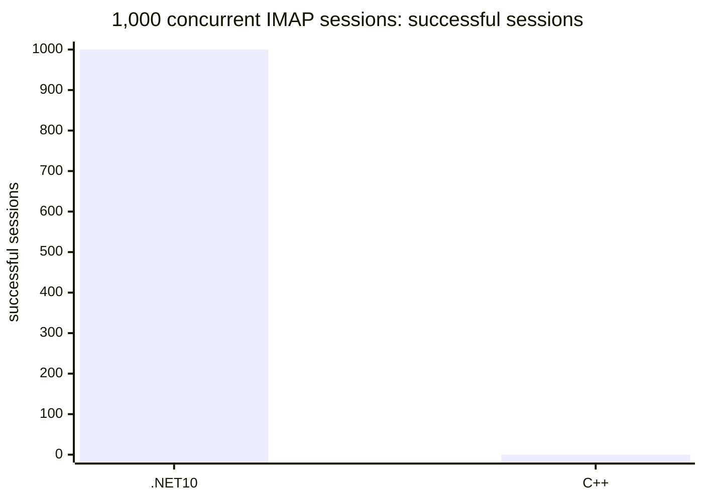
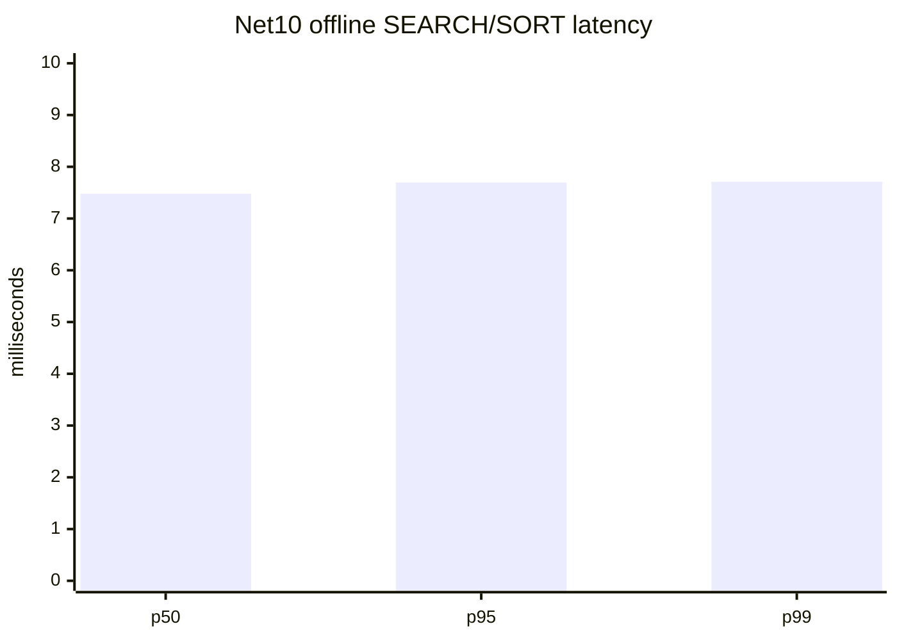

hMailServer
===========

## Current parity continuation (2026-08-11, SMTPRelayerRequiresAuthentication authorization lease)

Code/test commit `29be1faa0` extends the existing generation-bound
authorization lease to authenticated
`IInterfaceSettings.SMTPRelayerRequiresAuthentication` (`DispId(34)`). The
lease is acquired immediately before the existing parameterized
`usesmtprelayerauthentication` SQL update and held through mutation result
handling and retained snapshot publication. No VARIANT_BOOL shape, SMTP
delivery authentication behavior, live reconfiguration, or COM identity
changed.

Legacy anchors are `InterfaceSettings::get/put_SMTPRelayerRequiresAuthentication`
(`hmailserver/source/Server/COM/InterfaceSettings.cpp:896-923`),
`SMTPConfiguration::Get/SetSMTPRelayerRequiresAuthentication`
(`hmailserver/source/Server/SMTP/SMTPConfiguration.cpp:249-258`), the
installed IDL property (`hmailserver/source/Server/hMailServer/hMailServer.idl:565-566`),
the `usesmtprelayerauthentication` seed (`hmailserver/source/DBScripts/CreateTablesMSSQL.sql:786`),
and the .NET `UpdateSmtpRelayerRequiresAuthenticationSql` path. Focused tests
cover lease acquire/dispose and unavailable-lease denial before mutation.

Focused settings/store coverage is `102/102`. Full Net10 excluding the two
known host/AV-locked scanner cleanup classes is `2078 passed, 39 skipped,
0 failed`; the unfiltered run has 2 unrelated temporary-`.eml`
`UnauthorizedAccessException` cleanup failures. Disposable SQL/Data restore,
non-DB restore/reinitialization, SQL/FTS, matched C++/.NET protocol load,
SEC-18, migration/installer, out-of-process COM, AD/DC, crash/power-loss,
24-hour soak, and remaining unleased COM/Admin mutations keep release
**RED**. Next slice is a fresh legacy-first audit of `SMTPRelayerUsername`.

## Current parity continuation (2026-08-11, SMTPRelayer authorization lease)

Code/test commit `c83791c3b` extends the existing generation-bound
authorization lease to authenticated `IInterfaceSettings.SMTPRelayer`
(`DispId(22)`). The lease is acquired immediately before the existing
parameterized `smtprelayer` SQL update and held through mutation result
handling and retained snapshot publication. No BSTR shape, SMTP delivery
behavior, live reconfiguration, or COM identity changed.

Legacy anchors are `InterfaceSettings::get/put_SMTPRelayer`
(`hmailserver/source/Server/COM/InterfaceSettings.cpp:574-605`),
`SMTPConfiguration::Get/SetSMTPRelayer`
(`hmailserver/source/Server/SMTP/SMTPConfiguration.cpp:139-148`), the
installed IDL property (`hmailserver/source/Server/hMailServer/hMailServer.idl:545-546`),
the `smtprelayer` seed (`hmailserver/source/DBScripts/CreateTablesMSSQL.sql:760`),
and the .NET `UpdateSmtpRelayerSql` path. Focused tests cover lease
acquire/dispose and unavailable-lease denial before mutation.

Focused settings/store coverage is `100/100`. Full Net10 excluding the two
known host/AV-locked scanner cleanup classes is `2076 passed, 39 skipped,
0 failed`; the unfiltered run reached the scanner cleanup tests and reported
2 unrelated `UnauthorizedAccessException` failures deleting temporary `.eml`
files. Disposable SQL/Data restore, non-DB restore/reinitialization, SQL/FTS,
matched C++/.NET protocol load, SEC-18, migration/installer, out-of-process
COM, AD/DC, crash/power-loss, 24-hour soak, and remaining unleased COM/Admin
mutations keep release **RED**. Next slice is a fresh legacy-first audit of
`SMTPRelayerRequiresAuthentication`.

## Current parity continuation (2026-08-11, SMTPMinutesBetweenTry authorization lease)

Code/test commit `06af4facd` extends the existing generation-bound
authorization lease to authenticated `IInterfaceSettings.SMTPMinutesBetweenTry`
(`DispId(20)`). The lease is acquired immediately before the existing
parameterized `smtpminutesbetweenretries` SQL update and held through mutation
result handling and retained snapshot publication. No retry scheduling,
delivery behavior, live reconfiguration, or COM identity changed.

Legacy anchors are `InterfaceSettings::get/put_SMTPMinutesBetweenTry`
(`hmailserver/source/Server/COM/InterfaceSettings.cpp:500-533`),
`SMTPConfiguration::Set/GetMinutesBetweenTry`
(`hmailserver/source/Server/SMTP/SMTPConfiguration.cpp:101-110`), the installed
IDL property (`hmailserver/source/Server/hMailServer/hMailServer.idl:543-544`),
the `smtpminutesbetweenretries` seed (`hmailserver/source/DBScripts/CreateTablesMSSQL.sql:744`),
and the .NET `UpdateSmtpMinutesBetweenTrySql` path. Focused tests cover lease
acquire/dispose and unavailable-lease denial before mutation.

Focused settings/store coverage is `98/98`; full Net10 is `2081 passed, 39
skipped, 0 failed`. Disposable SQL/Data restore, non-DB restore/reinitialization,
SQL/FTS, matched C++/.NET protocol load, SEC-18, migration/installer,
out-of-process COM, AD/DC, crash/power-loss, 24-hour soak, and remaining
unleased COM/Admin mutations keep release **RED**. Next slice is a fresh
legacy-first audit of `SMTPRelayer`.

## Current parity continuation (2026-08-11, SMTPNoOfTries authorization lease)

Code/test commit `0bf71cd8f` extends the existing generation-bound
authorization lease to authenticated `IInterfaceSettings.SMTPNoOfTries`
(`DispId(19)`). The lease is acquired immediately before the existing
parameterized `smtpnoofretries` SQL update and held through mutation result
handling and retained snapshot publication. No retry policy validation,
delivery behavior, live reconfiguration, or COM identity changed.

Legacy anchors are `InterfaceSettings::get/put_SMTPNoOfTries`
(`hmailserver/source/Server/COM/InterfaceSettings.cpp:465-496`),
`SMTPConfiguration::Set/GetNoOfRetries`
(`hmailserver/source/Server/SMTP/SMTPConfiguration.cpp:88-97`), the installed
IDL property (`hmailserver/source/Server/hMailServer/hMailServer.idl:541-542`),
the `smtpnoofretries` seed (`hmailserver/source/DBScripts/CreateTablesMSSQL.sql:742`),
and the .NET `UpdateSmtpNoOfTriesSql` path. Focused tests cover lease
acquire/dispose and unavailable-lease denial before mutation.

Focused settings/store coverage is `96/96`; full Net10 is `2079 passed, 39
skipped, 0 failed`. Disposable SQL/Data restore, non-DB restore/reinitialization,
SQL/FTS, matched C++/.NET protocol load, SEC-18, migration/installer,
out-of-process COM, AD/DC, crash/power-loss, 24-hour soak, and remaining
unleased COM/Admin mutations keep release **RED**. Next slice is a fresh
legacy-first audit of `SMTPMinutesBetweenTry`.

## Current parity continuation (2026-08-11, DenyMailFromNull authorization lease)

Code/test commit `a146723f4` extends the existing generation-bound
authorization lease to authenticated `IInterfaceSettings.DenyMailFromNull`
(`DispId(11)`). The lease is acquired immediately before the existing
parameterized `allowmailfromnull` SQL mutation and held through mutation result
handling and retained snapshot publication. The legacy inversion remains
unchanged: `DenyMailFromNull = TRUE` persists `allowmailfromnull = 0`.

Legacy anchors are `InterfaceSettings::get/put_DenyMailFromNull`
(`hmailserver/source/Server/COM/InterfaceSettings.cpp:284-321`),
`SMTPConfiguration::Set/GetAllowMailFromNull`
(`hmailserver/source/Server/SMTP/SMTPConfiguration.cpp:75-85`), the SMTP
empty-sender check (`hmailserver/source/Server/SMTP/SMTPConnection.cpp:601-614`),
the installed IDL property (`hmailserver/source/Server/hMailServer/hMailServer.idl:537-538`),
the `allowmailfromnull` seed (`hmailserver/source/DBScripts/CreateTablesMSSQL.sql:736`),
and the .NET `UpdateAllowMailFromNullSql` path. Focused tests cover inversion,
lease acquire/dispose, and unavailable-lease denial before mutation.

Focused settings/store coverage is `94/94`; full Net10 is `2077 passed, 39
skipped, 0 failed`. Disposable SQL/Data restore, non-DB restore/reinitialization,
SQL/FTS, matched C++/.NET protocol load, SEC-18, migration/installer,
out-of-process COM, AD/DC, crash/power-loss, 24-hour soak, and remaining
unleased COM/Admin mutations keep release **RED**. Next slice is a fresh
legacy-first audit of `SMTPNoOfTries`.

## Current parity continuation (2026-08-11, AllowSMTPAuthPlain authorization lease)

Code/test commit `2d42c0006` extends the existing generation-bound
authorization lease to authenticated `IInterfaceSettings.AllowSMTPAuthPlain`
(`DispId(8)`). The lease is acquired immediately before the existing
parameterized `authallowplaintext` SQL update and held through mutation result
handling and retained snapshot publication. No SMTP trust behavior, live
reconfiguration, VARIANT_BOOL mapping, or COM identity changed.

Legacy anchors are `InterfaceSettings::get/put_AllowSMTPAuthPlain`
(`hmailserver/source/Server/COM/InterfaceSettings.cpp:242-280`),
`SMTPConfiguration::Set/GetAuthAllowPlainText`
(`hmailserver/source/Server/SMTP/SMTPConfiguration.cpp:63-72`), the installed
IDL property (`hmailserver/source/Server/hMailServer/hMailServer.idl:535-536`),
the `authallowplaintext` seed (`hmailserver/source/DBScripts/CreateTablesMSSQL.sql:734`),
and the .NET `UpdateAllowSmtpAuthPlainSql` path. Focused tests cover lease
acquire/dispose and unavailable-lease denial before mutation.

Focused settings/store coverage is `92/92`; full Net10 is `2075 passed, 39
skipped, 0 failed`. Disposable SQL/Data restore, non-DB restore/reinitialization,
SQL/FTS, matched C++/.NET protocol load, SEC-18, migration/installer,
out-of-process COM, AD/DC, crash/power-loss, 24-hour soak, and remaining
unleased COM/Admin mutations keep release **RED**. Next slice is a fresh
legacy-first audit of `DenyMailFromNull`.

## Current parity continuation (2026-08-11, MirrorEMailAddress authorization lease)

Code/test commit `59e433449` extends the existing generation-bound
authorization lease to authenticated `IInterfaceSettings.MirrorEMailAddress`
(`DispId(7)`). The lease is acquired immediately before the existing
parameterized `mirroremailaddress` SQL update and held through success/failure
handling and retained snapshot publication. No email mirroring runtime,
validation, SQL shape, BSTR contract, or COM identity changed.

Legacy anchors are `InterfaceSettings::get/put_MirrorEMailAddress`
(`hmailserver/source/Server/COM/InterfaceSettings.cpp:207-239`),
`Configuration::SetMirrorAddress`
(`hmailserver/source/Server/Common/Application/Configuration.cpp:240-248`),
the installed IDL property (`hmailserver/source/Server/hMailServer/hMailServer.idl:533-534`),
the `mirroremailaddress` seed (`hmailserver/source/DBScripts/CreateTablesMSSQL.sql:730`),
and the .NET `UpdateMirrorEmailAddressSql` path. Direct activation denial,
failed-write retention, lease acquire/dispose, and unavailable-lease denial are
covered.

Focused settings/store coverage is `90/90`; full Net10 is `2073 passed, 39
skipped, 0 failed`. Remaining unleased Settings mutation paths, disposable
SQL/Data restore, non-DB restore/reinitialization, SQL/FTS, matched C++/.NET
protocol load, SEC-18, migration/installer, out-of-process COM, AD/DC,
crash/power-loss, and 24-hour soak keep release **RED**. Next slice is the
same lease treatment for `AllowSMTPAuthPlain` after a fresh legacy-first audit.

## Current parity continuation (2026-08-11, MaxPOP3Connections authorization lease)

Code/test commit `0e4a70129` extends the existing generation-bound
authorization lease to authenticated `IInterfaceSettings.MaxPOP3Connections`
(`DispId(6)`). The lease is acquired immediately before the existing
parameterized `maxpop3connections` SQL update and held through success/failure
handling and retained snapshot publication. No validation, SQL shape, POP3
listener behavior, or COM identity changed.

Legacy anchors are `InterfaceSettings::get/put_MaxPOP3Connections`
(`hmailserver/source/Server/COM/InterfaceSettings.cpp:172-202`),
`POP3Configuration::Set/GetMaxPOP3Connections`
(`hmailserver/source/Server/POP3/POP3Configuration.cpp:31-40`), the installed
IDL property (`hmailserver/source/Server/hMailServer/hMailServer.idl:531-532`),
the `maxpop3connections` seed (`hmailserver/source/DBScripts/CreateTablesMSSQL.sql:726`),
and the .NET `UpdateMaxPop3ConnectionsSql` path. Direct activation denial,
failed-write retention, lease acquire/dispose, and unavailable-lease denial are
covered.

Focused settings/store coverage is `88/88`; full Net10 is `2071 passed, 39
skipped, 0 failed`. Remaining unleased Settings mutation paths, disposable
SQL/Data restore, non-DB restore/reinitialization, SQL/FTS, matched C++/.NET
protocol load, SEC-18, migration/installer, out-of-process COM, AD/DC,
crash/power-loss, and 24-hour soak keep release **RED**. Next slice is the
same lease treatment for `MirrorEMailAddress` after a fresh legacy-first audit.

## Current parity continuation (2026-08-11, MaxSMTPConnections authorization lease)

Code/test commit `9178d1b1b` extends the existing generation-bound
authorization lease to the authenticated `IInterfaceSettings.MaxSMTPConnections`
setter (`DispId(5)`). The lease is acquired immediately before the existing
parameterized `maxsmtpconnections` SQL update and held through success/failure
handling and retained snapshot publication. No validation, SQL shape, runtime
listener behavior, or COM identity changed.

Legacy anchors are `InterfaceSettings::get/put_MaxSMTPConnections`
(`hmailserver/source/Server/COM/InterfaceSettings.cpp:108-134`),
`SMTPConfiguration::Set/GetMaxSMTPConnections`
(`hmailserver/source/Server/SMTP/SMTPConfiguration.cpp:51-58`), the installed
IDL property (`hmailserver/source/Server/hMailServer/hMailServer.idl:529-530`),
the `maxsmtpconnections` seed (`hmailserver/source/DBScripts/CreateTablesMSSQL.sql:728`),
and the .NET `UpdateMaxSmtpConnectionsSql` path. Direct activation denial,
failed-write retention, lease acquire/dispose, and unavailable-lease denial are
covered.

Focused settings/store coverage is `86/86`; full Net10 is `2069 passed, 39
skipped, 0 failed`. Remaining unleased Settings mutation paths, disposable
SQL/Data restore, non-DB restore/reinitialization, SQL/FTS, matched C++/.NET
protocol load, SEC-18, migration/installer, out-of-process COM, AD/DC,
crash/power-loss, and 24-hour soak keep release **RED**. Next slice is the
same lease treatment for `MaxPOP3Connections` after a fresh legacy-first audit.

## Current parity continuation (2026-08-11, Settings mutation authorization lease)

Code/test commit `62f5ef553` closes the retained-COM authorization race for the
bounded `SMTPRelayerUseSSL`/`SMTPRelayerConnectionSecurity` mutation path. The
existing `ApplicationAuthorizationAuthority` generation and lease are now
captured by `Application.Settings`, passed through
`SettingsAdministrationRuntimeHost`, and held from immediately before the
parameterized SQL mutation through snapshot publication. Reauthentication
cannot invalidate the generation or acquire the authentication gate while this
write is in flight; an unavailable lease fails with `E_ACCESSDENIED`.

Legacy behavior was verified at
`InterfaceApplication::get_Settings`, `InterfaceSettings::LoadSettings`, and
`InterfaceSettings::put_SMTPRelayerUseSSL`: legacy retained scalar Settings
objects use acquisition-time `config_` authorization, while the .NET rewrite
keeps its stricter live mutation check and now makes the SQL write atomic with
that authorization generation. COM identity, `DispId(71)`/`DispId(91)`,
VARIANT_BOOL mapping, direct activation denial, and SMTP runtime behavior are
unchanged.

Focused settings/store coverage is `84/84`; full Net10 is `2067 passed, 39
skipped, 0 failed`. The revoke-race test blocks authentication until the
mutation releases its lease, then confirms the retained proxy cannot mutate
under the old generation. Other Settings mutation paths still need the same
lease treatment before security sign-off.

Release remains RED for disposable SQL/Data rollback, non-DB restore and
reinitialization, SQL/FTS, matched C++/.NET protocol load, SEC-18 cutover,
migration/installer, out-of-process COM, AD/DC, crash/power-loss, 24-hour
soak, and remaining unleased COM/Admin mutations. Next slice: extend the
authorization lease to the next smallest already-implemented Settings
mutation family.

## Current parity continuation (2026-08-11, SMTPRelayerUseSSL mutation)

Code/test commit `90ecdaa5a` implements only the authenticated
`IInterfaceSettings.SMTPRelayerUseSSL` setter (`DispId(71)`). It preserves the
installed COM identity, VARIANT_BOOL contract, direct activation denial, and
the existing `SMTPRelayerConnectionSecurity` projection. `true` maps to the
legacy `CSSSL` value (`1`); `false` maps to `CSNone` (`0`) through the existing
parameterized `hm_settings.smtprelayerconnectionsecurity` administration
store path. Snapshot publication occurs only after a one-row successful write.

Focused settings/store coverage is `81/81`; full Net10 is `2064 passed, 39
skipped, 0 failed`. Tests cover direct activation denial, authorized true and
false mapping, failed-write retention, and administrator revocation. Outbound
relayer TLS/STARTTLS, notifications, and live reconfiguration remain outside
this persistence slice.

Legacy anchors are `IInterfaceSettings.SMTPRelayerUseSSL` (`DispId(71)`) in
`hmailserver/source/Server/hMailServer/hMailServer.idl`,
`InterfaceSettings::get_SMTPRelayerUseSSL` and
`InterfaceSettings::put_SMTPRelayerUseSSL`
(`hmailserver/source/Server/COM/InterfaceSettings.cpp:1729-1760`),
`SMTPConfiguration::SetSMTPRelayerConnectionSecurity` and
`GetSMTPRelayerConnectionSecurity`
(`hmailserver/source/Server/SMTP/SMTPConfiguration.cpp:163-174`), and the
`smtprelayerconnectionsecurity` seed in
`hmailserver/source/DBScripts/CreateTablesMSSQL.sql:872`.

Release remains RED: disposable SQL/Data rollback, non-DB restore and
reinitialization, SQL/FTS, matched C++/.NET protocol load, SEC-18 cutover,
migration/installer, out-of-process COM, AD/DC, crash/power-loss, and 24-hour
soak remain unproven. Security review also leaves a medium retained-COM-proxy
authorization TOCTOU blocker: revocation can race between the live admin check
and the SQL mutation because Settings has no authorization lease spanning both.
The next slice is a legacy-first audit of the smallest safe authorization-lease
fix or remaining Settings mutation.

## Current parity continuation (2026-08-11, SMTPRelayerConnectionSecurity mutation)

Code/test commit `0f7b50282` implements only the authenticated
`IInterfaceSettings.SMTPRelayerConnectionSecurity` setter (`DispId(91)`). It
preserves the installed COM identity, enum values `None=0`, `Tls=1`,
`StartTlsOptional=2`, `StartTlsRequired=3`, and direct activation denial. The
setter casts the enum directly to its integer value, updates only the existing
`hm_settings.smtprelayerconnectionsecurity` row through a parameterized
`SqlDbType.Int` command, and publishes the retained snapshot only after
one-row success. No enum-range validation was added, matching legacy behavior.

Direct activation getter/setter denial, all four enum values, successful
snapshot publication, failed-write retention, administrator revocation,
one-row enforcement, exact SQL shape, and the existing `SMTPRelayerUseSSL`
projection are covered. Focused settings/store coverage is `80/80`; full
Net10 is `2063 passed, 39 skipped, 0 failed`. Outbound relayer TLS/STARTTLS,
`ExternalDelivery`, `SMTPClientConnection`, notifications, and live
reconfiguration remain unchanged and were deliberately left out.

Legacy anchors are `eConnectionSecurity` and
`IInterfaceSettings.SMTPRelayerConnectionSecurity`
(`hmailserver/source/Server/hMailServer/hMailServer.idl`),
`InterfaceSettings::put_SMTPRelayerConnectionSecurity`,
`SMTPConfiguration::SetSMTPRelayerConnectionSecurity`, the generic
`PropertySet::SetLong`/`Property::WriteLongSetting_` path,
`ServerTargetResolver::GetFixedSMTPHostForDomain_`, and the
`smtprelayerconnectionsecurity` SQL seed
(`hmailserver/source/DBScripts/CreateTablesMSSQL.sql`).

Release remains RED: disposable SQL/Data rollback, non-DB restore and
reinitialization, SQL/FTS, matched legacy/.NET protocol load, SEC-18 cutover,
installer/out-of-process COM, AD/DC, crash/power-loss, and 24-hour soak remain
unproven. Next slice is a fresh legacy-first audit of one remaining low-risk
Settings mutation.

## Current parity continuation (2026-08-11, SMTPRelayer mutation)

Code/test commit `4a5a6cf5f` implements only the authenticated
`IInterfaceSettings.SMTPRelayer` setter (`DispId(22)`, `BSTR`). It preserves the
installed COM identity and direct activation denial, rechecks the existing
server-administrator boundary, updates only the existing
`hm_settings.smtprelayer` row through a parameterized `nvarchar(4000)` command,
and publishes the retained snapshot only after one-row success. The legacy
relay value is written unchanged; no validation or encryption was added.

Direct activation getter/setter denial, authorized BSTR write, failed-write
retention, administrator revocation, one-row enforcement, and exact SQL
command shape are covered. Focused settings/store coverage is `78/78`; full
Net10 is `2061 passed, 39 skipped, 0 failed`. Fixed-relay routing,
configuration notifications, relayer credentials, and live reconfiguration
remain unchanged and were deliberately left out of this persistence slice.

Legacy anchors are `IInterfaceSettings.SMTPRelayer`
(`hmailserver/source/Server/hMailServer/hMailServer.idl`),
`InterfaceSettings::put_SMTPRelayer`,
`SMTPConfiguration::SetSMTPRelayer`, the generic
`PropertySet::SetString`/`Property::WriteStringSetting_` path,
`ServerTargetResolver::GetFixedSMTPHostForDomain_`, and the `smtprelayer` SQL
seed (`hmailserver/source/DBScripts/CreateTablesMSSQL.sql`).

Release remains RED: disposable SQL/Data rollback, non-DB restore and
reinitialization, SQL/FTS, matched legacy/.NET protocol load, SEC-18 cutover,
installer/out-of-process COM, AD/DC, crash/power-loss, and 24-hour soak remain
unproven. Next slice is a fresh legacy-first audit of one remaining low-risk
Settings mutation.

## Current parity continuation (2026-08-11, SMTPRelayerUsername mutation)

Code/test commit `8e3e5cf16` implements only the authenticated
`IInterfaceSettings.SMTPRelayerUsername` setter (`DispId(35)`, `BSTR`). It
preserves the installed COM identity and direct activation denial, rechecks
the existing server-administrator boundary, updates only the existing
`hm_settings.smtprelayerusername` row through a parameterized `nvarchar(4000)`
command, and publishes the retained snapshot only after one-row success. The
legacy username value is written unchanged; no validation or encryption was
added, matching the legacy path where only the relayer password is encrypted.

Direct activation getter/setter denial, authorized BSTR write, failed-write
retention, administrator revocation, one-row enforcement, and exact SQL
command shape are covered. Focused settings/store coverage is `76/76`; full
Net10 is `2059 passed, 39 skipped, 0 failed`. Relayer password storage,
fixed-relay routing, configuration notifications, and live reconfiguration
remain unchanged and were deliberately left out of this persistence slice.

Legacy anchors are `IInterfaceSettings.SMTPRelayerUsername`
(`hmailserver/source/Server/hMailServer/hMailServer.idl`),
`InterfaceSettings::put_SMTPRelayerUsername`,
`SMTPConfiguration::SetSMTPRelayerUsername`, the generic
`PropertySet::SetString`/`Property::WriteStringSetting_` path,
`ServerTargetResolver::GetFixedSMTPHostForDomain_`, and the
`smtprelayerusername` SQL seed
(`hmailserver/source/DBScripts/CreateTablesMSSQL.sql`).

Release remains RED: disposable SQL/Data rollback, non-DB restore and
reinitialization, SQL/FTS, matched legacy/.NET protocol load, SEC-18 cutover,
installer/out-of-process COM, AD/DC, crash/power-loss, and 24-hour soak remain
unproven. Next slice is a fresh legacy-first audit of one remaining low-risk
Settings mutation.

## Current parity continuation (2026-08-11, SMTPRelayerPort mutation)

Code/test commit `0707fda27` implements only the authenticated
`IInterfaceSettings.SMTPRelayerPort` setter (`DispId(37)`, `int`). It preserves
the installed COM identity and direct activation denial, rechecks the live
administrator callback, updates only the existing
`hm_settings.smtprelayerport` row through a parameterized `SqlDbType.Int`
command, and publishes the retained snapshot only after one-row success. The
legacy value is written unchanged; the seeded default remains `25`.

Direct activation getter/setter denial, an authorized integer write,
failed-write retention, administrator revocation, one-row enforcement, and
exact SQL command shape are covered. Focused settings/store coverage is
`74/74`; full Net10 is `2057 passed, 39 skipped, 0 failed`. Fixed-relayer
delivery routing, value `0` fallback behavior, configuration notifications,
and live reconfiguration remain unchanged and were deliberately left out of
this persistence slice.

Legacy anchors are `IInterfaceSettings.SMTPRelayerPort`
(`hmailserver/source/Server/hMailServer/hMailServer.idl`),
`InterfaceSettings::put_SMTPRelayerPort`,
`SMTPConfiguration::SetSMTPRelayerPort`, the generic
`PropertySet::SetLong`/`Property::WriteLongSetting_` path,
`ServerTargetResolver::GetFixedSMTPHostForDomain_`, and the
`smtprelayerport` SQL seed (`hmailserver/source/DBScripts/CreateTablesMSSQL.sql`).

Release remains RED: disposable SQL/Data rollback, non-DB restore and
reinitialization, SQL/FTS, matched legacy/.NET protocol load, SEC-18 cutover,
installer/out-of-process COM, AD/DC, crash/power-loss, and 24-hour soak remain
unproven. Next slice is a fresh legacy-first audit of one remaining low-risk
Settings mutation.

## Current parity continuation (2026-08-11, SMTPRelayerRequiresAuthentication mutation)

Code/test commit `429b20687` implements only the authenticated
`IInterfaceSettings.SMTPRelayerRequiresAuthentication` setter (`DispId(34)`,
`VARIANT_BOOL`). It preserves the installed COM identity and direct activation
denial, rechecks the live administrator callback, updates only the existing
`hm_settings.usesmtprelayerauthentication` row through a parameterized integer
command, and publishes the retained snapshot only after one-row success. The
legacy public value maps directly to storage: `true` writes `1`, and `false`
writes `0`.

Direct activation getter/setter denial, both boolean writes, failed-write
retention, administrator revocation, one-row enforcement, and exact SQL
command shape are covered. Focused settings/store coverage is `72/72`; full
Net10 is `2055 passed, 39 skipped, 0 failed`. Fixed-relayer credential
selection, SMTP routing, change notifications, and live reconfiguration remain
unchanged and were deliberately left out of this persistence slice.

Legacy anchors are `IInterfaceSettings.SMTPRelayerRequiresAuthentication`
(`hmailserver/source/Server/hMailServer/hMailServer.idl`),
`InterfaceSettings::put_SMTPRelayerRequiresAuthentication`,
`SMTPConfiguration::SetSMTPRelayerRequiresAuthentication`, the generic
`Property::SetBoolValue`/`Property::WriteLongSetting_` path, and the
`usesmtprelayerauthentication` SQL seed
(`hmailserver/source/DBScripts/CreateTablesMSSQL.sql`).

Release remains RED: disposable SQL/Data rollback, non-DB restore and
reinitialization, SQL/FTS, matched legacy/.NET protocol load, SEC-18 cutover,
installer/out-of-process COM, AD/DC, crash/power-loss, and 24-hour soak remain
unproven. Next slice is a fresh legacy-first audit of one remaining low-risk
Settings mutation.

## Current parity continuation (2026-08-11, DenyMailFromNull mutation)

Code/test commit `5d67f7eee` implements only the authenticated
`IInterfaceSettings.DenyMailFromNull` setter (`DispId(11)`, `VARIANT_BOOL`).
It preserves the installed COM identity and direct activation denial, rechecks
the live administrator callback, updates only the existing
`hm_settings.allowmailfromnull` row through a parameterized integer command,
and publishes the retained snapshot only after one-row success. The legacy
public value is inverted when persisted: `DenyMailFromNull = true` writes
`AllowMailFromNull = 0`, while `false` writes `1`.

Direct activation denial, true/false inversion, failed-write retention,
administrator revocation, one-row enforcement, and exact SQL command shape are
covered. Focused settings/store coverage is `70/70`; full Net10 is `2053
passed, 39 skipped, 0 failed`. SMTP `MAIL FROM:<>` runtime handling and live
reconfiguration remain unchanged and were deliberately left out of this
bounded persistence slice.

Legacy anchors are `IInterfaceSettings.DenyMailFromNull`
(`hmailserver/source/Server/hMailServer/hMailServer.idl`),
`InterfaceSettings::put_DenyMailFromNull`,
`SMTPConfiguration::SetAllowMailFromNull`, the generic
`PropertySet::SetBoolValue`/`Property::WriteLongSetting_` path, and the
`allowmailfromnull` SQL seed (`hmailserver/source/DBScripts/CreateTablesMSSQL.sql`).

Release remains RED: disposable SQL/Data rollback, non-DB restore and
reinitialization, SQL/FTS, matched legacy/.NET protocol load, SEC-18 cutover,
installer/out-of-process COM, AD/DC, crash/power-loss, and 24-hour soak remain
unproven. Next slice is a fresh legacy-first audit of one remaining low-risk
Settings mutation.

## Current parity continuation (2026-08-11, AllowSMTPAuthPlain mutation)

Code/test commit `5ff8ef8ee` implements only the authenticated
`IInterfaceSettings.AllowSMTPAuthPlain` setter (`DispId(8)`, `VARIANT_BOOL`).
It updates the existing `hm_settings.authallowplaintext` row through a
parameterized integer command, requires one affected row, rechecks the live
server-administrator callback, and publishes the retained snapshot only after
success. Direct activation denial, true/false writes, failed-write retention,
administrator revocation, one-row enforcement, and SQL command shape are
covered. Focused settings/store coverage is `68/68`; full Net10 is `2051
passed, 39 skipped, 0 failed`.

Legacy anchors are `IInterfaceSettings.AllowSMTPAuthPlain`
(`hmailserver/source/Server/hMailServer/hMailServer.idl`),
`InterfaceSettings::put_AllowSMTPAuthPlain`,
`SMTPConfiguration::SetAuthAllowPlainText`, the generic
`PropertySet::SetBool` path, and the `authallowplaintext` SQL seed
(`hmailserver/source/DBScripts/CreateTablesMSSQL.sql:734`). SMTP protocol
advertisement and runtime AUTH behavior remain unchanged.

Release remains RED: disposable SQL/Data rollback, non-DB restore and
reinitialization, SQL/FTS, matched legacy/.NET protocol load, SEC-18 cutover,
installer/out-of-process COM, AD/DC, crash/power-loss, and 24-hour soak remain
unproven. Next slice is a fresh legacy-first audit of one remaining low-risk
Settings mutation.

## Current parity continuation (2026-08-11, TCPIPThreads mutation)

Code/test commit `2752b90ad` implements only the authenticated
`IInterfaceSettings.TCPIPThreads` setter (`DispId(60)`). It updates the
existing `hm_settings.tcpipthreads` row through a parameterized integer
command, requires one affected row, rechecks the live server-administrator
callback, and publishes the retained snapshot only after success. Direct
activation denial, failed-write retention, administrator revocation, one-row
enforcement, and SQL command shape are covered. Focused settings/store
coverage is `66/66`; full Net10 is `2049 passed, 39 skipped, 0 failed`.

Legacy anchors are `IInterfaceSettings.TCPIPThreads`
(`hmailserver/source/Server/hMailServer/hMailServer.idl:522`),
`InterfaceSettings::put_TCPIPThreads`
(`hmailserver/source/Server/COM/InterfaceSettings.cpp:1530`),
`Configuration::SetTCPIPThreads`
(`hmailserver/source/Server/Common/Application/Configuration.cpp:142`),
`IOService::DoWork` startup consumption
(`hmailserver/source/Server/Common/TCPIP/IOService.cpp:66`), and the
`tcpipthreads` SQL seed (`hmailserver/source/DBScripts/CreateTablesMSSQL.sql:840`).
IOService worker creation and runtime reconfiguration remain unchanged.

Release remains RED: disposable SQL/Data rollback, non-DB restore and
reinitialization, SQL/FTS, matched legacy/.NET protocol load, SEC-18 cutover,
installer/out-of-process COM, AD/DC, crash/power-loss, and 24-hour soak remain
unproven. Next slice is a fresh legacy-first audit of one remaining low-risk
Settings mutation.

## Current parity continuation (2026-08-11, MaxIMAPConnections mutation)

Code/test commit `ab1c7c721` implements only the authenticated
`IInterfaceSettings.MaxIMAPConnections` setter (`DispId(53)`). It updates the
existing `hm_settings.maximapconnections` row through a parameterized integer
command, requires one affected row, rechecks the live server-administrator
callback, and publishes the retained snapshot only after success. Direct
activation denial, failed-write retention, administrator revocation, one-row
enforcement, and SQL command shape are covered. Focused settings/store
coverage is `64/64`; full Net10 is `2047 passed, 39 skipped, 0 failed`.

Legacy anchors are `IInterfaceSettings.MaxIMAPConnections`
(`hmailserver/source/Server/hMailServer/hMailServer.idl:589-590`),
`InterfaceSettings::put_MaxIMAPConnections`
(`hmailserver/source/Server/COM/InterfaceSettings.cpp:140`),
`IMAPConfiguration::SetMaxIMAPConnections`
(`hmailserver/source/Server/IMAP/IMAPConfiguration.cpp:113`),
`SessionManager::CreateSession(STIMAP)` connection-limit enforcement
(`hmailserver/source/Server/Common/Application/SessionManager.cpp:44`), and
the `maximapconnections` SQL seed
(`hmailserver/source/DBScripts/CreateTablesMSSQL.sql:832`). .NET IMAP listener
configuration and runtime connection-limit behavior remain unchanged.

Release remains RED: disposable SQL/Data rollback, non-DB restore and
reinitialization, SQL/FTS, matched legacy/.NET protocol load, SEC-18 cutover,
installer/out-of-process COM, AD/DC, crash/power-loss, and 24-hour soak remain
unproven. Next slice is a fresh legacy-first audit of one remaining low-risk
Settings mutation.

## Current parity continuation (2026-08-11, MaxDeliveryThreads mutation)

Code/test commit `88aa5466c` implements only the authenticated
`IInterfaceSettings.MaxDeliveryThreads` setter (`DispId(29)`). It updates the
existing `hm_settings.maxdelivertythreads` row through a parameterized integer
command, requires one affected row, rechecks the live server-administrator
callback, and publishes the retained snapshot only after success. Direct
activation denial, failed-write retention, administrator revocation, one-row
enforcement, and SQL command shape are covered. Focused settings/store
coverage is `62/62`; full Net10 is `2045 passed, 39 skipped, 0 failed`.

Legacy anchors are `IInterfaceSettings.MaxDeliveryThreads`
(`hmailserver/source/Server/hMailServer/hMailServer.idl:520-560`),
`InterfaceSettings::put_MaxDeliveryThreads`
(`hmailserver/source/Server/COM/InterfaceSettings.cpp:556-572`),
`SMTPConfiguration::SetMaxNoOfDeliveryThreads`
(`hmailserver/source/Server/SMTP/SMTPConfiguration.cpp:187-195`),
`SMTPDeliveryManager::OnPropertyChanged`
(`hmailserver/source/Server/SMTP/SMTPDeliveryManager.cpp:184-197`), and the
`maxdelivertythreads` SQL seed (`hmailserver/source/DBScripts/CreateTablesMSSQL.sql:762`).
Live delivery queue resizing and runtime reconfiguration remain deliberately
unchanged.

Release remains RED: disposable SQL/Data rollback, non-DB restore and
reinitialization, SQL/FTS, matched legacy/.NET protocol load, SEC-18 cutover,
installer/out-of-process COM, AD/DC, crash/power-loss, and 24-hour soak remain
unproven. Next slice is a fresh legacy-first audit of one remaining low-risk
Settings mutation.

## Current parity continuation (2026-08-11, RuleLoopLimit mutation)

Code/test commit `4d554f1b5` implements only the authenticated
`IInterfaceSettings.RuleLoopLimit` setter (`DispId(48)`). It updates the
existing `hm_settings.rulelooplimit` row through a parameterized integer
command, requires one affected row, rechecks the live server-administrator
callback, and publishes the retained snapshot only after success. Direct
activation denial, failed-write retention, administrator revocation, and SQL
command shape are covered. Focused settings/SQL coverage is `60/60`; full
Net10 is `2043 passed, 39 skipped, 0 failed`.

Legacy anchors are `IInterfaceSettings.RuleLoopLimit`
(`hmailserver/source/Server/hMailServer/hMailServer.idl:580-581`),
`InterfaceSettings::put_RuleLoopLimit`
(`hmailserver/source/Server/COM/InterfaceSettings.cpp:1239-1270`),
`SMTPConfiguration::SetRuleLoopLimit`
(`hmailserver/source/Server/SMTP/SMTPConfiguration.cpp:223-233`), the generic
`PropertySet::SetLong`/`Property::WriteLongSetting_` path, and the
`rulelooplimit` SQL seed (`hmailserver/source/DBScripts/CreateTablesMSSQL.sql:814`).
RuleApplier/SmtpRuleProcessor runtime wiring remains unchanged and is a
separate slice.

Release remains RED: disposable SQL/Data rollback, non-DB restore and
reinitialization, SQL/FTS, matched legacy/.NET protocol load, SEC-18 cutover,
installer/out-of-process COM, AD/DC, crash/power-loss, and 24-hour soak remain
unproven. Next slice is a fresh legacy-first audit of one remaining low-risk
Settings mutation.

## Current parity continuation (2026-08-11, VerifyRemoteSslCertificate mutation)

Code/test commit `f882ff44f` implements only the authenticated
`IInterfaceSettings.VerifyRemoteSslCertificate` setter (`DispId(93)`). It
updates the existing `hm_settings.VerifyRemoteSslCertificate` row with a
parameterized integer command, requires one affected row, rechecks the live
server-administrator callback, and publishes the retained snapshot only after
success. Direct activation denial, failure retention, and SQL command shape are
covered. Focused settings/SQL coverage is `58/58`; full Net10 is `2041 passed,
39 skipped, 0 failed`.

Legacy anchors are `IInterfaceSettings.VerifyRemoteSslCertificate`
(`hmailserver/source/Server/hMailServer/hMailServer.idl:656-657`),
`InterfaceSettings::put_VerifyRemoteSslCertificate`
(`hmailserver/source/Server/COM/InterfaceSettings.cpp:2244-2254`),
`Configuration::SetVerifyRemoteSslCertificate`
(`hmailserver/source/Server/Common/Application/Configuration.cpp:604-607`),
`PROPERTY_VERIFYREMOTESSLCERTIFICATE`
(`hmailserver/source/Server/Common/Application/Constants.h:122`), and the
`VerifyRemoteSslCertificate` SQL seed
(`hmailserver/source/DBScripts/CreateTablesMSSQL.sql:936`). TLS handshake
runtime behavior remains unchanged and is a separate slice.

Release remains RED: disposable SQL/Data rollback, non-DB restore and
reinitialization, SQL/FTS, matched legacy/.NET protocol load, SEC-18 cutover,
installer/out-of-process COM, AD/DC, crash/power-loss, and 24-hour soak remain
unproven. Next slice is a fresh legacy-first audit of one remaining low-risk
Settings mutation.

## Current parity continuation (2026-08-11, authenticated maximum MX host count mutation)

Code/test commit `3ca025ce1` extends the existing authenticated Administrator
settings seam to only `IInterfaceSettings.MaxNumberOfMXHosts` (`DispId(90)`). It
updates the fixed `hm_settings.MaxNumberOfMXHosts` row with a parameterized
integer command, requires one affected row, rechecks the live administrator
callback, and publishes the retained snapshot only after success. Focused
settings/SQL coverage is `56/56`; full Net10 is `2039 passed, 39 skipped, 0
failed`.

Legacy anchors are `IInterfaceSettings.MaxNumberOfMXHosts`
(`hmailserver/source/Server/hMailServer/hMailServer.idl:650-651`),
`InterfaceSettings::put_MaxNumberOfMXHosts`
(`hmailserver/source/Server/COM/InterfaceSettings.cpp:2189-2214`),
`SMTPConfiguration::SetMaxNumberOfMXHosts`
(`hmailserver/source/Server/SMTP/SMTPConfiguration.cpp:237-245`),
`PROPERTY_MAX_NUMBER_OF_MXHOSTS`
(`hmailserver/source/Server/Common/Application/Constants.h:120`), and the
`MaxNumberOfMXHosts` SQL seed. `ExternalDelivery` MX-host enforcement and live
runtime reconfiguration remain unchanged.

Release remains RED: disposable SQL/Data rollback, SQL/FTS, matched legacy and
.NET protocol load evidence, SEC-18 cutover, installer/out-of-process COM, and
24-hour soak remain unproven. Next slice is a fresh legacy-first audit of one
remaining low-risk Settings mutation.

## Current parity continuation (2026-08-11, authenticated SMTP retry count mutation)

Code/test commit `f8010374d` extends the existing authenticated Administrator
settings seam to only `IInterfaceSettings.SMTPNoOfTries` (`DispId(19)`). It
updates the canonical fixed `hm_settings.smtpnoofretries` row with a
parameterized integer command, requires one affected row, rechecks the live
administrator callback, and publishes the retained snapshot only after
success. Focused settings/SQL coverage is `53/53`; full Net10 is
`2036 passed, 39 skipped, 0 failed`.

Legacy anchors are `IInterfaceSettings.SMTPNoOfTries`
(`hmailserver/source/Server/hMailServer/hMailServer.idl:541-542`),
`InterfaceSettings::put_SMTPNoOfTries`
(`hmailserver/source/Server/COM/InterfaceSettings.cpp`),
`SMTPConfiguration::SetNoOfRetries`
(`hmailserver/source/Server/SMTP/SMTPConfiguration.cpp`),
`PROPERTY_SMTPNOOFTRIES`
(`hmailserver/source/Server/Common/Application/Constants.h`), and the
canonical `smtpnoofretries` seed in the database scripts. The unrelated typo
row `smtpnooftries` remains excluded. `ExternalDelivery` retry scheduling and
runtime reconfiguration remain unchanged.

Release remains RED: disposable SQL/Data rollback, SQL/FTS, matched legacy and
.NET protocol load evidence, SEC-18 cutover, installer/out-of-process COM, and
24-hour soak remain unproven. Next slice is a fresh legacy-first audit of one
remaining low-risk Settings mutation.

## Current parity continuation (2026-08-11, authenticated SMTP retry interval mutation)

Code/test commit `b970bf00c` extends the existing authenticated Administrator
settings seam to only `IInterfaceSettings.SMTPMinutesBetweenTry`
(`DispId(20)`). It updates the fixed `hm_settings.smtpminutesbetweenretries`
row with a parameterized integer command, requires one affected row, rechecks
the live administrator callback, and publishes the retained snapshot only after
success. Focused settings/SQL coverage is `51/51`; full Net10 is
`2034 passed, 39 skipped, 0 failed`.

Legacy anchors are `IInterfaceSettings.SMTPMinutesBetweenTry`
(`hmailserver/source/Server/hMailServer/hMailServer.idl:543-544`),
`InterfaceSettings::put_SMTPMinutesBetweenTry`
(`hmailserver/source/Server/COM/InterfaceSettings.cpp:500-535`),
`SMTPConfiguration::SetMinutesBetweenTry`
(`hmailserver/source/Server/SMTP/SMTPConfiguration.cpp:101-109`),
`PROPERTY_SMTPMINUTESBETWEEN`
(`hmailserver/source/Server/Common/Application/Constants.h:12`), and the
`smtpminutesbetweenretries` seed in
`hmailserver/source/DBScripts/CreateTablesMSSQL.sql:744`. `ExternalDelivery`
retry scheduling and live runtime reconfiguration remain unchanged.

Release remains RED: disposable SQL/Data rollback, SQL/FTS, matched legacy and
.NET protocol load evidence, SEC-18 cutover, installer/out-of-process COM, and
24-hour soak remain unproven. Next slice is a fresh legacy-first audit of one
remaining low-risk Settings mutation.

## Current parity continuation (2026-08-11, authenticated incorrect-line-endings mutation)

Code/test commit `9a7687365` extends the existing authenticated Administrator
settings seam to only `IInterfaceSettings.AllowIncorrectLineEndings`
(`DispId(61)`, `VARIANT_BOOL`). It updates the fixed
`hm_settings.smtpallowincorrectlineendings` row with a parameterized integer
command, requires one affected row, rechecks the live administrator callback,
and publishes the retained snapshot only after success. Focused settings/SQL
coverage is `49/49`; full Net10 is `2032 passed, 39 skipped, 0 failed`.

Legacy anchors are `IInterfaceSettings.AllowIncorrectLineEndings`
(`hmailserver/source/Server/hMailServer/hMailServer.idl:604`),
`InterfaceSettings::put_AllowIncorrectLineEndings`
(`hmailserver/source/Server/COM/InterfaceSettings.cpp:326`),
`SMTPConfiguration::SetAllowIncorrectLineEndings`
(`hmailserver/source/Server/SMTP/SMTPConfiguration.cpp:288`),
`Property::SetBoolValue` / `WriteLongSetting_`
(`hmailserver/source/Server/Common/Application/Property.cpp:36-78`), and the
`smtpallowincorrectlineendings` seed in
`hmailserver/source/DBScripts/CreateTablesMSSQL.sql`. SMTP protocol behavior
and live reconfiguration remain unchanged.

Release remains RED: disposable SQL/Data rollback, SQL/FTS, matched legacy and
.NET protocol load evidence, SEC-18 cutover, installer/out-of-process COM, and
24-hour soak remain unproven. Next slice is a fresh legacy-first audit of one
remaining low-risk Settings mutation.

## Current parity continuation (2026-08-11, authenticated Delivered-To header mutation)

Code/test commit `279b18f70` extends the existing authenticated Administrator
settings seam to only `IInterfaceSettings.AddDeliveredToHeader`
(`DispId(73)`, `VARIANT_BOOL`). It updates the fixed
`hm_settings.adddeliveredtoheader` row with a parameterized integer command,
requires one affected row, rechecks the live administrator callback, and
publishes the retained snapshot only after success. Focused settings/SQL
coverage is `47/47`; full Net10 is `2030 passed, 39 skipped, 0 failed`.

Legacy anchors are `IInterfaceSettings.AddDeliveredToHeader`
(`hmailserver/source/Server/hMailServer/hMailServer.idl:520`),
`InterfaceSettings::put_AddDeliveredToHeader`
(`hmailserver/source/Server/COM/InterfaceSettings.cpp:1833`),
`SMTPConfiguration::SetAddDeliveredToHeader`
(`hmailserver/source/Server/SMTP/SMTPConfiguration.cpp:300`),
`PROPERTY_ADDDELIVEREDTOHEADER`
(`hmailserver/source/Server/Common/Application/Constants.h:94`), and the
existing row seed in `hmailserver/source/DBScripts/CreateTablesMSSQL.sql:874`.
`LocalDelivery::AddTraceHeaders_` remains unchanged.

Release remains RED: disposable SQL/Data rollback, SQL/FTS, matched legacy and
.NET protocol load evidence, SEC-18 cutover, installer/out-of-process COM, and
24-hour soak remain unproven. Next slice is a fresh legacy-first audit of one
remaining low-risk Settings mutation.

## Current parity continuation (2026-08-10, authenticated maximum message size mutation)

Code/test commit `69aa0c6d5` extends the existing authenticated Administrator
settings seam to only `IInterfaceSettings.MaxMessageSize` (`DispId(44)`). It
updates the fixed `hm_settings.maxmessagesize` row with a parameterized integer
command, requires one affected row, rechecks the live administrator callback,
and publishes the retained snapshot only after success. Focused settings/SQL
coverage is `45/45`; full Net10 is `2028 passed, 39 skipped, 0 failed`.

Legacy anchors are `IInterfaceSettings.MaxMessageSize`
(`hmailserver/source/Server/hMailServer/hMailServer.idl:576-577`),
`InterfaceSettings::put_MaxMessageSize`
(`hmailserver/source/Server/COM/InterfaceSettings.cpp:65-105`),
`SMTPConfiguration::SetMaxMessageSize`
(`hmailserver/source/Server/SMTP/SMTPConfiguration.cpp:199-207`), and the
existing `maxmessagesize` schema row in
`hmailserver/source/DBScripts/CreateTablesMSSQL.sql:804`. SMTP SIZE/limit,
IMAP APPEND enforcement, KB-to-byte conversion, and live reconfiguration are
unchanged.

Release remains RED: disposable SQL/Data rollback, SQL/FTS, matched legacy and
.NET protocol load evidence, SEC-18 cutover, installer/out-of-process COM, and
24-hour soak remain unproven. Next slice is a fresh legacy-first audit of one
remaining low-risk Settings mutation.

## Current parity continuation (2026-08-10, authenticated disconnect-invalid-clients mutation)

Code/test commit `2ee01f107` extends the existing authenticated Administrator
settings seam to only `IInterfaceSettings.DisconnectInvalidClients`
(`DispId(64)`, `VARIANT_BOOL`). It updates the fixed
`hm_settings.disconnectinvalidclients` row with a parameterized integer
command, requires one affected row, rechecks the live administrator callback,
and publishes the retained snapshot only after success. Focused settings/SQL
coverage is `43/43`; full Net10 is `2026 passed, 39 skipped, 0 failed`.

Legacy anchors are `IInterfaceSettings.DisconnectInvalidClients`
(`hmailserver/source/Server/hMailServer/hMailServer.idl:610-613`),
`InterfaceSettings::put_DisconnectInvalidClients`
(`hmailserver/source/Server/COM/InterfaceSettings.cpp:1661-1693`),
`Configuration::SetDisconnectInvalidClients`
(`hmailserver/source/Server/Common/Application/Configuration.cpp:488-498`),
`Property::SetBoolValue` / `WriteLongSetting_`
(`hmailserver/source/Server/Common/Application/Property.cpp:36-78`), and
`PROPERTY_SMTPDISCONNECTINVALIDCLIENTS`
(`hmailserver/source/Server/Common/Application/Constants.h:89`). SMTP
invalid-command disconnect behavior and live runtime reconfiguration remain
unchanged.

Release remains RED: disposable SQL/Data rollback, SQL/FTS, matched legacy and
.NET protocol load evidence, SEC-18 cutover, installer/out-of-process COM, and
24-hour soak remain unproven. Next slice is a fresh legacy-first audit of one
remaining low-risk Settings mutation.

## Current parity continuation (2026-08-10, authenticated invalid-command limit mutation)

Code/test commit `9a7e418eb` extends the existing authenticated Administrator
settings seam to only `IInterfaceSettings.MaxNumberOfInvalidCommands`
(`DispId(65)`). It updates the fixed
`hm_settings.maximumincorrectcommands` row with a parameterized integer
command, requires one affected row, rechecks the live administrator callback,
and publishes the retained snapshot only after success. Focused settings/SQL
coverage is `41/41`; full Net10 is `2024 passed, 39 skipped, 0 failed`.

Legacy anchors are `IInterfaceSettings.MaxNumberOfInvalidCommands`
(`hmailserver/source/Server/hMailServer/hMailServer.idl:612-613`),
`InterfaceSettings::put_MaxNumberOfInvalidCommands`
(`hmailserver/source/Server/COM/InterfaceSettings.cpp:1695-1720`),
`Configuration::SetMaxNumberOfInvalidCommands`
(`hmailserver/source/Server/Common/Application/Configuration.cpp:501-509`),
`PROPERTY_MAXIMUMINCORRECTCOMMANDS`
(`hmailserver/source/Server/Common/Application/Constants.h:90`), and the
SMTP disconnect threshold in `SMTPConnection::OnCommand`
(`hmailserver/source/Server/SMTP/SMTPConnection.cpp:2210-2219`). The runtime
threshold reconfiguration path remains deliberately unchanged.

Release remains RED: disposable SQL/Data rollback, SQL/FTS, matched legacy and
.NET protocol load evidence, SEC-18 cutover, installer/out-of-process COM, and
24-hour soak remain unproven. Next slice is a fresh legacy-first audit of one
remaining low-risk Settings mutation.

## Current parity continuation (2026-08-10, authenticated MaxSMTPRecipientsInBatch mutation)

Code/test commit `b4cacd531` extends the bounded Administrator settings seam to
only `IInterfaceSettings.MaxSMTPRecipientsInBatch` (`DispId(62)`). It rechecks
the live server-administrator callback, updates only the existing
`hm_settings.maxsmtprecipientsinbatch` row with a parameterized integer command,
requires one affected row, and changes a retained snapshot only after success.
SMTP delivery batching runtime and live reconfiguration remain unchanged.

Legacy anchors are `IInterfaceSettings.MaxSMTPRecipientsInBatch`
(`hmailserver/source/Server/hMailServer/hMailServer.idl:606-607`),
`InterfaceSettings::put_MaxSMTPRecipientsInBatch`
(`hmailserver/source/Server/COM/InterfaceSettings.cpp:1627-1658`),
`SMTPConfiguration::SetMaxSMTPRecipientsInBatch`
(`hmailserver/source/Server/SMTP/SMTPConfiguration.cpp:211-220`),
`ExternalDelivery` batching consumption
(`hmailserver/source/Server/SMTP/ExternalDelivery.cpp:67-87`), and
`PROPERTY_MAXSMTPRECIPIENTSINBATCH`
(`hmailserver/source/Server/Common/Application/Constants.h:74`). Focused
settings/SQL coverage is `39/39`; full Net10 is `2022 passed, 39 skipped, 0
failed`. No COM identity or delivery runtime behavior changed.

Release remains RED: real SQL/Data rollback, SEC-18 cutover, installer and
out-of-process COM, matched C++/Net10 protocol load evidence, SQL FTS, and
24-hour soak remain unproven.

## Current parity continuation (2026-08-10, authenticated WelcomeSMTP mutation)

Code/test commit `6408eb8bd` extends the bounded Administrator settings seam to
only `IInterfaceSettings.WelcomeSMTP` (`DispId(23)`, BSTR). It rechecks the
live server-administrator callback, updates only the existing
`hm_settings.welcomesmtp` row with a parameterized string command, requires one
affected row, and changes a retained snapshot only after success. The SMTP
session greeting runtime path remains unchanged.

Legacy anchors are `IInterfaceSettings.WelcomeSMTP`
(`hmailserver/source/Server/hMailServer/hMailServer.idl:547-552`),
`InterfaceSettings::put_WelcomeSMTP`
(`hmailserver/source/Server/COM/InterfaceSettings.cpp:679-710`),
`SMTPConfiguration::SetWelcomeMessage`
(`hmailserver/source/Server/SMTP/SMTPConfiguration.cpp:113-123`), and
`SMTPConnection::SendBanner_`
(`hmailserver/source/Server/SMTP/SMTPConnection.cpp:166-181`). Focused
settings/SQL coverage is `37/37`; full Net10 is `2020 passed, 39 skipped, 0
failed`. No COM identity, direct activation boundary, or SMTP runtime
reconfiguration behavior changed.

Release remains RED: real SQL/Data rollback, SEC-18 cutover, installer and
out-of-process COM, matched C++/Net10 protocol load evidence, SQL FTS, and
24-hour soak remain unproven.

## Current parity continuation (2026-08-10, authenticated WelcomeIMAP mutation)

Code/test commit `df7f72c22` extends the bounded Administrator settings seam to
only `IInterfaceSettings.WelcomeIMAP` (`DispId(25)`, BSTR). It rechecks the
live server-administrator callback, updates only the existing
`hm_settings.welcomeimap` row with a parameterized string command, requires one
affected row, and changes a retained snapshot only after success. The IMAP
session greeting runtime path remains unchanged.

Legacy anchors are `IInterfaceSettings.WelcomeIMAP`
(`hmailserver/source/Server/hMailServer/hMailServer.idl`, `DispId(25)`),
`InterfaceSettings::put_WelcomeIMAP`
(`hmailserver/source/Server/COM/InterfaceSettings.cpp`),
`IMAPConfiguration::SetWelcomeMessage`
(`hmailserver/source/Server/IMAP/IMAPConfiguration.cpp`),
`PROPERTY_WELCOMEIMAP`
(`hmailserver/source/Server/Common/Application/Constants.h`), and
`IMAPConnection::SendBanner_`
(`hmailserver/source/Server/IMAP/IMAPConnection.cpp`). Focused settings/SQL
coverage is `35/35`; full Net10 is `2018 passed, 39 skipped, 0 failed`. No COM
identity, direct activation boundary, or IMAP runtime reconfiguration behavior
changed.

Release remains RED: real SQL/Data rollback, SEC-18 cutover, installer and
out-of-process COM, matched C++/Net10 protocol load evidence, SQL FTS, and
24-hour soak remain unproven.

## Current parity continuation (2026-08-10, authenticated WelcomePOP3 mutation)

Code/test commit `67d383ef1` extends the bounded Administrator settings seam to
only `IInterfaceSettings.WelcomePOP3` (`DispId(24)`, BSTR). It rechecks the
live server-administrator callback, updates only the existing
`hm_settings.welcomepop3` row with a parameterized string command, requires one
affected row, and changes a retained snapshot only after success. The POP3
session greeting runtime path remains unchanged.

Legacy anchors are `IInterfaceSettings.WelcomePOP3`
(`hmailserver/source/Server/hMailServer/hMailServer.idl:547-550`),
`InterfaceSettings::put_WelcomePOP3`
(`hmailserver/source/Server/COM/InterfaceSettings.cpp:713-745`),
`POP3Configuration::SetWelcomeMessage`
(`hmailserver/source/Server/POP3/POP3Configuration.cpp:24-53`),
`PROPERTY_WELCOMEPOP3`
(`hmailserver/source/Server/Common/Application/Constants.h:14`), and
`POP3Connection` banner consumption
(`hmailserver/source/Server/POP3/POP3Connection.cpp:101-115`). Focused
settings/SQL coverage is `33/33`; full Net10 is `2016 passed, 39 skipped, 0
failed`. No COM identity, direct activation boundary, or POP3 runtime
reconfiguration behavior changed.

Release remains RED: real SQL/Data rollback, SEC-18 cutover, installer and
out-of-process COM, matched C++/Net10 protocol load evidence, SQL FTS, and
24-hour soak remain unproven.

## Current parity continuation (2026-08-10, authenticated MaxPOP3Connections mutation)

Code/test commit `e11234d8a` extends the bounded Administrator settings seam to
only `IInterfaceSettings.MaxPOP3Connections` (`DispId(6)`). It rechecks the
live server-administrator callback, updates only the existing
`hm_settings.maxpop3connections` row with a parameterized integer command,
requires one affected row, and changes a retained snapshot only after success.
The POP3 listener’s separate startup/runtime cap is unchanged.

Legacy anchors are `IInterfaceSettings.MaxPOP3Connections`
(`hmailserver/source/Server/hMailServer/hMailServer.idl:531-532`),
`InterfaceSettings::put_MaxPOP3Connections`
(`hmailserver/source/Server/COM/InterfaceSettings.cpp:172-199`),
`POP3Configuration::SetMaxPOP3Connections`
(`hmailserver/source/Server/POP3/POP3Configuration.cpp:31-39`),
`SessionManager` POP3 admission (`hmailserver/source/Server/Common/Application/SessionManager.cpp:62-90`),
and the `hm_settings` schema (`hmailserver/source/DBScripts/CreateTablesMSSQL.sql:726`).
Focused settings/SQL coverage is `31/31`; full Net10 is `2014 passed, 39
skipped, 0 failed`. No COM identity, direct activation boundary, or POP3
listener reconfiguration behavior changed.

Release remains RED: real SQL/Data rollback, SEC-18 cutover, installer and
out-of-process COM, matched C++/Net10 protocol load evidence, SQL FTS, and
24-hour soak remain unproven.

## Current parity continuation (2026-08-10, authenticated MaxSMTPConnections mutation)

Code/test commit `9d2033677` extends the bounded Administrator settings seam to
only `IInterfaceSettings.MaxSMTPConnections` (`DispId(5)`). It rechecks the
live server-administrator callback, updates only the existing
`hm_settings.maxsmtpconnections` row with a parameterized integer command,
requires one affected row, and changes a retained snapshot only after success.
The SMTP listener’s startup limit and live reconfiguration behavior are
unchanged.

Legacy anchors are `IInterfaceSettings.MaxSMTPConnections`
(`hmailserver/source/Server/hMailServer/hMailServer.idl:529`),
`InterfaceSettings::put_MaxSMTPConnections`
(`hmailserver/source/Server/COM/InterfaceSettings.cpp:124`),
`SMTPConfiguration::SetMaxSMTPConnections`
(`hmailserver/source/Server/SMTP/SMTPConfiguration.cpp:51`),
`SessionManager::CreateSession`
(`hmailserver/source/Server/Common/Application/SessionManager.cpp:43`), and
`Property::WriteLongSetting_`
(`hmailserver/source/Server/Common/Application/Property.cpp:71`). Focused
settings/SQL coverage is `29/29`; full Net10 is `2012 passed, 39 skipped, 0
failed`. No COM identity, direct activation boundary, or SMTP trust behavior
changed.

Release remains RED: real SQL/Data rollback, SEC-18 cutover, installer and
out-of-process COM, matched C++/Net10 protocol load evidence, SQL FTS, and
24-hour soak remain unproven.

## Current parity continuation (2026-08-10, authenticated WorkerThreadPriority mutation)

Code/test commit `2e60909b5` extends the bounded Administrator settings seam to
only `IInterfaceSettings.WorkerThreadPriority` (`DispId(57)`). It rechecks the
live server-administrator callback, updates only the existing
`hm_settings.workerthreadpriority` row with a parameterized integer command,
requires one affected row, and changes a retained snapshot only after success.

Legacy anchors are `IInterfaceSettings.WorkerThreadPriority`
(`hmailserver/source/Server/hMailServer/hMailServer.idl:599`),
`InterfaceSettings::put_WorkerThreadPriority`
(`hmailserver/source/Server/COM/InterfaceSettings.cpp:1496`),
`Configuration::SetWorkerThreadPriority`
(`hmailserver/source/Server/Common/Application/Configuration.cpp:130`),
`PROPERTY_WORKERTHREADPRIORITY`
(`hmailserver/source/Server/Common/Application/Constants.h:70`), and the
`hm_settings.settinginteger` schema (`hmailserver/source/DBScripts/CreateTablesMSSQL.sql:836`).
Focused settings/SQL coverage is `27/27`; full Net10 is `2010 passed, 39
skipped, 0 failed`. No COM identity, direct activation boundary, SMTP trust,
or live reconfiguration behavior changed.

Release remains RED: real SQL/Data rollback, SEC-18 cutover, installer and
out-of-process COM, matched C++/Net10 protocol load evidence, SQL FTS, and
24-hour soak remain unproven.

## Current parity continuation (2026-08-10, authenticated MirrorEMailAddress mutation)

Code/test commit `3ba1d5f49` extends the bounded Administrator settings seam to
only `IInterfaceSettings.MirrorEMailAddress` (`DispId(7)`). It rechecks the
live server-administrator callback, updates only the existing
`hm_settings.mirroremailaddress` row with a parameterized command, requires one
affected row, and changes a retained snapshot only after success.

Legacy anchors are `InterfaceSettings::put_MirrorEMailAddress`
(`hmailserver/source/Server/COM/InterfaceSettings.cpp:224-241`),
`Configuration::SetMirrorAddress`
(`hmailserver/source/Server/Common/Application/Configuration.cpp:242-248`),
and `PROPERTY_MIRROREMAILADDRESS`
(`hmailserver/source/Server/Common/Application/Constants.h:6`). Focused
settings/SQL coverage is `25/25`; full Net10 is `2008 passed, 39 skipped, 0
failed`. Direct activation, failed-write snapshot retention, and retained
object reauthentication are covered; no SMTP/reinitialize behavior changed.

Release remains RED: real SQL/Data rollback, SEC-18, installer/rollback,
normal isolated C++ listeners, matched SMTP/IMAP/POP3/delivery evidence, SQL
FTS, and 24-hour soak remain unproven.

## Current parity continuation (2026-08-10, authenticated DefaultDomain mutation)

Code/test commit `41b77dba1` implements one legacy Administrator mutation:
`IInterfaceSettings.DefaultDomain` (`DispId(50)`) now rechecks the live server
administrator boundary and updates only the existing `hm_settings.defaultdomain`
row with a parameterized SQL command. The retained settings snapshot changes
only after exactly one affected row; failed writes preserve the old value.

Legacy anchors are `InterfaceSettings::put_DefaultDomain`
(`hmailserver/source/Server/COM/InterfaceSettings.cpp:1272-1297`),
`Configuration::SetDefaultDomain`
(`hmailserver/source/Server/Common/Application/Configuration.cpp:415-424`),
and `Property::WriteStringSetting_`
(`hmailserver/source/Server/Common/Application/Property.cpp:44-97`).
Focused settings/SQL coverage is `23/23`; full Net10 is `2006 passed, 39
skipped, 0 failed`. Direct activation remains E_ACCESSDENIED and all other
settings setters remain unchanged.

Release remains RED: real SQL/Data rollback, live reconfiguration, SEC-18,
installer/rollback, normal isolated C++ listeners, matched SMTP/IMAP/POP3 and
delivery evidence, SQL FTS, and 24-hour soak are not proven.

## Current parity continuation (2026-08-10, bounded metadata extraction)

Code/test commit `d77fa9426` bounds `SevenZipBackupArchiveMetadataReader` before
`ReadToEnd()` allocation to the existing 1 MiB XML parser limit. Focused
`BackupManagerComContractTests` coverage is `28/28`; full Net10 is `2004 passed,
39 skipped, 0 failed`. The limit is a restore
input safety boundary; it does not change COM identity, restore ordering, or
production database/Data behavior.

The paired C++/.NET performance gate remains **RED**. The isolated benchmark
proves 1,000 byte-identical message files and reports separate disposable SQL
fixtures, but C++ completed only `4/25` IMAP and `0/25` POP3 sessions, while
.NET completed `25/25` for each protocol. The 1,000-concurrent IMAP pair is
also invalid (`.NET 1000/1000`, C++ `0/1000`); no speed-up ratio is valid.
See `hmailserver/source/Server.Net10/benchmarks/CPP_VS_NET10_PERFORMANCE_REPORT.md`
and the protected untracked evidence under `artifacts/benchmarks/`.

Release remains RED. A normal isolated C++ listener binary, SQL Server
Full-Text Search, populated SQL/Data rollback evidence, SEC-18 cutover,
migration/installer rollback, and 24-hour live soak remain open.

## Current parity continuation (2026-08-10, combined settings/domain restore)

Code/test commit `a8f55de14` extends the DB-only restore path to accept
`RestoreSettings|RestoreDomains` when the archive contains exactly those
sections. It restores domain metadata first and ordered settings second in the
same SQL transaction context, rejects the SMTP relayer credential property,
and disposes before commit on settings failure. This matches legacy
`BackupExecuter::Restore` ordering (`source/Server/Common/Application/BackupExecuter.cpp:274-335`)
and `Configuration::XMLLoad` property-first settings loading
(`source/Server/Common/Application/Configuration.cpp:716-758`). Focused
execution coverage is `19/19`; full default Net10 is `2002 passed, 39
skipped, 0 failed`.

Reinitialization, non-DB settings+domains restore, real SQL/Data rollback,
credential round-trip policy, and performance/security release gates remain
open and RED. The next independent gate is running settings and message
rollback against the approved disposable SQL/Data target; repository work can
continue with live SQL/FTS/backfill acceptance once that target exists.

## Current parity continuation (2026-08-10, settings-only restore execution)

Code/test commit `a389b0a95` wires the parsed settings snapshot into a
transaction-scoped, settings-only DB restore. It requires the archive to
contain settings, requires an isolated SQL metadata transaction, rejects the
legacy SMTP relayer credential property from restore input, applies ordered
properties, and disposes the transaction on failure before commit. Legacy
`BackupExecuter::Restore` restores settings after domains and before
reinitialization (`source/Server/Common/Application/BackupExecuter.cpp:274-335`)
and `Configuration::XMLLoad` loads the property set first
(`source/Server/Common/Application/Configuration.cpp:716-758`). Focused
execution coverage is `17/17`; full default Net10 is `2000 passed, 39 skipped,
0 failed`.

Combined settings+domains restore, reinitialization/live reconfiguration,
credential round-trip policy, and disposable SQL/Data acceptance remain open.
Release and performance gates remain RED. The next bounded slice is combined
settings+domains DB-only transaction ordering and rollback.

## Current parity continuation (2026-08-10, transactional settings restore boundary)

Code/test commit `9dd56fa60` adds the transaction-scoped
`ISettingsRestoreAdministrationStore` boundary and SQL Server implementation.
It applies each parsed property through a parameterized update of an existing
`hm_settings` row, with no insert/delete/drop path, and exposes the store from
the existing backup-restore transaction. The executor does not call it yet, so
restore flags, live settings, and COM behavior are unchanged. Focused settings
and transaction coverage is `9/9`; full default Net10 is `1998 passed, 39
skipped, 0 failed`.

The actual isolated SQL/Data restore, rollback on settings failure, credential
policy, and executor wiring remain open. Release and performance gates remain
RED. The next bounded slice is wiring parsed settings into the existing
transactional DB-only restore path without live reconfiguration.

## Current parity continuation (2026-08-10, settings restore parsing)

Code/test commit `9b6544736` adds parser-only settings restore coverage. The
archive parser reads root `Properties` children into ordered
`BackupSettingsPropertySnapshot` values without mutating SQL, runtime settings,
or COM state. This follows legacy `PropertySet::XMLLoad`
(`source/Server/Common/Application/PropertySet.cpp:184-213`), which treats an
absent `Properties` node as success, applies children in order, defaults
missing/invalid `LongValue` to zero and missing `StringValue` to empty, and
does not retain unknown property names. `Configuration::XMLLoad`
(`source/Server/Common/Application/Configuration.cpp:716-758`) invokes that
property load before the broader settings collections. Focused coverage is
`15/15`; full default Net10 is `1997 passed, 39 skipped, 0 failed`.

This slice stops before settings SQL mutation, transaction/rollback,
reinitialization/live reconfiguration, and destructive restore acceptance.
Release and performance gates remain RED. The next bounded slice is an
isolated settings restore store boundary with failure-safe SQL behavior.

## Current parity audit (2026-08-10, recipient/search backlog correction)

The former “restore message recipients/search metadata” item is stale as an
archive-schema requirement. Legacy `Message::XMLStore`
(`source/Server/Common/BO/Message.cpp:200-218`) emits only the message scalar
attributes; `PersistentMessage::ReadRecipients_`
(`source/Server/Common/Persistence/PersistentMessage.cpp:231-267`) reads
`hm_messagerecipients` from SQL at runtime, and
`PersistentMessageMetaData::GetMessagesToIndex`
(`source/Server/Common/Persistence/PersistentMessageMetaData.cpp:30-74`)
rebuilds derived search metadata. The .NET `MessageSearchBackfillProcessor`
already leases missing-index messages and marks success/failure. Keep the
remaining item as post-restore backfill/live SQL acceptance, not a new XML
recipient parser or archive restore table.

## Current parity continuation (2026-08-10, partial message rollback acceptance)

Test commit `02c221769` adds the second bounded failure case: one message is
inserted, the next insert fails, and the executor must remove the first SQL
message row, restore the original data directory, remove staged raw files, and
clean its recovery artifact. Full default Net10 is `1994 passed, 39 skipped,
0 failed`. The two destructive SQL/Data rollback tests remain skipped without
the approved disposable target; release remains RED.

## Current parity continuation (2026-08-10, message failure rollback)

Code/test commit `f144fbf86` closes the bounded restore rollback gap exposed by
the legacy-first audit. Legacy `BackupExecuter::RestoreDataDirectory_`
(`source/Server/Common/Application/BackupExecuter.cpp:339-388`) stages the raw
DataBackup tree before `Collection::XMLLoad`
(`source/Server/Common/BO/Collection.h:85-135`) inserts message metadata;
legacy failure can leave raw-file and partial SQL residue. The .NET path now
records each restored root folder immediately after insertion, so a first
message insert failure can delete the whole root tree during compensating
rollback. Focused writer coverage is `3/3`; full default Net10 is `1994
passed, 38 skipped, 0 failed`. The destructive SQL/Data failure test is
present but skipped without the approved disposable SQL opt-in, so release
remains RED.

## Current parity continuation (2026-08-10, raw message-file restore acceptance)

Test commit `84ca67ee4` proves a disposable non-DB restore with the real raw
DataBackup layout `DataBackup/<domain>/<account>/<guid-bucket>/<filename>`.
The executor stages the file graph, restores folder message metadata, and
reads back the generated message ID with the archived UID. Full default Net10
is `1993 passed, 37 skipped, 0 failed`. This does not close recipients,
search metadata, ACL, crash-safe SQL/filesystem rollback, or production release
gates; release remains RED.

## Current parity continuation (2026-08-10, folder message metadata)

Code/test commit `1b89ae4b8` adds the bounded legacy folder-message metadata
restore path. Legacy `Message::XMLLoad`, `PersistentMessage::SaveObject`, and
`IMAPFolder::XMLLoadSubItems` semantics are preserved: message IDs are newly
generated, nonzero mailbox UIDs are retained, retry/lock defaults remain
legacy values, and the folder UID counter is not incremented. Recipients,
search metadata, ACLs, and physical message-file staging remain separate.

Focused parser and isolated SQL round-trip coverage passes; default full Net10
is `1992 passed, 37 skipped, 0 failed`. SQL opt-in remains `2021 passed, 2
skipped`, with six unrelated existing message/indexing fixture failures.
Release remains RED because full DataBackup message-file acceptance,
filesystem/SQL atomic rollback, C++ protocol parity, SEC-18, installer, and
soak gates remain open.

## Current parity continuation (2026-08-10, restore commit rollback)

Code/test commit `915b78a4a` closes a restore transaction safety gap: SQL
metadata disposal now attempts rollback whenever commit has not completed,
including after a failed commit has begun, while preserving the original
commit error if the provider has already closed the transaction. Focused
restore/transaction coverage is `12 passed, 0 failed, 0 skipped`; default full
Net10 is `1992 passed, 37 skipped, 0 failed`. The release gate remains RED;
an injected provider-level commit-failure test and crash/power-loss recovery
are still open.

## Current parity continuation (2026-08-10, folder metadata restore)

Code/test commit `5b457d513` completes the bounded folder-metadata restore
slice. Legacy behavior is anchored by `Account::XMLStore`/
`Account::XMLLoadSubItems`, `IMAPFolder::XMLStore`/`IMAPFolder::XMLLoadSubItems`,
`PersistentIMAPFolder::SaveObject`, and `IMAPFolders::PreSaveObject` in
`hmailserver/source/Server/Common`. The .NET 10 parser now restores recursive
folder name, subscription, `CurrentUID`, creation time, account ownership, and
parent-before-child IDs. Archives containing folder messages or permissions
fail closed because those payloads remain outside this slice.

Focused parser plus isolated SQL round-trip/rollback coverage is `25 passed,
0 failed, 0 skipped`. Default full Net10 is `1992 passed, 37 skipped, 0
failed`. SQL opt-in full execution is `2021 passed, 2 skipped`, with six
unrelated existing message/indexing fixture failures. Release remains RED for
message/ACL/settings restore, crash-safe filesystem/SQL recovery, reproducible
C++ IMAP/POP3 startup, paired SMTP/delivery measurements, SEC-18, migration/
installer, out-of-process COM, AD/DC, and 24-hour soak evidence.

hMailServer is an open source email server for Microsoft Windows.

This page describes how to compile and run hMailServer in debug. 

For other information about hMailServer, please go to http://www.hmailserver.com

No active development
=====================

## Current parity continuation (2026-08-10, Rules restore)

Code/test commit `4f43db7b2` completes one bounded restore slice anchored to
legacy `PersistentRule::SaveObject`, `PersistentRuleCriteria::SaveObject`,
`PersistentRuleAction::SaveObject`, `Rule::XMLStore/XMLLoadSubItems`, and
`Account::XMLStore/XMLLoadSubItems` in `hmailserver/source/Server/Common`.
The .NET 10 path now parses the legacy `Rules`, `RuleCriterias`, and
`RuleActions` XML, inserts generated IDs through transaction-scoped SQL stores,
and rolls back the complete graph when a child insert fails.

Focused isolated SQL coverage is `13 passed, 0 failed, 0 skipped`, including
readback of rule, criterion, and action fields and injected action failure
rollback. Default full Net10 is `1991 passed, 37 skipped, 0 failed`. With the
approved disposable SQL opt-in enabled, `2020 passed, 2 skipped`, with six
unrelated existing message/indexing fixture failures. Release remains RED:
full settings/folders/messages restore, C++ IMAP/POP3 parity, paired SMTP and
delivery measurements, SEC-18, migration/installer, service/out-of-process
COM, AD/DC, and 24-hour soak are still open.

## Current production-gate status (2026-08-10, 1,000-concurrent IMAP)

Code/test commit `21cc042c9` adds a bounded live 1,000-concurrent IMAP
acceptance runner and report validator. The run uses the same disposable SQL
database shape, byte-identical 1,000-message Data corpus (`1000/1000` file
equality), account, root `INBOX`, and loopback endpoint `127.0.0.1:1143` for
both implementations. The two SQL targets were also aligned to the same
loopback listener rows: SMTP `2525`, IMAP `1143`, and POP3 `25110`.

| Scenario | .NET 10 | Legacy C++ | Decision |
| --- | ---: | ---: | --- |
| 1,000 concurrent IMAP LOGIN/SELECT/SEARCH/SORT/LOGOUT | `1000/1000`, p50 `48.706 ms`, p95 `183.157 ms`, p99 `558.690 ms` | `0/1000`, no successful session; IMAP banner/read path aborted and POP3 did not open | no ratio |

The isolated .NET 10 run is valid workload evidence, but it is not a C++
comparison because the temporary C++ `/Debug` process did not complete the
same scenario. The performance release gate remains **RED**. No speed-up,
regression percentage, or winner is claimed. Raw evidence is under
`artifacts/benchmarks/live-cpp-net10-20260810_152708/`; the runner is
`build/benchmark-net10-live-concurrent-imap.ps1` and its validator is
`build/test-net10-live-concurrent-imap.ps1`.

.NET 10 rewrite continuation audit (2026-08-10, FetchAccount restore)
-----------------------------------------------------------------------

Code/test commit `7e8d71c15` adds the bounded restore-side FetchAccount slice. Legacy `Account::XMLStore` (`hmailserver/source/Server/Common/BO/Account.cpp:280-331`) serializes FetchAccounts; `FetchAccount::XMLStore` (`FetchAccount.cpp:55-79`) emits the encrypted password and nested UIDs; `FetchAccountUID::XMLStore` (`FetchAccountUID.cpp:42-49`) emits `UID` and `Date`; and `FetchAccounts::Refresh`/`FetchAccountUIDs::Refresh` (`FetchAccounts.cpp:36-43`, `FetchAccountUIDs.cpp:29-50`) preserve owner scoping. The .NET parser now restores those children, preserves and validates legacy Blowfish ciphertext, inserts generated FetchAccount IDs, and restores UID rows.

The restore executor uses a transaction-scoped `IFetchAccountAdministrationStore` through `IBackupRestoreMetadataTransaction`; SQL Server inserts and UID inserts share the same transaction context. Focused parser/SQL/restore coverage passes `30/30`; disposable LocalDB FetchAccount readback and transaction rollback passes `2/2`. Default full Net10 passes `1990`, skips `35`, and fails `0`. SQL-enabled full Net10 passes `2017`, skips `2`, and has `6` unrelated existing message/indexing fixture failures. No COM identity, authenticated boundary, SMTP trust, production SQL/Data, service, IIS, DCOM, or machine state changed. Release remains RED for live paired C++/.NET 10 performance, populated full restore/round-trip, SEC-18, migration/installer, out-of-process COM, AD/DC, protocol/load, crash/power-loss, and soak gates.

Test commit `17ba6e70a` extends the same isolated executor fixture with one valid FetchAccount/UID, generated-ID readback, and invalid-UID-date rollback. The focused disposable restore class passes `12/12`; default full Net10 passes `1990`, skips `36`, and fails `0`. This is executor-level evidence for the bounded FetchAccount slice, not full restore parity or a release claim.

.NET 10 rewrite continuation audit (2026-08-10, isolated SQL restore fixture schema)
--------------------------------------------------------------------------------------

Test-only code/test commit `877f72160` repairs the disposable LocalDB restore fixture used by `BackupRestoreRoundTripIntegrationTests`. The fixture now includes the legacy `hm_fetchaccounts.faid` identity and the empty cleanup tables/columns required by the transaction-scoped restore deletion SQL: `hm_imapfolders`, `hm_acl`, `hm_group_members`, and `hm_fetchaccounts_uids`. Legacy references are `BackupExecuter::StartRestore`/`RestoreDataDirectory_` (`hmailserver/source/Server/Common/Application/BackupExecuter.cpp:230-388`), `Collection<T,P>::XMLLoad/DeleteAll` (`hmailserver/source/Server/Common/BO/Collection.h:85-135,202-215`), and the `hm_fetchaccounts` schema (`hmailserver/source/DBScripts/CreateTablesMSSQL.sql:433-469`). Current symbols are `SqlServerDomainAdministrationStore.DeleteAllDomainsForRestoreAsync` and `MetadataBackupRestoreExecutor.RestoreMetadataAsync`.

The isolated LocalDB restore class passes `11/11`; the default full Net10 suite passes `1987`, skips `33`, and fails `0`. This slice changes no production code, SQL schema, COM identity, service, Data directory, or machine state. Populated restore/rollback beyond this fixture, live C++/.NET 10 performance/load, SEC-18, migration/installer, service/COM, AD/DC, and 24-hour soak gates remain open; release remains RED. The next bounded restore action is to expand isolated populated-graph readback/rollback coverage only where the existing fixture and disposable safeguards support it.

.NET 10 rewrite continuation audit (2026-08-10, disposable LocalDB and COM password verifier)
-----------------------------------------------------------------------------------------------

Code/test commit `f34ee25c8` adds a bounded production SQL verifier for attached, authenticated `Account.ValidatePassword` calls. Legacy anchors are `InterfaceAccount::ValidatePassword` (`hmailserver/source/Server/COM/InterfaceAccount.cpp:350-364`), `PasswordValidator::ValidatePassword` (`hmailserver/source/Server/Common/Util/PasswordValidator.cpp:109-188`), `Crypt::Validate` (`hmailserver/source/Server/Common/Util/Crypt.cpp:63-84`), and `hm_accounts` credential fields (`hmailserver/source/DBScripts/CreateTablesMSSQL.sql:168-194`). The .NET verifier is `SqlServerAccountPasswordVerifier` and uses a parameterized account-ID lookup plus `LegacyPasswordVerifier`, the existing `OnClientValidatePassword` executor, and the existing AD validator; direct activation, authentication, COM identity, and DISPID 22 remain unchanged. It intentionally does not add username lookup, aliases, last-logon, or auto-ban side effects.

The disposable environment is now reproducible with `build/prepare-net10-disposable-localdb.ps1` and `build/remove-net10-disposable-localdb.ps1`. It uses only the current user's `MSSQLLocalDB`, a marker-protected TEMP Data root, and `HMAILSERVER_NET10_SQLSERVER_INTEGRATION_ALLOW_ISOLATED_CREATE=1`; `MSSQLSERVER` and `HmailDb_Test5700` were not used. Focused verifier/COM/legacy-password tests passed `70/70`; the verifier SQL integration test passed `4/4` with TRX evidence under `artifacts/net10-disposable/`. Full Net10 passed `2009`, skipped `2`, and failed `9` existing SQL fixture/schema tests. Security is CONDITIONAL and reality is RED for release: SEC-12, SEC-18, AD/script parity, restore/rollback, migration/installer, out-of-process COM, live load, and 24-hour soak remain open. The LocalDB report and TRX are machine-specific and are intentionally not committed.

## Performance comparison status (2026-08-10)

The current evidence is `RED - no valid C++ vs .NET 10 comparison yet`. Net10's isolated offline synthetic pack passed 100,000-message SEARCH/SORT with p50 `7.478 ms`, p95 `7.696 ms`, p99 `7.709 ms`, and throughput `1,209,080 messages/s`. Its 20-cycle short soak also passed with p95 `9.031 ms` and zero errors. These are diagnostic Net10-only measurements, not live server equivalence evidence.

The next isolated paired run used two new MSSQLSERVER databases, two separate ASCII Data directories, and the same 1,000-message corpus. Per-file SHA-256 comparison passed `1000/1000`; both databases contain `1000` messages, metadata rows, and recipients; all listeners were loopback-only on SMTP `2525`, IMAP `1143`, and POP3 `25110`. The live matrix is recorded in [`paired-live-comparison.md`](artifacts/benchmarks/live-cpp-net10-20260810_152708/paired-live-comparison.md), with raw JSON/CSV under the same artifact directory.

| Scenario | .NET 10 | C++ | Ratio |
| --- | --- | --- | --- |
| SMTP greeting/EHLO/QUIT | `25/25`, p95 `13.616 ms` | `25/25`, p95 `10.948 ms` | invalid |
| IMAP login/select/search/sort/logout | `25/25`, p95 `3.027 ms` | `4/25`, p95 `29.929 ms` | invalid |
| POP3 login/stat/list/quit | `25/25`, p95 `5.962 ms` | `0/25`, no successful sample | invalid |

```mermaid
xychart-beta
    title "Raw p95 latency (diagnostic only; no winner)"
    x-axis [SMTP, IMAP, POP3]
    y-axis "milliseconds" 0 --> 250
    bar [13.616, 3.027, 5.962]
    bar [10.948, 29.929, 0]
```

The C++ binary opened SMTP/IMAP only and was not a normal reproducible release build; POP3 and stable IMAP parity therefore failed. The .NET 10 production host also cannot start its COM local-server registration against the installed Application AppID (`0x80004015`), so the measurement used a benchmark-only listener host that intentionally omitted COM registration. No speed-up or regression percentage is claimed. The later 1,000-concurrent IMAP run now has valid .NET 10-only evidence (`1000/1000`) but C++ completed `0/1000`, so it remains non-comparable. SMTP message acceptance, delivery queue, and 24-hour soak remain unmeasured. The performance release gate remains **RED**.

.NET 10 rewrite continuation audit (2026-08-10, offline 100k IMAP SEARCH/SORT acceptance)
-------------------------------------------------------------------------------------------

The existing benchmark pack passed its independently executable offline synthetic acceptance on current HEAD `7dde90db9`: 100,000 messages, seed `5700`, expected matches `9,091`, `DATE DESC, UID ASC`, correctness true, p50 `6.888 ms`, p95 `7.276 ms`, p99 `7.324 ms`, and p95 threshold `<=2500 ms`. JSON, CSV, and Markdown artifacts were emitted under a unique `%TEMP%` directory. Focused benchmark tests passed `4/4`. This is diagnostic synthetic evidence only; it does not prove SQL Server FTS, real mailbox behavior, 1,000 concurrent IMAP sessions, SMTP/delivery throughput, C++ equivalence, or long-duration leak freedom.

.NET 10 rewrite continuation audit (2026-08-10, Account.ValidatePassword preparatory seam)
-------------------------------------------------------------------------------------------

Code/test commit `edacbde75` adds a test-injected, account-ID-scoped verifier seam for the legacy `Account.ValidatePassword` gap without enabling production credential verification. Legacy `InterfaceAccount::ValidatePassword` (`hmailserver/source/Server/COM/InterfaceAccount.cpp:350-364`) calls `PasswordValidator::ValidatePassword` and returns a Boolean without protocol last-logon or auto-ban side effects; protocol authentication is a separate `AccountLogon::Logon` path. The .NET seam forwards only `(accountId, password)` after attached/live-auth checks, retains direct activation denial and COM identity/DISPID 22, and keeps SQL-backed accounts at `E_NOTIMPL` when no verifier is configured. It does not add credentials to `AccountAdministrationSnapshot`, reuse protocol authentication, or implement SQL, AD, script, hash, auto-ban, or last-logon behavior.

Focused Accounts coverage is `60 passed, 0 skipped, 0 failed`; full Net10 is `1984 passed, 32 skipped, 0 failed`. Security approves the preparatory seam; reality is YELLOW for the bounded slice and RED for release. The production service supplies no verifier callback, so this is not a production parity claim. SQL/Data restore, authoritative credential lookup, AD/script boundary review, out-of-process COM, SEC-18, migration/installer, live performance/load, and soak gates remain open. No production SQL/Data, service, COM registration, DCOM, IIS, or firewall state changed.

.NET 10 rewrite continuation audit (2026-08-10, saved Rule MoveUp/MoveDown parity)
----------------------------------------------------------------------------------

Code/test commit `d87b77a15` completes the bounded saved `Rule.MoveUp()`/`MoveDown()` slice. Legacy `InterfaceRule::MoveUp/MoveDown`, `Rules::MoveUp/MoveDown`, and `Rules::UpdateSortOrder_()` swap adjacent account-owned rules and renumber `hm_rules.rulesortorder` before persisting (`hmailserver/source/Server/COM/InterfaceRule.cpp`; `hmailserver/source/Server/Common/BO/Rules.cpp`; `hmailserver/source/DBScripts/CreateTablesMSSQL.sql:471-478`). The .NET path adds an owner-scoped transactional reorder with `UPDLOCK,HOLDLOCK`, preserves boundary `S_OK` and unsaved `0x800403E9`, publishes the reordered generation to shared facades, and keeps retained `Rule.Save()` from restoring a stale sort order. Installed Rule IID/CLSID/ProgID/DISPID/vtable, direct activation denial, authentication, SMTP rule execution, and unrelated RuleCriteria/RuleAction behavior are unchanged.

Focused Rule/SQL-contract coverage is `30 passed, 0 skipped, 0 failed`; full Net10 is `1977 passed, 32 skipped, 2 failed`. The two failures are host-AV locks on generated scanner `.eml` cleanup. Security review is conditional PASS after the retained-save fix; reality is YELLOW for this bounded slice and RED for release because live SQL, out-of-process COM, restore/rollback, SEC-18, migration/installer, performance/load, AD/DC, and soak gates remain unproven. No production SQL/Data, service, COM registration, DCOM, IIS, or firewall state changed.

.NET 10 rewrite continuation audit (2026-08-10, Account.UnlockMailbox POP3 lock parity)
----------------------------------------------------------------------------------------

Code/test commit `f89890421` completes the bounded `Account.UnlockMailbox()` slice. Legacy `InterfaceAccount::UnlockMailbox` (`hmailserver/source/Server/COM/InterfaceAccount.cpp:332`) unlocks the process-local `POP3Sessions` account-ID lock and returns `S_OK`; acquisition/release are anchored by `POP3Connection.cpp:496,831-838`. The .NET path now wires an account-ID unlock callback through the service host, authenticated Accounts adapters, the synthetic Administrator account (legacy ID 0), and the `Links` fallback account. Lease ownership prevents a stale lease dispose from removing a replacement lock. Installed Account COM identity/DISPID/vtable, authenticated `Settings` boundaries, direct activation denial, SMTP trust, and live reconfiguration are unchanged.

Focused Account/Application/Links/POP3 coverage is `87 passed, 0 skipped, 0 failed`; full Net10 is `1972 passed, 32 skipped, 2 failed`. The two failures are host-AV locks on generated scanner `.eml` cleanup; an AV-excluded full run is `1967 passed, 32 skipped, 0 failed`. Security review approves this bounded slice; reality remains RED for release because disposable SQL/Data restore, SEC-18, service/COM, migration/installer, live performance/load, AD/DC, and soak gates remain unproven. No production SQL/Data, service, COM registration, DCOM, IIS, or firewall state changed.

.NET 10 rewrite continuation audit (2026-08-10, IMAP Message.Save state/UID and multi-draft publication parity)
---------------------------------------------------------------------------------------------------------------

Code/test commit `c1b1734c0` closes the bounded IMAP `Message.Save()` publication slice. Legacy `InterfaceMessages::Add` and `InterfaceMessage::Save` (`hmailserver/source/Server/COM/InterfaceMessages.cpp:102-138`; `InterfaceMessage.cpp:390-516`) keep ID-zero drafts out of the parent collection, then perform one delivered-state insert per saved draft. `PersistentMessage::AddObject` and `PersistentIMAPFolder::GetUniqueMessageID` (`hmailserver/source/Server/Common/Persistence/PersistentMessage.cpp:542-666`; `PersistentIMAPFolder.cpp:236-247`) assign one generated message ID and folder UID per save. The .NET path now returns ID/state/UID from the transactional `hm_imapfolders` allocation plus `hm_messages` insert, owner-scopes folder reads, and publishes each saved draft against the live collection exactly once. Installed COM identity, authenticated folder access, direct activation denial, SMTP trust, and protocol APPEND behavior are unchanged.

Focused Message/store coverage is `39 passed, 1 skipped, 0 failed`; the skipped test is the disposable SQL integration test because the approved connection and isolated-create opt-in are unset. Full Net10 is `1965 passed, 32 skipped, 2 failed`; both failures are host-AV locks preventing cleanup of generated scanner `.eml` files. Security review is YELLOW for the bounded slice because MIME `.eml` persistence for COM-created drafts and cross-writer UID coordination remain open; reality is RED for release. No production SQL/Data, service, COM registration, DCOM, IIS, or firewall state changed. Do not treat the stale lower audit entries as the current next slice.

.NET 10 rewrite continuation audit (2026-08-10, Diagnostics retained reauthentication parity)
---------------------------------------------------------------------------------------------

Code/test commit `f86733cd8` completes the bounded Diagnostics authorization slice. Legacy `InterfaceDiagnostics::{PerformTests,get/put_LocalDomainName,get/put_TestDomainName}`, `InterfaceDiagnosticResults::{get_Count,get_Item}`, and `InterfaceDiagnosticResult::{get_Name,get_Description,get_ExecutionDetails,get_Result}` (`hmailserver/source/Server/COM/InterfaceDiagnostics.cpp:12-112`; `InterfaceDiagnosticResults.cpp:11-45`; `InterfaceDiagnosticResult.cpp:8-66`) recheck the attached server-admin authentication on every call and return `0x800403E9` after revocation. The .NET path now carries one live callback through `Diagnostics -> DiagnosticResults -> DiagnosticResult`, preserving installed COM identity/DISPID/vtable shape and direct activation denial.

Focused Diagnostics coverage is `7 passed, 0 failed, 0 skipped`; full Net10 is `1967 passed, 32 skipped, 2 failed`. The two failures are host-AV locks preventing cleanup of generated scanner `.eml` files. Security review is PASS for this bounded slice; reality remains RED for release because SQL/Data restore, SEC-18, service/COM, migration/installer, live performance/load, AD/DC, and soak gates are not proven. Diagnostics runtime execution remains an abstraction configured by tests; no production diagnostic runtime was broadened. No production SQL/Data, service, COM registration, DCOM, IIS, or firewall state changed.

.NET 10 rewrite continuation audit (2026-08-10, unsaved Rule MoveUp/MoveDown HRESULT parity)
-------------------------------------------------------------------------------------

Code/test commit `cdfc000ad` closes the narrow unsaved-rule movement error gap. Legacy `InterfaceRules::Add` and `InterfaceRule::MoveUp/MoveDown` (`hmailserver/source/Server/COM/InterfaceRules.cpp`; `InterfaceRule.cpp:221`; `COMError.cpp:24`) create an ID-zero draft and return `0x800403E9` with `Object not yet saved.` before movement or SQL access. The .NET `Rule` facade now preserves that result for ID-zero drafts while retaining direct activation/auth checks and leaving saved-rule movement, SQL reorder, and protocol rule execution unchanged.

Focused Rules coverage is `19 passed, 0 failed, 0 skipped`; full Net10 is `1968 passed, 32 skipped, 2 failed`, with the two known host-AV scanner `.eml` cleanup locks. Security review PASS for this bounded slice; reality remains RED for release. This older paragraph is superseded by the later saved `Rule.MoveUp()`/`MoveDown()` implementation entry above. No production SQL/Data, service, COM registration, DCOM, IIS, or firewall state changed.

.NET 10 rewrite continuation audit (2026-08-10, IMAP folder message ownership parity)
--------------------------------------------------------------------------------------

Code/test commit `e311058e8` closes the bounded empty-folder owner-ID and retained-folder insertion gap. Legacy `InterfaceIMAPFolder::get_Messages` and `InterfaceMessages::Add` (`hmailserver/source/Server/COM/InterfaceIMAPFolder.cpp:161-178`; `InterfaceMessages.cpp:102-130`) carry the owning account/folder IDs even when the folder is empty. Legacy retained non-INBOX folder saves fail before insert because `PersistentMessage::AddObject` requests a UID through `PersistentIMAPFolder::GetCurrentUID_` and the deleted folder row is absent (`hmailserver/source/Server/Common/Persistence/PersistentMessage.cpp:587-618`; `PersistentIMAPFolder.cpp:193-223`). The .NET path (`hmailserver/source/Server.Net10/src/HMailServer.ComInterop/IMAPFolders.cs:365-368`; `Messages.cs:1076-1120`) now carries `ImapFolderAdministrationSnapshot.AccountId`, and `SqlServerMessageAdministrationStore.InsertMessageSql` atomically requires matching `hm_imapfolders.folderid` and `folderaccountid` with `UPDLOCK,HOLDLOCK`.

Focused message/store/IMAP coverage is `36 passed, 5 skipped, 0 failed`; full Net10 is `1962 passed, 32 skipped, 2 failed`, with the two known host-AV scanner `.eml` cleanup failures. The disposable SQL retained-folder test is present but skipped because the approved connection and isolated-create opt-in are unset. COM identity, authenticated folder access, direct activation denial, schema, SMTP, and protocol APPEND behavior are unchanged. Message Save delivered-state/folder-UID publication remains a separate parity gap; release remains RED.

.NET 10 rewrite continuation audit (2026-08-09, DNSBL missing-host HRESULT parity)
------------------------------------------------------------------------------------

Code/test commit `e279ac725` closes the narrow `DNSBlackLists.ItemByDNSHost` COM status gap. Legacy `InterfaceDNSBlackLists::get_ItemByDNSHost` (`hmailserver/source/Server/COM/InterfaceDNSBlackLists.cpp:168-184`) performs a case-insensitive collection lookup and returns `S_FALSE` (`0x00000001`) when no host matches. The .NET `DNSBlackLists.get_ItemByDNSHost` (`hmailserver/source/Server.Net10/src/HMailServer.ComInterop/DnsBlackLists.cs:208-222`) now preserves that HRESULT while retaining case-insensitive hits.

Focused DNSBL coverage is `15 passed, 0 failed, 0 skipped`; DNSBL plus the related SQL integration class is `27 passed, 0 failed, 0 skipped`. Full Net10 is `1961 passed, 31 skipped, 2 failed`; the two failures are the known host-AV locks on generated scanner `.eml` cleanup. IInterfaceDNSBlackLists DISPID 7, direct activation denial, authenticated Settings access, owner-scoped SQL lookup, and SMTP DNSBL behavior are unchanged. Release remains RED: approved disposable SQL/Data restore, live SQL/FTS and protocol/load, service/COM, SEC-18, migration/rollback, AD/DC, and soak gates remain open.

.NET 10 rewrite continuation audit (2026-08-09, obsolete AntiSpam setter parity)
----------------------------------------------------------------------------------

Code/test commit `508d35d17` closes the narrow legacy `AntiSpam.TarpitDelay` and `AntiSpam.TarpitCount` setter gap. Legacy `InterfaceAntiSpam::put_TarpitDelay` and `put_TarpitCount` (`hmailserver/source/Server/COM/InterfaceAntiSpam.cpp:745-792`) authenticate through the attached object, ignore the obsolete values, and return `S_OK`; the getters return `0`. The .NET setters now perform the authenticated facade check and preserve the no-op, while direct activation remains `E_ACCESSDENIED`. `AntiSpamComContractTests` covers authorized no-op behavior and direct-activation denial.

Focused AntiSpam coverage is `15 passed, 0 failed, 0 skipped`; full Net10 is `1961 passed, 31 skipped, 2 failed`. The two failures are the known host-AV locks during generated `.eml` cleanup in `ClamWinScannerTestRuntimeTests` and `CustomScannerTestRuntimeTests`. The parity audit also confirmed that the legacy IMAP domain-alias/default-domain lookup path is already present in `SqlServerImapAccountAuthenticator.AccountLookupSql` and `AuthenticateNormalAsync`; that backlog item is stale and was not restarted. Release remains RED: approved disposable SQL/Data restore, live performance/load, service/COM, SEC-18, migration/rollback, AD/DC, and soak gates remain open.

.NET 10 rewrite continuation audit (2026-08-09, Language.Download HRESULT parity)
----------------------------------------------------------------------------------

Code/test commit `23fd5ef74` aligns authorized `Language.Download()` with legacy `InterfaceLanguage::Download` (`hmailserver/source/Server/COM/InterfaceLanguage.cpp:67`), which calls `COMError::GenerateError("Not implemented.")` (`COMError.cpp:24`) and returns `0x800403E9`. The .NET path (`hmailserver/source/Server.Net10/src/HMailServer.ComInterop/Languages.cs:141`) now preserves that HRESULT and message; `GlobalObjectsComContractTests` covers it. IInterfaceLanguage IID/vtable/DISPID 4 and direct activation/access boundaries are unchanged.

Focused GlobalObjects coverage is `8 passed, 0 failed, 0 skipped`; full Net10 is `1961 passed, 31 skipped, 2 failed`, with the same two host-AV scanner cleanup failures. No SQL/Data, IIS, service, registry, DCOM, protocol, or production state changed. Release remains RED and the next gates remain approved disposable SQL/Data restore, live performance/load, and AV-compatible scanner cleanup.

.NET 10 rewrite continuation audit (2026-08-09, release-gate revalidation)
----------------------------------------------------------------------------

The retained Domain child-collection audit found no new production gap. Legacy `InterfaceDomain::get_Accounts`, `get_Aliases`, `get_DomainAliases`, and `get_DistributionLists` (`hmailserver/source/Server/COM/InterfaceDomain.cpp:308-478`) attach the shared authentication state; the .NET `Domain` adapter (`hmailserver/source/Server.Net10/src/HMailServer.ComInterop/Domains.cs:811-821,882-889`) evaluates its guarded snapshot before creating each child adapter and propagates the live callback. `DomainsComContractTests`, `LinksComContractTests`, and the route WebAdmin source test pass `27/27`; no production code changed.

The historical `background_route_save.php` POST-only/CSRF item is already complete in `8d684e638` and covered by `WebAdminRoutePostOnlySourceTests`; it was not restarted. The approved disposable SQL/Data restore target remains unset, so populated-store restore, rollback, live SQL/FTS, protocol/load, service/COM, SEC-18, installer, AD/DC, and 24-hour soak gates remain RED. The default full suite remains non-clean because host AV locks generated scanner `.eml` files. Untracked benchmark artifacts contain an older `d7d5cb6c4` run and are not release evidence; the newer temporary benchmark evidence at `565175aff` was not staged.

.NET 10 rewrite continuation audit (2026-08-09, backup creation revalidation)
-------------------------------------------------------------------------------

The formerly recorded raw non-DB-only `BODomains|BOMessages` `DataBackup` staging item is already implemented. Legacy anchors are `BackupExecuter::StartBackup` and `BackupExecuter::BackupDataDirectory_` (`hmailserver/source/Server/Common/Application/BackupExecuter.cpp:57-147,172-217`), `FileUtilities::CopyDirectory`/`DeleteFilesInDirectory`, and `Compression::AddDirectory`; the .NET path is `SevenZipBackupArchiveRuntime.CreateAsync`. Raw mode leaves the external `DataBackup` beside the archive, compressed mode archives staged content, and DB-only mode omits physical staging.

Focused backup creation/restore containment revalidation is `150 passed, 0 failed, 0 skipped`; `check-net10-prereqs.ps1 -RequireMsBuild` passed. The complete option matrix is covered by `BackupArchiveRuntimeTests.CreatesCompleteBackupOptionMatrixWithLegacyOrderingAndCleanup` plus the raw, compressed, and DB-only archive tests. Do not restart the stale raw staging item. The next release gate remains disposable SQL/Data restore acceptance, which requires the approved isolated connection and opt-in.

.NET 10 rewrite continuation audit (2026-08-09, ClamAV local-target rebind hardening)
--------------------------------------------------------------------------------------

Code/test commit `414b1e9e0` closes the bounded ClamAV hostname re-resolution window in the COM test path. Legacy `InterfaceAntiVirus::TestClamAVScanner` (`hmailserver/source/Server/COM/InterfaceAntiVirus.cpp:577-596`) passes the supplied hostname to `VirusScannerTester::TestClamAVConnect` (`hmailserver/source/Server/Common/AntiVirus/VirusScannerTester.cpp:22-45`), which passes it to `ClamAVVirusScanner::Scan` and `SynchronousConnection::Connect` (`hmailserver/source/Server/Common/AntiVirus/ClamAVVirusScanner.cpp:48-64`). The .NET `LegacyLocalScannerTargetGuard.TryGetValidatedLocalAddress` now resolves once, rejects any non-local answer, and `AntiVirus.TestClamAVScanner` passes only the validated IP literal to the existing runtime interface.

Focused guard/ClamAV/AntiVirus coverage is `20 passed, 0 failed, 0 skipped`. Filtered full Net10 is `1954 passed, 0 failed, 31 skipped`; default full is `1959 passed, 2 failed, 31 skipped`. The two default failures remain host-AV cleanup locks on generated `.eml` files in the ClamWin and custom scanner runtime tests. Installed COM identity, direct activation, authentication, SMTP trust, live reconfiguration, SQL/Data, service, IIS, registry, and DCOM state are unchanged. Release remains RED because SQL/Data restore, SEC-18, service/COM, installer, live protocol/load, native restore containment, AD/DC, and soak gates remain open.

.NET 10 rewrite continuation audit (2026-08-09, retained AntiVirus authorization)
----------------------------------------------------------------------------------

Code/test commit `3c8b58981` closes the retained AntiVirus authorization gap. Legacy `InterfaceSettings::get_AntiVirus` (`hmailserver/source/Server/COM/InterfaceSettings.cpp:387-405`) grants the object only to a server administrator, and every public `InterfaceAntiVirus` getter, setter, attachment-blocking member, and scanner-test method rechecks `GetIsServerAdmin` (`hmailserver/source/Server/COM/InterfaceAntiVirus.cpp:20-581`). The .NET `AntiVirus.Snapshot` guard now rechecks the live administrator callback for retained scalar and scanner operations. `BlockedAttachments.GetBlockedAttachments` also fails closed for retained collection operations, including `DeleteByDBID`; this is deliberate security hardening because the legacy collection method itself only checked its attached parent pointer while the .NET child mutation paths already carried live authorization.

Focused AntiVirus/BlockedAttachments coverage is `27 passed, 0 failed, 0 skipped`. Filtered full Net10 is `1951 passed, 0 failed, 31 skipped`; default full is `1956 passed, 2 failed, 31 skipped`, with the two known `UnauthorizedAccessException` cleanup failures caused by the host AV locking generated `.eml` files in `ClamWinScannerTestRuntimeTests` and `CustomScannerTestRuntimeTests`. Installed COM identity, direct activation boundaries, SMTP trust, live reconfiguration, SQL/Data, service, IIS, registry, and DCOM state are unchanged.

The next security slice is the ClamAV hostname DNS-rebind gap: `AntiVirus.TestClamAVScanner` validates a local target, but the runtime client can resolve the hostname again at connection time. It remains unimplemented here. Release remains RED because disposable SQL/Data restore, SEC-18, service/COM, installer, live protocol/load, native restore containment, AD/DC, and soak gates remain open.

.NET 10 rewrite continuation audit (2026-08-09, retained MessageIndexing authorization)
--------------------------------------------------------------------------------------

The .NET 10 branch is a side-by-side rewrite and is not a production release. Code/test commit `e2109f422` carries the live server-administrator callback from `Settings.MessageIndexing` into retained MessageIndexing facades. Legacy `InterfaceSettings::get_MessageIndexing` (`hmailserver/source/Server/COM/InterfaceSettings.cpp:1974-1990`) requires server-admin access; `InterfaceMessageIndexing::get_TotalMessageCount`, `get_TotalIndexedCount`, `Clear`, and `Index` (`hmailserver/source/Server/COM/InterfaceMessageIndexing.cpp:64-137`) recheck it, while legacy `get_Enabled`/`put_Enabled` (`:30-62`) do not. The .NET `MessageIndexing2` status properties and `Rebuild` are also guarded because they are retained admin operations; installed COM identity and direct activation boundaries are unchanged. Focused MessageIndexing/Settings coverage is `25 passed, 0 failed, 0 skipped`; filtered full Net10 is `1949 passed, 0 failed, 31 skipped`.

The default full run is `1954 passed, 2 failed, 31 skipped`. Both failures are `UnauthorizedAccessException` cleanup failures in `ClamWinScannerTestRuntimeTests` and `CustomScannerTestRuntimeTests`, where host AV locks generated `.eml` files; excluding those two classes passes. The commandable offline 100,000-message SEARCH/SORT benchmark was rerun at HEAD `565175aff`: Release build 0 warnings/0 errors, correctness and threshold passed, p50/p95/p99 `6.839/13.904/16.184 ms`, with JSON/CSV/Markdown written to a temporary directory. It remains diagnostic only, not live SQL FTS, protocol, concurrency, C++ equivalence, or soak evidence.

The post-MessageIndexing parity audit rejected retained `Settings.ServerMessages` as a false gap because legacy `InterfaceServerMessages` authorizes at acquisition and attaches authentication only to child construction; it rejected `GlobalObjects.Languages` callback propagation because legacy `InterfaceGlobalObjects::get_Languages`, `InterfaceLanguages`, and `InterfaceLanguage` permit retained reads after authentication loss. No code slice was committed. The next executable priority is approved disposable SQL/Data restore acceptance; its integration connection and isolated-create opt-in remain unset.

Legacy `InterfaceAccount::ValidatePassword` (`hmailserver/source/Server/COM/InterfaceAccount.cpp:350-364`) validates the attached account through `PasswordValidator::ValidatePassword`, including legacy hash modes, AD validation, and the client password event. The current `Account.ValidatePassword` (`hmailserver/source/Server.Net10/src/HMailServer.ComInterop/AccountComClass.cs:417-426`) remains deliberately fenced for SQL-backed snapshots because a safe implementation needs an authoritative credential lookup, retained-object reauthentication, and separately reviewed COM/AD/script boundaries. Do not remove the `E_NOTIMPL` fence as a mechanical parity change.

Production SQL/Data, service/COM, SEC-18, installer, AD/DC, native restore containment, live protocol, and 24-hour soak evidence remain blocked or incomplete. Release status is RED.

hMailServer is no longer being actively developed or maintained. The latest major version was released several years ago. hMailServer relies on algorithms which are considered insecure by modern standards, such as SHA1 and outdated versions of OpenSSL. For that reason, it's recommended that you migrate to an alternative software or service.

Building hMailServer
====================

Branches
--------

   * The master branch contains the latest development version of hMailServer. This version is typically not yet released for production usage. If you want to add new features to hMailServer, use this branch.
   
   * The x.y.z (for example 5.6.2) contains the code for the version with the same name as the branch. For example, branch 5.6.1 contains hMailServer version 5.6.1. These branches are typically only used for bugfixes or minor features.

Environment set up
---------------------

**Required software**

   * An installed version of hMailServer 5.7 (configured with a database)
   * Visual Studio 2019 Community edition
   * InnoSetup 5.5.4a (non-unicode version)
   * Perl 5 (https://strawberryperl.com/)
   * Python 3 (https://www.python.org/)
   
**NOTE**

You should not be compiling hMailServer on a computer which already runs a production version of hMailServer. When compiling hMailServer, the compilation will stop any already running version of hMailServer, and will register the compiled version as the hMailServer version on the machine (configuring the Windows service). This means that if you are running a production version of hMailServer on the machine, this version will stop running if you compile hMailServer. If this happens, the easiest path is to reinstall the production version.

Installing Visual Studio 2019 Community edition
----------------------------------------------

1. Download [Visual Studio 2019](https://visualstudio.microsoft.com/vs/) and launch the installation.
2. Select the following _Workloads_
  * .NET desktop development
  * Desktop development with C++
3. Select the following _Individual components_
  * C++ ATL for latest v142 build tools (x86 & x64)
  * Windows 10 SDK (10.0.18362.0)

3rd party libraries
-------------------

Some 3rd party libraries which hMailServer relies on are large and updated frequently. Rather than including these large libraries into the hMailServer git repository, they have to be downloaded and built, currently manually. When you build hMailServer, Visual Studio will use a system environment variable, named hMailServerLibs, to locate these libraries.

Create an environment variable named hMailServerLibs pointing at a folder where you will store hMailServer libraries, such as C:\Dev\hMailLibs.

Building OpenSSL
----------------
1. Download OpenSSL 3.5.x from http://www.openssl.org/source/ and put it into %hMailServerLibs%\<OpenSSL-Version>.
   You should now have a folder named %hMailServerLibs%\<OpenSSL-version>, for example C:\Dev\hMailLibs\openssl-3.5.5
2. Start a x64 Native Tools Command Prompt for VS2019.
3. Change dir to %hMailServerLibs%\<OpenSSL-version>.
3. Run the following commands:

   <pre>
   SET CFLAGS=-DOPENSSL_TLS_SECURITY_LEVEL=0
   Perl Configure no-asm VC-WIN64A --prefix=%cd%\out64 --openssldir=%cd%\out64 -D_WIN32_WINNT=0x600 --api=1.1.1 no-deprecated
   nmake clean
   nmake install_sw
   </pre>

Building PostgreSQL
-------------------
1. Download PostgreSQL 18.3 source from https://www.postgresql.org/ftp/source/v18.3/ and put it into %hMailServerLibs%\postgresql-18.3.
   You should now have a folder named %hMailServerLibs%\postgresql-18.3, for example C:\Dev\hMailLibs\postgresql-18.3
2. Download winflexbison from https://github.com/lexxmark/winflexbison/releases, extract it, and add the folder to `%PATH%`.
3. Install Python dependencies: `py -m pip install meson ninja`
4. Start a x64 Native Tools Command Prompt for VS2019.
5. Change dir to %hMailServerLibs%
6. Run the following commands:

   <pre>
   set hMailServerLibs=%cd%
   cd postgresql-18.3
   meson setup builddir -Dssl=openssl -Dextra_include_dirs=%hMailServerLibs%\openssl-3.5.5\out64\include -Dextra_lib_dirs=%hMailServerLibs%\openssl-3.5.5\out64\lib
   meson compile -C builddir src/interfaces/libpq/libpq:shared_library
   </pre>

**NOTE:** The `-Dextra_include_dirs` and `-Dextra_lib_dirs` flags ensure meson links against the specific OpenSSL version built above. Verify that no other OpenSSL installation appears earlier in `%PATH%` (e.g. from Git for Windows or other tools), as meson may pick up the wrong version.

**TIP:** You can use [Dependencies](https://github.com/lucasg/Dependencies/releases) to verify that the built `libpq.dll` links against the correct OpenSSL DLLs (`libcrypto-3-x64.dll` / `libssl-3-x64.dll`) and not some other version found elsewhere on the system.

Building Boost
--------------
1. Download Boost 1.90.0 from http://www.boost.org/ and put it into %hMailServerLibs%\<Boost-Version>.
   You should now have a folder named %hMailServerLibs%\<Boost-Version>, for example C:\Dev\hMailLibs\boost_1_90_0
2. Start a x64 Native Tools Command Prompt for VS2019.
3. Change dir to %hMailServerLibs%\<Boost-Version>.
4. Run the following commands:

   NOTE: Change the -j parameter from 4 to the number of cores on your computer. The parameter specifies the number of parallel compilations will be done.

   <pre>
   bootstrap
   b2 debug release threading=multi link=static --with-thread --with-filesystem --with-regex --with-chrono --with-system --with-atomic --toolset=msvc-14.2 address-model=64 stage --build-dir=out64 -j 4
   </pre>

Building hMailServer
--------------------

Visual Studio 2019 must be started with _Run as Administrator_.

1. Download the source code from this Git repository.
2. Compile the solution hmailserver\source\Server\hMailServer\hMailServer.sln.
   This will build the hMailServer server-part (hMailServer.exe)
3. Compile the solution hmailserver\source\Tools\hMailServer Tools.sln.
   This will build hMailServer related tools, such as hMailServer Administrator and hMailServer DB Setup.
4. Compile hmailserver\installation\hMailServer.iss (using InnoSetup)
   This will build the hMailServer installation program.

Running in Debug
----------------

If you want to run hMailServer in debug mode in Visual Studio, add the command argument /debug. You find this setting in the Project properties, under Configuration Properties -> Debugging.

Running tests
-------------

hMailServer source code contains a number of automated tests which excercises the basic functionality. When adding new features or fixing bugs, corresponding tests should be added. hMailServer tests are implemented using NUnit. To run them in Visual Studio, follow these steps:

NOTE: When running tests, your local hMailServer installation will be updated with test accounts. Existing domains and accounts are deleted. Each tests prepares the server configuration in different ways. In other words, do not run the automated tests in an environment where you need to preserve hMailServer data.

1. Make sure hMailServer.exe is built and can be run. The tests will launch the service.
2. Open the test solution, `\hmailserver\test\hMailServer Tests.sln`
3. In Visual Studio, select Test Explorer from the View-menu. 
4. Locate a test to run under "RegressionTests"
5. Right-click on a test or test category and select "Run".

You can also navigate to the source code for a test, right-click anywhere and select "Run Test(s)" to run it.

Releasing hMailServer
=====================

Without finding any serious issues:

1. Run all integration tests on supported versions of Windows and the different supported databases. 
2. Run all server stress tests
3. Enable Gflags (gflags /p /enable hmailserver.exe) and run all integration tests to check for memory issues
4. Run for at least 1 week in production for hMailServer.com
5. Wait for at least 500 downloads of the beta version
