hMailServer
===========

## Current authoritative status (2026-09-01, paired performance gate)

The latest paired disposable C++/.NET 10 IMAP `Full` run used separate SQL
clones of the same backup, byte-matched Data trees, 1,000 messages, and
loopback `127.0.0.1:1143`. At 100 sessions both implementations passed. The
legacy C++ service failed the 500 and 1,000 session cells (`189/500` and
`186/1,000`), while Net10 passed both (`500/500` and `1,000/1,000`). This is
valid capacity evidence, not a general speed-up claim; the performance release
gate remains **RED**. See
[`CPP_VS_NET10_PERFORMANCE_REPORT_20260901.md`](hmailserver/source/Server.Net10/benchmarks/CPP_VS_NET10_PERFORMANCE_REPORT_20260901.md)
for the table, Mermaid graphs, fixture hashes, and legacy symbol references.

The C++ tree was not changed. Legacy `SessionManager::CreateSession`,
`TCPServer::HandleAccept`, shared IOCP callbacks, and synchronous file-backed
SEARCH/SORT are the relevant reference path. A source change is deferred until
read-only worker/TCP/SQL correlation proves the bottleneck.

The benchmark runners now expose `WarmupSeconds` and record it in the report,
so readiness and workload start are explicit and reproducible.

## Historical status (2026-09-01, root-private IMAP RENAME parity)

The bounded slice after code/test commit `f6a3d15c2` implements root-level
private-folder IMAP `RENAME`. Legacy `IMAPCommandRENAME::ExecuteCommand` and
`ConfirmPossibleToRename` in `hmailserver/source/Server/IMAP/IMAPCommandRename.cpp`
require authentication and `PermissionDeleteMailbox`, reject INBOX, public or
nested transitions and existing targets, then persist the existing folder row
and return `OK Rename completed`. Net10 now dispatches through
`ImapRenameCommandHandler` to a transactional
`SqlServerImapMailboxStore.RenameRootFolderAsync`, preserving tracker updates.
Nested/public/cross-parent and implicit-parent behavior remain out of scope.

Focused RENAME/session and SQL-folder-store coverage passes `80/80`. Full
Net10 Debug is `2788 passed, 94 skipped, 5 failed / 2887`; the five failures
remain the known registered local-server COM activation checks returning
`E_NOINTERFACE`. Native AD/SSPI, registered out-of-process COM, SEC-18 caller
proof, restore/rollback, paired performance, and long-soak gates remain open;
release remains **RED**.

Next is fresh correlated SEC-18 evidence when IIS prerequisites are available,
then disposable native AD/SSPI acceptance and `STORE FLAGS` authorization
hardening/evidence. Paired queue and long-soak work remain release blockers.

## Current isolated backup -> restore -> backup round-trip (2026-09-01)

The disposable SQL/Data round-trip runner passed `25/25` tests with zero
failures. It exercised the real backup/restore runtime against localhost
MSSQL using Integrated Security, unique `hmailserver_net10_*` databases that
are dropped in test `finally` blocks, and test-owned temporary Data roots that
are deleted in `finally`. The report explicitly records that the production
service, `HmailDb_Test5700`, production Data directory, and production targets
were not used. JSON/CSV/Markdown evidence is under
`artifacts/benchmarks/review-20260901/backup-restore-roundtrip/`.

This closes the bounded disposable round-trip fixture only. It does not prove
production backup/restore, installer rollback, service/Data rollback, or a
full production-sized semantic restore. The release gate remains **RED**.
Next is disposable installer/service/Data rollback evidence.

## Current installer/service/Data rollback preflight (2026-09-01)

The safe installer rollback preflight passed and emitted JSON/CSV/Markdown
evidence under
`artifacts/migration/installer-rollback-preflight-current/`. It validated
archive structure, bounded process/XML handling, service snapshot parsing,
installer ordering, uninstaller compensation, and PowerShell syntax. The
actual installer drill is **ENVIRONMENT-BLOCKED** because this host has no
disposable registered legacy service/COM baseline or isolated SQL/Data clone.
No service, registry, COM, DCOM, SQL, or Data-directory mutation was
performed. The release gate remains **RED**.

Next is registered COM/Admin compatibility evidence without changing installed
registration or DCOM permissions.

## Current COM factory boundary evidence (2026-09-01)

The focused COM run now passes the new in-process factory QI/CreateInstance
check `1/1`; the five registered local-server activation checks still return
`E_NOINTERFACE`. Legacy ATL uses `RegisterClassObjects` with
`CLSCTX_LOCAL_SERVER` and `REGCLS_MULTIPLEUSE | REGCLS_SUSPENDED`; the Net10
host registers the same local-server shape. The remaining gap is custom
interface marshaling through the registered out-of-process type-library/proxy
environment, not the installed IID/CLSID/AppID graph or direct-activation
authorization. No production registration, registry, DCOM ACL, service, SQL,
or Data change was made. Full Net10 Debug is `2774 passed, 93 skipped, 5
failed / 2872`; release remains **RED**.

Next is isolated SEC-18 caller-token evidence; registered COM/Admin acceptance
remains environment-blocked until a disposable registered legacy/type-library
environment is available.

## Current SEC-18 staging readiness (2026-09-01)

The read-only readiness runner emitted fresh JSON/Markdown evidence under
`artifacts/sec18-staging/` and returned `ENVIRONMENT-BLOCKED` with exit code
`2`. The current host has an elevated administrator token, but no discoverable
`WebAdministration` module, `appcmd.exe`, `W3SVC`, or `WAS`. Unsafe evidence
paths were rejected and no IIS, registry, DCOM, service, firewall, SQL, Data,
or COM mutation was attempted. Existing 2026-08-26 VM evidence remains
historical and does not prove an independent COM caller token. SEC-18 and the
release gate remain **RED**.

Next is a fresh elevated collector run on the isolated IIS staging host, then
independent PHP/FastCGI-to-COM caller-token evidence with correlation and
denial cases.

## Current Net10 repeated IMAP resource acceptance (2026-09-01, 5 x 100)

On the clean manifest-bound 100k disposable SQL/Data fixture, Net10 Admission
passed five waves of 100 IMAP sessions: `500/500`, zero errors/timeouts, and
zero readiness/shutdown/runtime failures. Settled process growth was
`+1.133 MiB`, `+5` handles, and `-5` threads. The report validator enforces
per-wave success and bounded resource limits. Evidence and the resource chart
are under `artifacts/benchmarks/review-20260901/net10-imap-admission-100x5-100k/`.

The same fixture's Full profile was recorded separately as a failure:
`309/500` sessions succeeded and `191` failed across five waves. This is valid
RED capacity evidence, not a soak pass. There is no new C++ run in this slice;
C++ 500/1000-session capacity remains the existing failed baseline, and Net10
was process-backed rather than service-backed. No ratio or winner is claimed.
The performance release gate remains **RED**. Next is the isolated backup ->
restore -> backup semantic round-trip.

## Current Net10 delivery queue diagnostic (2026-09-01, 100 messages)

The clean manifest-bound 100k disposable fixture was used for one Net10-only
delivery-queue diagnostic. Local delivery passed `100/100` with `81.673`
messages/s and p50/p95/p99 of `4.193/6.362/10.396 ms`. SQL readback proved one
retained retry row with `messagetype=1`, `locked=0`, no lease owner,
`retrycount=1`, a future next-try timestamp, and one retained recipient.
JSON/CSV/Markdown evidence is under
`artifacts/benchmarks/review-20260901/net10-delivery-queue-100/`.

This is a bounded Net10 diagnostic, not a C++ comparison: no equivalent
legacy C++ delivery-queue runner is available, and the Net10 run was not
service-backed. The report validator is
`build/test-net10-delivery-queue-report.ps1`; the performance release gate
remains **RED**. Next is repeated-wave IMAP/resource acceptance on a fresh
fixture.

## Current paired SMTP acceptance (2026-09-01, 500 messages)

Code/test commit `6d59153af` adds a validator for paired SMTP acceptance
artifacts. On the same manifest-bound disposable SQL/Data fixture, loopback
SMTP port `2525`, and 500-message local-delivery readback, both the legacy C++
service and Net10 passed `500/500` with zero errors. C++ p50/p95/p99 were
`6.793/8.605/15.162 ms` at `19.010` messages/s; Net10 was
`3.976/5.875/10.052 ms` at `18.934` messages/s.

| Implementation | Accepted | p50 ms | p95 ms | p99 ms | Throughput/s |
| --- | ---: | ---: | ---: | ---: | ---: |
| Legacy C++ service | 500/500 | 6.793 | 8.605 | 15.162 | 19.010 |
| .NET 10 | 500/500 | 3.976 | 5.875 | 10.052 | 18.934 |

The paired report and chart are under
`artifacts/benchmarks/paired-cpp-net10-20260901-delivery/`:
`smtp-acceptance-500-comparison.md`,
`smtp-acceptance-500-comparison.json`, and `smtp-acceptance-500.png`.
The descriptive C++/Net10 p95 ratio is `1.465` and the Net10/C++ throughput
ratio is `0.996`; this single cell does not establish a general winner. The
performance release gate remains **RED** pending queue/remote-delivery,
1,000-session IMAP capacity, POP3 soak, and 24-hour resource acceptance.

The SMTP readback runner intentionally leaves accepted messages and Data files
in the disposable target for post-run accounting. This fixture is therefore
consumed after this run and must not be reused as a clean baseline; future
paired runs require a fresh manifest-bound SQL/Data copy.

Code/test commit `dd90cd942` adds the missing opt-in production-wiring
acceptance for legacy raw non-DB-only `BODomains|BOMessages` backup staging.
Against a disposable SQL Server database and temporary Data root, the real
SQL-backed payload runtime produced mode `6` XML with `Format="Raw"` and
`FolderName="DataBackup"`; nested message content was preserved, a staging
root file was omitted, the sibling `DataBackup` directory remained beside the
archive, and the disposable database/Data root were cleaned up. The legacy
behavior is anchored at `BackupExecuter::StartBackup` and
`BackupExecuter::BackupDataDirectory_` in
`source/Server/Common/Application/BackupExecuter.cpp:57-196`.

The paired TCP `451 -> 250` recovery evidence from code/test commit
`b4319db45` remains under
`artifacts/benchmarks/paired-cpp-net10-20260901-delivery/`; it is a bounded
correctness result. Larger delivery waves, capacity, restore, installer,
COM, SEC-18, and soak gates remain **RED**.

## Previous bounded status (2026-09-01, paired SMTP local-delivery readback)

Code/test commit `6361a8074` adds opt-in, manifest-bound local-delivery
readback to the paired SMTP acceptance runner. On one fresh disposable
SQL/Data fixture, the real C++ service and Net10 service each accepted 25/25
messages and produced exactly one `hm_messages` row plus one Data file per
marker, with `messagetype=2`, Inbox placement, account `test@perf.test`, and
zero recipient rows. The compact comparison and chart are under
`artifacts/benchmarks/paired-cpp-net10-20260901-delivery/`.

| Implementation | p50 ms | p95 ms | p99 ms | Throughput/s | Wire/readback |
| --- | ---: | ---: | ---: | ---: | --- |
| Legacy C++ service | 6.845 | 10.835 | 46.054 | 18.706 | 25/25 PASS |
| .NET 10 | 5.336 | 29.166 | 67.014 | 18.099 | 25/25 PASS |

This is a 25-message correctness and timing cell, not a general performance
winner claim. The performance release gate remains **RED** because transient
retry/defer, larger SMTP/delivery/queue waves, C++ 500/1000-session capacity,
backup/restore timing, installer/COM lifecycle, and 24-hour leak acceptance
remain open. Exact legacy anchors are
`Server/SMTP/SMTPConnection.cpp::HandleSMTPFinalizationTaskCompleted_`,
`Server/SMTP/SMTPDeliveryManager.cpp::GetNextMessage_`,
`Server/SMTP/SMTPDeliverer.cpp::DeliverMessage`, and
`Server/SMTP/ExternalDelivery.cpp::RescheduleDelivery_`; the Net10 path is
`SmtpSession.HandleDataAsync`, `SqlServerSmtpQueueWriter.EnqueueAsync`,
`DeliveryQueueProcessor.ProcessOneAsync`, and
`SqlServerDeliveryQueueLeaseStore.CompleteAsync`.

The paired fixture manifest SHA-256 is
`A83052CA61D7F3853E97522D3F72DDA595DB61811511435D3030E4E230E8B07E`.
Both runs used only disposable databases, copied Data roots, loopback ports,
and a disposable legacy SCM service. No production service, database, Data
directory, COM registration, or DCOM ACL was changed.

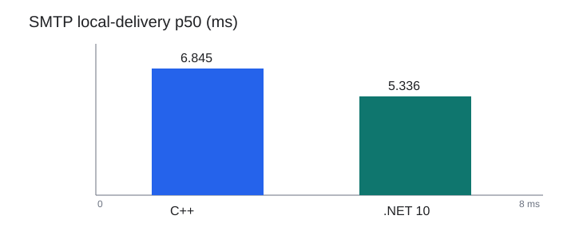

The follow-up Net10 component test sent a real TCP `451` from a loopback sink
through `SmtpRemoteDeliveryClient`, `RemoteDeliveryTargetDispatcher`, and
`DeliveryQueueProcessor`. SQL readback proved `messagetype=1`, unlocked lease,
cleared lease owner, retry count `1`, future `messagenexttrytime`, and one
retained recipient; the sink observed EHLO/MAIL/RCPT and no DATA. Evidence is
under `artifacts/benchmarks/paired-cpp-net10-20260901-delivery/net10-tcp451-retry.*`.
This is Net10 component-level evidence only. A paired C++/Net10 retry result,
larger delivery waves, and retry recovery remain open; performance is **RED**.

Code/test commit `434dac735` adds manifest-bound corpus sizing to the
benchmark-only paired fixture and concurrent IMAP runner. The disposable
orchestrator starts the legacy C++ binary through a unique SCM service, passes
its verified worker PID to the workload runner, and owns service stop/delete
and temporary SQL principal cleanup. The installed `hMailServer` service and
Application registration are not modified.

The first valid paired 100,000-message SEARCH/SORT acceptance used one fresh
fixture, matching SQL/Data copies, SQL Server, loopback `127.0.0.1:1143`, and
the `Full` IMAP profile. Both implementations passed exact SEARCH and SORT
validation:

| Implementation | p50 ms | p95 ms | p99 ms | Throughput/s | Result |
| --- | ---: | ---: | ---: | ---: | --- |
| Legacy C++ service | 15849.605 | 15849.605 | 15849.605 | 0.063 | 100000/100000 PASS |
| .NET 10 | 846.875 | 846.875 | 846.875 | 1.170 | 100000/100000 PASS |

The fixture manifest is `DE4DA2CDCDA01B1BE6D8C9BC98A377167205E940722D2BBCEE98A15A16ACB23A`;
each side contained exactly 100,000 SQL messages and 100,000 byte-matched
Data files. The compact comparison and chart are under
`artifacts/benchmarks/paired-cpp-net10-20260901-100k/`.

This is a single-session mailbox acceptance cell. Its measured p50 ratio is
`18.715` C++/Net10, but it is not a general product speedup claim. The
performance release gate remains **RED** because C++ 500/1000-session
capacity, larger SMTP/delivery/queue scenarios, backup/restore timing,
installer/COM lifecycle, and 24-hour leak acceptance remain open.

The disposable Net10 Full-Text backfill also passed `100000/100000` before
the live cell. No production database, Data directory, service, COM
registration, DCOM ACL, or public listener was used.

The earlier 100-session paired capacity cell remains historical evidence:

The first valid paired capacity cell used the same manifest-bound 1,000-message
corpus, copied Data trees, SQL Server instance, loopback `127.0.0.1:1143`,
`Full` IMAP profile, and 100 sessions. Both implementations passed `100/100`
with SEARCH and SORT returning the exact `1..1000` sequence. Observed values
were:

| Implementation | p50 ms | p95 ms | p99 ms | Throughput/s | Result |
| --- | ---: | ---: | ---: | ---: | --- |
| Legacy C++ service | 2696.204 | 4334.200 | 4377.055 | 22.717 | 100/100 PASS |
| .NET 10 | 528.348 | 629.023 | 641.604 | 148.932 | 100/100 PASS |

These are one 100-session observation, not a release-wide performance claim.
The paired artifacts are under
`artifacts/benchmarks/paired-cpp-net10-20260901-service/concurrent-cpp-100/`
and `concurrent-net10-100/`. The complete capacity matrix is documented in
`artifacts/benchmarks/paired-cpp-net10-20260901-service/concurrent-imap-capacity-matrix.md`.

The 500-session cell was C++ `189/500` versus Net10 `500/500`; the 1,000-session
cell was C++ `186/1000` versus Net10 `1000/1000`. C++ failures were socket
timeouts/refusals under load, while both disposable service wrappers completed
cleanup and preserved production state. These failed legacy cells remain part
of the acceptance record and invalidate a general speedup claim.

The Net10 fixture required a disposable-only correction before indexing:
`hm_messages.messagefilename` was repointed from the copied source path to the
matching copied staging Data root in both disposable databases. The Net10
Full-Text backfill then passed `1000/1000` and produced the indexed state used
by this cell. No production database or Data directory was used.

Performance remained **RED** in this historical cell because legacy C++
500/1000-session capacity did not pass. The 100k cell above is now complete,
while durable SMTP/delivery, backup/restore timing, and 24-hour leak
acceptance remain open.

The first service-backed durable SMTP cell also passed on the same paired
fixture: 100/100 accepted messages for both implementations, with exact
SQL/Data post-run accounting. C++ p50/p95 were `6.678/10.555 ms` at `19.274`
messages/s; Net10 was `4.716/8.605 ms` at `19.287` messages/s. This is one
descriptive 100-message cell, not a general performance claim. Evidence is
under `artifacts/benchmarks/paired-cpp-net10-20260901-service/smtp-cpp-100/`
and `smtp-net10-100/`.

## Historical status (2026-08-31, disposable legacy C++ service)

Code/test commit `76902911e` adds an explicit disposable-only legacy startup
path. The default C++ behavior is unchanged: `_tWinMain` still registers the
installed AppID, and normal service startup still uses `hMailServer`. With the
explicit `/DisposableBenchmark` and validated `/ServiceName=` options, a
Release x64 C++ build skips the installed AppID write and binds the SCM entry
point to a unique disposable service name. The source behavior is anchored at
`hmailserver/source/Server/hMailServer/hMailServer.cpp::_tWinMain`,
`StartServiceInitialization`, and `ServiceMain`.

The new disposable service runner created, started, exercised, stopped, and
deleted `hMailServerPerfCpp20260901` against the disposable SQL/Data fixture.
The worker PID and executable, SQL database, and loopback listeners
`127.0.0.1:2525`, `:1143`, and `:25110` were observed; installed Application
registry state remained unchanged. Evidence is in
`artifacts/benchmarks/paired-cpp-net10-20260901-service/service/`.

The service-backed protocol orchestrator now runs the same loopback SMTP, IMAP
SEARCH/SORT, and POP3 smoke workload through a real disposable C++ SCM worker.
C++ passed `6/6` samples on the attested 1,000-message fixture. The paired
Net10 smoke run passed SMTP/POP3 but failed IMAP SEARCH/SORT because it returned
zero results, so this is validation evidence only and not a speedup claim.
Reports are under
`artifacts/benchmarks/paired-cpp-net10-20260901-service/protocol-cpp-service/`
and `.../protocol-net10/`.

The disposable service runner also verifies the exact legacy SQL listener rows
before startup: protocol 1 on 2525, protocol 3 on 25110, and protocol 5 on
1143, each bound to `127.0.0.1` (`portaddress1=2130706433`). A mismatch fails
closed and is recorded in the service protocol report.

This removes the prior “C++ cannot run as a service” environment blocker, but
does not establish a performance winner. The release performance gate remains
**RED** until the same service-backed C++ and Net10 workloads pass the complete
matrix, including 100,000-message SEARCH/SORT, 1,000 concurrent IMAP, delivery,
backup/restore timing, and 24-hour leak acceptance. The full Net10 suite is
`2773 passed, 90 skipped, 5 failed`; the five existing failures are registered
local-server COM activation checks returning `E_NOINTERFACE`.

## Current authoritative status (2026-08-31, SEC-18 graph raw-value attestation)

Code/test commit `38d6f96e3` independently validates the canonical raw registry
value names, REG_SZ type, and UTF-16 NUL-terminated bytes for all installed
Application graph paths in both Registry64 and Registry32 views. It preserves
the legacy Registry32 asymmetry and rejects a tampered raw value even when
counts, hash, and collector flags are retained. Focused SEC-18 validators pass.

The full Net10 suite remains `2773 passed, 90 skipped, 5 failed` (`2868` total).
The five failures are existing registered local-server COM activation checks
returning `E_NOINTERFACE` (`0x80004002`). SEC-18 live caller-token evidence,
registered out-of-process COM, disposable restore/installer baselines, and the
performance release gates remain open. No production registration, DCOM ACL,
service, database, or Data directory was changed.

## Current IMAP profile diagnostic (2026-08-31, RED)

Code/test commit `0b462ef7c` adds benchmark-only `Admission`, `AuthSelect`,
`Search`, `Sort`, and `Full` profiles so listener admission and each SQL-backed
operation can be measured separately. A fresh disposable 5708/6000 fixture
preserves the same 1,000-message logical corpus and 1,000-file Data tree for
the current-head C++ and Net10 builds.

At 1,000 concurrent sessions, admission passed `1000/1000` for both sides.
The C++/Net10 admission p95 values were `785.501/1050.048 ms`; this isolated
ratio is descriptive only. `AuthSelect` was C++ `979/1000` versus Net10
`1000/1000`; `Search` was C++ `983/1000` versus Net10 `0/1000` timeouts; and
`Sort` was C++ `963/1000` versus Net10 `1000/1000`. `Full SEARCH/SORT` was C++
`223/1000` versus Net10 `0/1000` timeouts. No full-load speedup or overall
winner is claimed. The performance release gate remains **RED**.

Report and charts:

- [PROFILE_DIAGNOSTIC.md](artifacts/benchmarks/paired-cpp-net10-20260831-query-indexed-diagnostic/report/PROFILE_DIAGNOSTIC.md)
- [profile-success-count.png](artifacts/benchmarks/paired-cpp-net10-20260831-query-indexed-diagnostic/report/profile-success-count.png)
- [profile-p95-latency.png](artifacts/benchmarks/paired-cpp-net10-20260831-query-indexed-diagnostic/report/profile-p95-latency.png)
- [profile-throughput.png](artifacts/benchmarks/paired-cpp-net10-20260831-query-indexed-diagnostic/report/profile-throughput.png)

The C++ process used for this diagnostic was a disposable standalone `/Debug`
process; the separate service acceptance above now closes that launch gap. The
corpus is still below the required 100,000 messages. No production source, COM
registration, service, database, or Data directory was changed. The initial
query-state gap was then closed only in the disposable Net10 fixture before the
indexed rerun.

The read-only SQL state collector in `5676f6a82` found that the paired C++
database has no Net10 indexing tables, while the Net10 database has Full-Text
objects but `0/1000` search documents, indexing disabled, and an empty queue.
Therefore the current Search/Full failures cannot be treated as pure capacity
evidence until a disposable Net10 index is prepared and the profiles are
rerun. The state report is
[imap-query-state.md](artifacts/benchmarks/paired-cpp-net10-20260831-query-diagnostic/query-state/imap-query-state.md).

After the disposable Net10 backfill test passed, the indexed rerun reached
`1000/1000` for Net10 in all five profiles. C++ reached `1000/1000` for
Admission, AuthSelect, and Sort, but only `579/1000` for Search and `775/1000`
for Full. The indexed report is
[PROFILE_DIAGNOSTIC.md](artifacts/benchmarks/paired-cpp-net10-20260831-query-indexed-diagnostic/report/PROFILE_DIAGNOSTIC.md)
with the corresponding
[query-state evidence](artifacts/benchmarks/paired-cpp-net10-20260831-query-indexed-diagnostic/query-state/imap-query-state.md).
The performance gate remains **RED** because the paired Search and Full
acceptance conditions still fail; the installed-service launch gap is now
closed only for disposable testing.

The threshold matrix in code/test commit `bdccabb08` ran Search and Full at
100/500/1000 sessions on the indexed disposable fixture. Net10 passed every
cell. C++ passed 100 and 500 sessions, then reached `890/1000` for Search and
`951/1000` for Full at 1,000 sessions. Ratios are published only for paired
PASS cells; this is a capacity threshold diagnostic, not an overall speedup
claim. See the [threshold report](artifacts/benchmarks/paired-cpp-net10-20260831-threshold-diagnostic/report/IMAP_QUERY_THRESHOLD_DIAGNOSTIC.md)
and [chart](artifacts/benchmarks/paired-cpp-net10-20260831-threshold-diagnostic/report/threshold-success-count.png).

The follow-up connection-ramp diagnostic in code/test commit `7f36e0987`
records the launch stagger without changing the default simultaneous workload.
At 1,000 C++ Search sessions, the simultaneous run was `890/1000` with 110
transport-boundary errors; the 5 ms/session-index ramp was `402/1000` with 598
connection refusals. Net10 passed the same ramp `1000/1000`. The C++ errors
occur before a valid IMAP SEARCH response and are not evidence of a SQL search
correctness defect. Legacy source mapping is documented in the
[capacity-failure diagnostic](artifacts/benchmarks/paired-cpp-net10-20260831-ramp-diagnostic/report/IMAP_CAPACITY_FAILURE_DIAGNOSTIC.md).
No listener, SQL, ACL, or production behavior was changed, and no overall
speedup claim is valid. Performance remains **RED**.

## Current POP3 large-mailbox acceptance (2026-08-31)

Code/test commit `84a11e4c6` makes the existing disposable POP3 large-mailbox
runner manifest-bound for both legacy C++ and Net10 and adds a focused v2
validator. Against the same 1,000-message SQL/Data fixture and the same
`USER/PASS/STAT/LIST/UIDL/RETR 1/QUIT` sequence, both implementations passed
5/5 iterations and reported mailbox rows `1000/1000`. Net10 total p50 was
`91.739 ms`; C++ `/Debug` was `102.670 ms`. These are acceptance diagnostics,
not a release performance winner: that historical run used `/Debug`, the
corpus is 1,000 rather than 100,000 messages, and only five iterations were
run. See the [POP3 report](artifacts/benchmarks/paired-cpp-net10-20260831-pop3-large-mailbox/report/POP3_LARGE_MAILBOX_COMPARISON.md).

## Installer/rollback acceptance status (2026-08-31)

The rollback archive preflight passed without installer side effects. The actual
installer drill is **ENVIRONMENT-BLOCKED** because it would invoke
`--register-com` and `sc.exe create/config` and this host has no disposable
registered legacy service/COM rollback baseline. No machine-wide service,
registry, COM, database, or Data mutation was attempted. Details and the exact
continuation requirements are in the [installer/rollback preflight report](artifacts/migration/installer-rollback-preflight-20260831.md).

## SEC-18 evidence audit (2026-08-31)

The existing disposable IIS staging artifacts and SEC-18 safety/self-test set
were audited read-only. The four repository validators pass, and the VM record
proves a dedicated IIS worker-token capture. SEC-18 remains **RED**: no
independent COM caller-token evidence exists, and two same-day inventory files
conflict on whether the legacy Application AppID/service is present. A fresh,
single-invocation inventory and separately registered disposable caller probe
are required. See the [SEC-18 evidence audit](artifacts/sec18-staging/SEC18-EVIDENCE-AUDIT-20260831.md).

## Restore dry-run audit (2026-08-31)

The read-only restore planner, containment, execution-gate, metadata, and
integrity tests passed `121/121` using the built Net10 test assembly. Populated
SQL/Data round-trip acceptance is **ENVIRONMENT-BLOCKED** because the required
isolated SQL connection and explicit isolated-create opt-in were not configured;
no database or Data directory was touched. See the [restore dry-run audit](artifacts/migration/restore-dry-run-audit-20260831.md).

## SEC-18 authorized-result gate (2026-08-31)

The SEC-18 attester now requires a supplied authorized response whose
activation, interface, and method HRESULTs are all `S_OK`; missing responses
and non-success HRESULTs fail closed. Focused attestation, staging inventory,
registry-binary, and worker-token tests pass. This closes only the evidence
validator gap; it does not create a live COM caller proof. Wrong-SID/process
identity and installed-graph completeness remain open. See
`build/attest-sec18-denial-evidence.ps1` and
`build/test-sec18-denial-evidence-attestation.ps1`.

The next SEC-18 attestation slice requires the wrong-SID case to contain
distinct caller/expected SIDs and the non-pool case to match an independently
measured process identity whose SID differs from the dedicated pool. Negative
fixtures cover both failures. This remains evidence validation, not live COM
proof; canonical installed-graph content validation remains open.

## Current performance gate (2026-08-31, RED)

### Current HEAD paired diagnostic

The fresh disposable fixture `hmail-perf-pair-head2-20260831` uses the same
1,000-message logical corpus and 1,000-file Data tree for a current-HEAD
legacy C++ Release build (`b00eb7e52319`) and the Net10 Release build. Both
protocol runs passed 200/200 for SMTP, IMAP, and POP3. Durable SMTP acceptance
passed 500/500 for both implementations with exact SQL/Data accounting.

The concurrent IMAP gate is still RED: C++ passed 100/100 but only 225/500
and 225/1000; Net10 passed 100/100 and 500/500 but only 224/1000. No ratio or
winner is published for 500 or 1000 because the paired acceptance condition
failed. The current raw diagnostic report and charts are
[`PERFORMANCE_DIAGNOSTIC.md`](artifacts/benchmarks/paired-cpp-net10-20260831-head2/report/PERFORMANCE_DIAGNOSTIC.md),
[`concurrent-imap.png`](artifacts/benchmarks/paired-cpp-net10-20260831-head2/report/concurrent-imap.png),
and [`protocol-p95.png`](artifacts/benchmarks/paired-cpp-net10-20260831-head2/report/protocol-p95.png).
Protocol and SMTP p95 values are descriptive measurements only; they do not
clear the release gate. The corpus is 1,000 messages, not the required
100,000-message mailbox, and the C++ run is a disposable standalone `/Debug`
process rather than an installed service. Performance remains **RED**.

Release build follow-up commit `058a9f6f7` annotates the Windows-only backup
snapshot ACL/SID path and its COM `LoadBackup` entry point with the supported
Windows platform contract. Focused `BackupArchiveIdentityTests` pass `13/13`,
and the complete Release build passes with `0` warnings and `0` errors for both
ComInterop target frameworks. This removes the Release CA1416 build blocker;
registered COM activation, high-concurrency capacity, soak, and the other
release gates remain open.

The ordered load also captured the worker-exit cause in the Windows
Application log: `MessageSearchBackfillHostedService` lost a SQL connection
from the pool and the default `StopHost` policy terminated the Net10 process.
Commit `a3e14d83e` now logs transient backfill batch failures and retries while
preserving cancellation. Follow-up commit `605bb1cf0` adds a bounded
exponential retry delay (2 s, 4 s, capped at 30 s) and resets it after a
successful batch. Focused coverage is `5/5`; this reduces repeated SQL-pool
pressure and prevents indexing failure from taking down the service, but does
not yet prove the IMAP high-load gate.

Post-fix disposable load evidence confirms the distinction: Net10 1000
concurrent sessions completed `0/1000` and 500 completed `0/500`, but the
worker remained alive and shut down cleanly; 100 completed `8/100`. The
remaining failure is capacity/SQL contention, not an unhandled backfill crash.

Benchmark tooling commit `7f70890fd` upgrades the concurrent IMAP artifact to
`live-concurrent-imap-v2`. Reports now attest the effective Net10 SQL
provider/database/pooling/max-pool/timeout settings and the exact per-session
fan-out (`one TCP client; greeting, LOGIN, SELECT, SEARCH, SORT, LOGOUT`). On
the disposable postfix fixture, an acceptance-shaped 100-session diagnostic
with explicit `Max Pool Size=500` and 30-second socket timeout passed `100/100`
(p50 `5241.172 ms`, p95 `5309.501 ms`) with clean shutdown. Comparable
5-second probes were `0/100` with pool 100 and `59/100` with pool 500, so pool
size alone is not a proven capacity fix. The required 500/1000 levels and soak
remain unproven; the performance gate remains **RED**.

The follow-up v2 runs used the same disposable postfix fixture, loopback
ports, 30-second socket timeout, and explicit Net10 pool 500. Net10 passed
`500/500` at p50 `26778.192 ms` and p95 `27792.686 ms`, but timed out `1000/1000`
at the 1,000-session level. Legacy C++ completed `227/500` and `363/1000`;
its reports correctly identify the native legacy SQL layer rather than claiming
Net10 pool settings. Both implementations had clean process shutdown and no
runtime failures. These are diagnostic capacity results, not a speed claim or
a release-gate pass.

An SQL DMV sample taken during a separate Net10 pool-500 500-session run
recorded 92 to 447 concurrent requests for the target database, with
`ASYNC_NETWORK_IO` as the observed request wait type. That run still passed
`500/500` but measured p50 `23204.878 ms`, p95 `23707.578 ms`, and throughput
`20.892/s`. The raw disposable sample is under
`artifacts/benchmarks/paired-cpp-net10-20260831-session-attested/sql-dmv-net10-500-pwsh/`.
This is SQL-side evidence of result-stream/fan-out pressure, not proof of
Net10 superiority or a cleared 1,000-session gate.

> **Revalidation required:** the table below is retained as historical
> diagnostic evidence. Its original generator did not independently recompute
> sample cardinality, percentiles, throughput, or bind raw report bytes to a
> trusted run descriptor. Do not use it to claim Net10 performance superiority
> until the attested full matrix is regenerated by the hardened pipeline.

The clean paired Release comparison is now executable. Legacy C++ and .NET 10
used the same 1,000-message logical corpus, byte-identical Data copies,
loopback ports, credentials, SQL instance, and protocol commands. C++ remains
on schema 5708; only the Net10 copy was upgraded to schema 6000. The legacy
binary was rebuilt from the repository source with post-build registration
disabled.

Code/test commit `a71a5963f` adds a sealed paired-run descriptor. It binds one
shared run ID, the exact fixture-manifest hash, all required protocol,
concurrency, SMTP, and short-soak artifact slots, and the SHA-256 of every raw
JSON report. The hardened generator now requires this descriptor before it can
emit a comparison table, ratio, or chart. No new acceptance-sized matrix has
been run through this boundary yet, so the table below remains historical
diagnostic evidence.

Code/test commit `7c3f009bc` closes the observable IMAP completion-text gap:
legacy `IMAPCommandSEARCH::ExecuteCommand` emits `OK Search completed` for
non-UID SEARCH and SORT, and Net10 now emits the same text. Focused handler,
session, and TCP coverage passes `64/64`; the live protocol producer now fails
an otherwise passing sample if either legacy completion tag does not match.

| Scenario | Legacy C++ p95 | .NET 10 p95 | Result |
| --- | ---: | ---: | --- |
| SMTP command | 3.92 ms | 0.69 ms | Net10 5.67x faster |
| IMAP SEARCH/SORT | 159.65 ms | 17.43 ms | Net10 9.16x faster |
| POP3 | 2.74 ms | 23.02 ms | Net10 8.39x slower |
| IMAP at 1,000 sessions | 689/1,000 | 1,000/1,000 | Legacy C++ gate failed |
| SMTP durable acceptance | 20.692 msg/s | 20.532 msg/s | Effectively tied |

Both implementations accepted 500/500 SMTP messages with exact +500 SQL rows
and +500 Data files. Net10 also completed a 20,000-session short soak with
zero errors. The overall performance release gate remains **RED** because the
mandatory 24-hour soak, remote delivery, queue, TLS/network, restore,
installer, and lifecycle gates are still open. POP3 is a documented Net10
regression; no production-readiness claim is made.

The benchmark containment follow-up is code/test commit `3b6dd0fc6`.
`provision-paired-benchmark-fixture.ps1` now pins the migration script hash and
requires approved disposable Data/backup roots plus a registration-disabled
legacy build manifest. All seven live benchmark runners reject unapproved
executable overrides, and the report generator refuses arbitrary or
pre-existing generated output. Focused input-safety rejection tests pass. This
closes harness input containment only: live SEARCH/SORT correctness still needs
returned UID/count/order assertions, and raw artifact provenance is not yet
bound end-to-end to one fixture and tested executable. A 50-wave diagnostic
Net10 run reached 49,986/50,000 with 14 client `WSAEADDRINUSE` errors; it is not
an acceptance result.

The live wire follow-up is now covered by code/test commit `c763be9c4`.
`build/live-imap-result-validation.ps1` validates the untagged SEARCH/SORT
identifier, numeric result shape, zero-result shape, and exact `1..1000`
sequence. The protocol and concurrent IMAP runners apply that validation to
every measured result. On the clean disposable fixture
`hmail_perf_pair_wire_cpp_20260827` / `hmail_perf_pair_wire_net10_20260827`,
both the C++ `/Debug` listener and the Net10 apphost passed one live SMTP,
IMAP, and POP3 smoke sample; both returned SEARCH and SORT `1..1000`.

The C++ wire tags match the legacy `IMAPCommandSEARCH::ExecuteCommand`,
`IMAPCommandUID::ExecuteCommand`, and `IMAPSort::Sort` behavior. Net10 still
emits `a003 OK SEARCH completed` and `a004 OK SORT completed`, while legacy
emits `a003 OK Search completed` and `a004 OK Search completed`; the result
runner records this as an explicit compatibility difference. This proves live
result correctness for the tested index-populated fixture, not full IMAP
parity or performance acceptance.

Code/test commit `61bf5ec6e` completes end-to-end manifest binding for the core
protocol, concurrent IMAP, and durable SMTP artifacts. JSON, CSV, and Markdown
now carry one run ID, fixture/manifest identity, disposable database/Data
identity, and exact C++/Net10 executable hashes; validators reject unbound or
failed reports. Exact SMTP SQL-row and Data-file deltas are mandatory.

A fresh repository-generated fixture exposed a separate production parity
gap that the earlier table did not exercise. With legacy `MessageIndexing=0`
and no search-document rows, C++ scans message files and returns SEARCH
`1..1000`, while Net10 currently returns zero; SORT remains exact. The earlier
latency comparison used an index-populated fixture and remains valid only for
that configuration. Indexing-disabled SEARCH fallback is therefore the next
bounded production slice, and the performance release gate remains **RED**.

Code/test commit `ebe4e04a4` closes the bounded `SEARCH SUBJECT` part of that
gap. Net10 now reads the MIME-decoded Subject from authoritative `.eml` files
and applies legacy case-insensitive substring matching independently of the
indexing setting. Focused tests pass `26/26`, and a manifest-bound disposable
1,000-message live smoke returned exact `1..1000` for `SEARCH SUBJECT
Benchmark`. Its single `764.413 ms` sample is correctness evidence only.
`SEARCH TEXT needle` still returns zero on the empty-index fixture, so the
general indexing-disabled SEARCH gate and overall performance gate remain
**RED**.

Code/test commit `48c3bea66` closes the bounded disabled-index `SEARCH TEXT`
gap. Net10 now evaluates decoded top-level headers, the first visible plain
body, and raw HTML as separate authoritative-file domains, preserving legacy
case-insensitive substring behavior and excluding attachments. Focused tests
pass `23/23`; the broader search set passes `30/30`. On a fresh manifest-bound
1,000-message fixture, the unchanged protocol workload returned exact SEARCH
and SORT `1..1000`, and 1x1 concurrent IMAP passed. The one-sample IMAP times
(`808.878 ms` protocol, `729.160 ms` concurrent) are correctness diagnostics,
not acceptance percentiles. Per-message metadata SQL, enabled partial-index
coverage, and full paired load remain open, so the performance gate stays
**RED**.

Code/test commit `33c34766e` removes the per-candidate metadata-query N+1 for
file-backed Subject and disabled-index TEXT searches. Candidate metadata is
loaded through a parameterized 128-item batch query with order and missing-row
preservation; MIME parsing, indexed behavior, SORT, and COM boundaries are
unchanged. Focused coverage is `39/39`, the disposable localhost SQL batch test
passes, and the Release Service build has zero warnings/errors. MIME parsing is
still per candidate and fresh percentile measurements are pending, so the
performance gate remains **RED**. The next slice is enabled partially-indexed
SEARCH fallback parity.

Code/test commit `1d0c66634` closes that partial-index false-negative. For a
text-bearing SEARCH, Net10 checks index coverage; when indexed rows are fewer
than message rows, it retains SQL mailbox/UID/flag/date filtering but evaluates
header, body, and TEXT terms through the authoritative message files. A
disposable SQL test with two matching messages and only one index row returns
both UIDs. Complete-index behavior and SORT are unchanged. Full Debug is `2772
passed, 90 skipped, 5 failed`; the five failures are the existing registered
COM local-server `E_NOINTERFACE` checks. The performance gate remains **RED**.

Code/test commit `89ad75a53` hardens the aggregate comparison boundary. The
report generator now requires every protocol, concurrent IMAP, SMTP, and soak
input to match the exact fixture-manifest bytes, disposable DB/Data target,
executable path/hash, run-start SQL/Data/message fingerprint, implementation,
and one shared non-empty run ID. It rejects legacy `UNBOUND`, stale executable,
missing-attestation, and mixed-run artifacts before producing tables or
charts. SMTP now performs and publishes the same pre-launch attestation; fresh
disposable C++ and Net10 `1/1` SMTP smokes both passed exact SQL/Data accounting
and the JSON/CSV/Markdown validators. Those one-message runs are integration
evidence only and publish no speed claim. A trusted run descriptor, raw report
hash binding, and metric/sample recomputation remain mandatory before the full
comparison can be regenerated; the performance gate remains **RED**.

Code/test commit `f43ef7094` also makes the comparison generator recompute
percentiles and throughput from raw samples, enforce the exact 200/500/100,
500,1,000/20-wave workload shapes, validate SEARCH/SORT result correctness,
reconcile every soak wave's resource snapshot, and require detailed SMTP
SQL/Data acceptance evidence. Concurrent artifacts now carry an exact session
sequence per wave. A `1/1` smoke remains intentionally excluded from the
acceptance charts; the full matrix must be rerun through this validator before
the historical table above can be treated as current evidence.

The complete report, sanitized CSV/JSON summaries, and static charts are in
[artifacts/benchmarks/paired-cpp-net10-20260827/PERFORMANCE_COMPARISON.md](artifacts/benchmarks/paired-cpp-net10-20260827/PERFORMANCE_COMPARISON.md).

The post-batch paired diagnostic is recorded in
[artifacts/benchmarks/paired-cpp-net10-20260828-batch/PERFORMANCE_COMPARISON.md](artifacts/benchmarks/paired-cpp-net10-20260828-batch/PERFORMANCE_COMPARISON.md).
It uses the same disposable 1,000-message fixture for both implementations;
three-iteration p95 values are diagnostic only. Net10 passed the protocol and
1-session checks, but was slower in this small sample for IMAP and POP3. No
speedup claim is made and the performance gate remains **RED**.

Code/test commit `15a92553f` adds live run-start fixture attestation. Before
the paired protocol or concurrent-IMAP process starts, the harness now re-hashes
the manifest, exact 1,000-file Data tree, disposable SQL version/message
projection, and selected executable; descendant Data reparse points fail
closed. JSON, CSV, and Markdown must agree. A fresh C++/Net10 smoke passed and
is recorded in
[artifacts/benchmarks/paired-cpp-net10-20260828-attested/PERFORMANCE_COMPARISON.md](artifacts/benchmarks/paired-cpp-net10-20260828-attested/PERFORMANCE_COMPARISON.md).
The samples are not acceptance percentiles. Full launch-payload leases,
expanded SQL state, aggregate provenance enforcement, load, and soak remain
open, so the performance gate is still **RED**.

The lower dated status sections are retained as historical slice records. The
2026-08-27 performance section above is the authoritative current status.

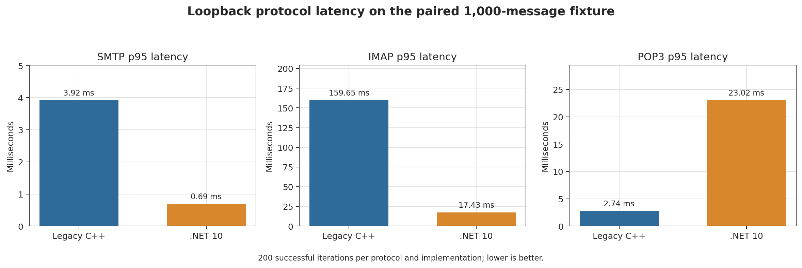

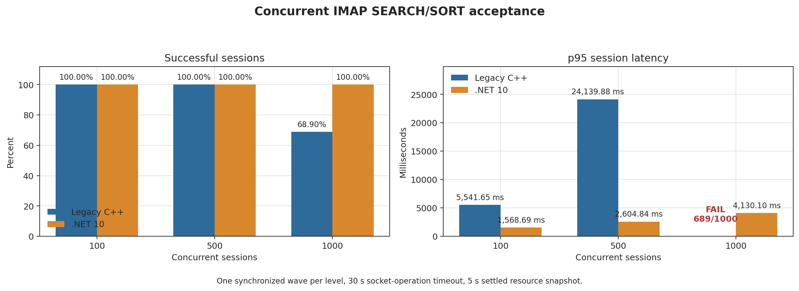

## Current authoritative status (2026-08-26, disposable legacy registration)

The legacy payload `hMailServer.exe /Register` was run only inside the approved
disposable `HMailServer-SEC18-Disposable` VM. It returned exit code `0`; its
service is `Stopped/Disabled`, and the staging collector now sees the existing
Application AppID. The IIS staging health check remains `200 OK` on
`127.0.0.1:8088`. Independent PHP/FastCGI COM caller-token evidence is still
missing, so SEC-18 and the overall release gate remain **RED**. No production
registration, DCOM ACL, database, Data directory, or service was changed.

A bounded real PHP/FastCGI probe also confirmed that the existing
`hMailServer.Application` activation returns `E_ACCESSDENIED` for the dedicated
worker identity. The service was stopped and disabled and the temporary probe
was removed afterward; this is denial evidence, not broker authorization.

The offline synthetic 100k-message IMAP SEARCH/SORT harness also passes at
HEAD (`9091/9091` correct; p50 `9.118 ms`, p95 `9.542 ms`, p99 `9.660 ms`).
This is diagnostic Net10-only evidence and does not establish SQL FTS, live
IMAP, or legacy C++ performance parity.

Disposable local SQL acceptance also completed against `localhost` using only
GUID-scoped databases. Full-Text was present; the success database migrated
from `5708` to `6000`, the injected failure database remained at `5708`, and
cleanup reported zero errors with no production paths or COM/DCOM changes.
The legacy transaction branch is recorded as `BlockedByFullTextDdl`, so this is
not a claim of atomic legacy transaction equivalence.

## Current authoritative status (2026-08-25, physical Data quiescence audit)

The quiescence audit found that `DeliveryQueuePauseDrainGate` only gates the
delivery queue worker (`hmailserver/source/Server.Net10/src/HMailServer.Delivery/DeliveryQueuePauseDrainGate.cs`),
while `SevenZipBackupArchiveRuntime.StageDataDirectory` still snapshots the
configured Data root without a shared admission boundary. No coordinator spans
SMTP, IMAP, POP3, external-fetch, import, message, and COM writers. A partial
lock would not establish legacy-safe backup consistency, so no production code
change was made. This remains a release blocker; the next implementation must
introduce and prove a complete writer admission contract or use isolated cloned
rollback testing instead. Release remains **RED**.

## Current authoritative status (2026-08-25, DB-only message snapshot parity)

Code/test commit `50e95294c` extends the domain-only snapshot to the legacy
`BOMessages` plus `BackupMessagesDbOnly` path. Folder and DB message metadata
now use the same SQL snapshot transaction through the existing folder/message
store transaction constructors. Physical DataBackup staging is unchanged.
Legacy anchor: `Account::XMLStore` and `GetFolders()->XMLStore` at
`hmailserver/source/Server/Common/BO/Account.cpp:318-327`. Focused tests pass
`3/3`; full Debug Net10 passes `2729`, skips `96`, and fails `0` (`2825` total).

Physical message backup, Data quiescence, settings-wide consistency, and crash
consistency remain open. Release remains **RED**.

## Current authoritative status (2026-08-25, domain backup rule snapshot parity)

Code/test commit `b60432724` extends the domain-only SQL snapshot with the
legacy `Account::XMLStore` Rules, Criteria, and Actions child projections.
Legacy ordering is anchored at `hmailserver/source/Server/Common/BO/Account.cpp:318-322`;
the SQL rule stores use the existing transaction context. Focused snapshot and
payload tests pass `3/3`; full Debug Net10 passes `2729`, skips `96`, and fails
`0` (`2825` total).

This remains domain-only metadata parity. Folders/messages, physical Data
quiescence, settings-wide consistency, and crash consistency remain open.
Release remains **RED**.

## Current authoritative status (2026-08-25, domain backup account/fetch snapshot parity)

Code/test commit `8157fb1da` extends the domain-only SQL snapshot with the
legacy `Account::XMLStore` child projections: encrypted account credentials,
`FetchAccount::XMLStore`, and `FetchAccountUID::XMLStore`. Legacy anchors are
`hmailserver/source/Server/Common/BO/Account.cpp:280-327`,
`FetchAccount.cpp:55-79`, and `FetchAccountUID.cpp:42-49`. The snapshot now
uses transaction-scoped `IBackupAccountAdministrationStore` and
`IBackupFetchAccountAdministrationStore`; payload tests cover account password
encryption metadata and fetch credential projection. Focused tests pass `3/3`;
full Debug Net10 passes `2729`, skips `96`, and fails `0` (`2825` total).

This remains limited to domain-only metadata. Settings, rules, folders,
messages, physical Data quiescence, and cross-writer crash consistency remain
open; no full backup release claim is made. Release remains **RED**.

## Current authoritative status (2026-08-25, read-only SQL backup snapshot scope)

Code/test commits `e28c767f6` and `503d4b724` add the bounded
`IBackupDomainProjectionSnapshotFactory` contract, SQL Server implementation,
and a production `BackupXmlPayloadRuntime` path for domain-only backups. That
path opens one explicit `IsolationLevel.Snapshot` transaction and exposes only
read-only domain projection stores; disposal rolls the transaction back and
closes the connection. Legacy backup anchors are
`BackupExecuter::StartBackup` (`hmailserver/source/Server/Common/Application/BackupExecuter.cpp:57`),
`BackupTask::DoWork` (`.../BackupTask.cpp:27`), and
`Configuration::XMLStore` (`.../Configuration.cpp:687`). Focused contract tests
pass `3/3`; full Debug Net10 passes `2729`, skips `96`, and fails `0` (`2825`
total).

Only the domains-only projection path uses this scope. Settings, fetch-account
secrets, rules, folders, messages, physical Data quiescence, and writer
coordination remain independent/open; no full SQL/Data atomicity or
crash-consistency claim is valid. Release remains **RED**.

## Current authoritative status (2026-08-25, SURBL mutation leases)

The latest bounded COM/Admin slice forwards the generation-bound authorization
lease through `AntiSpam.SURBLServers` and holds it across SURBL insert, update,
and delete callbacks. Legacy anchors are `InterfaceSURBLServer::Save/Delete`
(`source/Server/COM/InterfaceSURBLServer.cpp:12,187`) and
`InterfaceSURBLServers::DeleteByDBID/Add`
(`source/Server/COM/InterfaceSURBLServers.cpp:88,135`). Focused SURBL COM
tests pass `17/17`; related SQL store tests pass `6/6`; standard full Debug
passes `2726`, skips `96`, and fails `0` (`2822` total). COM identity and
direct activation denial remain unchanged.

Release remains **RED**. The SQL backup snapshot, rollback, SEC-18, registered
COM, credential, paired performance, and long-soak gates remain open.

## Current authoritative status (2026-08-25, security-range mutation leases)

The latest bounded COM/Admin slice carries the generation-bound authorization
lease through `Settings.SecurityRanges` into security-range insert, update,
delete, and `SetDefault` store callbacks. Legacy anchors are
`InterfaceSecurityRange::Save/Delete`
(`source/Server/COM/InterfaceSecurityRange.cpp:36,759`) and
`InterfaceSecurityRanges::Delete/DeleteByDBID/Add/SetDefault`
(`source/Server/COM/InterfaceSecurityRanges.cpp:43,60,158,219`). Focused
`SecurityRangesComContractTests` pass `28/28`; standard full Debug passes
`2724`, skips `96`, and fails `0` (`2820` total). COM identity and direct
activation denial remain unchanged.

Release remains **RED**; backup consistency, rollback, SEC-18, registered COM,
credential, paired performance, and long-soak gates remain open.

## Current authoritative status (2026-08-25, whitelist mutation leases)

The latest bounded COM/Admin slice carries the generation-bound authorization
lease through `AntiSpam.WhiteListAddresses` into whitelist insert, update,
item/collection delete, and clear store callbacks. Legacy anchors are
`InterfaceWhiteListAddress::Save/Delete`
(`source/Server/COM/InterfaceWhiteListAddress.cpp:8-54`) and
`InterfaceWhiteListAddresses::Clear/DeleteByDBID/Add`
(`source/Server/COM/InterfaceWhiteListAddresses.cpp:42-59,109-124,186-215`).
COM identity, DISPIDs, direct activation denial, and owner snapshots remain
unchanged. Focused whitelist COM tests pass `19/19`; related SQL store tests
pass `11/11`; standard full Debug passes `2722`, skips `96`, and fails `0`
(`2818` total).

Release remains **RED**. Backup consistency, rollback, registered COM/SEC-18,
credential evidence, paired C++/.NET performance, and long-soak gates remain
open. Cache `Clear` is still blocked because no real .NET cache backend exists.

## Current authoritative status (2026-08-25, TCP/IP port mutation leases)

The latest bounded COM/Admin slice guards TCP/IP port insert, update, delete,
and `SetDefault` store mutations with the generation-bound authorization
lease. Legacy anchors are `InterfaceTCPIPPort::Save`
(`source/Server/COM/InterfaceTCPIPPort.cpp:33`) and
`InterfaceTCPIPPorts::DeleteByDBID/Add`
(`source/Server/COM/InterfaceTCPIPPorts.cpp:101,148`). Focused
`TcpIpPortsComContractTests` pass `25/25`. The standard full Debug suite
passes `2720`, skips `96`, and fails `0` (`2816` total). Cache `Clear` remains
an explicit backend blocker: the .NET 10 runtime has no real cache-container
abstraction, so the existing optional seam is not being presented as parity.

Release remains **RED**. Backup writer quiescence, cloned rollback,
registered COM/SEC-18, PHP credential removal, paired C++/.NET load, protocol
thresholds, and long-soak evidence remain open.

## Current authoritative status (2026-08-25, SSL certificate mutation leases)

The latest bounded COM/Admin slice guards SSL certificate collection
`DeleteByDBID`, `Clear`, and item `Save` paths with the generation-bound
authorization lease. Legacy anchors are
`InterfaceSSLCertificate::Save/Delete` in
`source/Server/COM/InterfaceSSLCertificate.cpp:14,38` and collection
`DeleteByDBID/Add` in `source/Server/COM/InterfaceSSLCertificates.cpp:122,169`.
Focused `SslCertificatesComContractTests` pass `14/14`. The latest standard
full Debug suite passes `2718`, skips `96`, and fails `0`; the prior opt-in
environment run was `2797/16/0` before this slice and was not rerun because
the required opt-in environment variables are absent in the current shell.

Release remains **RED**. Atomic backup quiescence, cloned installer/service/
Data rollback, registered COM and SEC-18 evidence, PHP credential removal,
paired C++/.NET load, protocol thresholds, and 24-hour soak remain open.

## Current parity gate (2026-08-25, private binding reparse safety)

Private backup binding snapshot-root and staging-directory creation now uses
the existing handle-relative directory creator, so ancestor and final reparse
points are rejected during creation rather than checked only afterward. The
existing `BackupArchiveIdentityTests` reparse coverage remains green: `11`
passed, `2` skipped, `0` failed. Full Debug Net10 remains `2709` passed,
`95` skipped, `0` failed (`2804` total). Atomic source quiescence and
snapshot consistency remain separate release gates.

## Current release gate (2026-08-25, installer rollback guard)

The installer now snapshots every existing `hMailServer` service before COM or
service mutation and invokes compensating service plus legacy-COM rollback on
failure, including the same-executable existing-service path. The guard is
covered by `build/test-net10-rollback-archive-preflight.ps1`; the full Debug
Net10 suite passes `2709`, skips `95`, and fails `0` (`2804` total). This is a
rollback guard, not a completed machine-level installer drill. Cloned legacy
SQL/Data acceptance and service/registration rollback remain required.

## Current parity gate (2026-08-25, restore ancestor containment)

Restore directory moves now open the source and destination-parent paths
component-by-component from pinned Windows handles and reject ancestor reparse
points before the native rename. The legacy anchor is
`source/Server/Common/Application/BackupExecuter.cpp:195-217`; this closes the
destination-ancestor TOCTOU slice without changing the archive layout or
production paths. Focused restore tests pass `23`, skip `1`, and fail `0`; the
full Debug Net10 suite passes `2709`, skips `95`, and fails `0` (`2804` total).
Atomic filesystem snapshot/quiescence, registered COM/SEC-18, rollback,
paired-load, protocol-threshold, and soak gates remain open.

## Environment evidence (2026-08-25, SEC-18)

SEC-18 collector self-tests pass, but live evidence remains unavailable. The
current Codex token is not elevated (`Administrator=False`), and Hyper-V
`Get-VM`/`Get-VMHost` access is denied. No worker SID, registered COM caller,
DCOM permission, IIS, service, database, or Data-directory claim is made from
the self-tests. The SEC-18 gate remains **RED** pending an elevated isolated
host or disposable VM.

## Current parity gate (2026-08-25, Directories review)

The six writable legacy `Settings.Directories` properties now have focused
authenticated mutation coverage and preserve the installed COM identity and
direct-activation boundary. `DBScriptDirectory` remains read-only with the
legacy cached-path behavior. Focused `DirectoriesComContractTests` pass
`11/11`; the full Debug Net10 suite passes `2709`, skips `94`, and fails `0`
(`2803` total). Release remains **RED** because registered/out-of-process COM
and SEC-18 caller evidence, installer/restore rollback, paired C++/.NET load,
protocol thresholds, and long-soak evidence are still unavailable.

## Current parity gate (2026-08-25, INI replacement durability)

The administrator-password INI replacement now flushes the containing
directory after the atomic `File.Replace`/`File.Move`. Legacy behavior is
anchored at `source/Server/COM/InterfaceSettings.cpp:1014-1032`; this closes
the directory-metadata durability gap but does not prove process-kill or
power-loss recovery.

The external-fetch VBScript/JScript runner no longer embeds stored fetch-account
passwords. Legacy `Events.cpp:209-248` still exposes the Password property to
the script object; Net10 supplies UTF-16LE Base64 through stdin and decodes it
inside the runner. Focused WSH coverage is `64/64`. The disposable Full-Text SQL/Data acceptance passed: `25/25` backup/restore
round-trip tests and `7/7` SQL database-administration tests. The full Debug
Net10 suite passes `2703`, skips `94`, and fails `0` (`2797` total). This is
local disposable SQL Server evidence, not independent VM or production
evidence. Release remains **RED** for installed/out-of-process COM, SEC-18,
installer/service/Data rollback, power-loss durability, paired C++ performance,
protocol thresholds, and long-soak acceptance. Next slice: isolated registered
COM/SEC-18 caller evidence.

Offline follow-up checks pass: SEC-18/COM boundary tests are `47 passed, 1
skipped`, and installer/registration/rollback guard tests are `10 passed, 1
skipped`. These do not replace registered out-of-process COM, IIS worker
identity, service mutation, or disposable rollback evidence; release remains
RED.

`Application.ServerState` now receives the legacy `Stopped=1`, `Starting=2`,
`Running=3`, and `Stopping=4` lifecycle transitions across bootstrap,
readiness, failure, and shutdown. Focused coverage is `30 passed`; full Debug
Net10 is `2701 passed, 94 skipped, 0 failed`. The next slice is isolated
registered COM/SEC-18 caller evidence.

The safe offline 100k SEARCH/SORT benchmark passed in Release (`p50 13.78 ms`,
`p95 25.328 ms`, `p99 27.317 ms`). This is Net10-only diagnostic evidence,
not a C++ speed comparison or service soak result.

Contract note: legacy DISPID 76 is `IInterfaceSettings::SetAdministratorPassword`,
not an Application member. The Application lifecycle gap is `ServerState`
transition wiring plus registered/out-of-process COM and SCM evidence.

Authenticated `Application.Start()`/`Stop()` delegation is now implemented and
tested; the next code slice is wiring `ServerState` transitions to bootstrap,
readiness, and shutdown. Registered COM/SCM and SEC-18 evidence remain
environment-gated.

## Historical parity gate (2026-08-22, legacy POP3 PASS before USER)

Code/test commit `3d2e96724` closes the legacy POP3 PASS-before-USER gap.
Legacy `ProtocolPASS_` at `source/Server/POP3/POP3Connection.cpp:443-496`
routes the empty username through logon and returns the full-email guidance;
Net10 now does the same. Focused POP3/listener tests pass `24`, and full
Debug Net10 passes `2697`, skips `94`, and fails `0` (`2791` total).

The release gate remains **RED** because power-loss injection/durability,
native crash semantics, Full-Text SQL/Data, installed COM, migration/restore,
SEC-18, installer rollback, paired C++ performance, protocol thresholds, and
soak gates remain open. The next independent slice is approved Full-Text
SQL/Data round-trip acceptance. The previous empty-PASS entry below is
historical.
historical.
historical.

## Historical parity gate (2026-08-22, client-password runner secret transport)

Code/test commit `c86bb6f94` removes the plaintext client password from the
temporary `runner.vbs`/`runner.js` files. Legacy `Events.cpp:67-90` builds the
`OnClientValidatePassword(HMAILSERVER_ACCOUNT, password)` call in memory and
`ScriptServer.cpp:202-320` executes the generated source; the password is not
persisted as a runner file. Net10 now sends a UTF-16LE Base64 representation
over redirected stdin and decodes it inside the WSH runner, preserving the
legacy handler signature and result contract. Focused WSH tests pass `63`, and
full Debug Net10 passes `2682`, skips `94`, and fails `0` (`2776` total).

The release gate remains **RED**: installed COM, migration/restore, SEC-18,
installer rollback, paired C++ performance, protocol thresholds, and soak
gates remain open. The next independent slice is approved Full-Text SQL/Data
round-trip acceptance. The previous Settings.Scripting entry below is
historical.

## Historical parity gate (2026-08-22, Settings.Scripting runtime publication)

Code/test commit `e7ac977ef` publishes legacy `Settings.Scripting.Enabled` and
`Language` changes from the existing `hm_settings` rows into the singleton
script executor used by SMTP/IMAP/delivery event paths; persistence was added in
`768dd75ef`, while retaining
the deterministic real-authority proof for the parent construction race.
Legacy `InterfaceSettings::get_Scripting` performs a
live administrator check at `InterfaceSettings.cpp:1060`, while the returned
legacy child caches its settings in `InterfaceScripting::LoadSettings` and
continues to work after revocation. Net10 now checks the live administrator
before creating a new child, holds the generation-bound authorization lease
through construction, and preserves the retained-child behavior.

Focused scripting/SQL tests pass `107`, skip `0`, fail `0`; full Debug Net10
passes `2681`, skips `94`, and fails `0` (`2775` total). Release remains
**RED**: plaintext runner-file handling,
plaintext runner-file handling, installed COM, migration/restore, SEC-18,
installer rollback, paired C++ performance, protocol thresholds, and soak
gates remain open. The previous JScript entry below is historical.

## Historical parity gate (2026-08-22, JScript line-separator escaping)

Code/test commit `d4ea47713` implements the legacy JScript source-literal
escaping for U+2028 and U+2029. Legacy `Events.cpp:30-40` emits these values
as `\\u2028` and `\\u2029` before `ScriptServer::FireEvent` parses generated
event source; Net10 now mirrors that behavior in
`WindowsScriptRuleExecutor.EscapeJScript`. Focused WSH coverage preserves
both values as handler data and rejects an injection-shaped statement.

Focused tests pass `62`, skip `0`, fail `0`; full Debug Net10 passes `2674`,
skips `94`, and fails `0` (`2768` total). Release remains **RED** because
retained Scripting authorization/live enablement, plaintext runner-file
handling, installed COM, migration/restore, SEC-18, installer rollback,
paired C++ performance, protocol thresholds, and 24-hour soak remain open.

The previous SetAdministratorPassword entry below is historical.

## Historical parity gate (2026-08-22, Settings.SetAdministratorPassword)

Code/test commit `3d8cc17a9` implements the bounded legacy
`Settings.SetAdministratorPassword` slice. Legacy behavior is anchored at
`hmailserver/source/Server/COM/InterfaceSettings.cpp:1014-1031` and
`hmailserver/source/Server/Common/Application/IniFileSettings.cpp:358-367`:
the authenticated setter generates salted SHA-256, writes
`[Security] AdministratorPassword` in the configured INI, and does not touch
SQL, Data, SMTP, service state, or reload behavior.

Net10 preserves the installed Settings IID/vtable/DISPID `76`, keeps direct
`Settings` activation denied, stages the hash without retaining or logging the
plaintext, reports INI write failure before publishing the new live verifier,
and publishes the verifier snapshot to subsequent authentication attempts.
Focused setter plus Settings tests pass `262`, skip `0`, fail `0`; full Debug
Net10 passes `2672`, skips `94`, and fails `0` (`2766` total).

Release remains **RED**: installed/out-of-process COM proof, crash/power-loss
INI replacement atomicity, Full-Text SQL/Data, SEC-18, installer rollback,
paired C++ performance, protocol thresholds, and 24-hour soak remain open.

The previous CrashSimulationMode entry below is historical.

## Historical parity gate (2026-08-22, Settings.CrashSimulationMode)

Code/test commit `5f2a8b011` implements the legacy process-local
`Settings.CrashSimulationMode` setter. Legacy
`InterfaceSettings::get/put_CrashSimulationMode` at
`hmailserver/source/Server/COM/InterfaceSettings.cpp:1594-1623` reads and
writes `Configuration::crash_simulation_mode_` without SQL/Data persistence.
Net10 now uses a shared thread-safe process-local holder, preserves the
authenticated Settings boundary, live admin revalidation, authorization lease,
IID/vtable/DISPID `99`, and default `0`. No SMTP crash execution, reload,
service, COM registration, or production state was added.

Focused `SettingsComContractTests` pass `255`, skip `0`, fail `0`; full Debug
Net10 passes `2665`, skips `94`, and fails `0` (`2759` total). Release remains
**RED**: SMTP crash execution is separate, and Full-Text SQL/Data,
registered COM/SEC-18, installer rollback, filesystem TOCTOU, paired
performance, protocol thresholds, and 24-hour soak remain open.

## Historical backup snapshot security gate (2026-08-22, handle-relative destination creation)

Code/test commit `28d046d3d` extends `WindowsHandleRelativeDirectoryCopier`
with a root-to-leaf pinned-handle walk for missing nested destination
ancestors. Existing final directories remain reusable, existing files still
fail, intermediate collisions are reopened only as non-reparse directories,
and the prior owned snapshot staging/collision cleanup, identity hashing,
reparse rejection, and protected DACL remain in force.
Existing reparse points are rejected before ACL application or archive/Data
copy; the root is protected before child creation, and the protected DACL
grants access only to the executing identity and `SYSTEM`. Legacy backup
references are
`hmailserver/source/Server/Common/Application/BackupExecuter.cpp:57-209,339-386`
and `FileUtilities.cpp:370-402`; the .NET symbols are
`BackupDataDirectoryIdentity.CopyStableSnapshot`,
`WindowsHandleRelativeDirectoryCopier.OpenOrCreateDirectoryPath`, and
`BackupArchiveBinding.TryCreate`. Legacy-visible destination paths,
SQL/Data semantics, COM identity, and service behavior are unchanged.

Focused `BackupRestoreDataDirectoryRuntimeTests` pass `23`, skip `0`, and fail
`0`; `BackupArchiveIdentityTests` pass `11`, skip `2` (symlink privilege),
and fail `0`; the full Debug Net10 suite passes `2661`, skips `94`, and fails
`0` (`2755` total). Release remains **RED**: atomic snapshot/quiescence,
same-name replacement and remaining binding ancestor TOCTOU review, Full-Text SQL/Data round-trip, registered COM/SEC-18 caller evidence,
installer/service/data rollback, remaining COM/Admin parity, paired C++/.NET
performance, protocol thresholds, and 24-hour soak remain open or
environment-blocked. Nested, empty, zero-byte, and Unicode entries plus
collision preservation are covered; the hash is not an atomic filesystem
snapshot and destination ancestor/same-name replacement TOCTOU remains open.
Older
sections below are historical.

## Current Application.Connect gate (2026-08-22)

Code/test commit `fe0893c8f` restores legacy `Application.Connect` behavior.
`InterfaceApplication::Connect` in
`hmailserver/source/Server/COM/InterfaceApplication.cpp:306-324` performs no
authentication check, reads the last connection error, returns `S_OK` when it
is empty, and otherwise returns `COMError::GenerateError` with HRESULT
`0x800403E9`. Net10 carries an optional `LastErrorMessage` in its application
runtime snapshot and preserves Application IID, vtable order, DISPID `11`,
and direct no-auth behavior.

Focused Application tests pass `22/22`; the full Debug Net10 suite passes
`2651`, skips `92`, and fails `0` (`2743` total). The default production
runtime reports an empty last-error unless a host supplies one; no SQL, Data,
service, registry, COM registration, DCOM, IIS, or firewall state changed.
Registered COM, real startup-failure propagation, and service lifecycle gates
remain unproven. Release remains **RED**.

## Current Application.SubmitEMail gate (2026-08-22)

Code/test commit `173685313` restores the legacy `Application.SubmitEMail`
compatibility path. Legacy `InterfaceApplication::SubmitEMail` in
`hmailserver/source/Server/COM/InterfaceApplication.cpp:289-303` performs no
administrator check, sends service opcode `200`, and returns `S_OK`.
`ServiceController` forwards that opcode to
`Application::SubmitPendingEmail` in
`hmailserver/source/Server/hMailServer/hMailServer.cpp:395-423` and
`hmailserver/source/Server/Common/Application/Application.cpp:453-464`, which
wakes the SMTP delivery manager.

Net10 now signals the already configured in-process delivery wake signal
without SQL/Data mutation or authentication, preserves Application IID
`2C1A3EF1-115F-4029-BB33-D9CCA4BB0DE8`, DISPID `8`, and retains `E_NOTIMPL`
when the runtime signal is not configured. Signal failures map to `E_FAIL`.
Focused Application/delivery queue tests pass `32/32`; the full Debug Net10
suite passes `2650`, skips `92`, and fails `0` (`2742` total). This does not
prove registered COM activation, SCM opcode delivery, or behavior while the
service is stopped. Release remains **RED**.

## Current Domain compatibility gate (2026-08-22)

Code/test commit `8c264991d` restores the legacy
`IInterfaceDomain::SynchronizeDirectory` compatibility call. Legacy
`InterfaceDomain::SynchronizeDirectory` in
`hmailserver/source/Server/COM/InterfaceDomain.cpp:365-378` verifies the
domain object and returns `S_OK` without synchronizing files or changing state.
Net10 now preserves IID `3F50C3AF-67C0-4628-91D6-E2EAC7786830`, DISPID `13`,
ProgID `hMailServer.Domain.1`, and direct-activation denial, while an
authenticated retained domain performs the same no-op.

Focused `DomainsComContractTests` pass `19/19`; the full Debug Net10 suite
passes `2646`, skips `92`, and fails `0` (`2738` total). Tests prove
idempotence, no persistence callback, direct `E_ACCESSDENIED`, and retained
authentication revocation. No SQL, Data, service, registry, COM registration,
DCOM, IIS, or firewall state changed. Release remains **RED** because the
Full-Text SQL/Data gate, registered COM/SEC-18 evidence, installer rollback,
paired C++ performance, protocol/load thresholds, and long-soak acceptance
remain open.

## Current native Data restore rename gate (2026-08-22)

Code/test commit `1cdd7b98d` fixes the bounded Windows Data-directory rename
used by `WindowsBackupRestoreDataDirectoryMutation.MoveDirectory`. The prior
`SetFileInformationByHandle(FileRenameInfo)` call returned Win32
`ERROR_INVALID_PARAMETER (87)` for a relative destination rooted at an open
directory handle on this Windows 11 host. Net10 now uses the native
`NtSetInformationFile(FileRenameInformation)` contract with the correctly
laid-out `FILE_RENAME_INFORMATION` buffer, pinned source/destination-parent
handles, and no absolute-path fallback. The buffer offsets are valid for both
x64 and x86 pointer sizes.

Legacy behavior is anchored to
`hmailserver/source/Server/Common/Application/BackupExecuter.cpp:339-380`
(`BackupExecuter::RestoreDataDirectory_`) and
`hmailserver/source/Server/Common/Util/FileUtilities.cpp:370-402`
(`FileUtilities::CopyDirectory`). The Net10 implementation remains contained
to the restore filesystem mutation; SQL, service, COM, Data-directory
selection, and recovery-journal boundaries are unchanged.

Focused restore/containment/execution coverage passes `50`, skips `0`, and
fails `0`. The disposable LocalDB backup/restore round-trip passes `25`,
skips `0`, and fails `0`; it uses only the isolated LocalDB instance and a
temporary Data root. Default full Net10 passes `2644`, skips `92`, and fails
`0` (`2736` total). Release remains **RED** because LocalDB has no Full-Text,
the artifact-named MSSQLSERVER databases cannot be opened by the current
Windows identity, and registered COM/SEC-18, installer rollback, paired C++
performance, protocol thresholds, and long-soak evidence remain open.

The SEC-18 staging evidence dated 2026-08-21 is historical for the disposable
guest and remains RED for broker registration: it lacks existing Application
AppID registration and effective COM caller-token proof. A fresh read-only
host check on 2026-08-22 found Hyper-V `vmms` running but no visible VM or
`HMailServer-SEC18-Disposable` guest (`Get-VM`/`Get-VMHost` returned no
guest). No new collector run is justified without a visible disposable guest;
no COM registration, DCOM ACL, IIS, firewall, production service, SQL, or Data
state was changed.

## Current authenticated ClamAV port mutation gate (2026-08-22)

Code/test commit `8f173c0ff` implements legacy `AntiVirus.ClamAVPort`
mutation from `hmailserver/source/Server/COM/InterfaceAntiVirus.cpp:519-533`.
The existing SQL snapshot uses the fixed `ClamAVPort` setting row. Net10 uses
a parameterized integer update, the existing authenticated Settings lease, and
retained snapshot publication only after a successful one-row mutation.
Installed COM identity and direct activation boundaries are unchanged.

Focused contract/store tests pass `357`, skip `0`, and fail `0`; default full
Net10 passes `2644`, skips `92`, and fails `0` (`2736` total). No disposable
SQL integration was available, so release remains **RED**. The AntiVirus
Admin setter surface is now complete in code/tests. The SQL gate was checked
read-only: the artifact-named disposable MSSQLSERVER databases cannot be
opened by the current Windows identity, so historical `FullTextAvailable:
true` metadata is insufficient. An approved disposable Full-Text SQL Server
connection and SQL/Data round-trip remain required.

## Current authenticated ClamAV host mutation gate (2026-08-22)

Code/test commit `d9db97814` implements legacy `AntiVirus.ClamAVHost`
mutation from `hmailserver/source/Server/COM/InterfaceAntiVirus.cpp:484-508`.
The existing SQL snapshot uses the fixed `ClamAVHost` setting row. Net10 uses
a parameterized string update, the existing authenticated Settings lease, and
retained snapshot publication only after a successful one-row mutation.
Installed COM identity and direct activation boundaries are unchanged.

Focused contract/store tests pass `354`, skip `0`, and fail `0`; default full
Net10 passes `2641`, skips `92`, and fails `0` (`2733` total). No disposable
SQL integration was available, so release remains **RED**. Next independent
slice: establish or verify disposable Full-Text SQL Server `6000`, then
complete `ClamAVPort` parity.

## Current authenticated ClamAV enabled mutation gate (2026-08-22)

Code/test commit `f1e9ecd81` implements legacy `AntiVirus.ClamAVEnabled`
mutation from `hmailserver/source/Server/COM/InterfaceAntiVirus.cpp:451-475`.
The existing SQL snapshot uses the fixed `ClamAVEnabled` setting row. Net10
uses a parameterized integer update, the existing authenticated Settings
lease, and retained snapshot publication only after a successful one-row
mutation. Installed COM identity and direct activation boundaries are
unchanged.

Focused contract/store tests pass `351`, skip `0`, and fail `0`; default full
Net10 passes `2638`, skips `92`, and fails `0` (`2730` total). No disposable
SQL integration was available, so release remains **RED**. Next independent
slice: establish or verify disposable Full-Text SQL Server `6000`, then
continue `ClamAVHost` and `ClamAVPort` mutations.

## Current authenticated attachment-blocking mutation gate (2026-08-22)

Code/test commit `b2c2314e5` implements legacy
`AntiVirus.EnableAttachmentBlocking` mutation. The legacy reference is
`hmailserver/source/Server/COM/InterfaceAntiVirus.cpp:400-424`; it writes the
`enableattachmentblocking` setting from
`hmailserver/source/Server/Common/Application/Constants.h:88`. Net10 uses a
parameterized fixed-row SQL update, the existing authenticated Settings
lease, and retained snapshot publication only after a successful one-row
mutation. Installed COM identity and direct activation boundaries are
unchanged.

Focused contract/store tests pass `348`, skip `0`, and fail `0`; default full
Net10 passes `2635`, skips `92`, and fails `0` (`2727` total). No disposable
SQL integration was available, so release remains **RED**. Next independent
slice: establish or verify disposable Full-Text SQL Server `6000`, then
continue the remaining ClamAV Admin mutations.

## Current authenticated AntiVirus MaximumMessageSize mutation gate (2026-08-22)

Code/test commit `04403e1b7` implements legacy
`AntiVirus.MaximumMessageSize` mutation. The legacy reference is
`hmailserver/source/Server/COM/InterfaceAntiVirus.cpp:343-367`; it writes the
`avmaxmsgsize` setting from
`hmailserver/source/Server/Common/Application/Constants.h:63`. Net10 uses a
parameterized fixed-row SQL update, the existing authenticated Settings
lease, and retained snapshot publication only after a successful one-row
mutation. Installed COM identity and direct activation boundaries are
unchanged.

Focused contract/store tests pass `345`, skip `0`, and fail `0`; default full
Net10 passes `2632`, skips `92`, and fails `0` (`2724` total). No disposable
SQL integration was available, so release remains **RED**. Next independent
slice: establish or verify disposable Full-Text SQL Server `6000`, then
continue the next authenticated AntiVirus/Admin mutation.

## Current authenticated CustomScannerReturnValue mutation gate (2026-08-22)

Code/test commit `3f66a8eb9` implements legacy
`AntiVirus.CustomScannerReturnValue` mutation. The legacy reference is
`hmailserver/source/Server/COM/InterfaceAntiVirus.cpp:189-221`; it writes the
`customviursscannerreturnvalue` setting from
`hmailserver/source/Server/Common/Application/Constants.h:48`. Net10 uses a
parameterized fixed-row SQL update, the existing authenticated Settings
lease, and retained snapshot publication only after a successful one-row
mutation. Installed COM identity and direct activation boundaries are
unchanged.

Focused contract/store tests pass `342`, skip `0`, and fail `0`; default full
Net10 passes `2629`, skips `92`, and fails `0` (`2721` total). No disposable
SQL integration was available, so release remains **RED**. Next independent
slice: establish or verify disposable Full-Text SQL Server `6000`, then
continue the next authenticated AntiVirus/Admin mutation.

## Current authenticated CustomScannerExecutable mutation gate (2026-08-22)

Code/test commit `f02091d5f` implements legacy
`AntiVirus.CustomScannerExecutable` mutation. The legacy reference is
`hmailserver/source/Server/COM/InterfaceAntiVirus.cpp:155-189`; it writes the
`customvirusscannerexecutable` setting from
`hmailserver/source/Server/Common/Application/Constants.h:47`. Net10 uses a
parameterized fixed-row SQL update, the existing authenticated Settings
lease, and retained snapshot publication only after a successful one-row
mutation. Installed COM identity and direct activation boundaries are
unchanged.

Focused contract/store tests pass `339`, skip `0`, and fail `0`; default full
Net10 passes `2626`, skips `92`, and fails `0` (`2718` total). No disposable
SQL integration was available, so release remains **RED**. Next independent
slice: establish or verify disposable Full-Text SQL Server `6000`, then
continue the next authenticated AntiVirus/Admin mutation.

## Current authenticated CustomScannerEnabled mutation gate (2026-08-22)

Code/test commit `40e77eb2b` implements legacy
`AntiVirus.CustomScannerEnabled` mutation. The legacy reference is
`hmailserver/source/Server/COM/InterfaceAntiVirus.cpp:121-157`; it writes the
`usecustomvirusscanner` setting from
`hmailserver/source/Server/Common/Application/Constants.h:46`. Net10 uses a
parameterized fixed-row SQL update, the existing authenticated Settings
lease, and retained snapshot publication only after a successful one-row
mutation. Installed COM identity and direct activation boundaries are
unchanged.

Focused contract/store tests pass `336`, skip `0`, and fail `0`; default full
Net10 passes `2623`, skips `92`, and fails `0` (`2715` total). No disposable
SQL integration was available, so release remains **RED**. Next independent
slice: establish or verify disposable Full-Text SQL Server `6000`, then
continue the next authenticated AntiVirus/Admin mutation.

## Current authenticated AntiVirus NotifySender mutation gate (2026-08-22)

Code/test commit `1444bea7e` implements legacy
`AntiVirus.NotifySender` mutation. The legacy reference is
`hmailserver/source/Server/COM/InterfaceAntiVirus.cpp:275-309`; it writes the
`avnotifysender` setting from
`hmailserver/source/Server/Common/Application/Constants.h:25`. Net10 uses a
parameterized fixed-row SQL update, the existing authenticated Settings
lease, and retained snapshot publication only after a successful one-row
mutation. Installed COM identity and direct activation boundaries are
unchanged.

Focused contract/store tests pass `333`, skip `0`, and fail `0`; default full
Net10 passes `2620`, skips `92`, and fails `0` (`2712` total). No disposable
SQL integration was available, so release remains **RED**. Next independent
slice: establish or verify disposable Full-Text SQL Server `6000`, then
continue the next authenticated AntiVirus/Admin mutation.

## Current authenticated AntiVirus NotifyReceiver mutation gate (2026-08-22)

Code/test commit `5e48295f7` implements legacy
`AntiVirus.NotifyReceiver` mutation. The legacy reference is
`hmailserver/source/Server/COM/InterfaceAntiVirus.cpp:309-347`; it writes the
`avnotifyreceiver` setting from
`hmailserver/source/Server/Common/Application/Constants.h:26`. Net10 uses a
 parameterized fixed-row SQL update, the existing authenticated Settings
lease, and retained snapshot publication only after a successful one-row
mutation. Installed COM identity and direct activation boundaries are
unchanged.

Focused contract/store tests pass `330`, skip `0`, and fail `0`; default full
Net10 passes `2617`, skips `92`, and fails `0` (`2709` total). No disposable
SQL integration was available, so release remains **RED**. Next independent
slice: establish or verify disposable Full-Text SQL Server `6000`, then
continue the next authenticated AntiVirus/Admin mutation.

## Current authenticated AntiVirus Action mutation gate (2026-08-22)

Code/test commit `304796fd4` implements legacy `AntiVirus.Action` mutation.
The legacy reference is `hmailserver/source/Server/COM/InterfaceAntiVirus.cpp:223-276`:
`hDeleteEmail` maps to integer `0`, `hDeleteAttachments` maps to integer `1`,
and the setting key is `avaction` from
`hmailserver/source/Server/Common/Application/Constants.h:28`. Net10 writes
the existing row through a parameterized SQL store method, requires the
authenticated Settings lease, and updates the retained snapshot only after a
successful one-row mutation. Installed COM identity and direct activation
boundaries are unchanged.

Focused contract/store tests pass `327`, skip `0`, and fail `0`; default full
Net10 passes `2614`, skips `92`, and fails `0` (`2706` total). No disposable
SQL integration was available, so release remains **RED**. Next independent
slice: establish or verify disposable Full-Text SQL Server `6000`, then
continue the next authenticated AntiVirus/Admin mutation.

## Current authenticated ClamWin database mutation gate (2026-08-22)

Code/test commit `16ba1c809` implements the legacy authenticated
`AntiVirus.ClamWinDBFolder` setter. The legacy reference is
`hmailserver/source/Server/COM/InterfaceAntiVirus.cpp:104-119`, with the
fixed `avclamwindb` setting key in
`hmailserver/source/Server/Common/Application/Constants.h:24`. Net10 writes
the existing `hm_settings` row through a parameterized SQL store method,
requires the existing authenticated Settings lease, and updates the retained
Settings snapshot only after a successful one-row mutation. Installed COM
identity, direct activation denial, SMTP trust, and live reconfiguration are
unchanged.

Focused contract/store tests pass `324`, skip `0`, and fail `0`; default full
Net10 passes `2611`, skips `92`, and fails `0` (`2703` total). No disposable
SQL integration was available, so release remains **RED**. Next independent
slice: establish or verify disposable Full-Text SQL Server `6000`, then
continue the next authenticated Admin mutation.

## Current authenticated ClamWin executable mutation gate (2026-08-22)

Code/test commit `aff52ba5d` implements the legacy authenticated
`AntiVirus.ClamWinExecutable` setter. The legacy reference is
`hmailserver/source/Server/COM/InterfaceAntiVirus.cpp:70-85`, with the fixed
`avclamwinexec` setting key in
`hmailserver/source/Server/Common/Application/Constants.h:23`. Net10 writes
the existing `hm_settings` row through a parameterized SQL store method,
requires the existing authenticated Settings lease, and updates the retained
Settings snapshot only after a successful one-row mutation. Installed COM
identity, direct activation denial, SMTP trust, and live reconfiguration are
unchanged.

Focused contract/store tests pass `321`, skip `0`, and fail `0`; default full
Net10 passes `2608`, skips `92`, and fails `0` (`2700` total). No disposable
SQL integration was available, so release remains **RED**. Next independent
slice: establish or verify disposable Full-Text SQL Server `6000`, then
implement `ClamWinDBFolder` parity.

## Current authenticated AntiVirus mutation gate (2026-08-22)

Code/test commit `e43f27997` implements the legacy authenticated
`AntiVirus.ClamWinEnabled` setter. The legacy reference is
`hmailserver/source/Server/COM/InterfaceAntiVirus.cpp:23-44`, using the
`avclamwinenable` row named by
`hmailserver/source/Server/Common/Application/Constants.h:22`. Net10 persists
the fixed row through `SqlServerSettingsAdministrationStore`, requires the
existing authenticated Settings lease, and publishes only after a successful
single-row update. COM identity, direct activation denial, SMTP trust, and
live reconfiguration are unchanged.

Focused contract/store tests pass `318`, skip `0`, and fail `0`; default full
Net10 passes `2605`, skips `92`, and fails `0` (`2697` total). No disposable
SQL integration was available, so release remains **RED**. Remaining gates
include Full-Text SQL/Data round-trip, installer rollback, registered COM and
SEC-18 evidence, AD/master-user, DKIM/DMARC/SPF, paired C++ performance, and
long-soak acceptance. Next slice: establish or verify disposable Full-Text
SQL Server `6000`, then continue the smallest authenticated Admin mutation.

## Current recursive DataBackup containment gate (2026-08-22)

Code/test commit `4a71e82e1` replaces path-based recursive DataBackup copying
with handle-relative Windows traversal. `WindowsHandleRelativeDirectoryCopier`
pins source and destination directories, enumerates child names through
`NtQueryDirectoryFile`, opens/creates entries relative to parent handles with
`NtCreateFile`, rejects reparse points, and copies file bytes from open handles.
It is used by backup staging and restore DataDirectory replacement.

Legacy anchors are `BackupExecuter::BackupDataDirectory_` and
`FileUtilities::CopyDirectory` in the legacy C++ tree; the .NET integration is
in `BackupArchiveRuntime.StageDataDirectory` and
`BackupRestoreDataDirectoryRuntime.RestoreAsync`.

Focused traversal tests are `78 passed, 1 skipped, 0 failed`; default full
Net10 is `2602 passed, 92 skipped, 0 failed` (`2694` total). The remaining
focused skip is the existing symlink prerequisite. This does not prove SQL/Data
round-trip, C++ performance parity, or release readiness. Release remains
**RED**. Next independent slices are Full-Text-capable disposable SQL Server
`6000`, isolated registered COM/SEC-18 evidence, and installer rollback.

## Current authenticated backup worker path (2026-08-22)

Code/test commit `2d1139665` proves the authenticated production-shaped
`Application -> BackupManager.StartBackup -> BackupTaskHostedService` path
reaches `SevenZipBackupArchiveRuntime` and creates a non-empty isolated local
7-Zip archive. Legacy anchors are
`InterfaceBackupManager::StartBackup` in
`hmailserver/source/Server/COM/InterfaceBackupManager.cpp:26-69` and
`BackupExecuter::StartBackup` in
`hmailserver/source/Server/Common/Application/BackupExecuter.cpp:57-217`.
The .NET composition is in
`hmailserver/source/Server.Net10/src/HMailServer.Service/Program.cs:41-84`.

Focused authenticated dispatch coverage is `2 passed, 0 skipped, 0 failed`;
related backup tests are `37 passed, 4 skipped, 0 failed`; default full Net10
is `2601 passed, 92 skipped, 0 failed` (`2693` total). This is test-only
evidence and does not establish real SQL/Data acceptance, C++ performance
parity, or release readiness. Release remains **RED**. The next slice is
recursive DataBackup source/target traversal with pinned handles.

## Current restore containment gate (2026-08-22)

Code/test commit `e4dfc879c` pins the restore source and destination-parent
directories with native Windows handles before `SetFileInformationByHandle`
and issues only a relative destination name. There is no absolute-path fallback;
if the relative native rename is unsupported, the mutation fails closed.

Legacy behavior is anchored to
`hmailserver/source/Server/Common/Application/BackupExecuter.cpp`:
`BackupExecuter::BackupDataDirectory_` (196-203) and
`BackupExecuter::RestoreDataDirectory_` (339-380), which call the path-based
`FileUtilities::CopyDirectory` at
`hmailserver/source/Server/Common/Util/FileUtilities.cpp:370-402`.
Net10’s bounded implementation is
`WindowsBackupRestoreDataDirectoryMutation.MoveDirectory` and
`BackupRestoreDataDirectoryRuntime.RestoreAsync`; journal checks remain in
`BackupRestoreRecoveryJournal`.

Focused restore/containment/identity/execution coverage is `58 passed, 0
skipped, 0 failed`; default full Net10 is `2600 passed, 92 skipped, 0 failed`
(`2692` total). The disposable LocalDB opt-in remains RED: the native relative
rename returns Win32 `ERROR_INVALID_PARAMETER (87)` on this Windows 11 host,
so real Data restore acceptance is blocked; Full-Text and authenticated COM
capability mismatches remain separate blockers.

Release remains **RED**. Next independent slices are handle-relative recursive
DataBackup traversal, Full-Text-capable disposable SQL Server `6000` startup,
and the isolated registered-COM/SEC-18 evidence gate. Installer rollback,
paired C++ performance, SMTP/delivery thresholds, and 24-hour leak evidence
remain open or environment-blocked.

## Historical MaxNumberOfMXHosts authorization-lease slice (2026-08-21)

Code/test commit `4cf6bbde4` closes the retained-object authorization lease
gap for authenticated `IInterfaceSettings.MaxNumberOfMXHosts` (`DispId(90)`).
Legacy `InterfaceSettings::get/put_MaxNumberOfMXHosts` at
`hmailserver/source/Server/COM/InterfaceSettings.cpp:2189-2217` delegates to
`SMTPConfiguration::Get/SetMaxNumberOfMXHosts` at
`hmailserver/source/Server/SMTP/SMTPConfiguration.cpp:237-245`, using
`PROPERTY_MAX_NUMBER_OF_MXHOSTS` from
`hmailserver/source/Server/Common/Application/Constants.h:120` and the
existing `hm_settings.maxnumberofmxhosts` row seeded at
`hmailserver/source/DBScripts/CreateTablesMSSQL.sql:926`.

Net10 now holds the existing generation-bound authorization lease across
`UpdateMaxNumberOfMXHostsAsync`, fails closed before store access when the
lease is unavailable, disposes it on success/failure, and publishes the new
retained snapshot only after a successful fixed-row update. The installed
Settings IID/vtable/DISPID/class identity, SQL schema, SMTP MX-host behavior,
and live reconfiguration remain unchanged. Focused tests pass `7`, skip `0`,
and fail `0`; full Net10 passes `2596`, skips `90`, and fails `0` (`2686`
total).

Release remains **RED**. Disposable SQL/Data restore, SEC-18 cutover,
registered/out-of-process COM, paired C++ performance, and long-soak evidence
remain open or environment-blocked.

## Historical AddDeliveredToHeader authorization-lease slice (2026-08-21)

Code/test commit `c54114f4e` closes the retained-object authorization lease
gap for authenticated `IInterfaceSettings.AddDeliveredToHeader` (`DispId(73)`).
Legacy `InterfaceSettings::get/put_AddDeliveredToHeader` at
`hmailserver/source/Server/COM/InterfaceSettings.cpp:1833-1862` delegates to
the SMTP configuration setting `PROPERTY_ADDDELIVEREDTOHEADER` at
`hmailserver/source/Server/Common/Application/Constants.h:94`, persisting the
existing `hm_settings.adddeliveredtoheader` row seeded at
`hmailserver/source/DBScripts/CreateTablesMSSQL.sql:874`.

Net10 now holds the existing generation-bound authorization lease across
`UpdateAddDeliveredToHeaderAsync`, fails closed before store access when the
lease is unavailable, disposes it on success/failure, and publishes the new
retained snapshot only after a successful fixed-row update. The installed
Settings IID/vtable/DISPID/class identity, SQL schema, SMTP header behavior,
and live reconfiguration remain unchanged. Focused tests pass `4`, skip `0`,
and fail `0`; full Net10 passes `2593`, skips `90`, and fails `0` (`2683`
total).

Release remains **RED**. Disposable SQL/Data restore, SEC-18 cutover,
registered/out-of-process COM, paired C++ performance, and long-soak evidence
remain open or environment-blocked.

## Historical DefaultDomain authorization-lease slice (2026-08-21)

Code/test commit `a2905f81f` closes the retained-object authorization lease
gap for authenticated `IInterfaceSettings.DefaultDomain` (`DispId(50)`).
Legacy `InterfaceSettings::get/put_DefaultDomain` at
`hmailserver/source/Server/COM/InterfaceSettings.cpp:1272-1305` delegates to
`Configuration::SetDefaultDomain` at
`hmailserver/source/Server/Common/Application/Configuration.cpp:415-424`,
persisting the existing `hm_settings.defaultdomain` row seeded at
`hmailserver/source/DBScripts/CreateTablesMSSQL.sql:820`.

Net10 now holds the existing generation-bound authorization lease across
`UpdateDefaultDomainAsync`, fails closed before store access when the lease is
unavailable, disposes it on success/failure, and publishes the new retained
snapshot only after a successful fixed-row update. The installed Settings
IID/vtable/DISPID/class identity, SQL schema, default-domain runtime, and live
reconfiguration remain unchanged. Focused tests pass `4`, skip `0`, and fail
`0`; full Net10 passes `2591`, skips `90`, and fails `0` (`2681` total).

Release remains **RED**. Disposable SQL/Data restore, SEC-18 cutover,
registered/out-of-process COM, paired C++ performance, and long-soak evidence
remain open or environment-blocked.

## Historical RuleLoopLimit authorization-lease slice (2026-08-21)

Code/test commit `52687fe48` closes the retained-object authorization lease
gap for authenticated `IInterfaceSettings.RuleLoopLimit` (`DispId(48)`).
Legacy `InterfaceSettings::get/put_RuleLoopLimit` delegates through the
configuration object to the existing `hm_settings.rulelooplimit` row; the
legacy key is `PROPERTY_RULELOOPLIMIT` in
`hmailserver/source/Server/Common/Application/Constants.h:44`, seeded at
`hmailserver/source/DBScripts/CreateTablesMSSQL.sql:814`. The COM setter path
is in `hmailserver/source/Server/COM/InterfaceSettings.cpp`.

Net10 now holds the existing generation-bound authorization lease across
`UpdateRuleLoopLimitAsync`, fails closed before store access when the lease is
unavailable, disposes it on success/failure, and publishes the new retained
snapshot only after a successful fixed-row update. The installed Settings
IID/vtable/DISPID/class identity, SQL schema, rule runtime, and live
reconfiguration remain unchanged. Focused tests pass `5`, skip `0`, and fail
`0`; full Net10 passes `2589`, skips `90`, and fails `0` (`2679` total).

Release remains **RED**. Disposable SQL/Data restore, SEC-18 cutover,
registered/out-of-process COM, paired C++ performance, and long-soak evidence
remain open or environment-blocked.

## Historical MaxMessageSize authorization-lease slice (2026-08-21)

Code/test commit `e5a54bb01` closes the retained-object authorization lease gap
for authenticated `IInterfaceSettings.MaxMessageSize` (`DispId(44)`). Legacy
`InterfaceSettings::get/put_MaxMessageSize` at
`hmailserver/source/Server/COM/InterfaceSettings.cpp:76-106` delegates to
`SMTPConfiguration::SetMaxMessageSize` at
`hmailserver/source/Server/SMTP/SMTPConfiguration.cpp:199-208`, persisting the
existing `hm_settings.maxmessagesize` row.

Net10 now holds the existing generation-bound authorization lease across
`UpdateMaxMessageSizeAsync`, fails closed before store access when the lease is
unavailable, disposes it on success/failure, and publishes the new retained
snapshot only after a successful fixed-row update. The installed Settings
IID/vtable/DISPID/class identity, SQL schema, SMTP/IMAP message-size runtime,
and live reconfiguration remain unchanged. Focused tests pass `4`, skip `0`,
and fail `0`; full Net10 passes `2587`, skips `90`, and fails `0` (`2677`
total).

Release remains **RED**. Disposable SQL/Data restore, SEC-18 cutover,
registered/out-of-process COM, paired C++ performance, and long-soak evidence
remain open or environment-blocked.

## Historical MaxAsynchronousThreads authorization-lease slice (2026-08-21)

Code/test commit `b65e3a8ad` closes the retained-object authorization lease gap
for authenticated `IInterfaceSettings.MaxAsynchronousThreads` (`DispId(88)`).
Legacy `InterfaceSettings::get/put_MaxAsynchronousThreads` at
`hmailserver/source/Server/COM/InterfaceSettings.cpp:1562-1592` delegates to
`IMAPConfiguration::SetAsynchronousThreads`, which persists the existing
`hm_settings` row named `MaxNumberOfAsynchronousTasks` seeded at
`hmailserver/source/DBScripts/CreateTablesMSSQL.sql:918`.

Net10 now holds the existing generation-bound authorization lease across
`UpdateMaxAsynchronousThreadsAsync`, fails closed before store access when the
lease is unavailable, disposes it on success/failure, and publishes the new
retained snapshot only after a successful fixed-row update. The installed
Settings IID/vtable/DISPID/class identity, SQL schema, asynchronous task
runtime, and live reconfiguration remain unchanged. Focused tests pass `4`,
skip `0`, and fail `0`; full Net10 passes `2585`, skips `90`, and fails `0`
(`2675` total).

Release remains **RED**. Disposable SQL/Data restore, SEC-18 cutover,
registered/out-of-process COM, paired C++ performance, and long-soak evidence
remain open or environment-blocked.

## Historical MaxIMAPConnections authorization-lease slice (2026-08-21)

Code/test commit `b9d781ab5` closes the retained-object authorization lease gap
for authenticated `IInterfaceSettings.MaxIMAPConnections` (`DispId(53)`).
Legacy `InterfaceSettings::get/put_MaxIMAPConnections` at
`hmailserver/source/Server/COM/InterfaceSettings.cpp:140-168` delegates to
`IMAPConfiguration::SetMaxIMAPConnections` at
`hmailserver/source/Server/Common/Application/IMAPConfiguration.cpp:114-123`,
persisting the existing `hm_settings.maximapconnections` row seeded by
`hmailserver/source/Server/Common/SQL/CreateTablesMSSQL.sql:832`.

Net10 now holds the existing generation-bound authorization lease across
`UpdateMaxImapConnectionsAsync`, fails closed before store access when the
lease is unavailable, disposes the lease on success/failure, and publishes the
new retained snapshot only after a successful update. The installed Settings
IID/vtable/DISPID/class identity, SQL schema, IMAP runtime behavior, and live
reconfiguration remain unchanged. Focused tests pass `4`, skip `0`, and fail
`0`; full Net10 passes `2583`, skips `90`, and fails `0` (`2673` total).

Release remains **RED**. Disposable SQL/Data restore, SEC-18 cutover,
registered/out-of-process COM, paired C++ performance, and long-soak evidence
remain open or environment-blocked.

## Current MaxDeliveryThreads authorization-lease slice (2026-08-21)

Code/test commit `0035df483` closes the retained-object authorization lease
gap for authenticated `IInterfaceSettings.MaxDeliveryThreads` (`DispId(29)`).
Legacy `InterfaceSettings::put_MaxDeliveryThreads` at
`hmailserver/source/Server/COM/InterfaceSettings.cpp:537` persists the
existing `hm_settings` row named `maxdelivertythreads` through
`SMTPConfiguration::SetMaxDeliveryThreads`; no new schema row is created.

Net10 now acquires and holds the existing generation-bound authorization lease
around `UpdateMaxDeliveryThreadsAsync`, fails closed with `E_ACCESSDENIED` when
the lease is unavailable, disposes it on success and failure, and publishes
the retained snapshot only after a successful fixed-row update. The installed
Settings IID/vtable/DISPID/class identity, SQL schema, SMTP runtime behavior,
and live reconfiguration remain unchanged. Focused tests pass `4`, skip `0`,
and fail `0`; full Net10 passes `2581`, skips `90`, and fails `0` (`2671`
total).

Release remains **RED**. Disposable SQL/Data restore, SEC-18 cutover,
registered/out-of-process COM, paired C++ performance, and long-soak evidence
remain open or environment-blocked.

## Current FetchAccount password getter slice (2026-08-21)

Code/test commit `5b91bbe90` completes the bounded retained
`IInterfaceFetchAccount.Password` getter path. Legacy
`InterfaceFetchAccount::get_Password` at
`hmailserver/source/Server/COM/InterfaceFetchAccount.cpp:239` returns the
attached object's decrypted value; `PersistentFetchAccount::ReadObject` at
`hmailserver/source/Server/Common/Persistence/PersistentFetchAccount.cpp:86`
decrypts `hm_fetchaccounts.fapassword` using the legacy Blowfish cipher. The
installed contract remains IID `752C1F5E-74DD-424F-AB60-07D9ABB5B7A4`, CLSID
`6F5E2977-2F51-40B0-847B-DD44C9ACC5A5`, ProgID `hMailServer.FetchAccount.1`,
and Password DISPID `7`.

Net10 now performs a parameterized `faid` plus `faaccountid` read through the
existing administration store, decrypts the value without exposing
ciphertext, and holds the existing generation-bound authorization lease for
the read. Direct activation remains denied; setters, external-fetch workers,
protocol behavior, schema, and COM identity are unchanged. Focused
FetchAccount/store coverage passes `48`, skips `3` SQL integration tests, and
fails `0`; full Net10 passes `2579`, skips `90`, and fails `0` (`2669` total).

The SQL integration connection and isolated-create opt-in are absent, so live
encrypted readback, malformed-ciphertext, missing-row, and disposable owner
scope evidence remain unproven. The next production gate is approved
disposable SQL/Data acceptance. Release remains **RED**.

## Current backup archive publication slice (2026-08-21)

Code/test commit `0bee6aa75` closes the bounded partial-archive publication
gap. Legacy `BackupExecuter::StartBackup` at
`hmailserver/source/Server/Common/Application/BackupExecuter.cpp:57`,
`BackupManager::OnBackupFailed`/`OnBackupCompleted` at
`hmailserver/source/Server/Common/Application/BackupManager.cpp:38`, and
`Compression::Compress` at
`hmailserver/source/Server/Common/Application/Compression.cpp:28` retain raw
`DataBackup` for non-DB-only message backups, publish the final archive only
after the 7z operation succeeds with legacy exit code `0` or `1`, and clean
failed compressed staging and metadata.

Net10 `SevenZipBackupArchiveRuntime.CreateAsync` now writes each archive to a
unique temporary file in the destination directory, moves it to the legacy
`HMBackup yyyy-MM-dd HHmmss.7z` name only after all archive operations pass,
and deletes the temporary archive in the failure/finally path. The existing
raw `DataBackup` retention, XML/layout, SQL schema, COM identity, and service
wiring are unchanged. Focused `BackupArchiveRuntimeTests` pass `59`, skip `1`
when Windows-only reparse coverage is unavailable, and fail `0`; full Net10
passes `2572`, skips `90`, and fails `0` (`2662` total).

The next independent acceptance slice remains the real SQL-backed raw
`BackupOptions = 2 | 4`, `BackupMessagesDbOnly = false` test with external
`DataBackup` evidence. It is blocked until
`HMAILSERVER_NET10_SQLSERVER_INTEGRATION_CONNECTION` and
`HMAILSERVER_NET10_SQLSERVER_INTEGRATION_ALLOW_ISOLATED_CREATE=1` are present.
Release remains **RED**. Residual risks are concurrent path replacement,
crash durability/abandoned temporary files, and legacy timestamp collision or
overwrite policy; disposable SQL/Data, restore/rollback, SEC-18, registered
COM, paired C++ performance, and long-soak gates also remain open.

## Current backup reparse-chain containment slice (2026-08-21)

Code/test commit `d31f374b6` closes the bounded raw `BODomains|BOMessages`
backup staging gap for existing source and destination ancestor junctions or
symlinks. Legacy `BackupExecuter::BackupDataDirectory_` and
`FileUtilities::CopyDirectory` at
`hmailserver/source/Server/Common/Application/BackupExecuter.cpp:196` and
`hmailserver/source/Server/Common/Util/FileUtilities.cpp:370` follow linked
paths. Net10 intentionally keeps the safer existing source-entry rejection
and now rejects every existing ancestor in
`SevenZipBackupArchiveRuntime.CreateAsync` before payload serialization or
archive/staging writes via `EnsureNoExistingAncestorReparsePoints`.

The backup XML/layout, SQL schema, COM identity, mode flags, and production
wiring are unchanged. Focused `BackupArchiveRuntimeTests` pass `58`, skip `1`
when Windows junction capability is unavailable, and fail `0`; full Net10
passes `2571`, skips `90`, and fails `0` (`2661` total). The next independent
acceptance slice is the real SQL-backed raw `BackupOptions = 2 | 4`,
`BackupMessagesDbOnly = false` test with external `DataBackup` evidence; it
remains blocked until the approved disposable SQL/isolated-create opt-in is
present.

Residual security risk is explicit: path checks do not close concurrent
replacement races, and partial-archive publication cleanup is a separate
slice. Release remains **RED**.

## Current BackupSettings compression-flag persistence slice (2026-08-21)

Code/test commit `9da19c922` completes the bounded authenticated
`IInterfaceBackupSettings.CompressDestinationFiles` setter. Legacy
`InterfaceBackupSettings::get/put_CompressDestinationFiles` is at
`hmailserver/source/Server/COM/InterfaceBackupSettings.cpp:189-220`; it uses
`Configuration::SetBackupOption` at
`hmailserver/source/Server/Common/Application/Configuration.cpp:450-472` and
`HM::Backup::BOCompression = 8` from
`hmailserver/source/Server/Common/Application/Backup.h:14-20`.

The installed child contract remains IID
`2C5559F0-DF3F-43C0-935C-F79D41CF8A5B`, CompressDestinationFiles DISPID `5`,
`VARIANT_BOOL`, CLSID `E0213ECF-BAEC-4E20-9813-0F75A97D0B16`, ProgID
`hMailServer.BackupSettings.1`, and the existing vtable shape. Net10 now
atomically sets or clears only bit `8` in the current
`hm_settings.backupoptions` row, preserves unrelated bits, enforces the
authenticated Administrator/lease boundary, and publishes snapshots only
after success. Parent publication merges bit `8` against current parent
options so retained child facades cannot overwrite unrelated flags. Focused
tests pass `282/282`; full Net10 passes `2569`, skips `90`, and fails `0`
(`2659` total).

The next independent production slice is raw non-DB-only `BODomains|BOMessages`
DataBackup staging, leaving the external `DataBackup` directory beside the
archive. The release gate remains **RED**: backup execution matrix,
disposable SQL/Data host-start and restore, rollback, SEC-18,
registered/out-of-process COM, paired C++ performance, and long-soak evidence
remain open.

## Current BackupSettings message-flag persistence slice (2026-08-21)

Code/test commit `31728473e` completes the bounded authenticated
`IInterfaceBackupSettings.BackupMessages` setter. Legacy
`InterfaceBackupSettings::get/put_BackupMessages` is at
`hmailserver/source/Server/COM/InterfaceBackupSettings.cpp:155-186`; it uses
`Configuration::SetBackupOption` at
`hmailserver/source/Server/Common/Application/Configuration.cpp:439-474` and
`HM::Backup::BOMessages = 4` from
`hmailserver/source/Server/Common/Application/Backup.h:14-20`.

The installed child contract remains IID
`2C5559F0-DF3F-43C0-935C-F79D41CF8A5B`, BackupMessages DISPID `4`,
`VARIANT_BOOL`, CLSID `E0213ECF-BAEC-4E20-9813-0F75A97D0B16`, ProgID
`hMailServer.BackupSettings.1`, and the existing vtable shape. Net10 now
atomically sets or clears only bit `4` in the current
`hm_settings.backupoptions` row, preserves unrelated bits, enforces the
authenticated Administrator/lease boundary, and publishes snapshots only
after success. Parent publication merges bit `4` with its current options so
retained child facades cannot overwrite unrelated flags. Focused tests pass
`277/277`; full Net10 passes `2564`, skips `90`, and fails `0` (`2654` total).

The release gate remains **RED**. Compression bit `8`, backup execution,
disposable SQL/Data host-start and restore, rollback, SEC-18,
registered/out-of-process COM, paired C++ performance, and long-soak evidence
remain open.

## Current BackupSettings domain-flag persistence slice (2026-08-21)

Code/test commit `d8d872a76` completes the bounded authenticated
`IInterfaceBackupSettings.BackupDomains` setter. Legacy
`InterfaceBackupSettings::get/put_BackupDomains` is at
`hmailserver/source/Server/COM/InterfaceBackupSettings.cpp:120-152`; it uses
`Configuration::SetBackupOption` at
`hmailserver/source/Server/Common/Application/Configuration.cpp:450-474` and
`HM::Backup::BODomains = 2` from
`hmailserver/source/Server/Common/Application/Backup.h:14-20`.

The installed child contract remains IID
`2C5559F0-DF3F-43C0-935C-F79D41CF8A5B`, BackupDomains DISPID `3`,
`VARIANT_BOOL`, CLSID `E0213ECF-BAEC-4E20-9813-0F75A97D0B16`, ProgID
`hMailServer.BackupSettings.1`, and the existing vtable shape. Net10 now
atomically sets or clears only bit `2` in the current
`hm_settings.backupoptions` row, keeps the authenticated owning Settings and
lease boundary, and publishes child/parent snapshots only after an exact-one-
row success. Focused tests pass `272/272`; full Net10 passes `2559`, skips
`90`, and fails `0` (`2649` total).

The release gate remains **RED**. BackupMessages bit `4`, compression bit `8`,
backup execution, disposable SQL/Data host-start and restore, rollback,
SEC-18, registered/out-of-process COM, paired C++ performance, and long-soak
evidence remain open.

## Current BackupSettings option-flag persistence slice (2026-08-21)

Code/test commit `428281bcc` completes the bounded authenticated
`IInterfaceBackupSettings.BackupSettings` setter. Legacy
`InterfaceBackupSettings::put_BackupSettings` at
`hmailserver/source/Server/COM/InterfaceBackupSettings.cpp:103-118` delegates
to `Configuration::SetBackupOption` at
`hmailserver/source/Server/Common/Application/Configuration.cpp:450-474`;
`HM::Backup::BOSettings` is bit `1` in
`hmailserver/source/Server/Common/Application/Backup.h:14`. Net10 preserves
the installed `IInterfaceBackupSettings` IID
`2C5559F0-DF3F-43C0-935C-F79D41CF8A5B`, BackupSettings DISPID `2`, VARIANT_BOOL
marshalling, CLSID, ProgID, vtable order, authenticated owning Settings
boundary, and direct-activation denial.

The SQL Server store now atomically clears or sets only bit `1` in the current
`hm_settings.backupoptions` row with parameterized mask/value parameters. It
preserves bits `2`, `4`, `8`, and unrelated bits without stale-snapshot
lost-update behavior. The authorization lease covers the store call, and
child/parent snapshots publish only after an exact-one-row success. Focused
BackupSettings/Settings/SQL tests pass `267/267`; full Net10 passes `2554`,
skips `90`, and fails `0` (`2644` total). The release gate remains **RED**:
the other backup option setters and backup execution, disposable SQL/Data
host-start/restore, rollback, SEC-18, registered/out-of-process COM, paired
C++ performance, and long soak evidence remain open.

## Current BackupSettings destination persistence slice (2026-08-21)

Code/test commit `8505d7aef` completes the bounded authenticated
`Settings.Backup.Destination` persistence slice. Legacy
`hmailserver/source/Server/COM/InterfaceBackupSettings.cpp` loads and writes
the destination through `Configuration::GetBackupDestination` and
`SetBackupDestination` in
`hmailserver/source/Server/Common/Application/Configuration.cpp`; the
installed child contract remains `IInterfaceBackupSettings`
`2C5559F0-DF3F-43C0-935C-F79D41CF8A5B`, Destination DISPID `1`, with the
existing `BackupSettings` CLSID/ProgID unchanged. Net10 now performs a
parameterized update of the legacy `hm_settings.backupdestination` row,
requires the existing authenticated Administrator lease, and publishes the
new snapshot only after exactly one row is updated.

The SQL parameter uses the legacy `nvarchar(4000)` width from
`hmailserver/source/DBScripts/CreateTablesMSSQL.sql:299-303`. The Administrator
`ucBackup.SaveData` path now writes Destination after the four still-pending
option setters, avoiding a destination-only partial save when those setters
fail. Focused BackupSettings/Settings/SQL tests pass `261/261`; full Net10
passes `2548`, skips `90`, and fails `0` (`2638` total). The release gate
remains **RED**: the remaining option setters, disposable SQL/Data host-start,
rollback, SEC-18, registered/out-of-process COM, paired C++ performance, and
long soak evidence are still open.

## Current Application service-control authorization slice (2026-08-21)

Code/test commit `adeec5e76` aligns the unauthenticated HRESULT boundary for
`Application.Start()` and `Application.Stop()` with legacy
`InterfaceApplication::Start/Stop` (`hmailserver/source/Server/COM/InterfaceApplication.cpp:54-89`).
Legacy checks `GetIsServerAdmin()` and returns `E_ACCESSDENIED` before calling
`Application::StartServers()` or `StopServers()`. Net10 now calls its existing
`EnsureServerAdministrator()` before the existing pending `E_NOTIMPL` path.
Authenticated lifecycle behavior remains intentionally unimplemented; no
service control, reinitialization, COM registration, DCOM, IDL, or type-library
behavior changed.

`ApplicationComContractTests` passes `17/17`; full Net10 passes `2541`, skips
`90`, and fails `0` (`2631` total). The release gate remains **RED** because
registered/out-of-process COM, disposable SQL/Data host-start and rollback,
paired C++ performance, SEC-18, and 24-hour soak evidence are still absent.

## Current WebAdmin logout POST-only security slice (2026-08-21)

Code/test commit `6d9c75c1b` hardens the legacy WebAdmin logout boundary. The
legacy path in `hmailserver/source/WebAdmin/logout.php` previously called
`session_destroy()` for any GET request; the legacy callers in
`include_treemenu.php` and `error.php` also navigated with GET. The bounded fix
loads the existing `include/functions.php` CSRF helpers, requires POST plus the
session token before destruction, and converts both callers to token-bearing
POST forms. It preserves the existing redirect and does not load
`initialize.php`, create COM state, access SQL, or alter COM identity.

`WebAdminLogoutPostOnlySourceTests` passes `4/4`; the combined WebAdmin source
filter passes `95`, skips `1`, and fails `0`; full Net10 passes `2540`, skips
`90`, and fails `0` (`2630` total). PHP runtime/lint is unavailable on this
host, so runtime GET/invalid-token/valid-POST evidence remains open. Plaintext
`session_password` retention, SEC-18 broker proof, disposable SQL/Data
restore, installer rollback, paired C++ performance, and 24-hour service/COM
soak remain open. Release remains **RED**.

## Current WebAdmin login POST-only security slice (2026-08-21)

Code/test commit `24769cf1d` hardens
`hmailserver/source/WebAdmin/background_login.php` by requiring
`hmailRequirePostCsrfToken()` before reading credentials and using
`hmailGetPostVar` for username/password. The existing POST form in
`hm_login.php` remains compatible; authentication, session behavior, and
`session_password` storage were intentionally not changed in this slice.
WebAdmin coverage is `91 passed, 1 skipped, 0 failed`; full Net10 is `2536
passed, 90 skipped, 0 failed` (`2626` total).

The plaintext PHP session-password blocker, SEC-18 caller-token proof,
disposable SQL/Data restore, installer rollback, paired C++ performance, and
24-hour service/COM soak remain open. Release remains **RED**.

## Current WebAdmin POST-only security slice (2026-08-21)

Security review found the IP-home background mutation accepted GET parameters
through `hmailGetVar`. Code/test commit `342ebdba1` updates
`hmailserver/source/WebAdmin/background_iphome_save.php` to call
`hmailRequirePostCsrfToken()` after the existing server-admin guard and read
`iphomeid`, `iphomeaddress`, and `action` only through `hmailGetPostVar`.
The source-contract test passes, all WebAdmin tests pass `90` with `1`
environment-gated skip, and full Net10 passes `2535`, skips `90`, and fails
`0` (`2625` total).

This closes only the bounded IP-home GET mutation path. Plaintext
`$_SESSION['session_password']` retention in
`hmailserver/source/WebAdmin/background_login.php:42`,
`initialize.php:42`, and `background_account_save.php:65` remains open, as do
SEC-18 caller-token proof, SQL/Data restore, paired C++ performance, and
24-hour service/COM soak gates. Release remains **RED**.

## Current offline performance evidence (2026-08-21)

The existing Net10 short-soak benchmark ran at current HEAD
`7ff53732eb6c4c57e6a2b02c0cb76d276e1726e2` with 100,000 synthetic messages,
seed `5700`, and 20/20 cycles. It completed with `0` errors, p50/p95/p99
`4.367/9.843/10.936 ms`, private-memory growth `-4,616,192` bytes, handle
growth `20`, thread growth `0`, and TCP growth `0`; the configured threshold
passed. JSON/CSV/Markdown are stored in
`artifacts/benchmarks/offline-net10-short-soak-20260821-7ff53732e/`.

This is offline synthetic Net10 evidence only. It does not establish C++ vs
.NET speed, live SQL behavior, protocol equivalence, service/COM lifecycle,
or 24-hour leak freedom. The paired performance gate remains **RED**.

## Current restore rollback evidence slice (2026-08-21)

Legacy restore orders groups before public-folder ACLs and resolves group
holders against newly inserted group IDs (`hmailserver/source/Server/IMAP/IMAPConfiguration.cpp:225-248`,
`hmailserver/source/Server/Common/BO/Group.cpp:55-80`,
`hmailserver/source/Server/Common/BO/ACLPermission.cpp:218-266`). Net10
already uses transaction-scoped group/member/folder stores and generated-ID
holder resolution. Test-only commit `ba2e1f190` injects a group-member insert
failure during the executor path and verifies disposal/rollback before commit
with no published group/member/ACL state. Restore execution focus is `36
passed, 24 skipped, 0 failed`; full Net10 is `2534 passed, 90 skipped, 0
failed` (`2624` total). No production restore code, SQL schema, COM identity,
or legacy `hm_group_members` cleanup semantics changed.

The live SQL rollback integration remains environment-gated; the next
production gate is disposable `6000` SQL/Data host-start and restore evidence.
Release remains **RED**.

## Current TLS ChaCha option persistence slice (2026-08-21)

Legacy `InterfaceSettings::put_TlsOptionPrioritizeChaChaEnabled`
(`hmailserver/source/Server/COM/InterfaceSettings.cpp:2458-2471`) calls
`Configuration::SetTlsOptionEnabled`
(`hmailserver/source/Server/Common/Application/Configuration.cpp:642-657`),
which changes only bit `4` in `hm_settings.TlsOptions` and preserves bit `2`
and all other bits. The installed COM contract remains `IInterfaceSettings`
IID `A4C709A3-98B2-410D-84F4-EDA999BF0CB2`, DISPID `106`, `VARIANT_BOOL`.

Code/test commit `7bd6159e5` adds the authenticated Net10 persistence through
the existing parameterized `UpdateTlsOptionsAsync` path, with fail-closed
update handling and publish-after-success snapshot behavior. Focused
Settings/SQL coverage is `254 passed, 0 skipped, 0 failed`; full Net10 is
`2533 passed, 90 skipped, 0 failed` (`2623` total). No TLS context rebuild,
restart orchestration, SMTP trust, COM identity, or direct activation boundary
changed. Release remains **RED** because disposable SQL/Data host-start,
SEC-18, rollback, paired C++ performance, and soak evidence remain
unavailable.

## Current TLS option persistence slice (2026-08-21)

Legacy `InterfaceSettings::put_TlsOptionPreferServerCiphersEnabled`
(`hmailserver/source/Server/COM/InterfaceSettings.cpp:2426-2439`) calls
`Configuration::SetTlsOptionEnabled`
(`hmailserver/source/Server/Common/Application/Configuration.cpp:642-657`),
which changes only bit `2` in `hm_settings.TlsOptions` and preserves all other
bits. The installed COM contract remains `IInterfaceSettings` IID
`A4C709A3-98B2-410D-84F4-EDA999BF0CB2`, DISPID `105`, `VARIANT_BOOL`.

Code/test commit `b7e2f1d56` adds authenticated Net10 persistence, exact
parameterized SQL, fail-closed update handling, and publish-after-success
snapshot behavior. Focused Settings/SQL coverage is `251 passed, 0 skipped,
0 failed`; full Net10 is `2530 passed, 90 skipped, 0 failed` (`2620` total).
No TLS live reconfiguration, SMTP trust, COM identity, or direct activation
boundary changed. The next independent slice is the same bounded persistence
parity for `TlsOptionPrioritizeChaChaEnabled` (bit `4`); release remains
**RED** because disposable SQL/Data host-start, SEC-18, rollback, paired
C++ performance, and soak evidence remain unavailable.

## Current TLS 1.3 flag persistence slice (2026-08-21)

Legacy `InterfaceSettings::put_TlsVersion13Enabled`
(`hmailserver/source/Server/COM/InterfaceSettings.cpp:2393-2406`) calls the
same `Configuration::SetSslVersionEnabled` read-modify-write path
(`hmailserver/source/Server/Common/Application/Configuration.cpp:632-640`),
changing only flag `16` in `hm_settings.SslVersions`.

Code/test commit `0f974cdd9` adds the authenticated Net10 bit-16 mutation,
preserves unrelated bits, fails closed on update failure, and publishes the
retained snapshot only after success. Focused Settings/SQL coverage is `248
passed, 0 skipped, 0 failed`; full Net10 is `2527 passed, 90 skipped, 0 failed`
(`2617` total). No TLS live reconfiguration, SMTP trust, COM identity, or
direct activation boundary changed.

The next production gate remains disposable `6000` SQL/Data host-start success
and failure evidence, blocked because the approved SQL connection and
isolated-create opt-in are absent. Release remains **RED**.

## Current TLS 1.2 flag persistence slice (2026-08-21)

Legacy `InterfaceSettings::put_TlsVersion12Enabled`
(`hmailserver/source/Server/COM/InterfaceSettings.cpp:2359-2372`) calls the
same `Configuration::SetSslVersionEnabled` read-modify-write path
(`hmailserver/source/Server/Common/Application/Configuration.cpp:632-640`),
changing only flag `8` in `hm_settings.SslVersions`.

Code/test commit `01fa372ff` adds the authenticated Net10 bit-8 mutation,
preserves unrelated bits, fails closed on update failure, and publishes the
retained snapshot only after success. Focused Settings/SQL coverage is `247
passed, 0 skipped, 0 failed`; full Net10 is `2526 passed, 90 skipped, 0 failed`
(`2616` total). No TLS live reconfiguration, SMTP trust, COM identity, or
direct activation boundary changed.

The next production gate remains disposable `6000` SQL/Data host-start success
and failure evidence, blocked because the approved SQL connection and
isolated-create opt-in are absent. Release remains **RED**.

## Current TLS 1.1 flag persistence slice (2026-08-21)

Legacy `InterfaceSettings::put_TlsVersion11Enabled`
(`hmailserver/source/Server/COM/InterfaceSettings.cpp:2325-2338`) calls the
same `Configuration::SetSslVersionEnabled` read-modify-write path
(`hmailserver/source/Server/Common/Application/Configuration.cpp:632-640`),
changing only flag `4` in the existing `hm_settings.SslVersions` row.

Code/test commit `25e105964` adds the authenticated Net10 bit-4 mutation using
the existing parameterized mask store, preserves all other bits, fails closed
on update failure, and publishes the retained snapshot only after success.
Focused Settings/SQL coverage is `246 passed, 0 skipped, 0 failed`; full Net10
is `2525 passed, 90 skipped, 0 failed` (`2615` total). No TLS live
reconfiguration, SMTP trust, COM identity, or direct activation boundary
changed.

The next production gate remains disposable `6000` SQL/Data host-start success
and failure evidence, blocked because the approved SQL connection and
isolated-create opt-in are absent. Release remains **RED**.

## Current TLS 1.0 flag persistence slice (2026-08-21)

Legacy `InterfaceSettings::put_TlsVersion10Enabled`
(`hmailserver/source/Server/COM/InterfaceSettings.cpp:2292-2305`) calls
`Configuration::SetSslVersionEnabled`
(`hmailserver/source/Server/Common/Application/Configuration.cpp:632-640`),
which reads the current `SslVersions` bitmask, changes only flag `2`, and writes
the existing `hm_settings` row seeded by `CreateTablesMSSQL.sql:940`.

Code/test commit `039bfb9fc` adds the authenticated Net10 parameterized mask
update, preserves all other bits, fails closed on a non-singular row outcome,
and publishes the retained snapshot only after success. Focused Settings/SQL
coverage is `245 passed, 0 skipped, 0 failed`; full Net10 is `2524 passed, 90
skipped, 0 failed` (`2614` total). No TLS live reconfiguration, SMTP trust,
COM identity, or direct activation boundary changed.

The next production gate remains disposable `6000` SQL/Data host-start success
and failure evidence, blocked because the approved SQL connection and
isolated-create opt-in are absent. Release remains **RED**.

## Current RewriteEnvelopeFromWhenForwarding persistence slice (2026-08-21)

Legacy `InterfaceSettings::put_RewriteEnvelopeFromWhenForwarding`
(`hmailserver/source/Server/COM/InterfaceSettings.cpp:2641-2652`) delegates to
`IniFileSettings::SetRewriteEnvelopeFromWhenForwarding`
(`hmailserver/source/Server/Common/Application/IniFileSettings.cpp:537-541`),
which updates the in-memory value and writes `[Settings]
RewriteEnvelopeFromWhenForwarding=0|1` to the initialization file.

Code/test commit `b38db417e` adds the matching authenticated Net10 writer
callback, retained runtime value update only after the writer returns, and
`LegacyInitializationFile` integer 0/1 write coverage. Focused Settings/INI
coverage is `180 passed, 0 skipped, 0 failed`; full Net10 is `2522 passed, 90
skipped, 0 failed` (`2612` total). Installed COM identity, direct activation
denial, SMTP/rule forwarding behavior, and live reconfiguration remain
unchanged.

The next production gate remains disposable `6000` SQL/Data host-start success
and failure evidence, blocked because the approved SQL connection and
isolated-create opt-in are absent. Release remains **RED**.

## Current automatic-ban duration persistence slice (2026-08-21)

Legacy `InterfaceSettings::put_AutoBanMinutes`
(`hmailserver/source/Server/COM/InterfaceSettings.cpp:2118-2129`) calls
`Configuration::SetAutoBanMinutes`
(`hmailserver/source/Server/Common/Application/Configuration.cpp:550-559`),
which writes the existing `hm_settings` integer row `AutoBanMinutes` seeded by
`CreateTablesMSSQL.sql:914`.

Code/test commit `f2faa45a0` adds the authenticated Net10 SQL mutation with a
parameterized integer update, one-row fail-closed behavior, authorization
lease, and retained snapshot publication only after success. Focused
Settings/SQL coverage is `242 passed, 0 skipped, 0 failed`; full Net10 is
`2520 passed, 90 skipped, 0 failed` (`2610` total). The installed Settings COM
identity, direct activation boundary, logon-failure algorithm, SMTP trust, and
live reconfiguration behavior are unchanged.

The next production gate remains disposable `6000` SQL/Data host-start success
and failure evidence, blocked because the approved SQL connection and
isolated-create opt-in are absent. Release remains **RED**.

## Current invalid logon-attempt window persistence slice (2026-08-21)

Legacy `InterfaceSettings::put_MaxInvalidLogonAttemptsWithin`
(`hmailserver/source/Server/COM/InterfaceSettings.cpp:2084-2095`) calls
`Configuration::SetMaxLogonAttemptsWithin`
(`hmailserver/source/Server/Common/Application/Configuration.cpp:538-547`),
which writes the existing `hm_settings` integer row
`LogonAttemptsWithinMinutes` seeded by `CreateTablesMSSQL.sql:912`.

Code/test commit `cab54911a` adds the authenticated Net10 SQL mutation with a
parameterized integer update, one-row fail-closed behavior, authorization
lease, and retained snapshot publication only after success. Focused
Settings/SQL coverage is `240 passed, 0 skipped, 0 failed`. The full suite
reached `2516 passed, 90 skipped, 2 failed` (`2608` total); both failures were
unrelated scanner tests denied access to temporary `.eml` files by host
endpoint protection. No COM identity, SMTP/logon-failure algorithm, or live
reconfiguration behavior changed.

The next production gate remains disposable `6000` SQL/Data host-start success
and failure evidence, blocked because the approved SQL connection and
isolated-create opt-in are absent. Release remains **RED**.

## Current maximum invalid logon-attempts persistence slice (2026-08-21)

Legacy `InterfaceSettings::put_MaxInvalidLogonAttempts`
(`hmailserver/source/Server/COM/InterfaceSettings.cpp:2050-2061`) calls
`Configuration::SetMaxInvalidLogonAttempts`
(`hmailserver/source/Server/Common/Application/Configuration.cpp:526-535`),
which writes the existing `hm_settings` integer row
`MaxInvalidLogonAttempts`.

Code/test commit `5c95d7da6` adds the authenticated Net10 SQL mutation with a
parameterized integer update, one-row fail-closed behavior, authorization
lease, and retained snapshot publication only after success. Focused
Settings/SQL coverage is `238 passed, 0 skipped, 0 failed`; full Net10 is
`2516 passed, 90 skipped, 0 failed` (`2606` total). The installed Settings COM
identity, direct activation boundary, SMTP/logon-failure runtime algorithm,
and live reconfiguration behavior are unchanged.

The next production gate remains disposable `6000` SQL/Data host-start success
and failure evidence, blocked because the approved SQL connection and
isolated-create opt-in are absent. Release remains **RED**.

## Current automatic logon-failure ban persistence slice (2026-08-21)

Legacy `InterfaceSettings::put_AutoBanOnLogonFailure`
(`hmailserver/source/Server/COM/InterfaceSettings.cpp:1998-2040`) forwards the
Boolean to `Configuration::SetAutoBanLogonEnabled`
(`hmailserver/source/Server/Common/Application/Configuration.cpp:514-524`),
which writes the existing `hm_settings` row
`AutoBanOnLogonFailureEnabled` seeded by `CreateTablesMSSQL.sql:908`.

Code/test commit `2317f3eac` adds the authenticated Net10 SQL mutation with
integer 0/1 encoding, one-row fail-closed behavior, authorization lease, and
retained snapshot publication only after success. Focused Settings/SQL
coverage is `236 passed, 0 skipped, 0 failed`; full Net10 is `2514 passed, 90
skipped, 0 failed` (`2604` total). The installed Settings COM identity,
direct activation boundary, and SMTP/logon-failure runtime algorithm are
unchanged; no live reconfiguration was added.

The next production gate remains disposable `6000` SQL/Data host-start success
and failure evidence, blocked because the approved SQL connection and
isolated-create opt-in are absent. Release remains **RED**.

## Current SSL cipher-list persistence slice (2026-08-21)

Legacy `InterfaceSettings::put_SslCipherList`
(`hmailserver/source/Server/COM/InterfaceSettings.cpp:2276-2288`) forwards the
raw BSTR to `Configuration::SetSslCipherList`
(`hmailserver/source/Server/Common/Application/Configuration.cpp:610-620`),
which writes the existing `hm_settings` string row `SslCipherList` without a
validation layer.

Code/test commit `daec569bd` adds the matching authenticated Net10 mutation
store update, one-row fail-closed behavior, authorization lease, and retained
snapshot publication only after success. The installed Settings COM identity
is unchanged. No TLS live reconfiguration or SMTP trust change was added.
Focused Settings/SQL coverage is `234 passed, 0 skipped, 0 failed`; full Net10
is `2512 passed, 90 skipped, 0 failed` (`2602` total).

The next production gate remains disposable `6000` SQL/Data host-start success
and failure evidence, blocked because the approved SQL connection and
isolated-create opt-in are absent. Release remains **RED**.

## Current IPv6 preference persistence slice (2026-08-21)

Legacy `InterfaceSettings::put_IPv6PreferredEnabled`
(`hmailserver/source/Server/COM/InterfaceSettings.cpp:2607-2618`) converts
`VARIANT_BOOL` to a native boolean and calls
`Configuration::SetIPv6Preferred` (`hmailserver/source/Server/Common/Application/Configuration.cpp:661-664`),
which writes the existing `hm_settings` row named `IPv6Preferred`.

Code/test commit `cd055a537` adds the matching authenticated Net10 mutation
store update with an integer 0/1 parameter, one-row fail-closed behavior,
authorization lease acquisition, and snapshot publication only after success.
The installed Settings IID/vtable/DISPID shape is unchanged and no live IPv6
listener reconfiguration was added. Focused Settings/SQL coverage is `232
passed, 0 skipped, 0 failed`; full Net10 is `2510 passed, 90 skipped, 0
failed` (`2600` total).

The next production gate remains disposable `6000` SQL/Data host-start success
and failure evidence. It is blocked because the approved SQL connection and
isolated-create opt-in are absent; release remains **RED**.

## Current DKIM key-open hardening slice (2026-08-21)

Legacy `DKIMSigner::Sign` and `DKIM::Sign` use the configured private-key path
through `hmailserver/source/Server/Common/AntiSpam/DKIM/DKIMSigner.cpp:34-106`
and `DKIM.cpp:90-155`; the legacy `FileUtilities::ReadCompleteTextFile` path
does not provide reparse containment. Code/test commit `c9299d253` now opens
the Windows final path component with `CreateFileW` and
`FILE_FLAG_OPEN_REPARSE_POINT`, rejects a reparse-point file from the opened
handle, checks the handle's final path against the configured Data directory,
rejects `NumberOfLinks != 1`, and then reads through that handle. Non-Windows
retains the existing FileStream path.

Focused DKIM runtime coverage is `8 passed, 2 skipped, 0 failed`; the full
Net10 Debug suite is `2508 passed, 90 skipped, 0 failed` (`2598` total). The
symlink tests are skipped on hosts that cannot create disposable reparse points.
No COM identity, SQL schema, SMTP trust, service, IIS, or firewall behavior
changed.

This is bounded hardening, not release acceptance. The implementation now
fails closed on final-path escapes and hardlinks, but this host has no live
symlink regression evidence. Paired C++/Net10 SMTP evidence and live SQL
acceptance are also absent. Release remains **RED**. The next slice is
disposable `6000` SQL/Data host-start evidence when the approved opt-in exists.

## Current outbound DKIM slice (2026-08-21)

Code/test commit `f6729bf3d` adds fail-closed outbound DKIM signing at the
legacy delivery boundary. Legacy `SMTPDeliverer::PreProcessMessage`
(`hmailserver/source/Server/SMTP/SMTPDeliverer.cpp:183-225`) signs only the
first attempt after `OnDeliverMessage` and before local/remote target splitting;
`DKIMSigner::Sign` and `DKIM::Sign`
(`hmailserver/source/Server/Common/AntiSpam/DKIM/DKIMSigner.cpp:28-106`,
`DKIM.cpp:89-180`) select the final RFC5322 From domain, apply the persisted
domain/alias settings, canonicalize, and sign. Legacy skips messages above
10 MB (`DKIM.cpp:111-115`). DKIM configuration storage and COM DISPIDs remain
the existing `PersistentDomain`, `InterfaceDomain`, and IDL paths; no COM
identity or SMTP trust behavior changed.

The .NET 10 `IDkimSigner`/`DkimSignerRuntime` is invoked by
`DeliveryQueueProcessor.ProcessOneAsync` after successful `OnDeliverMessage`
and before `ResolveAsync`, and is registered from `HMailServer.Service/Host.cs`.
It signs only retry zero, preserves an existing same-domain signature, rejects
invalid selector/header input, confines keys to the configured Data directory,
rejects traversal/reparse/oversized/invalid keys, preserves original bytes on
failure, and uses the existing atomic content-store save path.

Focused DKIM/delivery coverage is `23/23`; the full Net10 Debug run is
`2502 passed, 88 skipped, 0 failed` (`2590` total). This is not release
acceptance: key opening still has a reparse TOCTOU risk, and no paired
legacy/C++ SMTP or live remote-delivery evidence exists. Release remains
**RED**.

## Current delivery queue size persistence slice (2026-08-21)

Legacy `PersistentMessage::SaveObject`, `PersistentMessage::EnsureFileExistance`,
and `Message::SetSize` persist the message-file length in
`hm_messages.messagesize`; queue processing and external retry then consume
that persisted value. The .NET 10 implementation previously replaced signed or
script-mutated files and updated only the in-memory message record.

Code/test commit `eed5188e9` adds `IDeliveryQueueMessageStore.TryUpdateSizeAsync`
and a lease-scoped SQL update requiring the matching `messageid`, `messagetype=1`,
`messagelocked=1`, and `messageleaseowner`. DKIM replacement and all delivery
event content-mutation paths now persist the file size before target dispatch or
completion; a zero-row, exception, or cancellation path defers without dispatch.
Focused delivery/SQL-store coverage is `22/22`; the full Net10 Debug run is
`2507 passed, 88 skipped, 0 failed` (`2595` total).

This is bounded parity work, not release acceptance. File replacement and SQL
size update are still separate operations, so a process or storage failure
between them remains a crash-consistency risk. Live SQL acceptance is blocked
because the approved disposable connection and isolated-create opt-in are not
present; no production database was used. The next slice is disposable `6000`
SQL/Data host-start evidence, with DKIM reparse-safe key opening after that.

## Current release-gate status (2026-08-21, SEC-18 staging infrastructure)

The approved disposable VM HMailServer-SEC18-Disposable now has the required
IIS features, PHP 8.4.23 NTS x64, VC++ x64 runtime, a dedicated
HMailWebAdminBrokerPool, and a loopback-bound HMailWebAdminBrokerStaging site
on 127.0.0.1:8088. The real w3wp.exe worker PID/account/SID evidence and live
collector report are recorded in
artifacts/sec18-staging/SEC18-phase3-iis-php-inventory-20260821.md and
sec18-phase3-evidence-20260821.json.

The pre-registration gate remains RED: a direct primary-token SID read from the
live `w3wp.exe` worker now matches the dedicated pool SID and is recorded in
`artifacts/sec18-staging/worker-token-evidence-public-20260821.json`; however,
no trusted COM caller-token/native-reader evidence exists. The legacy
hMailServer service is intentionally absent from the guest, and no broker COM
registration or DCOM ACL change was made. The official PHP archive has no
checksum sidecar; the locally verified hash is disposable-test integrity
evidence only. SEC-18 collector and attestation timestamps now canonicalize
UTC in code/test commit 8d43f9a18. Release remains RED. The exact remaining
procedure is in RELEASE_GATE_EXECUTION_CHECKLIST.md.

## Current diagnostic benchmark (2026-08-21)

The current HEAD offline synthetic 100k-message IMAP SEARCH/SORT run passed
with `9091/9091` expected matches and p50/p95/p99 of
`8.725/9.426/9.614 ms`. JSON, CSV, and Markdown evidence is in
`artifacts/benchmarks/offline-net10-current-b89fb81f2/`; its JSON records the
benchmark source commit `b89fb81f24a3fc343b7fbe6885e21c2e4976ed2d`.

This is a Net10-only in-memory diagnostic. It does not prove SQL Server FTS,
live IMAP latency, C++ parity, paired speedup, or soak acceptance. The paired
performance gate remains **RED** until the same SQL/Data/message fixture and
workload matrix runs in a registry-isolated C++ environment.

## Current migration acceptance (2026-08-21)

Code/test commit `134b4d6fa` adds the isolated SQL migration acceptance runner
`build/test-net10-sql-migration.ps1`. Against uniquely named disposable
databases on the local Developer SQL Server, the real legacy scripts produced
`hm_dbversion=6000`, all lease/search/delivery indexes and Full-Text objects;
the injected failure path left the pre-6000 schema at `5708`. Evidence is in
`artifacts/migration/net10-sql-migration-20260821-final2/`. The hMailServer
service was stopped and no existing hMailServer database or Data directory was
used; disposable database objects and files were removed after the run.

The legacy transaction path remains a release blocker: SQL Server rejects
`CREATE FULLTEXT CATALOG` inside the transaction started by
`DBUpdater::formMain::DoUpgrade` (`hmailserver/source/Tools/DBUpdater/formMain.cs`)
with `Msg 574`. Therefore the result is
`PassedWithKnownLegacyTransactionLimitation`, not migration/rollback release
acceptance. Code/test commit `4b57928f1` now exposes the authenticated legacy
`Database.BeginTransaction`, `CommitTransaction`, and `RollbackTransaction`
controls through a store-backed SQL transaction with direct-activation denial
preserved. Code/test commit `29d628705` adds authenticated
`Database.ExecuteSQLScript` execution through that active transaction, using
the legacy blank-line command boundaries and 30-minute per-command timeout.
Code/test commit `bbd8981f8` adds an isolated SQL Server migration executor.
It partitions the legacy script into transactional and Full-Text segments,
writes atomic JSON checkpoints after each segment, reports partial-commit
failures, and verifies the final version. The executor is not yet wired into
the service upgrade/installer/reinitialize flow; because the FTS boundary is
non-atomic, migration/rollback release acceptance remains **RED**.

The transaction/script/executor slices are covered by 6/6 focused COM tests
and 4/4 explicit isolated SQL Server migration tests. The full Net10 Debug
suite is `2483 passed, 87 skipped, 0 failed` (`2570` total). The SQL fixture created
only unique disposable databases on local Developer SQL Server and removed
them in cleanup; no existing hMailServer database or Data directory was used.

Code/test commit `fc5f37373` adds the isolated upgrade runner boundary. It
recomputes and matches the verified backup SHA-256 before opening SQL, refuses
missing or altered artifacts, invokes reinitialize only after migration
completion, and reports migration/reinitialize/refusal outcomes. It remains
isolated and is not wired into the production installer or service cutover.

The runner slice is covered by 2 focused refusal tests and 1 explicit isolated
SQL upgrade test; the full suite is `2484 passed, 88 skipped, 0 failed`
(`2572` total). Migration/rollback release acceptance remains **RED** because
the FTS boundary is non-atomic and production installer/service wiring is not
yet proven.

The installer/service rollback-refusal and artifact-handoff item described in
this migration history remains open; it is not the current slice. The current
startup/readiness gate is recorded below.

## Current runtime startup gate (2026-08-21)

Code/test commit `0edebbfed` adds `DatabaseVersionStartupGuard` for the fast-mode
runtime schema. It refuses disconnected, unreadable, or non-`6000` databases
before bootstrap completion. Enabled IMAP, POP3, and SMTP listeners plus backup,
search-backfill, delivery, status-maintenance, and external-fetch workers await
bootstrap before binding or performing database work. The existing COM local
server still waits for final readiness.

The legacy COM `Database.RequiredVersion` value remains `5708`; `6000` is a
separate .NET 10 fast-mode runtime target so installed COM identity and behavior
are not silently changed. Legacy references are
`source/Server/Common/Application/Application.cpp:180-214`,
`source/Server/Common/Application/Constants.h:139`, and
`source/Server/Common/SQL/DatabaseConnectionManager.cpp:217-226`.

Focused startup/readiness tests pass `32/32`; the full Net10 Debug suite passes
`2489`, skips `88`, and fails `0` (`2577` total). This does not prove a real
service start against disposable SQL/Data, installer rollback, paired C++
performance, SEC-18, or soak acceptance. Release remains **RED**.

## Current upgrade handoff gate (2026-08-21)

Code/test commit `8242303c7` adds the isolated
`SqlServerUpgradeArtifactHandoff` guard. It revalidates the verified backup
SHA-256, target identity, matching completed upgrade result, and completed
migration report before writing an atomic JSON handoff manifest. Missing,
failed, altered, or malformed evidence always yields
`ServiceMutationAllowed=false`. It performs no installer, Windows service,
registry, COM, or DCOM mutation. Focused handoff tests pass `4/4`; full Net10
Debug passes `2493`, skips `88`, and fails `0` (`2581` total).

This is an operational refusal boundary, not a rollback drill. Real installer,
service, SQL/Data replacement and rollback remain unproven. The next slice is
an isolated disposable `6000` SQL/Data host-start acceptance, currently blocked
because the approved local SQL connection and isolated-create opt-in are not
present in the current process. Release remains **RED**.

## Current authoritative parity status (2026-08-21, UserInterfaceLanguage INI parity)

Code/test commit `2110b400e` implements authenticated
`Settings.UserInterfaceLanguage` persistence parity. The service now passes the
resolved initialization-file path into the Settings runtime; the setter writes
`[Settings] UseLanguage` through the Windows profile API, and the getter can
read the current value from that same file. Focused COM/INI coverage is `188
passed, 0 skipped, 0 failed`; full Net10 Debug coverage with the approved
disposable LocalDB opt-in is `2556 passed, 10 skipped, 0 failed` (`2566` total).

Legacy anchors are `InterfaceSettings::get/put_UserInterfaceLanguage`
(`source/Server/COM/InterfaceSettings.cpp:964-992`),
`IniFileSettings::Get/SetUserInterfaceLanguage`
(`source/Server/Common/Application/IniFileSettings.cpp:317-330`), and the
Settings IID `A4C709A3-98B2-410D-84F4-EDA999BF0CB2`, DISPID `42`, Settings
CLSID `FDF084A7-82DE-4EBE-8455-E506ACE01D63`, and ProgID
`hMailServer.Settings.1`. Direct activation remains `E_ACCESSDENIED` and the
authenticated server-administrator boundary is retained for mutation. No SQL,
service state, installed COM registration, DCOM, IIS, or protocol behavior was
changed. Production-hosted SMTP/POP3 timing, migration/installer,
registered COM/DCOM, SEC-18, paired C++ performance, and 24-hour soak remain
open. Release remains **RED**; no push was performed.

## Current authoritative parity status (2026-08-21, IMAP hierarchy delimiter parity)

Code/test commit `d35b4a467` implements authenticated
`Settings.IMAPHierarchyDelimiter` persistence parity. The SQL store performs
the legacy folder and rule-action conflict checks, rewrites existing rule
action paths transactionally, updates the existing `IMAPHierarchyDelimiter`
setting row, and publishes the snapshot only after commit. Same-value writes
remain no-ops and failed writes leave both the setting and rule actions
unchanged. Focused COM/SQL/integration coverage is `233 passed, 0 skipped, 0
failed`; full Net10 Debug coverage is `2554 passed, 10 skipped, 0 failed`
(`2564` total).

Legacy anchors are `InterfaceSettings::get/put_IMAPHierarchyDelimiter`
(`source/Server/COM/InterfaceSettings.cpp:2155-2185`),
`IMAPConfiguration::SetHierarchyDelimiter`
(`source/Server/IMAP/IMAPConfiguration.cpp:174-195`),
`PersistentIMAPFolder::GetExistsFolderContainingCharacter`
(`source/Server/Common/Persistence/PersistentIMAPFolder.cpp:178-188`), and
`PersistentRuleAction::UpdateHierarchyDelimiter`
(`source/Server/Common/Persistence/PersistentRuleAction.cpp:141-167`). The
installed Settings IID/vtable/DISPID `87` shape and authenticated
server-administrator boundary are unchanged. The .NET rule processor loads
rules per processing call, so no new cache-clear API was required; live IMAP
listener reconfiguration remains out of scope. Production-hosted SMTP/POP3
timing, migration/installer, registered COM/DCOM, SEC-18, paired C++
performance, and 24-hour soak gates remain open. Release remains **RED**; no
push was performed.

## Current authoritative parity status (2026-08-21, HostName persistence parity)

Code/test commit `11c95f606` implements authenticated `Settings.HostName`
persistence through `SqlServerSettingsAdministrationStore.UpdateHostNameAsync`.
It updates only the existing `hm_settings.settingstring` row named `hostname`,
publishes the new snapshot value only after a successful one-row update,
preserves the authenticated server-administrator boundary and authorization
lease, and retains direct activation fallback. Focused COM/SQL coverage is
`228 passed, 0 skipped, 0 failed`; disposable LocalDB SQL integration is
included; full Net10 Debug coverage is `2548 passed, 10 skipped, 0 failed`
(`2558` total).

Legacy anchors are `InterfaceSettings::get/put_HostName`
(`source/Server/COM/InterfaceSettings.cpp:644-676`) and
`Configuration::Get/SetHostName`
(`source/Server/Common/Application/Configuration.cpp:477-485`), with the
existing `hostname` SQL seed at `source/DBScripts/CreateTablesMSSQL.sql:780`.
The installed Settings IID/vtable/DISPID `33` shape is unchanged. SMTP
identity/runtime listener reconfiguration and unrelated Admin settings remain
out of scope. Migration/installer, registered COM/DCOM, SEC-18, paired C++
performance, and 24-hour soak gates remain open. Release remains **RED**; no
push was performed.

## Current authoritative parity status (2026-08-21, SMTP relayer password failure containment)

Code/test commit `9c4438f9d` closes the authenticated
`Settings.SetSMTPRelayerPassword` failure-containment gap. The existing
parameterized SQL update and `LegacyBlowfishPasswordCipher` encryption path
remain unchanged; the COM setter now returns `E_FAIL` when the configured
store does not affect the existing row, while preserving the authenticated
server-administrator boundary, authorization lease, direct activation denial,
and no-plaintext behavior. Focused COM/SQL coverage is `225 passed, 0
skipped, 0 failed`; full Net10 Debug coverage remains `2545 passed, 10
skipped, 0 failed` (`2555` total).

Legacy anchors are `InterfaceSettings::SetSMTPRelayerPassword`
(`source/Server/COM/InterfaceSettings.cpp:998-1012`) and
`SMTPConfiguration::SetSMTPRelayerPassword`
(`source/Server/SMTP/SMTPConfiguration.cpp:273-276`). The older backlog claim
that this method is `E_NOTIMPL` is stale: the persistence path already existed
and this slice corrected only its contained failure result. Migration/installer,
registered COM/DCOM, SEC-18, paired C++ performance, and 24-hour soak gates
remain open. Release remains **RED**; no push was performed.

## Current authoritative parity status (2026-08-21, IMAP master-user persistence parity)

Code/test commit `b06119510` implements authenticated
`Settings.IMAPMasterUser` persistence through
`SqlServerSettingsAdministrationStore.UpdateImapMasterUserAsync`. It updates
only the existing `hm_settings.settingstring` row named `ImapMasterUser`,
publishes the new snapshot value only after a successful one-row update,
preserves the authenticated server-administrator boundary and authorization
lease, and retains direct activation fallback. Focused COM/SQL coverage is
`226 passed, 0 skipped, 0 failed`; disposable LocalDB SQL integration is
included; full Net10 Debug coverage is `2545 passed, 10 skipped, 0 failed`
(`2555` total).

Legacy anchors are `InterfaceSettings::get/put_IMAPMasterUser`
(`source/Server/COM/InterfaceSettings.cpp:2490-2523`) and
`IMAPConfiguration::Get/SetIMAPMasterUser`
(`source/Server/IMAP/IMAPConfiguration.cpp:138-147`), with the existing
`ImapMasterUser` SQL seed at `source/DBScripts/CreateTablesMSSQL.sql:942`.
The installed Settings IID/vtable/DISPID `100` shape is unchanged. IMAP
master-user runtime authentication behavior, live reconfiguration, and
unrelated Admin settings remain out of scope. Migration/installer, registered
COM/DCOM, SEC-18, paired C++ performance, and 24-hour soak gates remain open.
Release remains **RED**; no push was performed.

## Current authoritative parity status (2026-08-21, IMAP public-folder name persistence parity)

Code/test commit `93ff19d16` implements authenticated
`Settings.IMAPPublicFolderName` persistence through
`SqlServerSettingsAdministrationStore.UpdateImapPublicFolderNameAsync`. It
updates only the existing `hm_settings.settingstring` row named
`imappublicfoldername`, publishes the new snapshot value only after a
successful one-row update, preserves the authenticated server-administrator
boundary and authorization lease, and retains direct activation fallback.
Focused COM/SQL coverage is `224 passed, 0 skipped, 0 failed`; disposable
LocalDB SQL integration is included; full Net10 Debug coverage is `2542
passed, 10 skipped, 0 failed` (`2552` total).

Legacy anchors are `InterfaceSettings::get/put_IMAPPublicFolderName`
(`source/Server/COM/InterfaceSettings.cpp:1304-1332`) and
`IMAPConfiguration::Get/SetIMAPPublicFolderName`
(`source/Server/IMAP/IMAPConfiguration.cpp:126-134`), with
`PROPERTY_IMAPPUBLICFOLDERNAME` and the existing SQL seed at
`source/DBScripts/CreateTablesMSSQL.sql:878`. The installed Settings
IID/vtable/DISPID `74` shape is unchanged. IMAP live reconfiguration, ACL
mutation, authentication, and unrelated Admin settings remain out of scope.
Migration/installer, registered COM/DCOM, SEC-18, paired C++ performance, and
24-hour soak gates remain open. Release remains **RED**; no push was
performed.

## Current authoritative parity status (2026-08-21, IMAP SASL initial-response persistence parity)

Code/test commit `784d83d59` implements the bounded authenticated
`Settings.IMAPSASLInitialResponseEnabled` setter path. It updates the existing
`hm_settings.settinginteger` row whose name is
`EnableImapSASLInitialResponse`, publishes the new value only after a
successful one-row store result, preserves the authenticated
server-administrator boundary and authorization lease, and retains direct
activation fallback behavior. Focused COM/SQL coverage is `222 passed, 0
skipped, 0 failed`; disposable LocalDB SQL integration is included; full
Net10 Debug coverage is `2539 passed, 10 skipped, 0 failed` (`2549` total).

Legacy anchors are `InterfaceSettings::get/put_IMAPSASLInitialResponseEnabled`
(`source/Server/COM/InterfaceSettings.cpp:2557-2584`) and
`IMAPConfiguration::Get/SetUseIMAPSASLInitialResponse`
(`source/Server/IMAP/IMAPConfiguration.cpp:162-170`), with
`PROPERTY_ENABLEIMAPSASLINTIALRESPONSE` and the existing SQL seed. The
installed Settings IID/vtable/DISPID `102` shape is unchanged. SASL
authentication, credentials, capability/runtime reload, and live
reconfiguration remain out of scope. Migration/installer, registered
COM/DCOM, SEC-18, paired C++ performance, and 24-hour soak gates remain open.
Release remains **RED**; no push was performed.

## Current authoritative parity status (2026-08-21, IMAP SASL PLAIN persistence parity)

Code/test commit `607d84543` implements the bounded authenticated
`Settings.IMAPSASLPlainEnabled` setter path. It updates the existing
`hm_settings.settinginteger` row whose name is `EnableImapSASLPlain`, publishes
the new value only after a successful one-row store result, preserves the
authenticated server-administrator boundary and authorization lease, and
retains direct activation fallback behavior. Focused COM/SQL coverage is
`220 passed, 0 skipped, 0 failed`; disposable LocalDB SQL integration is
included; full Net10 Debug coverage is `2536 passed, 10 skipped, 0 failed`
(`2546` total).

Legacy anchors are `InterfaceSettings::get/put_IMAPSASLPlainEnabled`
(`source/Server/COM/InterfaceSettings.cpp:2529-2553`) and
`IMAPConfiguration::Get/SetUseIMAPSASLPlain`
(`source/Server/IMAP/IMAPConfiguration.cpp:150-158`), with
`PROPERTY_ENABLEIMAPSASLPLAIN` and the existing SQL seed. The installed
Settings IID/vtable/DISPID `101` shape is unchanged. SASL authentication,
credential handling, capability/runtime reload, and live reconfiguration
remain out of scope. Migration/installer, registered COM/DCOM, SEC-18, paired
C++ performance, and 24-hour soak gates remain open. Release remains **RED**;
no push was performed.

## Current authoritative parity status (2026-08-21, IMAP ACL persistence parity)

Code/test commit `a824f4d92` implements the bounded authenticated
`Settings.IMAPACLEnabled` setter path. It updates the existing
`hm_settings.settinginteger` row whose name is `enableimapacl`, publishes the
new value only after a successful one-row store result, preserves the
authenticated server-administrator boundary and authorization lease, and
retains direct activation fallback behavior. Focused COM/SQL coverage is
`218 passed, 0 skipped, 0 failed`; disposable LocalDB SQL integration is
included; full Net10 Debug coverage is `2533 passed, 10 skipped, 0 failed`
(`2543` total).

Legacy anchors are `InterfaceSettings::get/put_IMAPACLEnabled`
(`source/Server/COM/InterfaceSettings.cpp:1463-1490`) and
`IMAPConfiguration::Get/SetUseIMAPACL`
(`source/Server/IMAP/IMAPConfiguration.cpp:90-98`), with
`PROPERTY_ENABLEIMAPACL` and the existing SQL seed. The installed Settings
IID/vtable/DISPID `75` shape is unchanged. ACL capability/runtime reload and
live reconfiguration remain out of scope; no per-folder ACL rights behavior
was changed. Migration/installer, registered COM/DCOM, SEC-18, paired C++
performance, and 24-hour soak gates remain open. Release remains **RED**; no
push was performed.

## Current authoritative parity status (2026-08-21, IMAP IDLE persistence parity)

Code/test commit `e27385413` implements the bounded authenticated
`Settings.IMAPIdleEnabled` setter path. It updates the existing
`hm_settings.settinginteger` row whose name is `enableimapidle`, publishes the
new value only after a successful one-row store result, preserves the
authenticated server-administrator boundary, and retains direct activation
fallback behavior. Focused COM/SQL coverage is `216 passed, 0 skipped, 0
failed`; disposable LocalDB SQL integration is included; full Net10 Debug
coverage is `2530 passed, 10 skipped, 0 failed` (`2540` total).

Legacy anchors are `InterfaceSettings::get/put_IMAPIdleEnabled`
(`source/Server/COM/InterfaceSettings.cpp:1432-1458`) and
`IMAPConfiguration::Get/SetUseIMAPIdle`
(`source/Server/IMAP/IMAPConfiguration.cpp:78-86`), with
`PROPERTY_ENABLEIMAPIDLE` and the existing SQL seed. The installed Settings
IID/vtable/DISPID shape is unchanged. IMAP IDLE capability/runtime reload and
live reconfiguration remain out of scope. Migration/installer, registered
COM/DCOM, SEC-18, paired C++ performance, and 24-hour soak gates remain open.
Release remains **RED**; no push was performed.

## Current authoritative parity status (2026-08-21, IMAP QUOTA persistence parity)

Code/test commit `36c8ffa86` implements the bounded authenticated
`Settings.IMAPQuotaEnabled` setter path. It updates the existing
`hm_settings.settinginteger` row whose name is `enableimapquota`, publishes the
new value only after a successful one-row store result, preserves the
authenticated server-administrator boundary, and retains direct activation
fallback behavior. Focused COM/SQL coverage is `214 passed, 0 skipped, 0
failed`; disposable LocalDB SQL integration is included; full Net10 Debug
coverage is `2527 passed, 10 skipped, 0 failed` (`2537` total).

Legacy anchors are `InterfaceSettings::get/put_IMAPQuotaEnabled`
(`source/Server/COM/InterfaceSettings.cpp:1400-1426`) and
`IMAPConfiguration::Get/SetUseIMAPQuota`
(`source/Server/IMAP/IMAPConfiguration.cpp:75-83`), with
`PROPERTY_ENABLEIMAPQUOTA` and the existing SQL seed. The installed Settings
IID/vtable/DISPID shape is unchanged. IMAP capability/runtime reload and live
reconfiguration remain out of scope. Migration/installer, registered
COM/DCOM, SEC-18, paired C++ performance, and 24-hour soak gates remain open.
Release remains **RED**; no push was performed.

## Current authoritative parity status (2026-08-21, IMAP SORT persistence parity)

Code/test commit `73d8e9e13` implements the bounded authenticated
`Settings.IMAPSortEnabled` setter path. It updates the existing
`hm_settings.settinginteger` row whose name is `enableimapsort`, publishes the
new value only after a successful one-row store result, preserves the
authenticated server-administrator boundary, and retains direct activation
fallback behavior. Focused COM/SQL coverage is `212 passed, 0 skipped, 0
failed`; disposable LocalDB SQL integration is included; full Net10 Debug
coverage is `2524 passed, 10 skipped, 0 failed` (`2534` total).

Legacy anchors are `InterfaceSettings::get/put_IMAPSortEnabled`
(`source/Server/COM/InterfaceSettings.cpp:1368-1394`) and
`IMAPConfiguration::Get/SetUseIMAPSort`
(`source/Server/IMAP/IMAPConfiguration.cpp:102-110`), with
`PROPERTY_ENABLEIMAPSORT` and the existing SQL seed. The installed Settings
IID/vtable/DISPID shape is unchanged. IMAP capability/search runtime reload
and live reconfiguration remain out of scope. Migration/installer, registered
COM/DCOM, SEC-18, paired C++ performance, and 24-hour soak gates remain open.
Release remains **RED**; no push was performed.

## Current authoritative parity status (2026-08-21, SMTP delivery bind persistence parity)

Code/test commit `10339d49a` implements the bounded authenticated
`Settings.SMTPDeliveryBindToIP` setter path. It updates the existing
`hm_settings.settingstring` row whose name is `smtpdeliverybindtoip`, publishes
the new value only after a successful one-row store result, preserves the
authenticated server-administrator boundary, and retains direct activation
fallback behavior. Focused COM/SQL coverage is `210 passed, 0 skipped, 0
failed`; disposable LocalDB SQL integration is included; full Net10 Debug
coverage is `2521 passed, 10 skipped, 0 failed` (`2531` total).

Legacy anchors are `InterfaceSettings::get/put_SMTPDeliveryBindToIP`
(`source/Server/COM/InterfaceSettings.cpp:1336-1363`) and
`SMTPConfiguration::Get/SetSMTPDeliveryBindToIP`
(`source/Server/SMTP/SMTPConfiguration.cpp:126-134`), using
`PROPERTY_SMTPDELIVERYBINDTOIP` and the existing SQL seed. The installed
Settings IID/vtable/DISPID shape is unchanged. Outbound socket bind behavior
and live reconfiguration remain out of scope. Migration/installer,
registered COM/DCOM, SEC-18, paired C++ performance, and 24-hour soak gates
remain open. Release remains **RED**; no push was performed.

## Current authoritative parity status (2026-08-21, ServiceIMAP persistence parity)

Code/test commit `5ba1ceb68` implements the bounded authenticated
`Settings.ServiceIMAP` setter path. It updates the existing
`hm_settings.settinginteger` row whose name is `protocolimap`, publishes the
new value only after a successful one-row store result, preserves the
authenticated server-administrator boundary, and retains direct activation
fallback behavior. Focused COM/SQL coverage is `208 passed, 0 skipped, 0
failed`; disposable LocalDB SQL integration is included; full Net10 Debug
coverage is `2518 passed, 10 skipped, 0 failed` (`2528` total).

Legacy anchors are `InterfaceSettings::get/put_ServiceIMAP`
(`source/Server/COM/InterfaceSettings.cpp:862-890`) and
`Configuration::GetUseIMAP/SetUseIMAP`
(`source/Server/Common/Application/Configuration.cpp:200-208`). The .NET
slice preserves the installed Settings IID/vtable/DISPID shape and writes
only the existing settings row through
`SqlServerSettingsAdministrationStore.UpdateServiceImapAsync`. Live IMAP
listener reconfiguration and socket timing acceptance are intentionally out
of scope. Migration/installer, registered COM/DCOM, SEC-18, paired C++
performance, and 24-hour soak gates remain open. Release remains **RED**; no
push was performed.

## Current authoritative parity status (2026-08-21, ServicePOP3 persistence parity)

Code/test commit `2698fd964` implements the bounded authenticated
`Settings.ServicePOP3` setter path. It updates the existing
`hm_settings.settinginteger` row whose name is `protocolpop3`, publishes the
new value only after a successful one-row store result, preserves the
authenticated server-administrator boundary, and retains direct activation
fallback behavior. Focused COM/SQL coverage is `206 passed, 0 skipped, 0
failed`; disposable LocalDB SQL integration is included; full Net10 Debug
coverage is `2515 passed, 10 skipped, 0 failed` (`2525` total).

Legacy anchors are `InterfaceSettings::get/put_ServicePOP3`
(`source/Server/COM/InterfaceSettings.cpp:821-860`) and
`Configuration::GetUsePOP3/SetUsePOP3`
(`source/Server/Common/Application/Configuration.cpp:187-195`). The .NET
slice preserves the installed Settings IID/vtable/DISPID shape and writes
only the existing settings row through
`SqlServerSettingsAdministrationStore.UpdateServicePop3Async`. Live POP3
listener reconfiguration and socket timing acceptance are intentionally out
of scope. Migration/installer, registered COM/DCOM, SEC-18, paired C++
performance, and 24-hour soak gates remain open. Release remains **RED**; no
push was performed.

## Current authoritative parity status (2026-08-21, ServiceSMTP persistence parity)

Code/test commit `43d4b9abf` implements the bounded authenticated
`Settings.ServiceSMTP` setter path. It updates the existing
`hm_settings.settinginteger` row whose name is `protocolsmtp`, publishes the
new value only after a successful store result, preserves the authenticated
server-administrator boundary, and retains direct activation fallback behavior.
Focused COM coverage is `150 passed, 0 skipped, 0 failed`; SQL store unit
coverage is `53 passed, 0 skipped, 0 failed`; disposable LocalDB SQL
integration is `1 passed, 0 skipped, 0 failed`; full Net10 Debug coverage is
`2512 passed, 10 skipped, 0 failed` (`2522` total).

Legacy anchors are `InterfaceSettings::get/put_ServiceSMTP`
(`source/Server/COM/InterfaceSettings.cpp:781-819`) and
`Configuration::GetUseSMTP/SetUseSMTP`
(`source/Server/Common/Application/Configuration.cpp:175-184`). The .NET
slice preserves the installed Settings IID/vtable/DISPID shape and writes
only the existing settings row through
`SqlServerSettingsAdministrationStore.UpdateServiceSmtpAsync`. Live SMTP
listener reconfiguration and socket timing acceptance are intentionally not
part of this persistence slice and remain the next production-hosted gate.
Migration/installer, registered COM/DCOM, SEC-18, paired C++ performance, and
24-hour soak gates remain open. Release remains **RED**; no push was performed.

## Current authoritative parity status (2026-08-21, domain quota setter/save parity)

Code/test commit `8a5bcb5ad` adds focused evidence for the legacy-compatible
authenticated domain `MaxSize` and `MaxAccountSize` setter/save paths, while
retaining the authenticated
`GreyListingWhiteAddress.Delete()` mutation for an item created by `Add()`,
saved, and then deleted through the
existing authenticated Settings mutation boundary, after the SPF, MX checks,
SpamAssassin, scanner endpoint, maximum-size, DKIM verification, greylisting
bypass, CheckHostInHelo, CheckPTR, GreyListingEnabled, AddHeader, PrependSubject,
and threshold pairs, plus the disposable whitelist Add/Save/readback/item Delete
round trip. Focused domain COM coverage is `17 passed, 0 skipped, 0 failed`;
related isolated SQL store coverage is `3 passed, 0 skipped, 0 failed`; full
disposable Net10 is `2509 passed, 10 skipped, 0 failed` (`2519` total). The
FinalDelete code/test slice remains in `1528f075b`.

Legacy anchors are `InterfaceGreyListingWhiteAddresses::Add/DeleteByDBID`
(`source/Server/COM/InterfaceGreyListingWhiteAddresses.cpp:85-93,162-183`),
`InterfaceGreyListingWhiteAddress::Save/Delete`
(`source/Server/COM/InterfaceGreyListingWhiteAddress.cpp:9-138`), and
`PersistentGreyListingWhiteAddress`
(`source/Server/Common/Persistence/PersistentGreyListingWhiteAddress.cpp:26-104`).
Domain anchors are `InterfaceDomain::get/put_MaxSize`
(`source/Server/COM/InterfaceDomain.cpp:518-554`) and
`InterfaceDomain::get/put_MaxAccountSize`
(`source/Server/COM/InterfaceDomain.cpp:1008-1044`), with
`Domain::GetMaxSizeMB/SetMaxSizeMB` and `Domain::GetMaxAccountSize/SetMaxAccountSize`
in `source/Server/Common/BO/Domain.cpp`. The domain facade stages both
values, and the SQL store persists them through `UpdateDomainAsync` before the
collection snapshot is replaced. The legacy getters remain domain-admin
scoped and setters server-admin scoped; the existing authenticated
server-admin boundary is preserved.
The saved-new-item `Delete()` callback now uses the owning collection's
authenticated SQL delete path and removes only the successfully deleted item
from that collection snapshot. The next production slice is SMTP
enable/disable/timing acceptance on an isolated production-like host.
Release remains **RED** because
migration/installer, COM/DCOM, SEC-18, live anti-spam reconfiguration,
DKIM/DMARC/SPF runtime wiring, paired C++ performance, and soak gates remain
open. Production-hosted SMTP socket acceptance for live greylisting
enable/disable/timing, triplet cleanup, migration/installer, SEC-18, paired C++
performance, and soak gates remain missing.

## Historical authoritative parity status (2026-08-20, transaction-scoped group/member restore)

Code/test commit `b834892dd` wires legacy `Groups/GroupMembers` restore into
the existing SQL metadata transaction. Member addresses resolve to newly
restored account IDs, inserted group IDs are returned, and public-folder ACL
holders use those restored IDs. Focused writer coverage is `10 passed, 0
skipped, 0 failed`; populated public-folder restore integration is `1 passed,
0 skipped, 0 failed`; the disposable LocalDB/Data full suite is `2442 passed,
10 skipped, 0 failed` (`2452` total).

Legacy anchors are `GroupMembers::PreSaveObject/PostStoreObject`
(`source/Server/Common/BO/GroupMembers.cpp:57-84`) and
`IMAPConfiguration::XMLLoad` (`source/Server/IMAP/IMAPConfiguration.cpp:225-248`).
The transaction rolls back group/member inserts with the surrounding restore,
but target group replacement/merge and settings-only group restore without
recreated account IDs remain open. Release remains **RED**.

## Historical authoritative parity status (2026-08-20, strict group/member restore parser/model)

Code/test commit `28b6d6cf4` adds strict parsing for legacy `Groups/GroupMembers`
restore metadata through `RestoreGroupEntry` and
`BackupArchiveXmlSnapshotParser.ParseGroupEntries`. It preserves names/order
and rejects duplicate groups, missing names, repeated containers, and
unexpected children. Focused coverage is `21 passed, 0 skipped, 0 failed`; the
disposable LocalDB/Data full suite is `2439 passed, 10 skipped, 0 failed`
(`2449` total).

Legacy anchors are `IMAPConfiguration::XMLStore/XMLLoad`
(`source/Server/IMAP/IMAPConfiguration.cpp:225-248`), `Group::XMLStore` and
`XMLLoadSubItems` (`source/Server/Common/BO/Group.cpp:55-79`), and
`GroupMembers::PostStoreObject/PreSaveObject`
(`source/Server/Common/BO/GroupMembers.cpp:57-84`). This does not yet mutate
SQL during restore. Next slice: transaction-scoped group/member restore with
restored-ID ACL holder resolution and rollback. Release remains **RED**.

## Historical authoritative parity status (2026-08-20, group/member backup capture)

Code/test commit `7213e522d` captures legacy `Groups/GroupMembers` metadata in
backup XML, including account-address member names and legacy ordering after
`PublicFolders`. Focused coverage is `56 passed, 1 skipped, 0 failed`; the
disposable LocalDB/Data full suite is `2437 passed, 10 skipped, 0 failed`
(`2447` total).

Legacy anchors are `IMAPConfiguration::XMLStore/XMLLoad`
(`source/Server/IMAP/IMAPConfiguration.cpp:225-248`), `Group::XMLStore` and
`XMLLoadSubItems` (`source/Server/Common/BO/Group.cpp:55-79`), and
`GroupMembers::PostStoreObject/PreSaveObject`
(`source/Server/Common/BO/GroupMembers.cpp:57-84`). The next slice is
transaction-scoped group/member restore with target-independent ACL holder
resolution and rollback. Restore/migration, COM/DCOM, SEC-18, paired
C++/.NET performance, and soak gates remain open; release is **RED**.

## Current authoritative parity status (2026-08-20, legacy restore UID allocation)

Code/test commit `4843c59b8` completes the legacy restore defaults and
owner-scoped UID-zero allocation. Restore resets `messagecurnooftries` to `0`,
adds `ImapMessageFlags.Recent` (`32`), allocates a new folder UID only when
the archived UID is zero, and returns the effective UID. Focused SQL/store
coverage is `9 unit passed, 2 integration passed, 0 failed`; disposable
LocalDB/Data is `2434 passed, 10 skipped, 0 failed`.

Legacy references are `Messages::Refresh` (`source/Server/Common/BO/Messages.cpp:165-197`),
`Message::XMLStore/XMLLoad` (`source/Server/Common/BO/Message.cpp:200-230`),
`PersistentMessage::AddObject` (`source/Server/Common/Persistence/PersistentMessage.cpp:574-646`),
and `BackupExecuter::BackupDataDirectory_/RestoreDataDirectory_`
(`source/Server/Common/Application/BackupExecuter.cpp:196-216, 372-386`).
They establish full folder-state serialization, nested file staging, and legacy
restore normalization. Net10 now matches the legacy retry/flag defaults and
calls the SQL equivalent of `PersistentIMAPFolder::GetUniqueMessageID` for
zero-UID mailbox messages. No COM identity, SMTP behavior, shared IMAP/COM
read behavior, or installed registration changed.

Next slice is target-preexisting group dependency parity, with explicit
unresolved-group and restore rollback coverage. Restore/migration, COM/DCOM,
SEC-18, paired C++/.NET performance, and soak gates remain open; release is
**RED**.

## Current authoritative parity status (2026-08-20, ACL restore storage foundation)

Current HEAD `6ec5d23d7` adds a transaction-scoped public-folder ACL restore
store. The SQL path is restricted to `folderaccountid = 0`, accepts only the
legacy ACL types user/group/anyone, enforces matching principal IDs and the
legacy 11-bit rights range, and is exposed through the existing backup SQL
transaction. Focused ACL SQL coverage is `16 passed, 0 failed`; the related
restore/parser/transaction group is `44 passed, 21 skipped, 0 failed`; the
disposable LocalDB/Data full suite is `2414 passed, 10 skipped, 0 failed`.

This is a foundation only. Legacy `IMAPFolder::XMLLoadSubItems` and
`ACLPermission::XMLLoad` in `hmailserver/source/Server/Common/BO/IMAPFolder.cpp`
and `ACLPermission.cpp` restore public-folder `<Permissions>` by holder name.
Net10 still rejects permission-bearing archives in
`BackupArchiveXmlSnapshotParser.ParseFolder`; account/group holder resolution,
public-folder graph backup/restore, and transaction-integrated ACL insertion
are not yet wired. Security review remains `NO-GO` until unresolved holders,
cross-account folders, malformed types, and mid-batch rollback are covered.

Next slice: add a strict legacy `<Permissions>` parser/model that preserves
holder names and fails closed on unknown or malformed entries, without yet
changing restore execution. Release remains **RED** for ACL restore, migration,
out-of-process COM/DCOM, SEC-18, paired C++/.NET performance, and soak gates.

## Current authoritative parity status (2026-08-20, restore retry metadata)

Current HEAD `1d38c85a2` has `2411 passed, 10 skipped, 0 failed` in the
disposable LocalDB/Data full Net10 suite. Queued backup failure cleanup is `1
passed, 0 failed`; focused backup acceptance is `51 passed, 1 skipped, 0
failed`; the guarded ACL revalidation benchmark is `80/80`
with p50/p95/p99 `0.499/0.856/1.317 ms`. The ACL result measures only Net10
selected-mailbox revalidation and does not establish C++/.NET speed or a
production SQL forecast.

Restore parity now preserves message `NoOfRetries`: legacy
`Message::XMLLoad` (`hmailserver/source/Server/Common/BO/Message.cpp`) reads
the XML value, and Net10 `BackupArchiveXmlSnapshotParser.ParseFolder` passes it
to `SqlServerMessageAdministrationStore.InsertMessageForRestoreAsync` through
`@CurrentNumberOfTries`. Focused parser/store coverage is `23 passed, 0
failed`; disposable `BackupRestoreRoundTripIntegrationTests` is `21 passed, 0
failed`, including SQL readback of `9` retries.

Legacy `BackupExecuter::StartBackup` and `BackupDataDirectory_` are anchored in
`hmailserver/source/Server/Common/Application/BackupExecuter.cpp:48-217`.
Raw non-DB-only `BODomains|BOMessages` staging is implemented by `50d8cefc3`;
the current tests cover modes `1`, `2`, `3`, and `6` in addition to the
existing raw/compressed matrix. The actual legacy `FULL` implementation emits
`ENVELOPE` and `BODYSTRUCTURE`; Net10 no longer adds `BODY[]` or an unintended
`\\Seen` mutation.

Queued backup success and failure event ordering and restore rollback paths now
have disposable filesystem/LocalDB acceptance. Next slice: broaden populated
restore semantic-equivalence and crash/recovery evidence. Paired C++/.NET
load, COM/DCOM, SEC-18, migration/rollback, and 24-hour soak evidence remain
open; release is **RED**.

## Current authoritative parity status (2026-08-20, reversible ACL read-only state)

Code/test commit `778cadfcd` separates client-requested read-only selection
from ACL-derived writeability. SELECT now recomputes the effective read-only
state after each ACL revalidation, so a later ACL grant restores writes without
reSELECT; EXAMINE remains permanently read-only for that selection. The
selection marker defaults false for compatibility and does not change COM,
SQL schema, SMTP, or installed identity behavior.

Legacy behavior remains anchored by `IMAPConnection::CheckPermission` and
`CheckFolderPermissions` (`hmailserver/source/Server/IMAP/IMAPConnection.cpp:875-921`)
and the command handlers that request `WriteSeen`, `WriteDeleted`, `Insert`,
and `Expunge`. Focused IMAP/SQL coverage is `52 passed`; full Debug is `2346
passed, 58 skipped, 0 failed`. The guarded benchmark from `73af63531` remains
available, but no SQL backend run was possible because no disposable
LocalDB/Data marker exists. No C++/.NET speed-up or winner is valid; release
remains **RED**.

Next slice: enforce legacy-specific `WriteSeen`, `WriteDeleted`, `Insert`, and
`Expunge` rights at their individual handler boundaries. The guarded SQL
benchmark remains ready for the approved fixture.

## Current authoritative parity status (2026-08-20, ACL revalidation query bound)

Legacy `IMAPConnection::CheckPermission` and `CheckFolderPermissions` in
`hmailserver/source/Server/IMAP/IMAPConnection.cpp:875-921` resolve current
ACL state at command boundaries through `ACLManager::GetPermissionForFolder`;
they do not reload mailbox message counters. Net10
`SqlServerImapMailboxStore.RevalidateSelectedMailboxAsync` now loads the
selected folder by ID and resolves current ACL/group access without calling
`LoadCountersAsync`. Focused coverage is `52 passed, 0 failed`; full Debug is
`2341 passed, 58 skipped, 0 failed`.

This reduces an identified SQL cost but is not a live performance result. An
approved disposable SQL/Data benchmark and a registry-isolated C++/.NET
matrix are still required; no speed-up or winner is valid. Release remains
**RED**. `Get-VM` currently returns no disposable VM, and the running host SQL
service was not used because disposability is not established.

## Current authoritative parity status (2026-08-20)

Legacy IDLE parity was verified against `IMAPCommandIdle::ExecuteCommand` and
`IMAPConnection::{AnswerCommand,EndIdleMode_,CheckPermission,
CheckFolderPermissions}`: ACL is not asynchronously rechecked while the
connection is idling; the next client command exits IDLE and is then checked.
Net10 follows the same boundary after the per-command selected-mailbox ACL
revalidation. No extra IDLE disconnect behavior was added.

The current release gate remains **RED**. The latest full suite is `2341
passed, 58 skipped, 0 failed`; C++/.NET paired performance, disposable
migration/rollback, live SQL/Data, out-of-process COM, and soak evidence remain
unproven. `Get-VM` currently returns no disposable VM; the running host SQL
service was not used because disposability is not established.

## Current authoritative parity status (2026-08-20)

Test-only commit `17fae65c1` covers the selected-folder ACL audit: SEARCH
denies after read revocation without tracker publication, COPY/MOVE denies
after source revocation, and COPY/MOVE denies a read-only destination. Focused
IMAP session/copy coverage is `49 passed, 0 failed`; full Debug is `2341
passed, 58 skipped, 0 failed`. No COM identity or production boundary changed.

Remaining ACL risks are IDLE-time unsolicited revocation, inherited
group-membership changes, and live SQL performance of per-command ACL lookup.
Live SQL/Data, migration/rollback, out-of-process COM, paired C++ performance,
and soak evidence remain open. Release remains **RED**.

## Current authoritative parity status (2026-08-20)

Code/test commit `61cb3368c` adds live selected-mailbox ACL revalidation at
each IMAP command dispatch for SQL-backed sessions. This closes the specific
legacy `IMAPConnection::CheckPermission` gap where an external ACL change was
not visible without a tracker publication. Read revocation now clears the
selected mailbox and write revocation changes it to read-only; the source and
destination checks for COPY/MOVE still require a separate handler-level audit.
Focused session coverage is `76 passed, 0 failed`; full Debug is `2338
passed, 58 skipped, 0 failed`.

The per-command SQL ACL lookup is intentionally visible as a performance
tradeoff and needs live benchmark evidence. IDLE-time unsolicited revocation,
inherited group-membership changes, COPY/MOVE source authorization, live
SQL/Data, migration/rollback, out-of-process COM, paired C++ performance, and
soak evidence remain open. Release remains **RED**.

## Current authoritative parity status (2026-08-20)

Test-only commit `c07c386ac` records tracker namespace and concurrency
boundaries: 128 concurrent ACL publications for one folder are lossless,
folder ACL generations remain independent from folder-tree generations, and
folder changes retain only the latest snapshot per account/folder key. Full
Debug is now `2337 passed, 58 skipped, 0 failed`. This is internal invalidation
evidence, not a legacy feature or release-gate pass.

Code/test commit `bce828b9f` closes the bounded public IMAP ACL revocation
signal/session invalidation slice. Legacy `ACLManager::SetACL`,
`IMAPConnection::CheckPermission`, `IMAPCommandSelect`,
`IMAPCommandStore`, `IMAPStore`, and `PersistentACLPermission` re-evaluate
public-folder permissions at command boundaries. Net10 now publishes a
folder-scoped ACL generation only after successful COM ACL insert/update/delete
and SQL-backed `SETACL`/`DELETEACL` persistence. A selected session revalidates
its mailbox before dispatch when that generation advances: read revocation
clears selection/recent state and write revocation changes the selection to
read-only. Installed ACL/IMAP COM IID, vtable, DISPID, ProgID, class identity,
authentication boundary, and direct activation denial are unchanged.

Focused ACL/session/COM/SQL-shape coverage is `108 passed, 0 failed`; full
Debug is `2335 passed, 58 skipped, 0 failed`. The tracker is an in-process
signal: direct external SQL changes, IDLE cancellation/unsolicited ACL
propagation, inherited group-membership changes, out-of-process COM, live
SQL/Data, migration/rollback, paired C++ performance, and soak evidence remain
open. Release remains **RED**.

Next parity slice: bound tracker namespace, generation ordering/retention, and
concurrency/soak tests. The next independent environment slice remains the
disposable VM Administrator sign-in followed by the guarded migration drill.

## Current authoritative parity status (2026-08-20)

Code/test commit `db9d690e8` records the legacy stale-child IMAP behavior with
focused tests: after a retained child collection's parent is deleted,
`Add()` forwards the old numeric parent ID and the inserted orphan remains
outside fresh root scope. The SQL shape test records the legacy absence of a
parent/account ownership guard. This preserves `InterfaceIMAPFolders::Add` and
`PersistentIMAPFolder::SaveObject` behavior and makes the integrity risk
explicit; it is not release acceptance. Focused coverage is `44/44`; full
Debug is `2333 passed, 58 skipped, 0 failed`.

Next parity/security slice: public ACL revocation and selected-session
invalidation. Migration/rollback, live SQL/Data, out-of-process COM, paired
C++ performance, and soak gates remain open. Release remains **RED**.

## Current authoritative parity status (2026-08-20)

Code/test commit `2c7147b6b` closes the retained public-folder authorization
and selected-session rename gap. `Settings.PublicFolders` rechecks live
server-admin authentication before returning a fresh adapter after failed
reauthentication. Existing retained public collection/item reads remain
compatible with the legacy C++ behavior. Public account-0 rename upserts now
refresh selected IMAP mailbox names by selected storage owner. Focused coverage
is `181/181`; full Debug is `2331 passed, 58 skipped, 0 failed`.

Public ACL revocation, stale-parent/account insert scope, account-wide deletion,
tracker ordering/retention, live SQL/Data, out-of-process COM, migration/
rollback, paired C++ performance, and soak gates remain open. Release remains
**RED**.

## Current authoritative isolated staging status (2026-08-20)

Code/test commit `4d6ca8b50` completes the bounded public IMAP folder mutation
slice. `Settings.PublicFolders` now uses the account-0 state-backed adapter,
so `Add`, `Save`, `DeleteByDBID`, and item `Delete` preserve legacy ownership,
parent scope, public auto-subscription, Inbox protection, failure retention,
and authenticated lease checks. Installed IMAPFolders/IMAPFolder IID, vtable,
DISPID, ProgID, class identity, and direct activation boundaries are unchanged.
Focused public-folder/Settings/SQL coverage is `151/151`; full Debug is
`2328 passed, 58 skipped, 0 failed`.

Open risks for the next slice are retained public-folder read reauthentication,
public ACL revocation and rename session refresh, stale-parent insertion,
account-wide deletion, live SQL/Data readback, and out-of-process COM. Release
remains **RED**.

Code/test commit `279609c07` adds guarded Hyper-V staging tooling for the
non-production release gates:
`build/provision-sec18-disposable-hyperv.ps1`,
`build/remove-sec18-disposable-hyperv.ps1`,
`build/collect-sec18-disposable-hyperv-inventory.ps1`, and their focused
PowerShell test. The tooling accepts only `C:\SEC18-Disposable`, requires an
elevated process, refuses non-private switches, and records ISO hash and
production-path evidence.

The official Microsoft Windows Server 2025 Evaluation x64 ISO was downloaded
from the Microsoft CDN, verified at `8,152,356,864` bytes with SHA-256
`7B052573BA7894C9924E3E87BA732CCD354D18CB75A883EFA9B900EA125BFD51`. The
disposable VM `HMailServer-SEC18-Disposable` is running with 3 GB RAM and 4
vCPUs on the private-only switch `HMailServer-SEC18-Private`. Inventory
evidence is outside the repository at
`C:\SEC18-Disposable\HMailServer-SEC18-Disposable\Evidence\hyperv-inventory.json`.

Test-only commits `11129543f` and `56eadeda4` make SQL source-shape assertions
checkout-independent and retry scanner test-file cleanup across transient
antivirus locks. Focused coverage is `41 + 7 passed, 0 failed`; the full Debug
suite is now `2324 passed, 58 skipped, 0 failed` after code/test commits
`d1547d4a4` and `b278c212e`.

That bounded queue slice matches legacy `InterfaceDeliveryQueue::Clear` and
`DeliveryQueueClearer::DoWork`: an internal pause/drain gate prevents worker
overlap, clear targets only type-1 delivery rows, uses a clear-start boundary,
and rechecks the live administrator guard before each batch. Focused queue
coverage is `27/27`. Live disposable SQL/Data cleanup, registered service and
out-of-process COM lifecycle, and queue performance/soak evidence remain open.

Code/test commit `b278c212e` adds an in-process, account-scoped IMAP folder
change tracker. Successful `IMAPFolders.Add`/`DeleteByDBID` and
`IMAPFolder.Save`/`Delete` mutations publish after persistence; `ImapSession`
checks the selected mailbox storage-owner generation before commands, updates
renamed selections, and drops deleted subtrees. Focused COM/session coverage is
`63/63`. Public-folder ACL revocation, account-wide deletion, concurrent
publication ordering, live SQL/Data, and out-of-process COM propagation remain
unproven.

Windows guest first boot is complete, but the VMConnect console is currently
at the disposable Administrator password prompt. The blank-password Enter
attempt did not authenticate; no password was entered or bypassed. Official
Microsoft .NET Runtime 10.0.10 x64 and SQL Server 2022 Express installers were
downloaded, final-domain checked, hashed, and transferred to guest
`C:\SEC18\Packages`; no installer was executed. Package evidence is outside
the repository at `C:\Users\Public\sec18-package-inventory.md`, with transfer
evidence at `C:\Users\Public\sec18-package-transfer.json`.

No production service, SQL database, Data directory, COM registration, DCOM
ACL, or firewall rule was changed. Release remains **RED**. Next slice:
manually complete disposable guest Administrator sign-in, then install the
verified packages and run the disposable legacy-to-Net10 migration/rollback
drill.

The production-parity backlog now distinguishes the implemented IMAP master-user
runtime and disposable Net10 acceptance evidence from the still-open native AD,
legacy-C++ comparison, live 100k-mailbox, and 24-hour soak gates.

It also records the already-implemented `BlockedAttachments` Add/Save/Delete
mutation path and its `15/15` focused COM contract result.

## Current authoritative migration/installer status (2026-08-14)

Code/test commits `3fe4cb513` and `ff100f32a` add bounded installer rollback
guards. The replacement guard in
`build/install-net10-service.ps1`. Before replacing a stopped legacy service,
the installer snapshots the original service path, start mode, error control,
display name, description, and dependencies; it requires the legacy
executable and explicit rollback archive before COM or service mutation. On a
post-mutation failure it restores the captured service configuration and
invokes the legacy executable's `/Register` path to restore prior COM
registration. New services retain the legacy `RPCSS` dependency. The helper is
`build/net10-service-rollback.ps1`.

The uninstall path now snapshots the owned service before deletion and restores
it if the subsequent COM unregister operation fails, while preserving the
legacy service-then-COM ordering.

Legacy anchors are `hMailServer.cpp::_tWinMain`,
`ServiceManager::RegisterService`, `ServiceManager::ReconfigureService_`, and
`ServiceManager::UnregisterService` in `hmailserver/source/Server/Common`.
Focused rollback/preflight coverage passes; full Net10 Debug is `2313 passed,
58 skipped, 0 failed`.

This is a compensating-rollback guard only. No Windows service, registry, COM,
SQL, or Data mutation was run. The real disposable legacy-to-Net10 replacement
drill, database setup parity, COM byte-preservation, and forced-failure
evidence remain open. Release remains **RED**. Next slice: execute the drill on
a disposable VM or registry-isolated staging host.

## Current authoritative protocol reinitialization status (2026-08-14)

Code/test commits `0e9164404`, `63f512752`, `894affe5f`, `3288249ad`, and
`83c77b86d` register the IMAP, POP3, and SMTP restartable
listener participants in `AddProductionHostedServices` through the singleton
`ServiceReinitializationCoordinator`. The hosted services remain alive while
the coordinator performs reverse-order stop and registration-order start, so
host shutdown still owns the final drain. A reinitialization creates a fresh
`ServerReadinessSignal` generation, publishes bootstrap/readiness only after
all participants restart, and fails closed on lifecycle or supervision failure.

Focused lifecycle/registration coverage is `25 passed, 0 failed`; full Net10
Debug is `2313 passed, 58 skipped, 0 failed`. Legacy anchors are
`Reinitializator::{ReInitialize,WorkerFunc}` and
`Application::{StopServers,Reinitialize,StartServers}` in
`hmailserver/source/Server/Common/Application`.

Production `BackupArchiveRuntime` now carries the coordinator callback into the
restore executor after successful SQL/Data work, and runtime-created
`Application.Reinitialize` delegates synchronously to the same coordinator
after server-administrator authentication. Parameterless/direct test
activation remains fail-closed. The bounded isolated restore/rollback suite
and raw DataBackup semantic round trip now pass against unique local SQL
databases and temporary Data roots; no production SQL/Data was used. The
broader production-like backup matrix, migration/installer rollback, paired
C++/.NET performance, and the overall release gate remain **RED**.

## Current authoritative isolated backup/restore status (2026-08-14)

The opt-in `BackupRestoreRoundTripIntegrationTests` suite passed `21/21` with
`HMAILSERVER_NET10_SQLSERVER_INTEGRATION_CONNECTION` pointed at local `master`
and `HMAILSERVER_NET10_SQLSERVER_INTEGRATION_ALLOW_ISOLATED_CREATE=1`.
Each test creates a unique disposable database and cleans it in `finally`.
Coverage includes metadata restore, raw DataBackup staging, real archive
dispatch, SQL transaction rollback, staged-file cleanup, failure containment,
ambiguous-commit recovery journaling, and distribution-list/fetch/rule/message
rollback paths. The new backup -> restore -> backup test compares normalized
metadata XML plus every staged Data file's relative path and SHA-256. Raw mode
intentionally leaves `DataBackup` beside each archive, matching legacy
`BackupExecuter::StartBackup` / `BackupDataDirectory_`
(`hmailserver/source/Server/Common/Application/BackupExecuter.cpp:57-209`).
Legacy XML anchors are `Domain::XMLStore`, `DistributionList::XMLStore`, and
`FetchAccount::XMLStore` in `hmailserver/source/Server/Common/BO`.

The slice also corrects two parity defects exposed by the round trip: recipient
containers now serialize as `Recipients`, and backup fetch rows are read in
monotonic `SequentialAccess` order. This proves bounded isolated semantic
equivalence only; it does not prove a cloned legacy production backup, service
replacement, installer rollback, or the remaining release gates. The planning
guard is now implemented; the next slice is the isolated disposable
migration/installer replacement and rollback drill.

## Historical restore lifecycle seam (superseded 2026-08-14)

Code/test commit `a84c1a032` adds the internal service reinitialization
coordinator seam. It is covered by `6 passed, 0 failed` focused tests and the
full Net10 Debug suite is `2296 passed, 57 skipped, 0 failed`. The seam is
fail-closed and compensates already-stopped or already-started participants
when a later lifecycle callback fails.

Legacy anchors are `BackupExecuter::StartRestore`,
`Reinitializator::ReInitialize`, and `Application::StopServers` /
`Reinitialize` / `StartServers` in the Common/Application tree. This commit
does not register real service participants, connect the restore callback, or
implement `ApplicationComClass.Reinitialize`; production restore remains
fail-closed. Release remains **RED**. Next slice: restartable participant
adapters plus a readiness barrier.

The readiness seam is now represented by a resettable internal generation in
`ServerReadinessSignal` (`a4323a102`). Existing startup callers retain their
behavior; a new generation starts non-ready and becomes usable only after its
bootstrap and listener completion. Focused readiness coverage is `5 passed, 0
failed`; full Net10 Debug is `2297 passed, 57 skipped, 0 failed`.

The readiness seam is now represented by a resettable internal generation in
`ServerReadinessSignal` (`a4323a102`). Existing startup callers retain their
behavior; a new generation starts non-ready and becomes usable only after its
bootstrap and listener completion. Focused readiness coverage is `5 passed, 0
failed`; full Net10 Debug is `2297 passed, 57 skipped, 0 failed`.

The three protocol listeners now expose an additive per-run start callback and
are proven to bind twice on the same listener object in focused tests (`20
passed, 0 failed`). The hosted services and production restore coordinator are
not wired to these callbacks yet; this is lifecycle preparation, not a live
reinitialization claim. Full Net10 is now `2300 passed, 57 skipped, 0 failed`.

The internal `RestartableListenerLifecycle` primitive (`4cb46e777`) now
serializes Start/Stop transitions, waits for the actual run to drain, rejects
concurrent starts, and cleans up failed binds. Focused coverage is `3 passed,
0 failed`; full Net10 is `2303 passed, 57 skipped, 0 failed`. It is not wired
to production hosted services, restore, or COM yet.

The internal `RestartableListenerParticipant` facade (`2aa8d32ee`) now exposes
coordinator-compatible Start/Stop plus per-run endpoint evidence. Focused
participant coverage is `4 passed, 0 failed`; full Net10 is `2304 passed, 57
skipped, 0 failed`. Actual hosted-service registration and readiness transition
remain open.

The IMAP hosted service now uses the restartable participant adapter
(`5d44dd4f0`): startup reports the actual endpoint, the active run is observed,
and shutdown drains through the adapter. Focused IMAP/participant coverage is
`8 passed, 0 failed`; full Net10 is `2305 passed, 57 skipped, 0 failed`.
POP3, SMTP, readiness-generation registration, restore, and COM wiring remain
separate and release remains **RED**.

## Current SMTP hosted-service continuation (2026-08-14)

Commit `0633bd2cb` wires the SMTP hosted service through the restartable
participant adapter. Focused SMTP/participant coverage is `9 passed, 0 failed`;
full Net10 is `2305 passed, 57 skipped, 0 failed`. All three protocol hosted
services now use the adapter, but readiness/coordinator registration, restore,
and COM wiring remain open. Release remains **RED**.

## Historical POP3 hosted-service continuation (2026-08-14)

Commit `9500dbee4` wires the POP3 hosted service through the restartable
participant adapter. Focused POP3/participant coverage is `9 passed, 0
failed`; full Net10 is `2305 passed, 57 skipped, 0 failed`. SMTP, readiness
generation registration, restore, and COM wiring remain open; release remains
**RED**.

## Current authoritative distribution-list deletion status (2026-08-14)

Code/test commit `143db0bb4` closes the owner-scope gap in direct distribution
list deletion. Legacy `PersistentDistributionList::DeleteObject` calls
`PersistentDistributionListRecipient::DeleteByListID` and deletes recipients
by numeric list ID before deleting the parent (`hmailserver/source/Server/Common/Persistence/PersistentDistributionList.cpp:35-54,160-164`; `PersistentDistributionListRecipient.cpp:49-56`).
The legacy schema has no parent foreign key
(`hmailserver/source/DBScripts/CreateTablesMSSQL.sql:314-340`).

Net10 `SqlServerDistributionListAdministrationStore.DeleteDistributionListAsync`
now binds `@DomainID` to the recipient DELETE and requires an existing parent
with the same `(distributionlistid, distributionlistdomainid)` before removing
recipient rows. Parent deletion remains owner-scoped. Focused SQL coverage is
`8 passed, 0 failed`; full Net10 Debug is `2290 passed, 56 skipped, 0 failed`.

Code/test commit `1e90198e4` completes the bounded atomicity slice. The
recipient and parent DELETEs now share one `SqlTransaction` with `XACT_ABORT
ON`; the owner-scoped parent lookup uses `UPDLOCK, HOLDLOCK`, and a zero-row
parent delete rolls back the transaction. The explicit disposable SQL test
`SqlServerDistributionListAdministrationStoreIntegrationTests.DeleteDistributionList_UsesOwnerScopeAndRollsBackWhenParentDeleteAffectsZeroRows`
passed `1/1` against local MSSQLSERVER and left no test database behind.

Focused SQL contract coverage is `8/8`; full Net10 Debug is `2290 passed,
57 skipped, 0 failed` in the default environment because the destructive SQL
opt-in is not exported. COM identity, direct activation, schema, SMTP
expansion, and unrelated Admin collections are unchanged. Release remains
**RED** for the independent restore, paired C++, SEC-18, migration, and soak
gates.

## Current authoritative performance gate (2026-08-14)

Fresh paired disposable evidence is valid at the start of the run: 37 SQL
table row counts match, both sides contain the same 1,000-message SHA-256 Data
corpus, Full-Text is ready, and both targets use `127.0.0.1:2525` SMTP,
`:1143` IMAP, and `:25110` POP3. Evidence is under
`artifacts/benchmarks/live-cpp-net10-20260814/shared-baseline-041500/`.

The .NET 10 matrix completed successfully on the fresh fixture: protocol SMTP,
IMAP, and POP3 `25/25` each; SMTP acceptance `25/25`; 1,000 concurrent IMAP
`1000/1000`; FTS SEARCH `25/25`; local delivery queue `50/50`; and POP3 large
mailbox `5/5`. The first queue attempt correctly failed on a reused mutated
database (`processed=51` vs `50`); a fresh pair then passed `50/50`. Measurements
and charts are in
[`PERFORMANCE_COMPARISON_REPORT.md`](hmailserver/source/Server.Net10/PERFORMANCE_COMPARISON_REPORT.md).

The C++ matrix was not started. Read-only preflight found Registry32
`HKLM\SOFTWARE\hMailServer\InstallLocation = C:\hMailServer57-Test`, while
the disposable binary is under
`C:\hmail-perf-pair-20260814_041500\cpp\Bin`. Legacy `_tWinMain` calls
`RegisterAppID()` before `/Debug` startup, so launching it here could alter
the installed Application registration. Evidence:
`artifacts/benchmarks/live-cpp-net10-20260814/cpp-preflight-fresh-041500.json`.

Therefore no C++/.NET 10 speed-up, regression ratio, or performance winner is
claimed. The performance release gate is **RED** until the identical fixture
and workload matrix runs in a registry-isolated C++ staging environment. The
current full Net10 result is `2313 passed, 58 skipped, 0 failed`.

```mermaid
xychart-beta
    title "Measured Net10 matched-fixture latency only"
    x-axis [SMTP, IMAP, POP3, Accept, IMAP-1k, FTS, Queue, POP3-large]
    y-axis "Milliseconds" 0 --> 3800
    bar [0.724, 12.463, 17.781, 5.995, 2610.928, 6.903, 5.267, 61.354]
    bar [1.330, 19.775, 27.875, 7.031, 3536.025, 17.852, 43.910, 275.177]
    bar [18.543, 424.364, 36.395, 198.675, 3585.298, 24.119, 126.114, 313.342]
```

Legend: p50, p95, p99. This is not a C++ comparison chart.

## Current authoritative Links cross-facade lifetime status (2026-08-14)

Code/test commit `88ef1006b` closes the lifetime inconsistency between
`Application.Links.get_DistributionList` and `Domain.DistributionLists`.
Legacy `InterfaceLinks::get_DistributionList` returns a detached wrapper and
does not notify other COM facades. Net10 now shares a process-local
`(DomainId, DistributionListId)` lifetime registry between the two
authenticated paths. Domain deletion or refresh invalidates retained Links
list/recipient facades too; runtime store reconfiguration resets the registry.
No COM identity, direct activation, schema, SMTP, or protocol behavior changed.

Focused Links/distribution-list coverage passed `54/54`; full Net10 Debug
passed `2290`, skipped `56`, failed `0`. SQL parent/recipient deletion is
still non-transactional and recipient SQL still lacks parent/domain predicates;
these remain separate release blockers. Release remains **RED**.

## Current authoritative stale DistributionList facade status (2026-08-14)

Code/test commit `7e5afe134` adds a process-local lifetime boundary for
authenticated distribution-list facades. Legacy
`InterfaceDistributionList::Delete`, `InterfaceDistributionLists::DeleteByDBID`,
`DistributionList::GetMembers`, and
`PersistentDistributionListRecipient::{DeleteObject,DeleteByListID}` are
numeric-ID based and permit retained stale wrappers. Net10 now invalidates the
shared lifetime after successful parent deletion, invalidates all retained
facades when the owning collection refreshes, and invalidates a displaced
token before a same-ID facade is registered. Retained list, recipient
collection, and child Save/Delete calls fail closed with `E_ACCESSDENIED`.

Focused distribution-list/recipient/Links coverage passed `53/53`; full
Net10 Debug passed `2289`, skipped `56`, failed `0`. This is not a complete
SQL identity fix: parent/recipient deletion ordering is still non-transactional,
recipient SQL remains numeric-list-ID scoped, and `Links` creates a separate
facade registry. Those are separate production blockers; COM identities,
schema, SMTP expansion, and direct activation boundaries were unchanged.

## Current authoritative Links recipient authorization status (2026-08-14)

Code/test commit `6e3bf3d5f` closes a lease-propagation gap in the retained
`Application.Links -> DistributionList -> Recipients` path. Legacy
`InterfaceLinks::get_DistributionList`, `InterfaceDistributionList::get_Recipients`,
`InterfaceDistributionListRecipients::{Add,DeleteByDBID}`, and
`InterfaceDistributionListRecipient::{Save,Delete}` retain the shared COM
object path without child reauthentication. Net10 intentionally remains
stricter: `Links.get_DistributionList` now passes the generation-bound lease
factory through the owner list to recipient mutations, so a retained list
cannot write after reauthentication invalidates its generation.

Focused Links/recipient/SQL coverage passed `36/36`; full Net10 Debug passed
`2287`, skipped `56`, failed `0`. The stale parent deletion/ID-reuse risk is
not solved by this slice and remains a separate production review item.

## Current authoritative DistributionListRecipients mutation status (2026-08-13)

Code/test commit `b8227a1b2` closes the generation-bound authorization lease
gap for legacy distribution-list recipient mutations. Legacy anchors are
`InterfaceDistributionListRecipients::{Add,DeleteByDBID}`,
`InterfaceDistributionListRecipient::{Save,Delete}`, and
`PersistentDistributionListRecipient::{SaveObject,DeleteObject}`. Net10 now
propagates the authenticated owner lease from `Domain.DistributionLists` into
the recipient collection and child facades, holds it across insert/update/
delete store callbacks, fails closed when unavailable, and publishes snapshots
only after successful persistence. COM identity, direct activation boundaries,
SMTP trust behavior, and unrelated Admin collections are unchanged.

Focused COM/SQL coverage passed `51/51`; full Net10 Debug passed `2286`,
skipped `56`, failed `0`. This slice does not close the broader release gates:
service-owned restore reinitialization, disposable restore/rollback,
registry-isolated paired C++ performance, SEC-18, migration/installer, and
long-run soak remain open.

## Current authoritative restore reinitialization status (2026-08-13)

Code/test commit `24405daa6` closes the legacy restore ordering gap at the
execution boundary. Legacy `BackupExecuter::StartRestore` in
`hmailserver/source/Server/Common/Application/BackupExecuter.cpp` restores
domains/data/settings and then calls
`Reinitializator::Instance()->ReInitialize()` before reporting success;
`InterfaceBackup::StartRestore` dispatches that work asynchronously.

Net10 `MetadataBackupRestoreExecutor.ExecuteAsync` now invokes an injected
reinitialization callback exactly once after a successful settings-only,
DB-only, non-DB, or full restore. Focused restore coverage passed `35/35`;
full Net10 Debug passed `2282`, skipped `56`, failed `0`. Failure and rollback
paths do not invoke the callback, and the production archive runtime now fails
closed before mutation when no service-owned callback is configured.

The actual service-owned reinitialization coordinator is still an open
production blocker. No public `Application.Reinitialize` or COM identity was
changed, and no restore/rollback release gate is claimed complete until the
callback is wired to a real runtime reinitialization and isolated round-trip
evidence passes.

## Current authoritative DomainAliases mutation status (2026-08-13)

Code/test commit `baa50bd4a` closes the generation-bound authorization lease
gap for legacy domain-alias mutations. The legacy anchors are
`InterfaceDomain::get_DomainAliases`,
`InterfaceDomainAliases::{Add,Delete,DeleteByDBID,get_Item,get_ItemByDBID}`,
`InterfaceDomainAlias::{AliasName,Save,Delete}`, and
`PersistentDomainAlias::{SaveObject,DeleteObject}` in
`hmailserver/source/Server/COM/` and
`hmailserver/source/Server/Common/Persistence/`. Net10 now propagates the
existing authenticated lease from `Domain.DomainAliases` into
`DomainAliases`/`DomainAlias`, holds it across insert/update/delete store
callbacks, avoids nested child-delete leases and reentrant authority checks,
and publishes snapshots only after successful persistence.

Focused DomainAliases plus related SQL/protocol tests passed `28/28`; full
Net10 Debug passed `2279`, skipped `56`, failed `0`. Null lease results fail
closed with `E_ACCESSDENIED`; owner-domain SQL predicates, installed COM
IIDs/DISPIDs/ProgIDs, direct activation boundaries, SMTP alias behavior, and
schema were unchanged. The paired C++/.NET performance gate remains **RED**;
the exact next slice is registry-isolated legacy execution, not a speedup
claim.

Next independent slices: registry-isolated C++ paired benchmark; isolated
restore/rollback acceptance; then the next legacy-anchored Admin/protocol
mutation gap.

## Current authoritative performance gate (2026-08-13)

The matched disposable fixture is now reproducible and validated: SQL row
counts match across 37 tables, both sides contain the same 1,000-message
SHA-256 Data corpus, SQL Full-Text is ready, and SMTP/IMAP/POP3 use the same
loopback ports (`127.0.0.1:2525`, `:1143`, `:25110`). Evidence is under
`artifacts/benchmarks/live-cpp-net10-20260813/shared-baseline-run-20260813_223908/`.

The .NET 10 workload matrix passed on that fixture: SMTP protocol `25/25`,
IMAP protocol `25/25`, POP3 protocol `25/25`, SMTP acceptance `25/25`, IMAP
concurrency `1000/1000`, FTS SEARCH `25/25`, local delivery queue `50/50`, and
POP3 large mailbox `5/5` with 1,000/1,000 mailbox rows verified. The detailed
latency table and charts are in
[`PERFORMANCE_COMPARISON_REPORT.md`](hmailserver/source/Server.Net10/PERFORMANCE_COMPARISON_REPORT.md).

The legacy C++ run was deliberately refused before launch. Its startup would
register the installed Application AppID, while Registry32 points to
`C:\hMailServer57-Test\Bin` instead of the disposable C++ target. Same-fixture
preflight evidence is in
`artifacts/benchmarks/live-cpp-net10-20260813/cpp-preflight-same-fixture-20260813_223908.json`.
The paired performance gate remains **RED**: no speed-up, regression ratio,
or performance winner is claimed until the identical matrix runs on a
registry-isolated C++ staging VM/installation.

```mermaid
xychart-beta
    title "Net10 matched-fixture p50/p95/p99 latency"
    x-axis [SMTP, IMAP, POP3, Accept, IMAP-1k, FTS, Queue, POP3-large]
    y-axis "Milliseconds" 0 --> 3800
    bar [1.254, 19.432, 19.007, 6.011, 2914.176, 10.348, 8.584, 60.214]
    bar [3.311, 121.194, 34.755, 9.742, 3660.792, 17.463, 17.595, 318.506]
    bar [24.569, 517.908, 54.679, 216.675, 3714.839, 27.586, 92.114, 370.136]
```

Legend: p50, p95, p99. C++ values are intentionally absent because the
required safe legacy execution was not available on this host.

## Current authoritative RouteAddress mutation authorization status (2026-08-13)

Code/test commit `cd2146e45` extends the generation-bound authorization lease
to legacy `Settings.Routes[...].Addresses` mutations. The legacy anchors are
`InterfaceRouteAddresses::DeleteByDBID/Add/DeleteByAddress`,
`InterfaceRouteAddress::Save/Delete`, and
`PersistentRouteAddress::SaveObject/DeleteObject` in
`hmailserver/source/Server/COM/InterfaceRouteAddresses.cpp`,
`InterfaceRouteAddress.cpp`, and
`hmailserver/source/Server/Common/Persistence/PersistentRouteAddress.cpp`.
Net10 leases collection deletion and child Save/Delete, avoids nested child
delete leases, preserves owner-scoped snapshots, and propagates
`E_ACCESSDENIED` without remapping it to `E_FAIL`. Installed RouteAddress COM
IIDs/DISPIDs/class identity, direct activation boundaries, SMTP behavior, and
SQL schema are unchanged.

Focused Route/RouteAddress plus SQL store coverage is `40 passed, 0 failed`;
full Net10 Debug is `2275 passed, 56 skipped, 0 failed`. The paired C++/.NET
performance gate remains **RED** because equivalent registry-isolated legacy
execution is unavailable; no speedup or ratio is claimed.

Next independent slices: the next legacy-anchored Admin/protocol mutation gap;
registry-isolated C++ paired benchmark, restore/rollback, SEC-18, and soak
gates remain open.

## Current authoritative Route mutation authorization status (2026-08-13)

Code/test commits `6567adc72` and `f2c63c5fe` close the bounded
generation-bound authorization lease gap for legacy `Settings.Routes`
mutations and remove a reentrant authority check that could deadlock a real
Application-backed save. Legacy
`InterfaceRoute::Save`/`Delete` and `PersistentRoute::SaveObject` behavior are
anchored in `hmailserver/source/Server/COM/InterfaceRoute.cpp` and
`hmailserver/source/Server/Common/Persistence/PersistentRoute.cpp`. Net10 now
holds the authenticated lease over existing/new `Route.Save`, child
`Route.Delete`, and direct collection `Routes.DeleteByDBID`; child deletion
avoids nested lease acquisition while still using the owning collection
snapshot. Null leases fail closed with `E_ACCESSDENIED`, and the installed
`Routes`/`Route` COM identity and direct activation boundaries are unchanged.

Focused Route coverage is `20 passed, 0 failed`; Route plus SQL store coverage
is `23 passed, 0 failed`; full Net10 Debug is `2273 passed, 56 skipped,
0 failed`. The paired C++/.NET performance
gate remains **RED** because equivalent registry-isolated legacy execution is
not available; no performance superiority or ratio is claimed.

Next independent slice: extend the same lease plumbing to legacy-anchored
`RouteAddresses`; registry-isolated C++ execution, restore/rollback, and the
remaining release gates stay open.

## Current authoritative FetchAccount SQL acceptance status (2026-08-13)

Code/test commit `abfed117e` adds the isolated SQL acceptance for the legacy
`InterfaceFetchAccount::Save` existing-row path and
`PersistentFetchAccount::SaveObject` behavior in
`hmailserver/source/Server/COM/InterfaceFetchAccount.cpp` and
`hmailserver/source/Server/Common/Persistence/PersistentFetchAccount.cpp`.
The test creates a GUID-named database on the user-owned `(localdb)\MSSQLLocalDB`
instance, uses a new marked TEMP Data root, updates an existing fetch account,
reads all owner-scoped fields back, verifies updated legacy Blowfish ciphertext,
and rejects a wrong owner. It drops the disposable database in `finally`.

Focused integration coverage is `3 passed, 0 failed`; related SQL store tests
are `10 passed, 0 failed`. Full Net10 with the disposable opt-in is `2316
passed, 10 skipped, 0 failed`. Evidence is in
`artifacts/net10-disposable/run-20260813-imap-permission/`; MSSQLSERVER,
`HmailDb_Test5700`, production Data, installed COM registration, and production
service state were not used. The paired C++/.NET performance gate remains
**RED** because the legacy registry-isolated run is still unavailable.

Next independent slices: obtain registry-isolated C++ execution for the paired
benchmark matrix; then continue the next legacy-anchored Admin/protocol gap.

## Current authoritative IMAP folder-permission authorization status (2026-08-13)

Code/test commit `23802be01` closes the bounded generation-bound
authorization-lease gap for IMAP folder-permission mutations. Legacy
`InterfaceIMAPFolderPermissions` collection deletion/add paths and
`InterfaceIMAPFolderPermission::Save/Delete` are anchored in
`hmailserver/source/Server/COM/InterfaceIMAPFolderPermissions.cpp` and
`InterfaceIMAPFolderPermission.cpp`. Net10 now holds the existing lease over
permission collection Delete/DeleteByDBID and item new/existing Save/Delete;
new items retain the owning collection lease factory, by-name wrappers retain
their delete/update delegates, null leases fail closed with `E_ACCESSDENIED`,
and logout checks reject retained mutation facades before store callbacks.

Focused permission coverage is `30 passed, 0 failed`; the combined IMAP
folder/permission/SQL-store set is `63 passed, 0 failed`; full Net10 is
`2269 passed, 55 skipped, 0 failed`. COM identity, direct activation
boundaries, owner/snapshot checks, SMTP trust, live reconfiguration, and SQL
schema were unchanged. Retained wrappers may still read or stage in-memory
values after logout; persistence mutation denial is complete for this slice.
Paired C++/.NET performance, live SQL/Data, restore, SEC-18, and 24-hour soak
gates remain unavailable; release remains **RED**.

Parity clarification commit `5cb18f4b2` proves retained permission wrappers
keep legacy read/stage behavior after logout while persistence Save remains
denied. Next independent slices: approved disposable SQL FetchAccount UPDATE/readback;
registry-isolated C++ execution and paired benchmark evidence; remaining
legacy-anchored Admin/protocol parity selected by the production gate.

## Current authoritative IMAP folder authorization status (2026-08-13)

Code/test commit `59dd1d7d1` closes the bounded generation-bound
authorization-lease gap for IMAP folder mutations. Legacy
`InterfaceIMAPFolders::Add/DeleteByDBID` and `InterfaceIMAPFolder::Save/Delete`
are anchored in `hmailserver/source/Server/COM/InterfaceIMAPFolders.cpp` and
`InterfaceIMAPFolder.cpp`, with ownership enforced by the legacy collection
lookup/delete path. Net10 now holds the existing authenticated lease across
folder insert, update, and delete callbacks; Add/Save also recheck the live
authentication predicate when no lease factory is present. Null leases fail
closed with `E_ACCESSDENIED`, unknown collection IDs remain `DISP_E_BADINDEX`,
and only the owning snapshot is updated after successful mutation.

Focused IMAP folder/permission/SQL-store coverage is `60 passed, 0 failed`;
full Net10 is `2266 passed, 55 skipped, 0 failed`. Installed COM identity,
direct activation boundaries, SMTP trust, live reconfiguration, SQL schema,
and broader Admin collections were unchanged. IMAP folder-permission lease
consumption is the next security slice. Live SQL/Data, registered COM/service,
paired C++/.NET performance, restore, SEC-18, and 24-hour soak gates remain
unavailable; release remains **RED**.

Next independent slices: consume authorization leases across IMAP folder
permissions; run approved disposable SQL FetchAccount UPDATE/readback
acceptance; obtain registry-isolated C++ execution for the paired performance
matrix.

## Current authoritative Group/GroupMember authorization status (2026-08-13)

Code/test commit `90b68a7fa` closes the bounded generation-bound
authorization-lease gap for Group and GroupMember mutations. Legacy
`InterfaceGroup::Save/Delete`, `InterfaceGroupMembers::DeleteByDBID`,
`InterfaceGroupMember::Save/Delete`, and
`InterfaceGroupMembers::DeleteByDBID` are anchored in
`hmailserver/source/Server/COM/InterfaceGroup.cpp`,
`InterfaceGroupMembers.cpp`, `InterfaceGroupMember.cpp`, and the legacy
`Collection::DeleteItemByDBID` path. Net10 now holds the existing lease across
the actual insert/update/delete callbacks for retained children and direct
collection deletion; retained Group facades revalidate that their owning
group is still present before exposing or mutating GroupMembers. Null leases
fail closed with `E_ACCESSDENIED`, and
unknown collection IDs do not invoke a store callback or acquire a lease.

Focused Group/GroupMember coverage is `31 passed, 0 failed`; focused tests
including the two SQL group-store classes are `39 passed, 0 failed`. Full
Net10 is `2263 passed, 55 skipped, 0 failed`. Installed COM IID/vtable/DISPID
and direct activation boundaries, SMTP trust, live reconfiguration, SQL
schema, and broader Admin collections were unchanged. IMAP folder/permission
mutation lease consumption remains the next security slice. Live SQL/Data,
registered COM/service, paired C++/.NET performance, restore, SEC-18, and
24-hour soak gates remain unavailable; release remains **RED**.

Next independent slices: consume authorization leases across IMAP folder and
IMAP folder-permission mutations; run approved disposable SQL FetchAccount
UPDATE/readback acceptance; obtain registry-isolated C++ execution for the
paired performance matrix.

## Current authoritative indirect FetchAccount authorization status (2026-08-13)

Code/test commit `53f13f5dd` completes the bounded indirect-account lease
propagation slice. Legacy `InterfaceFetchAccounts::Add`, `Delete`, and
`DeleteByDBID`, plus `InterfaceFetchAccount::Save`, `DownloadNow`, and
`Delete`, are anchored in
`hmailserver/source/Server/COM/InterfaceFetchAccounts.cpp` and
`InterfaceFetchAccount.cpp`. Net10 now carries the authenticated
generation-bound lease through `Application.Links`, `GroupMember.Account`,
and `IMAPFolderPermission.Account` into the existing Account/FetchAccounts
adapter. `DownloadNow` through each indirect route holds and disposes the
lease; a null lease fails closed with `E_ACCESSDENIED`. `Application.Links`
and its descendants are generation-bound, and permission-to-Group retains the
lease delegate.

Focused coverage is `81 passed, 0 failed`:
`FetchAccountsComContractTests` 31, `LinksComContractTests` 11,
`GroupMembersComContractTests` 13, and
`IMAPFolderPermissionsComContractTests` 26. Full Net10 is
`2258 passed, 55 skipped, 0 failed`. Installed COM identity/vtable/DISPID,
direct activation denial, SMTP trust, and external-fetch runtime behavior
were not broadened. Group/IMAP folder and permission mutations themselves
still do not consume this lease and remain a separate high-risk blocker;
`FetchAccount.Password` remains fenced. Live SQL/readback, registered COM,
service/worker, paired C++/.NET performance, restore, SEC-18, and soak gates
remain unavailable; release remains **RED**.

## Current authoritative FetchAccount mutation authorization status (2026-08-13)

Code/test commit `0589d0862` closes the bounded direct authenticated
`Account -> FetchAccounts` mutation lease slice. The legacy anchors are
`InterfaceFetchAccount::DownloadNow`, `Save`, and `Delete`, plus
`InterfaceFetchAccounts::Add`, `Delete`, and `DeleteByDBID` in
`hmailserver/source/Server/COM/InterfaceFetchAccount.cpp` and
`InterfaceFetchAccounts.cpp`. Net10 now carries the existing generation-bound
authorization lease from the authenticated `AccountComClass.FetchAccounts`
boundary through DownloadNow, insert, update, and delete store calls. A null
lease fails closed with `E_ACCESSDENIED`; successful calls dispose the lease
after the store/wake operation and publish only the owning snapshot.

Focused FetchAccounts COM coverage is `29 passed, 0 failed`; full Net10 is
`2255 passed, 55 skipped, 0 failed`. Installed IIDs/vtables/DISPIDs, direct
activation denial, owner scoping, SMTP trust, and external-fetch runtime
behavior were unchanged. `Links`, `GroupMembers`, and
`IMAPFolderPermissions` still create Account adapters without this lease
factory and are the next bounded authorization slice. Live SQL/readback,
registered COM, service/worker, paired C++/.NET performance, restore, SEC-18,
and soak evidence remain unavailable; release remains **RED**.

## Current authoritative FetchAccount Save parity status (2026-08-13)

Code/test commit `6573fdeda` closes the bounded authenticated existing-row
`FetchAccount.Save()` UPDATE slice. Legacy
`InterfaceFetchAccount::Save` (`hmailserver/source/Server/COM/InterfaceFetchAccount.cpp`)
delegates to `PersistentFetchAccount::SaveObject`
(`hmailserver/source/Server/Common/Persistence/PersistentFetchAccount.cpp`),
which writes mutable `hm_fetchaccounts` fields by `faid`, sets the next-try
timestamp, and encrypts the password through the legacy Blowfish path.

Net10 now stages existing-row setters through the owning authenticated
`Account -> FetchAccounts` collection, rechecks access, rejects a changed
parent account before the store, and updates SQL only where `faid` and
`faaccountid` both match. Unchanged passwords preserve stored ciphertext;
explicit password setters pass a value to the existing encryption boundary.
A successful update publishes the new values to the child and owning
collection snapshots; a failed update retains staged child state and the prior
collection snapshot. Installed FetchAccount identity/DISPIDs, direct
activation denial, DownloadNow/Delete behavior, and external-fetch runtime
behavior are unchanged.

Focused FetchAccounts plus SQL-store coverage is `36 passed, 0 failed`; full
Net10 is `2252 passed, 55 skipped, 0 failed`. No live SQL update/readback,
real COM/Admin activation, or external-fetch worker acceptance was run. The
existing-row `FetchAccount.Password` getter remains deliberately fenced
because administration snapshots do not retain plaintext credentials; this
and the live integration gates remain release residuals. Release remains
**RED**.

## Current authoritative Account.DeleteMessages parity status (2026-08-13)

Code/test commit `0da667302` closes the bounded authenticated
`Account.DeleteMessages` slice. Legacy `InterfaceAccount::DeleteMessages`
(`hmailserver/source/Server/COM/InterfaceAccount.cpp`) delegates to
`PersistentAccount::DeleteMessages` and its
`PersistentIMAPFolder::DeleteByAccount`/`DeleteObject` traversal
(`hmailserver/source/Server/Common/Persistence/PersistentAccount.cpp` and
`PersistentIMAPFolder.cpp`): account-owned IMAP messages are removed, the
Inbox root is retained, non-Inbox folders are removed, and the COM call returns
success when the persistence operation completes.

Net10 now keeps the installed `IInterfaceAccount` identity and DISPID 11,
requires the existing authenticated `Application -> Domains -> Accounts`
boundary, holds the generation-bound authorization lease through the store
call, revalidates the account owner by ID/domain/address inside one SQL
transaction, removes only messages belonging to that account's IMAP folders,
cleans message dependencies and ACL rows, preserves the Inbox root, deletes
owned message files, invalidates the account-size cache, and updates only the
owning retained snapshots. Direct activation remains denied and SMTP trust,
live reconfiguration, and unrelated Admin collections are unchanged.

Focused Account/IMAP/SQL coverage is `97 passed, 0 failed`; full Net10 is
`2247 passed, 55 skipped, 0 failed`. No live SQL/Data deletion, real COM
activation, or post-commit manifest-recovery drill was run. Release remains
**RED** until disposable SQL/Data acceptance, out-of-process COM lifecycle,
paired C++/.NET performance, restore/rollback, SEC-18, and soak gates are
proven.

## Current authoritative AntiSpam parity status (2026-08-13)

Code/test commit `55c9473ac` closes the bounded local SpamAssassin target
resolution gap. Legacy `SpamAssassinTestConnect::TestConnect` resolves the
configured host once through `DNSResolver::GetIpAddressesRecursive_` and
connects to the selected IP literal; `InterfaceAntiSpam::TestSpamAssassinConnection`
preserves the COM error boundary. Net10
`AntiSpam.TestSpamAssassinConnection` now passes the validated local IP to the
existing runtime, catches malformed DNS arguments as the existing `E_FAIL`
denial, and prefers IPv4 when a dual-stack local hostname provides one.

Focused AntiSpam COM coverage is `18 passed, 0 failed`; full Net10 is
`2240 passed, 55 skipped, 0 failed`. Installed COM identity, DISPID 36,
authenticated access, direct activation denial, SQL settings, WebAdmin, and
SpamAssassin protocol behavior were unchanged. No live COM activation or real
SpamAssassin socket acceptance was performed; release remains **RED**.

## Current authoritative delivery parity status (2026-08-13)

The bounded ordinary-MX DNS resolution slice is complete in code/test commit
`575734089`. Legacy `DNSResolver::GetEmailServersRecursive_` in
`hmailserver/source/Server/Common/TCPIP/DNSResolver.cpp` continues after an
individual MX A/AAAA lookup failure and only stops delivery when no usable
address remains. Net10 `RemoteSmtpEndpointResolver.ResolveRemoteAddressCandidatesAsync`
now preserves successful MX candidates, continues only for expected DNS
failures, propagates caller cancellation, and leaves unexpected exceptions
visible. Focused resolver coverage is `52 passed, 0 failed`; the full Net10
suite is `2237 passed, 55 skipped, 0 failed`.

No COM identity, authentication boundary, SMTP trust policy, SQL schema,
listener, service, Data directory, or live reconfiguration behavior changed.
Real DNS/socket/TLS acceptance remains unproven. Legacy private/link-local
destination filtering was not added because the C++ reference only prevents
self-connection to a local listening endpoint.

Release status remains **RED**: paired C++/.NET performance, live network,
restore/migration, COM lifecycle, SEC-18, and soak gates remain open.

## Historical Admin parity status (2026-08-13)

The bounded `Settings.IncomingRelays` slice now threads the existing
generation-bound authorization lease through retained collection and child
insert, update, and delete mutations, holding it through the store call and
local snapshot publication. Legacy references are
`InterfaceIncomingRelays::Delete` and `DeleteByDBID`, plus
`InterfaceIncomingRelay::Save` and `Delete`, in
`hmailserver/source/Server/COM/InterfaceIncomingRelays.cpp` and
`InterfaceIncomingRelay.cpp`. Focused .NET coverage is `23 passed, 0 failed`,
and the full Net10 suite at that historical commit was `2232 passed, 55 skipped, 0 failed`.

Installed COM identity, direct activation boundaries, SMTP trust behavior, and
live reconfiguration were unchanged. Release status remains **RED** because
the paired C++/.NET performance, restore/migration, COM lifecycle, SEC-18,
live network, and soak gates remain unproven.

## Current security gate (2026-08-13)

The .NET 10 external-fetch path now enforces its endpoint egress policy by
default, including direct `ExternalFetchPop3ClientOptions` and
`TcpExternalFetchSessionFactory` construction. Explicit
`ExternalFetch:EgressEnforce=false` remains available for controlled audit-only
operation, but is not the default. The policy protects .NET external POP3
fetch connections; legacy C++ external fetch, scanner production traffic, and
live diagnostics remain separate security/parity work. The release gate is
still **RED** pending paired C++ performance evidence, live DNS/socket/TLS
acceptance, restore/migration, COM/IIS, and soak gates.

## Current performance gate (2026-08-13)

The clean disposable pair was prepared and verified before measurement:
identical SQL row counts, 1,000 equal-SHA-256 Data files per side, Full-Text
ready, and loopback SMTP/IMAP/POP3 ports `2525/1143/25110`. Net10 completed
SMTP acceptance `25/25`, SMTP/IMAP/POP3 protocol `25/25` each, IMAP-1000
`1000/1000`, FTS SEARCH `25/25`, delivery queue `50/50`, and POP3 large-mailbox
`5/5`.

```mermaid
xychart-beta
    title "Net10 clean-pair latency percentiles (diagnostic only)"
    x-axis [SMTP-accept, SMTP, IMAP, POP3, IMAP-1000, FTS, Queue, POP3-large]
    y-axis "milliseconds" 0 --> 3700
    bar [5.507, 0.714, 11.394, 13.346, 2411.337, 9.168, 5.580, 77.263]
    bar [6.783, 1.282, 16.292, 25.311, 3597.804, 12.803, 11.050, 357.381]
```

Legend: first bar series is p50 and second is p95. These are Net10-only
observations, not C++ comparisons. The legacy C++ launch was refused by the
read-only Registry32 isolation preflight because installed hMailServer points
to `C:\hMailServer57-Test\Bin`; no C++ workload sample exists. No speed-up
ratio or winner is claimed. The release performance gate remains **RED**.
Full evidence and artifact paths are in
`hmailserver/source/Server.Net10/PERFORMANCE_COMPARISON_REPORT.md` and
`artifacts/benchmarks/live-cpp-net10-20260813/`.

## Current authoritative TCP/IP default reset status (2026-08-13)

Code/test commit `8440f7fc9` aligns authenticated `Settings.TCPIPPorts.SetDefault()`
with legacy `TCPIPPorts::SetDefault` (`hmailserver/source/Server/Common/BO/
TCPIPPorts.cpp`): it refreshes before comparing, treats the four default
protocol/port/security tuples as unchanged without requiring `0.0.0.0`, and
maps refresh failures while retaining the prior snapshot. Focused TCPIPPorts
coverage is `23/23`; full Net10 is `2219 passed, 54 skipped, 0 failed`.
Runtime multi-listener creation and live reconfiguration remain out of scope.

## Current authoritative TCP/IP port save status (2026-08-13)

Code/test commit `e0abbba3d` closes the bounded legacy certificate-validation
gap for authenticated `Settings.TCPIPPorts` item saves. Legacy
`PersistentTCPIPPort::SaveObject` (`hmailserver/source/Server/Common/Persistence/
PersistentTCPIPPort.cpp`) rejects normal saves with `CSSSL`,
`CSSTARTTLSOptional`, or `CSSTARTTLSRequired` when `SSLCertificateID == 0`,
and `InterfaceTCPIPPort::Save` returns the COM interface error. Net10 now
performs the same save-time check for new and existing items before invoking
the administration store, preserving staged values and the owning snapshot on
failure. COM identity, direct activation boundaries, and runtime listener
configuration are unchanged.

Focused TCPIPPorts coverage is `21/21`; related SQL-store coverage is `5
passed, 1 opt-in skipped`; full Net10 is `2217 passed, 54 skipped, 0 failed`.
The paired C++/.NET 10 performance gate remains **RED**: identical disposable
SQL/Data/message start state exists, but the C++ Registry32 preflight still
refuses safe launch, so no speed-up ratio or winner is claimed.

## Current authoritative listener-ownership status (2026-08-13)

Code/test commit `fb09dba17` scopes the production DI instance of
`RemoteSmtpLocalEndpointPolicy` to the enabled Net10 IMAP, SMTP, and POP3
listener options in `HMailServer.Service.Host`. This removes unrelated
machine-wide TCP listeners from that production policy. The legacy reference
is `LocalIPAddresses::LoadIPAddresses` and `IsLocalPort`
(`hmailserver/source/Server/Common/TCPIP/LocalIPAddresses.cpp:28-133`),
which derives self-connect checks from hMailServer's configured
`TCPIPPorts`, not every process on the machine.

Focused evidence: Host composition `4 passed`, listener policy `8 passed`,
remote transport `20 passed`, and the new Host listener test `1 passed`. The
full suite after this commit did not complete cleanly: `2213 passed`, `54
skipped`, `2 failed` because ClamWin/CustomScanner cleanup hit
`UnauthorizedAccessException` on `.eml` files held by the installed antivirus.
This is environment evidence, not a listener regression.

The slice intentionally does not claim full `hm_tcpipports` parity: Net10 Host
currently exposes one configured endpoint per protocol and has no live refresh
path. Multiple same-protocol rows, bind-failure/runtime ownership, live
reconfiguration, real DNS/socket/TLS evidence, SSRF/DNS validation, and paired
C++/.NET performance remain open. Performance is **RED**.

## Current authoritative global-relayer DNS status (2026-08-12)

Code/test commit `85ab61f04` restores legacy partial-resolution behavior for
global SMTP relayers. Legacy `ExternalDelivery::ResolveRecipientServers_`
(`hmailserver/source/Server/SMTP/ExternalDelivery.cpp:204-280`) resolves
pipe-separated members independently, retains every successful address, and
fails only when no candidates remain. Net10 `ResolveGlobalRelayerAsync`
(`hmailserver/source/Server.Net10/src/HMailServer.Delivery/RemoteSmtpEndpointResolver.cs:200-293`)
now follows that rule. Focused resolver coverage is `47 passed, 0 failed,
0 skipped`; full Net10 is `2214 passed, 54 skipped, 0 failed`.

This slice changes no COM identity, SQL schema, SMTP trust, TLS policy, or
live reconfiguration. Real DNS/socket/TLS acceptance, DNS response validation,
hMailServer-owned listener discovery, broader SMTP egress/SSRF policy, and the
paired C++/.NET performance gate remain open. Performance is **RED**.

## Current authoritative route MX-cap status (2026-08-12)

Code/test commit `c519f6e87` propagates the existing `hm_settings`/
`MaxNumberOfMXHosts` value into both matched and forced SMTP route targets.
Legacy `ExternalDelivery::ResolveRecipientServers_`
(`hmailserver/source/Server/SMTP/ExternalDelivery.cpp:195-280`) applies this
positive cap after fixed-route host/address expansion; Net10 now supplies the
same value to `RemoteSmtpEndpointResolver` for those route paths. Zero remains
the legacy no-cap value.

Focused SQL-target/resolver coverage is `51/51`; full Net10 at that earlier
continuation was `2212 passed, 54 skipped, 0 failed`. hMailServer-owned
listener discovery, live DNS/socket/TLS evidence, shared SMTP SSRF policy, and
the paired C++/.NET performance gate remain open. Performance is **RED**.

## Current authoritative fixed-route hostname status (2026-08-12)

Code/test commit `622d6296c` implements legacy fixed SMTP route hostname
planning in `RemoteSmtpEndpointResolver`. Legacy
`ExternalDelivery::ResolveRecipientServers_` (`hmailserver/source/Server/SMTP/
ExternalDelivery.cpp:195-330`) splits route hosts on `|`, resolves A/AAAA
addresses in order, deduplicates addresses, caps the flattened candidates with
`MaxNumberOfMXHosts`, and retains the configured hostname for TLS/SNI while
connecting to the numeric address. Net10 now mirrors that resolver behavior,
including successful candidates surviving an earlier host-resolution failure.

Focused resolver/self-connect coverage is `73/73`; full Net10 is `2210 passed,
54 skipped, 0 failed`. SQL propagation of `MaxNumberOfMXHosts` into matched or
forced route targets, partial global-relayer DNS fallback, hMailServer-owned
listener discovery, live DNS/socket/TLS evidence, broad SMTP SSRF policy, and
the paired C++/.NET performance gate remain open. Performance is **RED**.

## Current authoritative SMTP relay self-connect status (2026-08-12)

Code/test commit `b66f00e95` extends the bounded legacy local-listener guard
to explicit-address SMTP routes and global-relayer candidates. The legacy
reference is `TCPConnection::StartAsyncConnect_` calling
`LocalIPAddresses::IsLocalPort` (`hmailserver/source/Server/Common/TCPIP/
TCPConnection.cpp:130-160` and `LocalIPAddresses.cpp:108-133`), after the
route/relayer planner has produced a destination address. Net10 now marks
literal route targets and all already-resolved relayer candidates while
preserving private/link-local delivery, hostname-route DNS behavior, and
route/relayer ordering.

Focused route/relayer/self-connect coverage is `70/70`; full Net10 is `2207
passed, 54 skipped, 0 failed`. Hostname routes still need a separate
resolution/failover slice, and the listener provider currently observes active
machine listeners rather than hMailServer-owned listener state. Live
DNS/socket/TLS evidence, DNS response validation, shared SMTP SSRF policy, and
the paired C++/.NET performance release gate remain open; performance is
**RED**.

## Current authoritative SMTP self-connect status (2026-08-12)

Code/test commit `9e1bbb53b` preserves the legacy local-listening-endpoint
guard for ordinary DNS-derived SMTP delivery. The legacy references are
`TCPConnection::StartAsyncConnect_` and `LocalIPAddresses::IsLocalPort`
(`hmailserver/source/Server/Common/TCPIP/TCPConnection.cpp:75` and
`hmailserver/source/Server/Common/LocalIPAddresses.cpp:101`): a connection to
the server's own listening address and port is rejected, while loopback to an
unused port is allowed. Net10 applies that guard only to normal MX/implicit
address candidates before socket creation. Explicit fixed routes and the
global relayer remain unchanged for compatibility.

Focused self-connect/resolver coverage is `65/65`; full Net10 is `2202 passed,
54 skipped, 0 failed`. This is a bounded parity guard, not a complete SMTP
egress/SSRF policy. Private/link-local/mixed-answer policy, DNS response
validation, live DNS/socket/TLS acceptance, and the paired C++/.NET
performance release gate remain open; performance status is **RED**.

## Current authoritative normal-MX CNAME status (2026-08-12)

Code/test commit `bf6018662` closes the bounded legacy no-MX CNAME target
planning gap. Legacy `DNSResolver::GetEmailServersRecursive_`
(`source/Server/Common/TCPIP/DNSResolver.cpp:208-260`) queries CNAME only
when MX is empty, follows exactly one usable target recursively, and otherwise
uses implicit A/AAAA addresses for the original domain. Net10 now performs the
same bounded raw DNS CNAME lookup, preserves the resolved target as the SMTP
Host/TLS name when it is the implicit target, falls back for zero or multiple
CNAME records, and fails closed on cycles or excessive recursion.

Focused CNAME/MX/parser coverage is `42/42`; full Net10 is `2193 passed, 54
skipped, 0 failed`. This proves parser/fake-resolver parity only. Live
CNAME-to-MX/A/AAAA/socket/TLS acceptance remains unproven, the shared outbound
egress/SSRF policy remains open, and the paired C++/.NET performance release
gate remains **RED**.

## Current authoritative normal-MX address status (2026-08-12)

Code/test commit `1ffc564cb` extends ordinary remote delivery from MX hostname
selection to legacy-style address candidates. Legacy
`DNSResolver::GetEmailServersRecursive_`
(`source/Server/Common/TCPIP/DNSResolver.cpp:170-330`) expands every
preference-ordered MX exchange to A/AAAA addresses, removes duplicate IPs, and
applies `MaxNumberOfMXHosts` after flattening; with no MX it uses the domain's
implicit A/AAAA addresses. Net10 now preserves the original MX/domain host for
TLS/SNI and connects through `ConnectionAddress`, including literal MX IPs.

Focused coverage is `52/52`; full Net10 is `2184 passed, 54 skipped, 0 failed`.
Null MX remains fail-closed. CNAME target-name preservation and real DNS/socket
acceptance remain unproven, and the paired C++/.NET performance gate remains
**RED**.

## Current authoritative global-relayer status (2026-08-11)

Code/test commit `90146b45e` carries legacy fixed/global relayer address
planning into Net10. Legacy `ExternalDelivery::ResolveRecipientServers_`
(`source/Server/SMTP/ExternalDelivery.cpp:192-280`) splits `|` hosts,
resolves each hostname to ordered A/AAAA addresses, removes duplicate IPs, and
applies `MaxNumberOfMXHosts` after flattening. Net10 now does the same for
`RouteId == 0`, bypasses DNS for configured IP literals, preserves the original
hostname for SMTP TLS/SNI, and connects through the resolved address.

Focused coverage is `46/46`; full Net10 is `2177 passed, 54 skipped, 0 failed`.
Forced routes and ordinary MX remain unchanged. Real DNS/socket acceptance,
normal-MX address expansion, implicit-MX fallback, and paired C++ performance
remain open; the performance gate is **RED**.

## Current authoritative null-MX status (2026-08-11)

Code/test commit `b39a17abf` closes the legacy null-MX handling gap in the
normal remote-delivery resolver. Legacy
`DNSResolver::GetEmailServersRecursive_`
(`source/Server/Common/TCPIP/DNSResolver.cpp:208-260`) returns failure for an
MX record whose exchange is `.` with preference `0`; it does not fall back to
the domain A/AAAA records. Net10 now preserves the root DNS name during packet
parsing and fails endpoint resolution with an `IOException`, which the remote
dispatcher records as a transient resolution failure.

Focused coverage is `40/40`; full Net10 is `2170 passed, 54 skipped, 0 failed`.
This slice does not implement legacy A/AAAA expansion/deduplication, implicit
MX fallback, or fixed-relayer address planning. Real DNS/socket and disposable
SQL acceptance remain unavailable, and the paired C++/.NET performance gate is
still **RED**.

## Current authoritative normal-MX candidate status (2026-08-11)

Code/test commit `d569a0780` carries legacy normal-MX exchange ordering into
the Net10 outbound target path. Legacy
`ExternalDelivery::ResolveRecipientServers_`
(`source/Server/SMTP/ExternalDelivery.cpp:192-280`) calls
`DNSResolver::GetEmailServers`, preserves MX preference order, and truncates
the final candidate list with `MaxNumberOfMXHosts`. Net10 now retains all
ordered MX exchange hostnames, loads the existing `MaxNumberOfMXHosts` SQL row
for ordinary remote targets, applies the same positive limit, and sends the
candidate list through the existing sequential SMTP failover loop.

This is intentionally a partial slice. Legacy expands each MX exchange to
ordered A/AAAA addresses, removes duplicate addresses, and falls back to the
domain A/AAAA set when no MX exists; Net10 still delegates hostname address
resolution to `TcpClient`. Fixed/global relayer address expansion is also
unchanged. Focused coverage is `36/36`; full Net10 is `2166 passed, 54
skipped, 0 failed`. Real DNS/socket and disposable SQL acceptance remain
unavailable. The paired C++/.NET performance gate remains RED.

## Current authoritative outbound TLS verification status (2026-08-11)

Code/test commit `a2be0c906` wires the existing global
`VerifyRemoteSslCertificate` setting into remote SMTP implicit SSL and STARTTLS
handshakes. Legacy `TCPConnection::AsyncHandshake`
(`source/Server/Common/TCPIP/TCPConnection.cpp:308-350`) enables peer
verification only for client connections when
`Configuration::GetVerifyRemoteSslCertificate()` is true; the setting is
exposed by `InterfaceSettings::put_VerifyRemoteSslCertificate`
(`source/Server/COM/InterfaceSettings.cpp:2244-2254`) and seeded as `1` in
`source/DBScripts/CreateTablesMSSQL.sql:936`. Legacy
`CertificateVerifier::VerifyCertificate_` and `OverrideResult_`
(`source/Server/Common/TCPIP/CertificateVerifier.cpp:18-45,125-171`) validate
the server chain/hostname with revocation checking and preserve the explicit
optional-STARTTLS certificate-error override.

Net10 now loads the setting for MX, route, forced-route, and global-relayer
delivery targets, defaults missing SQL rows to verification enabled, uses
hostname validation with online revocation checking when enabled, and accepts
certificate errors only for the legacy optional-STARTTLS exception or an
explicit setting value of `false`. No COM identity, SQL schema, SMTP trust,
or live reconfiguration boundary changed. Focused coverage is `35/35`; full
Net10 is `2165 passed, 54 skipped, 0 failed`.

Real invalid-certificate/revocation socket tests and disposable SQL-to-TLS
acceptance are still missing, so this slice is not release evidence by itself.
The paired C++/.NET performance gate remains RED and no performance ratio or
winner is claimed.

## Current authoritative global SMTP relayer failover status (2026-08-11)

Code/test commit `50e6d843f` implements the bounded legacy global relayer
`|`-host failover slice. Legacy `ServerTargetResolver::Resolve` and
`GetFixedSMTPHostForDomain_` (`source/Server/SMTP/ServerTargetResolver.cpp:38-116,
170-237`) select the global relayer as one fixed `ServerInfo`; legacy
`ExternalDelivery::ResolveRecipientServers_` and `DeliverToSingleServer_`
(`source/Server/SMTP/ExternalDelivery.cpp:58-107,109-280,373-413`) split a
global relayer host on `|`, preserve left-to-right order, share port/security/
authentication, and try later candidates only after a transient failure. A
permanent reply stops failover. The Net10 change applies only to `RouteId == 0`
global relayer targets; domain routes, forced routes, ordinary MX delivery,
COM identity, SQL schema, SMTP trust, and live reconfiguration are unchanged.

The internal result now stops same-run failover after any recipient has been
accepted, preventing a second host from receiving a duplicate message when a
later RCPT or DATA operation fails. Empty host segments are ignored. Focused
coverage is `34/34`; full Net10 is `2164 passed, 54 skipped, 0 failed`.

Residual parity risks remain: Net10 does not yet reproduce legacy DNS A/AAAA
address ordering or `MaxNumberOfMXHosts` truncation for fixed relayer hosts,
and the queue contract still lacks exact per-recipient completion accounting
for a later retry. Real disposable SQL/socket/TLS/authentication acceptance is
still environment-blocked. The paired C++/.NET performance gate remains RED;
no ratio or winner is claimed.

## Current authoritative SMTP relayer password status (2026-08-11)

Code/test commit `b518c8e83` implements the authenticated Administrator
`Settings.SetSMTPRelayerPassword` persistence slice. Legacy
`InterfaceSettings::SetSMTPRelayerPassword`, `SMTPConfiguration::SetSMTPRelayerPassword`,
`PropertySet::SetString`, and `Property::WriteStringSetting_`
(`source/Server/Common/InterfaceSettings.cpp:998-1012`,
`source/Server/SMTP/SMTPConfiguration.cpp:273-281`,
`source/Server/Common/PropertySet.cpp:153-159`,
`source/Server/Common/Property.cpp:81-96`) preserve the installed IID and
DISPID 36 contract. Net10 now authorizes the caller and server administrator,
acquires the existing generation lease, encrypts the value with the legacy
compatibility cipher, and updates the parameterized `nvarchar(4000)` setting.
The password remains absent from snapshots and backups. Legacy zero-row update
success is intentionally preserved as COM `S_OK`.

Focused coverage is `146/146`; full Net10 is `2159 passed, 54 skipped, 0
failed`. Real SQL ciphertext round-trip and out-of-process COM evidence remain
unavailable, and the fixed-key reversible legacy cipher remains a release risk
requiring a separate migration/security decision. Release status remains RED.

## Current authoritative paired performance gate (2026-08-11)

The disposable comparison fixture is prepared and its start state is
validated: `hmail_perf_pair_cpp_20260811_1748` and
`hmail_perf_pair_net10_20260811_1748`, separate Data roots, 1,000 identical
message files with equal SHA-256, equal SQL row counts, the same active test
domain/account/Inbox, and loopback SMTP/IMAP/POP3 ports `2525/1143/25110`.
Evidence is under
`artifacts/benchmarks/live-cpp-net10-20260811/shared-baseline-pair-20260811_1748-final2/`.

The fresh C++ run is **RED and correctly refused**. Its read-only preflight
found the installed Registry32 hMailServer path at
`C:\hMailServer57-Test\Bin`, not the disposable
`C:\hmail-perf-cpp-ascii-20260810\Bin`; no C++ process, registry change,
production service, or production port was touched. Fresh evidence is under
`artifacts/benchmarks/live-cpp-net10-20260811/cpp-preflight-current/`.

Net10-only measurements and charts are recorded in
[`PERFORMANCE_COMPARISON_REPORT.md`](hmailserver/source/Server.Net10/PERFORMANCE_COMPARISON_REPORT.md).
They include SMTP acceptance, SMTP/IMAP/POP3 sessions, 1,000 concurrent IMAP,
FTS SEARCH, queue/local delivery, POP3 large mailbox, external fetch, and a
bounded 900-session soak. They do not establish a C++ comparison.

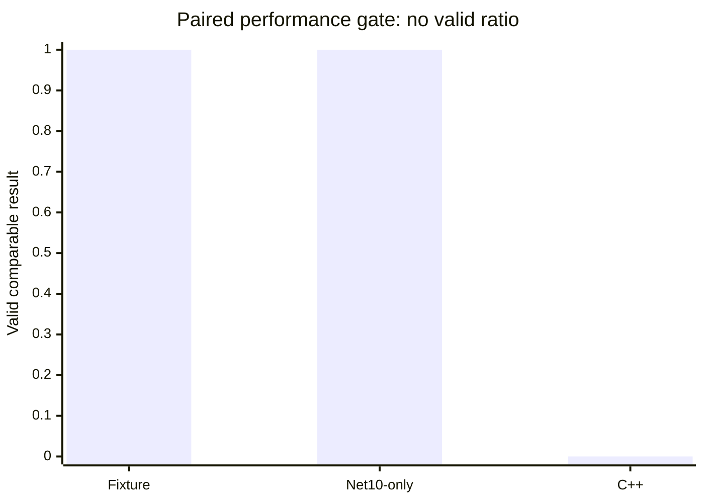

**No speed-up, regression percentage, or performance winner is claimed.** A
registry-isolated legacy binary or separate staging VM is still required
before running the identical C++ matrix and publishing comparison ratios.

## Current authoritative SMTP relayer status (2026-08-11)

Code/test commit `a0fc76a99` connects the persisted global SMTP relayer to
ordinary outbound delivery. Legacy `ServerTargetResolver::Resolve` and
`GetFixedSMTPHostForDomain_` (`source/Server/SMTP/ServerTargetResolver.cpp:38-116,
170-237`) select forced route, domain route, global relayer, then MX. The Net10
`SqlServerDeliveryTargetResolver` now follows that precedence, reads the
existing `hm_settings` rows, decrypts the legacy relayer password only for an
authenticated runtime target, defaults port `0` to `25`, and rejects invalid
security values or undecryptable credentials. Route and forced-route behavior
remain unchanged. Global relayer hosts containing `|` remain explicitly
unsupported by the current single-endpoint delivery contract and fail closed.

Focused relayer/resolver coverage is `19/19`; full Net10 is `2155 passed, 54
skipped, 0 failed`. This is unit/SQL-shape evidence only: no disposable SQL
readback or loopback SMTP/TLS/authentication acceptance was available. The
paired C++/.NET10 performance gate and overall release gate remain **RED**.
The next smallest production slice is authenticated `Settings.SetSMTPRelayerPassword`
persistence parity, followed by global-relayer multi-host failover and the
real disposable SQL/socket delivery matrix.

## Current authoritative ordinary-MX delivery status (2026-08-11)

Code/test commit `921f31064` now carries persisted global
`SMTPConnectionSecurity` into ordinary MX `DeliveryTarget` resolution. Legacy
anchors are `ServerTargetResolver::Resolve` and
`ExternalDelivery::DeliverToSingleServer_`
(`source/Server/SMTP/ServerTargetResolver.cpp:104-106`,
`source/Server/SMTP/ExternalDelivery.cpp:373-392`). Route and forced-route
security/authentication remain independent. Global values `0..3` are mapped;
invalid values fail closed. Optional STARTTLS remains plaintext only when no
STARTTLS is advertised and no authentication is configured; authenticated
connections and TLS handshake failures never downgrade to plaintext.

Focused delivery/resolver coverage is `21/21`; full Net10 is `2147 passed, 54
skipped, 0 failed`. The real SQL-to-MX/socket matrix is not yet proven because
the disposable SQL approval variables and remote SMTP fixture are unavailable.
Legacy retries plaintext after optional STARTTLS handshake failure; Net10
intentionally refuses that downgrade pending a security/product decision. The
paired C++/.NET10 performance gate remains **RED**.

## Current authoritative SQL-evidence status (2026-08-11)

The `SMTPConnectionSecurity` persistence slice now has a dedicated disposable
SQL integration harness in
`hmailserver/source/Server.Net10/tests/HMailServer.Net10.Tests/SqlServerSettingsAdministrationStoreSmtpConnectionSecurityIntegrationTests.cs`.
It accepts only an explicitly approved local SQL/LocalDB connection, requires
`HMAILSERVER_NET10_SQLSERVER_INTEGRATION_ALLOW_ISOLATED_CREATE=1`, creates a
random database, mutates all four legacy enum values, verifies read-back and
missing-row behavior, and drops the database in `finally`. The focused run
skipped safely because those approval variables are currently absent; the
full Net10 suite is `2133 passed, 54 skipped, 0 failed`. This is harness
coverage, not live SQL PASS evidence.

This SQL harness remains an environment-gated evidence tool. Its real mutation
and the ordinary-MX socket path must be run together on an explicitly approved
disposable target before release claims are made.

## Current authoritative parity status (2026-08-11)

The latest bounded COM/Admin slice implements authenticated
`Settings.SMTPConnectionSecurity` persistence. Legacy
`InterfaceSettings::put_SMTPConnectionSecurity`
(`source/Server/COM/InterfaceSettings.cpp:1799-1813`) delegates to
`SMTPConfiguration::SetSMTPConnectionSecurity`
(`source/Server/SMTP/SMTPConfiguration.cpp:175-184`), which updates the
existing `SmtpDeliveryConnectionSecurity` row seeded by
`source/DBScripts/CreateTablesMSSQL.sql:934`. Net10 now performs the same
parameterized fixed-row update, requires one affected row, preserves the
previous snapshot on failure, and rechecks the authenticated server-admin
boundary. Focused Settings/SQL coverage is `142/142`; full Net10 is `2133
passed, 53 skipped, 0 failed`. This slice does not add enum validation, live
SMTP/TLS reconfiguration, or delivery behavior changes.

The paired C++/.NET10 performance gate remains **RED**: the registry-isolated
C++ runner is still unavailable, so no speed-up ratio, regression percentage,
or winner is claimed. Service/out-of-process COM, restore/rollback,
migration/installer, SEC-18, AD/DC, and 24-hour soak gates remain open or
environment-blocked.

## Current authoritative performance-safety status (2026-08-11)

The latest bounded COM/Admin slice implements authenticated
`Settings.MaxAsynchronousThreads` persistence. Legacy writes the existing
`MaxNumberOfAsynchronousTasks` setting row; Net10 now uses a parameterized
fixed-row update, publishes the retained snapshot only after a one-row success,
and preserves authorization and failed-write retention. Focused Settings/SQL
coverage is `138/138`; the full Net10 suite is `2129 passed, 53 skipped, 0
failed`. This changes persistence only; asynchronous worker reconfiguration is
intentionally out of scope.

The fresh disposable pair now passes the start-state gate: both databases have
37 tables with equal row counts, 1,000 identical Data files, equal Data SHA-256,
the same active domain/account/Inbox, three loopback ports, and SQL Full-Text
catalog/index readiness. The latest post-soak evidence is under
`artifacts/benchmarks/live-cpp-net10-20260811/shared-baseline-pair-20260811_1748-after-protocol-soak-300/`.

Net10 live evidence is now available: SMTP acceptance `25/25`, protocol
SMTP/IMAP/POP3 `25/25`, concurrent IMAP `1000/1000`, and live IMAP Full-Text
`SEARCH TEXT needle` `25/25` with 1,000 matches per session. Net10 local
delivery also processed 50 disposable queue messages with 50/50 Inbox
commits, `73.308` messages/s, and p50/p95/p99 batch latency
`4.376/8.405/48.484 ms`; a controlled transient remote target retained one
unlocked SQL queue row with retry count 1 and a future next-try timestamp.
The 1,000-message POP3 mailbox also passed real loopback `STAT`, `LIST`,
`UIDL`, and `RETR 1` in `5/5` sessions; total p50 was `54.757 ms`, with
LIST/UIDL/RETR p50 `14.963/15.060/1.466 ms`, and SQL mailbox rows remained
`1000/1000`.
The POP3 result
required a focused production fix: the SQL mailbox reader now consumes
`messageid`, `messageuid`, and `messagesize` in the selected ordinal order
required by `SequentialAccess`. The legacy C++ process was not launched
because the read-only Registry32 preflight points to the installed test Bin
and legacy `/Debug` startup would write AppID registration. The paired
performance gate remains **RED**: no speed-up ratio, regression percentage,
or winner is valid until the same C++ scenarios run in a registry-isolated
environment.

The disposable Net10 restart acceptance also passed `2/2` start/readiness/stop
cycles. Each launched PID owned and banner-served all three loopback ports, and
no launched PID retained SMTP `2525`, IMAP `1143`, or POP3 `25110` after stop.
Start-ready p50 was `1636.538 ms`; stop p50 was `1546.317 ms`. This is process
and listener evidence only; COM local server was disabled, so Windows service
and out-of-process COM lifecycle remain open.

The disposable external-fetch acceptance completed five real TCP/SQL cycles
against a loopback POP3 fixture: `50/50` messages downloaded and accepted,
final UID snapshot `10`, all leases released, and temporary fetch rows cleaned
to `0/0`. Cycle p50/p95/p99 was `23.998/24.229/24.229 ms` with explicit
`127.0.0.0/8` egress allow evidence. This is Net10-only acceptance; no C++
ratio or speed-up claim is valid while the C++ registry-isolated runner is
blocked. Evidence is under
`artifacts/benchmarks/live-cpp-net10-20260811/net10-external-fetch/`.

The corrected live protocol benchmark also completed a bounded Net10 soak of
300 SMTP, 300 IMAP, and 300 POP3 sessions (`900/900`, zero errors) against the
same disposable Data/SQL pair and loopback ports. p95 latency was
`0.889/13.369/14.791 ms`; the launched process grew by approximately
`21.5 MiB`, `144` handles, and `2` threads, with no readiness or shutdown
failures. Evidence is under
`artifacts/benchmarks/live-cpp-net10-20260811/net10-protocol-soak-300/`.
This is bounded Net10-only evidence, not a 24-hour leak result or a C++ speed-up
comparison.

The delivery report is
`artifacts/benchmarks/live-cpp-net10-20260811/net10-live-delivery-queue/`.
The POP3 large-mailbox report is
`artifacts/benchmarks/live-cpp-net10-20260811/net10-pop3-large-mailbox/`.
The measured values and charts are in
[`hmailserver/source/Server.Net10/PERFORMANCE_COMPARISON_REPORT.md`](hmailserver/source/Server.Net10/PERFORMANCE_COMPARISON_REPORT.md).

## Historical current status (superseded, 2026-08-11)

## Historical current status (2026-08-11)

Code/tool commit `fdfa2e831` hardens
`build/generate-live-comparison-report.ps1`: it accepts explicit source report
paths, rejects C++ JSON without registry/config isolation preflight and
executable provenance, and refuses non-identical Data evidence. Its paired
report now records `sameSqlRowCounts=false` because this generator does not
receive SQL row-count evidence; `build/test-net10-live-comparison.ps1` checks
that RED/no-ratio decision. A current explicit-input report was generated at
`artifacts/benchmarks/live-cpp-net10-20260811/comparison-preflight-evidence-20260811/`.

The default legacy preflight-less comparison input is rejected rather than
being treated as paired evidence. The resulting release gate remains **RED**:
no speed-up ratio or winner is valid, and the missing SQL equality, SMTP DATA
postcondition, delivery queue, concurrent C++ run, and soak evidence remain
open. The next smallest repository slice is fresh disposable SMTP acceptance
evidence with fixture identity and post-run accounting; the C++ side remains
preflight-blocked on this host.

## Historical current status (2026-08-11)

Code/tool commit `e2ffb0ad8` applies the shared C++ registry/config/service
preflight and executable provenance evidence to the 1,000-session concurrent
IMAP runner. A C++ run on this host was refused before process creation due to
the Registry32 path mismatch; the report contains zero workload samples and is
under `artifacts/benchmarks/live-cpp-net10-20260811/cpp-concurrent-imap-preflight-fail-20260811/`.
The Net10 path ran only against its disposable loopback fixture and reported
its expected workload failure without claiming a ratio.

The legacy C++ reference adds a separate boundary: `_tWinMain` enters the
`/Debug` path after `_AtlModule.RegisterAppID()` and
`ChMailServerModule::RegisterAppID()` writes the AppID registration
(`source/Server/hMailServer/hMailServer.cpp:136-162,192-197`). Therefore a
real C++ benchmark requires an isolated Windows registry/installation in
addition to equal SQL/Data/message roots; this host remains unsuitable. The
paired C++/.NET 10 performance gate is **RED**, with no speed-up ratio or
winner claimed.

## Historical current status (2026-08-11)

Code/tool commit `f6d06e216` extends the C++ isolation gate from the SMTP
acceptance runner to the live SMTP/IMAP/POP3 protocol runner. Both runners now
share a read-only preflight that checks the legacy registry-selected Bin
directory, hMailServer service state, disposable INI database/DataFolder, and
the target executable's SHA-256, size, and UTC write time. The protocol runner
also has a report validator requiring these fields for C++ evidence.

The legacy sources make this mandatory: `Utilities::GetBinDirectory()` first
trusts `HKLM\SOFTWARE\hMailServer\InstallLocation`
(`source/Server/Common/Util/Utilities.cpp:101-119`), and
`IniFileSettings::GetInitializationFile()` reads `hMailServer.ini` from that
resolved directory (`source/Server/Common/Application/IniFileSettings.cpp:245-260`).
On this host the read-only preflight found Registry32 pointing to
`C:\hMailServer57-Test\Bin`, not the disposable
`C:\hmail-perf-cpp-ascii-20260810\Bin`; therefore the C++ process was not
launched. Evidence is under
`artifacts/benchmarks/live-cpp-net10-20260811/cpp-protocol-preflight-fail-20260811/`.

The paired C++/.NET 10 performance gate remains **RED**. No speed-up ratio or
winner is valid until a separately isolated legacy installation proves the
same registry/config resolution, SQL/Data/message roots, loopback ports, and
SMTP/IMAP/POP3 workload. The next repository slice is to apply this common
preflight to the 1,000-session IMAP runner; the actual paired run still needs a
separate C++ staging environment and a freshly recreated equal fixture.

## Current authoritative performance-safety status (2026-08-11)

Code/tool commit `6cc893f35` makes the isolated C++ SMTP acceptance runner
fail closed before launching `hMailServer.exe` when legacy configuration
resolution could escape the disposable target. The legacy source proves why:
`Utilities::GetBinDirectory()` first reads
`HKLM\SOFTWARE\hMailServer\InstallLocation`
(`source/Server/Common/Util/Utilities.cpp:101-119`), and
`IniFileSettings::GetInitializationFile()` then reads `hMailServer.ini` from
that directory (`source/Server/Common/Application/IniFileSettings.cpp:245-260`).

On this host the read-only preflight found `Registry32` resolving to
`C:\hMailServer57-Test\Bin`, not the disposable
`C:\hmail-perf-cpp-ascii-20260810\Bin`. The C++ target was therefore not
launched by the new runner; the fail-closed evidence is in
`artifacts/benchmarks/live-cpp-net10-20260811/cpp-preflight-fail-20260811/`.
The hMailServer service definition exists but was `Stopped`; no service,
registry, production database, or production Data directory was changed.

The C++/.NET 10 paired performance gate remains **RED**. No ratio or winner is
valid until a separate staging VM or an independently isolated legacy install
can prove registry/config resolution, SQL/Data/message equality, and the same
SMTP/IMAP/POP3 workload.

## Current authoritative parity status (2026-08-11)

Code/test commit `8f9eb3655` fixes a network-fragmentation gap in
`Server.Net10` `LineProtocolReader.ReadLineAsync`: after consuming a line, the
reader now re-examines the consumed cursor so a partial next line is completed
when its remaining bytes arrive. This matches the legacy DATA buffering path in
`SMTPConnection::ParseData(ByteBuffer)`,
`TransparentTransmissionBuffer::Append/Flush/RemoveTransmissionPeriod_`, and
`SMTPConnection::HandleSMTPFinalizationTaskCompleted_`.

`SmtpTcpListenerTests.RunAsync_StagesFragmentedDataUntilTerminatorAndQueuesAfterReceiverRelease`
proves fragmented DATA input, dot-unstuffing, no receiver call before
`CRLF.CRLF`, `250 Queued`, and `221` on the real loopback listener. The focused
listener/protocol tests pass `11/11`; the full Net10 suite passes `2127`, with
`46` skipped and `0` failed.

The isolated Net10 SMTP acceptance diagnostic passes `25/25` (p50 `4.053 ms`,
p95 `7.176 ms`, p99 `219.175 ms`), but the C++ target still fails SMTP
readiness with an empty banner and does not provide the required paired POP3
listener. The current disposable fixture was mutated by successful Net10
acceptance samples and must be recreated before the next equal-start-state
comparison. The paired C++/.NET 10 performance release gate remains **RED**;
no speed-up ratio or winner is claimed.

Next: repair or replace the isolated C++ protocol target, provision disposable
SQL Server Full-Text Search, recreate equal SQL/Data/message fixtures, then run
the identical SMTP/IMAP/POP3, delivery, concurrency, and soak matrix.

## Current authoritative benchmark status (2026-08-11)

Code/tool commit `b34b2b415` adds
`build/benchmark-net10-live-smtp-acceptance.ps1` and its fail-closed
validator. The runner measures the full SMTP `EHLO -> MAIL FROM -> RCPT TO ->
DATA -> 250 accepted -> QUIT` transaction on isolated loopback targets and
emits JSON/CSV/Markdown with p50/p95/p99 and throughput. A disposable smoke
run currently fails `0/1` for both Net10 and C++: Net10 reaches `354` but does
not return the final `250`, while the C++ target fails readiness. No ratio or
winner is claimed.

Code/test commit `0d03adfac` adds a disposable acceptance test for the real
`BackupManager.StartBackup -> LoadBackup -> StartRestore` chain. The test
creates a real 7z archive and raw `DataBackup`, loads it through the COM
manager, and restores it through the real SQL/Data executor. The same commit
does not change production code or installed COM state.

Code/tool commit `f754c86c3` adds an explicit
`HMAILSERVER_COM_LOCAL_SERVER_ENABLED=false` listener-only mode for isolated
benchmarks. Production defaults remain unchanged: COM local-server startup is
still enabled unless this setting is explicitly selected. The host now proves
SMTP, IMAP, and POP3 banners on the disposable loopback target without touching
the installed Application registration or DCOM ACLs.

The live Net10 protocol workload is still **RED**. The disposable SQL instance
does not have Full-Text Search, so the `SEARCH TEXT needle` workload cannot be
accepted as a valid live result; the copied C++ target still lacks the required
POP3 listener. No speed-up ratio or winner is claimed. Full default Net10 is
`2126 passed, 45 skipped, 0 failed`.

## Current authoritative restore status (2026-08-11)

Code/test commit `55f252fb3` extends the ambiguous-commit acceptance with the
startup/restart gate: `EnsureNoPendingRecovery` rejects the preserved journal
before any new restore mutation and leaves the restored target intact. This
is a recovery-reader gate, not an actual process-kill or power-loss drill.

Code/test commit `8ebace0de` adds disposable SQL/Data acceptance for an
ambiguous full-restore commit outcome. A test transaction commits the real
SQL metadata and then reports an error; the restore preserves the
`MetadataCommitStarted` recovery journal, the new Data target, and the
rollback artifact for manual reconciliation. This is not a process-kill or
power-loss drill.

Code/test commit `0d03adfac` adds disposable SQL/Data acceptance for the real
queued Administrator backup and restore path. `BackupManager.StartBackup`
creates the real archive/DataBackup, `LoadBackup` reads it, and
`BackupManager.StartRestore` runs
through `BackupTaskQueue`, `BackupTaskHostedService`, and the real
`MetadataBackupRestoreExecutor` against a populated target containing an
existing domain, public-folder rows, account folders, message metadata, and a
staged Data file. The test verifies replacement and cleanup, generated-domain
readback, and durable completion dispatch. Legacy references are
`BackupManager::StartRestore` and `BackupExecuter::StartRestore`/
`RestoreDataDirectory_` in `source/Server/Common/Application`.

The focused restore class passes `20/20`; the disposable SQL opt-in categories
pass `55/55`; default full Net10 is `2126 passed, 46 skipped, 0 failed`.
This closes the bounded queued archive/restore execution coverage, but not
crash/power-loss recovery, production payload-provider certification, service/
COM lifecycle, or independent SQL Server certification. Release remains
**RED**.

Next independent slices are full-restore crash/ambiguous-commit recovery
evidence, repair of the isolated legacy C++ protocol target so IMAP/POP3 can be
paired, and then SMTP acceptance/delivery-queue load scenarios. No C++/.NET10
speed-up ratio or performance winner is claimed.

## Current performance evidence (2026-08-11)

The shared disposable start state is verified before live testing: both SQL
targets report `33/33` matching table row counts, both isolated Data roots have
`1000/1000` files with zero relative-path or SHA-256 mismatches, and both use
loopback `127.0.0.1` on SMTP `2525`, IMAP `1143`, and POP3 `25110`.

The paired live gate is **RED** and no speed-up ratio or winner is claimed:

| Scenario | .NET 10 | Legacy C++ | Ratio |
| --- | ---: | ---: | --- |
| SMTP, 25 probes | 25/25, p95 1.02 ms | 0/0, POP3 readiness blocked the run | invalid |
| IMAP, 25 probes | 0/25 | 0/0, readiness blocked | invalid |
| POP3, 25 probes | 0/25 | 0/0, listener missing | invalid |
| Concurrent IMAP, 1000 sessions | 1000 completed, 0 successes | 0 started, readiness blocked | invalid |

```mermaid
xychart-beta
    title "Current live p95 latency (diagnostic only; no winner)"
    x-axis [SMTP, IMAP, POP3]
    y-axis "milliseconds" 0 --> 10
    bar [1.02, 0, 0]
    bar [0, 0, 0]
```

The zero values represent missing successful samples, not zero latency. The
offline .NET 10-only 100k SEARCH/SORT benchmark passes with p50 `7.101 ms`,
p95 `9.734 ms`, and p99 `9.784 ms`; it is not a C++ comparison. Evidence is
under `artifacts/benchmarks/live-cpp-net10-20260811/`.

The next performance gate requires a normal isolated C++ binary with all three
listeners, a working Net10 IMAP/POP3 path, then identical message acceptance,
delivery, queue, concurrency, and soak scenarios.

## Current parity continuation (2026-08-11, raw backup staging hardening)

Code/test commit `73405caa1` hardens `SevenZipBackupArchiveRuntime.CopyDirectory`
against source reparse points and removes a partially staged raw `DataBackup`
when archive creation fails or is cancelled. This matches the legacy staging
boundary in `BackupExecuter::BackupDataDirectory_`
(`source/Server/Common/Application/BackupExecuter.cpp:96-211`) while failing
closed for junction/symlink traversal. Successful raw backups still retain the
external `DataBackup` directory as required by the legacy `Format="Raw"` path.

`BackupArchiveRuntimeTests` passes `46` with `1` host-permission skip; full
default Net10 is `2125 passed, 43 skipped, 0 failed`. The paired C++/.NET10
performance gate remains **RED**. Next slice: make the benchmark collector
fail closed on SQL errors and generate graphs from the current run rather than
stale latency constants.

## Current parity continuation (2026-08-11, composed mode-7 backup dispatch)

Code/test commit `149770381` adds focused queue coverage for the composed
Administrator backup path: `StartBackup` creates the real 7z/DataBackup
artifacts, `LoadBackup` reads the mode-7 flags, and selecting settings, domains,
and messages dispatches `StartRestore` with option `7` through
`BackupTaskHostedService`. The test is intentionally a dispatch smoke test;
its recording restore executor does not mutate SQL/Data or prove rollback.

`BackupManagerMode7DispatchTests` passes `1/1`; the full default Net10 suite is
`2124 passed, 42 skipped, 0 failed`. The paired C++/.NET10 performance gate
remains **RED**: identical live SMTP/IMAP/POP3 completion is still absent, so
no speed-up ratio or winner is claimed. Next slice: harden raw DataBackup
staging against reparse points and failed-run residue.

## Current parity continuation (2026-08-11, full settings/domain/message restore)

Commit `563cd0042` adds the legacy `BOSettings|BODomains|BOMessages` restore
combination. Legacy `BackupExecuter::StartRestore` accepts option `7` and
restores domains/Data/messages before settings
(`source/Server/Common/Application/BackupExecuter.cpp:230-388`,
`source/Server/Common/Application/Configuration.cpp:716-760`). Net10 now
stages Data, deletes domains/public folders in one SQL transaction, restores
settings and populated message metadata, and keeps the Data recovery journal
when the SQL commit outcome is ambiguous. Installed COM identity is unchanged.

Focused restore coverage is `19 passed, 0 failed`; opt-in restore integration is
`17 passed, 0 failed`; fresh full Net10 opt-in is `2163 passed, 2 skipped, 0
failed`. The fixture uses a hand-built archive and configured local
isolated-create SQL endpoint, so this is **YELLOW**, not independent disposable
release proof. Production backup execution, reinitialize, crash/power-loss
drills, SEC-18, and paired C++/.NET10 performance remain open; no performance
ratio or winner is claimed. Next slice: true isolated `StartBackup -> LoadBackup`
populated existing-state round trip with public folders and message bytes.

## Current parity continuation (2026-08-11, WelcomeSMTP SQL capacity parity)

Commit `e3434d4b1` changes the Net10 `WelcomeSMTP` SQL parameter metadata from
`nvarchar(255)` to `nvarchar(4000)`, matching the legacy
`hm_settings.settingstring nvarchar(4000)` schema
(`source/DBScripts/CreateTablesMSSQL.sql:299-303`). The disposable SQL
integration test writes and reads a 300-character value exactly in a random
database on the configured local SQL endpoint and drops it afterward. Focused
store coverage is `33 passed`; full default Net10 is `2123 passed, 40 skipped,
0 failed`; fresh isolated-create opt-in is `2161 passed, 2 skipped, 0 failed`.
It targets no named hMailServer production database or Data directory, but the
SQL instance's independent disposability is still an environment gate.

The paired C++/.NET10 performance gate remains **RED** because the identical
SMTP/IMAP/POP3 workload is incomplete; no speedup ratio or winner is claimed.
Next slice: populated disposable settings/message restore plus rollback
acceptance. Legacy C++ still accepts raw multiline `WelcomeSMTP`; the separate
.NET10 CR/LF rejection is an intentional release-policy divergence.

## Current parity continuation (2026-08-11, WelcomeSMTP CR/LF hardening)

Commit `a414c88db` rejects CR/LF in authenticated `WelcomeSMTP` setters with
`E_INVALIDARG` before SQL mutation or runtime publication, while preserving
legacy formatting for valid values. Legacy anchors are
`InterfaceSettings::put_WelcomeSMTP`, `SMTPConfiguration::SetWelcomeMessage`,
`SMTPConnection::SendBanner_`, and `EnqueueWrite_`
(`source/Server/COM/InterfaceSettings.cpp:696-710`,
`source/Server/SMTP/SMTPConfiguration.cpp:120-123`,
`source/Server/SMTP/SMTPConnection.cpp:167-185,1548-1561`). The installed
BSTR/DISPID 23 contract is unchanged.

Focused coverage is `136 passed`; full default Net10 is `2123 passed, 39
skipped, 0 failed`; fresh disposable opt-in is `2160 passed, 2 skipped, 0
failed`. Legacy C++ still accepts raw multiline values; the .NET10 rejection
is an intentional security divergence requiring release-policy acceptance.
The paired C++/.NET10 performance gate remains **RED** because the
live protocol matrix is incomplete and no performance ratio is valid.

Next slice: repair or replace the isolated C++ protocol target, then rerun the
identical SQL/Data/message and SMTP/IMAP/POP3 loopback workload.

## Current parity continuation (2026-08-11, bootstrap SMTP greeting)

Commit `7a7e4b77b` makes Net10 publish persisted `WelcomeSMTP` during settings
bootstrap, matching legacy `Application::InitInstance` /
`Configuration::Load` before protocol startup and
`SMTPConnection::SendBanner_` reading `SMTPConfiguration::GetWelcomeMessage`
(`source/Server/Common/Application/Application.cpp:108`,
`source/Server/Common/Application/Configuration.cpp:56`,
`source/Server/SMTP/SMTPConnection.cpp:167-205`). Focused coverage is `158
passed`; full default Net10 is `2120 passed, 39 skipped, 0 failed`.

The paired C++/.NET10 performance gate is still **RED**. The identical SQL/Data
start state exists, but the isolated C++ listener and Net10 live IMAP/POP3
paths do not yet complete the same workload. No performance ratio or winner is
claimed. Next slice: repair or replace the isolated protocol target and rerun
the complete loopback matrix.

## Current performance gate (2026-08-11)

The paired release gate is **RED**. A disposable C++ SQL backup was restored
to both benchmark databases, and the two isolated Data directories were
verified as 1,000/1,000 files with zero relative-path or SHA-256 mismatches.
Both implementations used loopback `127.0.0.1` with SMTP `2525`, IMAP `1143`,
and POP3 `25110`.

The shared-baseline run did not complete an equivalent workload: C++ completed
`0/25` SMTP, IMAP, and POP3 probes; Net10 completed SMTP `25/25`, IMAP `0/25`,
and POP3 `0/25`. The 1,000-session IMAP run completed `0/1000` for both. No
speed-up, regression percentage, or performance winner is claimed. Evidence is
under `artifacts/benchmarks/live-cpp-net10-20260811/`; the repeatable start
state collector is `build/collect-live-equivalence-evidence.ps1`.

The latest opt-in validation is green for the available isolated SQL path:
`2156 passed, 2 skipped, 0 failed` against disposable MSSQL/Data resources.
The skips are the explicit installer-artifact and native-registry integration
gates. This does not clear the paired performance gate, SQL FTS, restore
round-trip, COM activation, SEC-18, or soak gates.

The live benchmark harness was hardened in code/test commit `2fe577f62`.
It now waits for all three loopback listeners, verifies ownership by the
launched PID, probes SMTP/IMAP/POP3 banners, waits for clean shutdown, and
uses a start barrier for the 1,000-session IMAP run. The rerun still fails
closed: C++ has no POP3 listener on `127.0.0.1:25110`; Net10 completes SMTP
`25/25` but IMAP and POP3 are `0/25`, and the 1,000-session run completes
`1000` probes with `0` successes. These artifacts remain diagnostic and no
performance ratio is valid.

```mermaid
xychart-beta
    title "Shared-baseline protocol success counts"
    x-axis [SMTP, IMAP, POP3, IMAP-1k]
    y-axis "successful sessions" 0 --> 25
    bar [0, 0, 0, 0]
    bar [25, 0, 0, 0]
```

## Current parity continuation (2026-08-11, MaxSMTPRecipientsInBatch authorization lease)

Code/test commit `77ea84fb9` extends the existing generation-bound
authorization lease to authenticated
`IInterfaceSettings.MaxSMTPRecipientsInBatch` (`DispId(62)`). The lease is
acquired immediately before the existing parameterized
`maxsmtprecipientsinbatch` SQL update and held through mutation result
handling and retained snapshot publication. No integer COM shape, delivery
batching behavior, or COM identity changed.

Legacy anchors are `InterfaceSettings::get/put_MaxSMTPRecipientsInBatch`
(`hmailserver/source/Server/COM/InterfaceSettings.cpp:1627-1659`),
`SMTPConfiguration::Get/SetMaxSMTPRecipientsInBatch`
(`hmailserver/source/Server/SMTP/SMTPConfiguration.cpp:211-220`),
`PROPERTY_MAXSMTPRECIPIENTSINBATCH`
(`hmailserver/source/Server/Common/Application/Constants.h:74`), the
installed Settings IID and `DispId(62)`
(`hmailserver/source/Server/hMailServer/hMailServer.idl:520-528,606-607`),
and the `maxsmtprecipientsinbatch` seed
(`hmailserver/source/DBScripts/CreateTablesMSSQL.sql:862`). Focused tests
cover lease acquire/dispose, unavailable-lease denial before mutation, and
reauthentication blocking during an in-flight mutation.

Focused settings/store coverage is `128/128`. Full unfiltered Net10 is
`2111 passed, 39 skipped, 0 failed`. Legacy `ExternalDelivery::Run` applies
the value and maps `0` to unlimited
(`hmailserver/source/Server/SMTP/ExternalDelivery.cpp:67-89`); no equivalent
Net10 delivery batching consumer was found. Net10 also falls back to `0`
when the row is absent while the installed legacy default is `100`. These
are separate parity blockers. Disposable SQL/Data restore, non-DB
restore/reinitialization, SQL/FTS, matched C++/.NET protocol load, protocol
greeting runtime parity, SEC-18, migration/installer, out-of-process COM,
AD/DC, crash/power-loss, 24-hour soak, and remaining unleased COM/Admin
mutations keep release **RED**. Next slice is a fresh legacy-first audit of
`Settings.DisconnectInvalidClients`.

## Current parity continuation (2026-08-11, AllowIncorrectLineEndings authorization lease)

Code/test commit `b6085a478` extends the existing generation-bound
authorization lease to authenticated
`IInterfaceSettings.AllowIncorrectLineEndings` (`DispId(61)`). The lease is
acquired immediately before the existing parameterized
`smtpallowincorrectlineendings` SQL update and held through mutation result
handling and retained snapshot publication. No VARIANT_BOOL shape, SMTP
parser behavior, or COM identity changed.

Legacy anchors are `InterfaceSettings::get/put_AllowIncorrectLineEndings`
(`hmailserver/source/Server/COM/InterfaceSettings.cpp:326-356`),
`SMTPConfiguration::Get/SetAllowIncorrectLineEndings`
(`hmailserver/source/Server/SMTP/SMTPConfiguration.cpp:288-297`),
`PROPERTY_ALLOWINCORRECTLINEENDINGS`
(`hmailserver/source/Server/Common/Application/Constants.h:73`), the
installed Settings IID and `DispId(61)`
(`hmailserver/source/Server/hMailServer/hMailServer.idl:520-528,604-605`),
and the `smtpallowincorrectlineendings` seed
(`hmailserver/source/DBScripts/CreateTablesMSSQL.sql:842`). Focused tests
cover lease acquire/dispose, unavailable-lease denial before mutation, and
reauthentication blocking during an in-flight mutation.

Focused settings/store coverage is `125/125`. Full unfiltered Net10 is
`2108 passed, 39 skipped, 0 failed`. Legacy SMTP bare-LF validation consumes
this setting (`hmailserver/source/Server/SMTP/SMTPConnection.cpp:1259-1265`);
that runtime path is unchanged. Disposable SQL/Data restore, non-DB
restore/reinitialization, SQL/FTS, matched C++/.NET protocol load, protocol
greeting runtime parity, SEC-18, migration/installer, out-of-process COM,
AD/DC, crash/power-loss, 24-hour soak, and remaining unleased COM/Admin
mutations keep release **RED**. Next slice is a fresh legacy-first audit of
`Settings.MaxSMTPRecipientsInBatch`.

## Current parity continuation (2026-08-11, TCPIPThreads authorization lease)

Code/test commit `752d55443` extends the existing generation-bound
authorization lease to authenticated `IInterfaceSettings.TCPIPThreads`
(`DispId(60)`). The lease is acquired immediately before the existing
parameterized `tcpipthreads` SQL update and held through mutation result
handling and retained snapshot publication. No integer COM shape, listener
runtime behavior, or COM identity changed.

Legacy anchors are `InterfaceSettings::get/put_TCPIPThreads`
(`hmailserver/source/Server/COM/InterfaceSettings.cpp:1530-1557`),
`Configuration::Get/SetTCPIPThreads`
(`hmailserver/source/Server/Common/Application/Configuration.cpp:142-151`),
`PROPERTY_TCPIPTHREADS`
(`hmailserver/source/Server/Common/Application/Constants.h:72`), the
installed Settings IID and `DispId(60)`
(`hmailserver/source/Server/hMailServer/hMailServer.idl:520-528,601-602`),
and the `tcpipthreads` seed (`hmailserver/source/DBScripts/CreateTablesMSSQL.sql:840`).
Focused tests cover lease acquire/dispose, unavailable-lease denial before
mutation, and reauthentication blocking during an in-flight mutation.

Focused settings/store coverage is `122/122`. Full unfiltered Net10 is
`2105 passed, 39 skipped, 0 failed`. Legacy and Net10 paths both persist this
setting; no separate listener-thread application path was established in this
slice. Disposable SQL/Data restore, non-DB restore/reinitialization, SQL/FTS,
matched C++/.NET protocol load, protocol greeting runtime parity, SEC-18,
migration/installer, out-of-process COM, AD/DC, crash/power-loss, 24-hour
soak, and remaining unleased COM/Admin mutations keep release **RED**. Next
slice is a fresh legacy-first audit of `Settings.AllowIncorrectLineEndings`.

## Current parity continuation (2026-08-11, WorkerThreadPriority authorization lease)

Code/test commit `3ab7c8aef` extends the existing generation-bound
authorization lease to authenticated `IInterfaceSettings.WorkerThreadPriority`
(`DispId(57)`). The lease is acquired immediately before the existing
parameterized `workerthreadpriority` SQL update and held through mutation
result handling and retained snapshot publication. No integer COM shape,
thread scheduling behavior, or COM identity changed.

Legacy anchors are `InterfaceSettings::get/put_WorkerThreadPriority`
(`hmailserver/source/Server/COM/InterfaceSettings.cpp:1496-1528`),
`Configuration::Get/SetWorkerThreadPriority`
(`hmailserver/source/Server/Common/Application/Configuration.cpp:129-139`),
`PROPERTY_WORKERTHREADPRIORITY`
(`hmailserver/source/Server/Common/Application/Constants.h:70`), the
installed Settings IID and `DispId(57)`
(`hmailserver/source/Server/hMailServer/hMailServer.idl:520-528,599-600`),
and the `workerthreadpriority` seed
(`hmailserver/source/DBScripts/CreateTablesMSSQL.sql:836`). Focused tests
cover lease acquire/dispose, unavailable-lease denial before mutation, and
reauthentication blocking during an in-flight mutation.

Focused settings/store coverage is `119/119`. Full unfiltered Net10 is
`2102 passed, 39 skipped, 0 failed`. Legacy source tracing found no actual
thread-priority application path; both implementations currently persist the
setting only. Disposable SQL/Data restore, non-DB restore/reinitialization,
SQL/FTS, matched C++/.NET protocol load, greeting runtime parity, SEC-18,
migration/installer, out-of-process COM, AD/DC, crash/power-loss, 24-hour
soak, and remaining unleased COM/Admin mutations keep release **RED**. Next
slice is a fresh legacy-first audit of `Settings.TCPIPThreads`.

## Current parity continuation (2026-08-11, WelcomeIMAP authorization lease)

Code/test commit `7645f6f70` extends the existing generation-bound
authorization lease to authenticated `IInterfaceSettings.WelcomeIMAP`
(`DispId(25)`). The lease is acquired immediately before the existing
parameterized `welcomeimap` SQL update and held through mutation result
handling and retained snapshot publication. No BSTR shape, installed COM
identity, or IMAP runtime wiring changed.

Legacy anchors are `InterfaceSettings::get/put_WelcomeIMAP`
(`hmailserver/source/Server/COM/InterfaceSettings.cpp:747-780`),
`IMAPConfiguration::Get/SetWelcomeMessage`
(`hmailserver/source/Server/IMAP/IMAPConfiguration.cpp:54-63`),
`PROPERTY_WELCOMEIMAP` (`hmailserver/source/Server/Common/Application/Constants.h:13`),
the installed Settings IID and `DispId(25)`
(`hmailserver/source/Server/hMailServer/hMailServer.idl:520-528,551-552`),
and the `welcomeimap` seed (`hmailserver/source/DBScripts/CreateTablesMSSQL.sql:754`).
Focused tests cover lease acquire/dispose, unavailable-lease denial before
mutation, and reauthentication blocking during an in-flight mutation.

Focused settings/store coverage is `116/116`. Full unfiltered Net10 is
`2099 passed, 39 skipped, 0 failed`. Legacy `IMAPConnection::SendBanner_`
consumes `welcomeimap` per connection
(`hmailserver/source/Server/IMAP/IMAPConnection.cpp:118-135`), while Net10
still uses its session greeting options; this runtime wiring is a separate
open parity blocker. Disposable SQL/Data restore, non-DB
restore/reinitialization, SQL/FTS, matched C++/.NET protocol load, SEC-18,
migration/installer, out-of-process COM, AD/DC, crash/power-loss, 24-hour
soak, and remaining unleased COM/Admin mutations keep release **RED**. Next
slice is a fresh legacy-first audit of `Settings.WorkerThreadPriority`.

## Current parity continuation (2026-08-11, WelcomePOP3 authorization lease)

Code/test commit `52c92f050` extends the existing generation-bound
authorization lease to authenticated `IInterfaceSettings.WelcomePOP3`
(`DispId(24)`). The lease is acquired immediately before the existing
parameterized `welcomepop3` SQL update and held through mutation result
handling and retained snapshot publication. No BSTR shape, installed COM
identity, or POP3 runtime wiring changed.

Legacy anchors are `InterfaceSettings::get/put_WelcomePOP3`
(`hmailserver/source/Server/COM/InterfaceSettings.cpp:713-745`),
`POP3Configuration::Get/SetWelcomeMessage`
(`hmailserver/source/Server/POP3/POP3Configuration.cpp:43-53`),
`PROPERTY_WELCOMEPOP3` (`hmailserver/source/Server/Common/Application/Constants.h:14`),
the installed Settings IID and `DispId(24)`
(`hmailserver/source/Server/hMailServer/hMailServer.idl:520-528,549-550`),
and the `welcomepop3` seed (`hmailserver/source/DBScripts/CreateTablesMSSQL.sql:756`).
Focused tests cover lease acquire/dispose, unavailable-lease denial before
mutation, and reauthentication blocking during an in-flight mutation.

Focused settings/store coverage is `113/113`. Full unfiltered Net10 is
`2096 passed, 39 skipped, 0 failed`. Legacy `POP3Connection::SendBanner_`
consumes `welcomepop3` per connection
(`hmailserver/source/Server/POP3/POP3Connection.cpp:100-116`), while Net10
still uses the fixed `Pop3SessionOptions.Greeting`; this runtime wiring is a
separate open parity blocker. Disposable SQL/Data restore,
non-DB restore/reinitialization, SQL/FTS, matched C++/.NET protocol load,
SEC-18, migration/installer, out-of-process COM, AD/DC, crash/power-loss,
24-hour soak, and remaining unleased COM/Admin mutations keep release
**RED**. Next slice is a fresh legacy-first audit of
`Settings.WelcomeIMAP`.

## Current parity continuation (2026-08-11, WelcomeSMTP authorization lease)

Code/test commit `6f5a12cc6` extends the existing generation-bound
authorization lease to authenticated `IInterfaceSettings.WelcomeSMTP`
(`DispId(23)`). The lease is acquired immediately before the existing
parameterized `welcomesmtp` SQL update and held through mutation result
handling and retained snapshot publication. No BSTR shape, installed COM
identity, or SMTP runtime wiring changed.

Legacy anchors are `InterfaceSettings::get/put_WelcomeSMTP`
(`hmailserver/source/Server/COM/InterfaceSettings.cpp:679-711`),
`SMTPConfiguration::Get/SetWelcomeMessage`
(`hmailserver/source/Server/SMTP/SMTPConfiguration.cpp:113-123`),
`PROPERTY_WELCOMESMTP` (`hmailserver/source/Server/Common/Application/Constants.h:15`),
the installed Settings IID and `DispId(23)`
(`hmailserver/source/Server/hMailServer/hMailServer.idl:520-528,547-548`),
and the `welcomesmtp` seed (`hmailserver/source/DBScripts/CreateTablesMSSQL.sql:758`).
Focused tests cover lease acquire/dispose, unavailable-lease denial before
mutation, and reauthentication blocking during an in-flight mutation.

Focused settings/store coverage is `110/110`. Full unfiltered Net10 is
`2093 passed, 39 skipped, 0 failed`. Legacy `SMTPConnection::SendBanner_`
consumes `welcomesmtp` on each connection
(`hmailserver/source/Server/SMTP/SMTPConnection.cpp:166-185`), while Net10
still sends the configured `SmtpSessionOptions.Greeting`; this runtime wiring
is a separate open parity blocker. Disposable SQL/Data restore,
non-DB restore/reinitialization, SQL/FTS, matched C++/.NET protocol load,
SEC-18, migration/installer, out-of-process COM, AD/DC, crash/power-loss,
24-hour soak, and remaining unleased COM/Admin mutations keep release
**RED**. Next slice is a fresh legacy-first audit of
`Settings.WelcomePOP3`.

## Current parity continuation (2026-08-11, SMTPRelayerPort authorization lease)

Code/test commit `f8875b316` extends the existing generation-bound
authorization lease to authenticated `IInterfaceSettings.SMTPRelayerPort`
(`DispId(37)`). The lease is acquired immediately before the existing
parameterized `smtprelayerport` SQL update and held through mutation result
handling and retained snapshot publication. No integer COM shape, SMTP relay
resolution, live reconfiguration, or COM identity changed.

Legacy anchors are `InterfaceSettings::get/put_SMTPRelayerPort`
(`hmailserver/source/Server/COM/InterfaceSettings.cpp:609-642`),
`SMTPConfiguration::Get/SetSMTPRelayerPort`
(`hmailserver/source/Server/SMTP/SMTPConfiguration.cpp:151-160`), the
installed Settings IID and property (`hmailserver/source/Server/hMailServer/hMailServer.idl:520-528,570-571`),
the `smtprelayerport` seed (`hmailserver/source/DBScripts/CreateTablesMSSQL.sql:788`),
and the .NET `UpdateSmtpRelayerPortSql` path. Focused tests cover lease
acquire/dispose, unavailable-lease denial before mutation, and reauthentication
blocking during an in-flight port mutation.

Focused settings/store coverage is `107/107`. Full unfiltered Net10 is
`2090 passed, 39 skipped, 0 failed`. Disposable SQL/Data restore,
non-DB restore/reinitialization, SQL/FTS, matched C++/.NET protocol load,
SEC-18, migration/installer, out-of-process COM, AD/DC, crash/power-loss,
24-hour soak, and remaining unleased COM/Admin mutations keep release
**RED**. Next slice is a fresh legacy-first audit of `Settings.WelcomeSMTP`.

## Current parity continuation (2026-08-11, SMTPRelayerUsername authorization lease)

Code/test commit `33f48accd` extends the existing generation-bound
authorization lease to authenticated `IInterfaceSettings.SMTPRelayerUsername`
(`DispId(35)`). The lease is acquired immediately before the existing
parameterized `smtprelayerusername` SQL update and held through mutation result
handling and retained snapshot publication. No BSTR shape, SMTP credential
handling, live reconfiguration, or COM identity changed.

Legacy anchors are `InterfaceSettings::get/put_SMTPRelayerUsername`
(`hmailserver/source/Server/COM/InterfaceSettings.cpp:930-958`),
`SMTPConfiguration::Get/SetSMTPRelayerUsername`
(`hmailserver/source/Server/SMTP/SMTPConfiguration.cpp:261-270`), the
installed IDL property (`hmailserver/source/Server/hMailServer/hMailServer.idl:567-568`),
the `smtprelayerusername` seed (`hmailserver/source/DBScripts/CreateTablesMSSQL.sql:782`),
and the .NET `UpdateSmtpRelayerUsernameSql` path. Focused tests cover lease
acquire/dispose and unavailable-lease denial before mutation.

Focused settings/store coverage is `104/104`. Full Net10 excluding the two
known host/AV-locked scanner cleanup classes is `2080 passed, 39 skipped,
0 failed`; the unfiltered run has 2 unrelated temporary-`.eml`
`UnauthorizedAccessException` cleanup failures. Disposable SQL/Data restore,
non-DB restore/reinitialization, SQL/FTS, matched C++/.NET protocol load,
SEC-18, migration/installer, out-of-process COM, AD/DC, crash/power-loss,
24-hour soak, and remaining unleased COM/Admin mutations keep release
**RED**. Next slice is a fresh legacy-first audit of `SMTPRelayerPort`.

## Current parity continuation (2026-08-11, SMTPRelayerRequiresAuthentication authorization lease)

Code/test commit `29be1faa0` extends the existing generation-bound
authorization lease to authenticated
`IInterfaceSettings.SMTPRelayerRequiresAuthentication` (`DispId(34)`). The
lease is acquired immediately before the existing parameterized
`usesmtprelayerauthentication` SQL update and held through mutation result
handling and retained snapshot publication. No VARIANT_BOOL shape, SMTP
delivery authentication behavior, live reconfiguration, or COM identity
changed.

Legacy anchors are `InterfaceSettings::get/put_SMTPRelayerRequiresAuthentication`
(`hmailserver/source/Server/COM/InterfaceSettings.cpp:896-923`),
`SMTPConfiguration::Get/SetSMTPRelayerRequiresAuthentication`
(`hmailserver/source/Server/SMTP/SMTPConfiguration.cpp:249-258`), the
installed IDL property (`hmailserver/source/Server/hMailServer/hMailServer.idl:565-566`),
the `usesmtprelayerauthentication` seed (`hmailserver/source/DBScripts/CreateTablesMSSQL.sql:786`),
and the .NET `UpdateSmtpRelayerRequiresAuthenticationSql` path. Focused tests
cover lease acquire/dispose and unavailable-lease denial before mutation.

Focused settings/store coverage is `102/102`. Full Net10 excluding the two
known host/AV-locked scanner cleanup classes is `2078 passed, 39 skipped,
0 failed`; the unfiltered run has 2 unrelated temporary-`.eml`
`UnauthorizedAccessException` cleanup failures. Disposable SQL/Data restore,
non-DB restore/reinitialization, SQL/FTS, matched C++/.NET protocol load,
SEC-18, migration/installer, out-of-process COM, AD/DC, crash/power-loss,
24-hour soak, and remaining unleased COM/Admin mutations keep release
**RED**. Next slice is a fresh legacy-first audit of `SMTPRelayerUsername`.

## Current parity continuation (2026-08-11, SMTPRelayer authorization lease)

Code/test commit `c83791c3b` extends the existing generation-bound
authorization lease to authenticated `IInterfaceSettings.SMTPRelayer`
(`DispId(22)`). The lease is acquired immediately before the existing
parameterized `smtprelayer` SQL update and held through mutation result
handling and retained snapshot publication. No BSTR shape, SMTP delivery
behavior, live reconfiguration, or COM identity changed.

Legacy anchors are `InterfaceSettings::get/put_SMTPRelayer`
(`hmailserver/source/Server/COM/InterfaceSettings.cpp:574-605`),
`SMTPConfiguration::Get/SetSMTPRelayer`
(`hmailserver/source/Server/SMTP/SMTPConfiguration.cpp:139-148`), the
installed IDL property (`hmailserver/source/Server/hMailServer/hMailServer.idl:545-546`),
the `smtprelayer` seed (`hmailserver/source/DBScripts/CreateTablesMSSQL.sql:760`),
and the .NET `UpdateSmtpRelayerSql` path. Focused tests cover lease
acquire/dispose and unavailable-lease denial before mutation.

Focused settings/store coverage is `100/100`. Full Net10 excluding the two
known host/AV-locked scanner cleanup classes is `2076 passed, 39 skipped,
0 failed`; the unfiltered run reached the scanner cleanup tests and reported
2 unrelated `UnauthorizedAccessException` failures deleting temporary `.eml`
files. Disposable SQL/Data restore, non-DB restore/reinitialization, SQL/FTS,
matched C++/.NET protocol load, SEC-18, migration/installer, out-of-process
COM, AD/DC, crash/power-loss, 24-hour soak, and remaining unleased COM/Admin
mutations keep release **RED**. Next slice is a fresh legacy-first audit of
`SMTPRelayerRequiresAuthentication`.

## Current parity continuation (2026-08-11, SMTPMinutesBetweenTry authorization lease)

Code/test commit `06af4facd` extends the existing generation-bound
authorization lease to authenticated `IInterfaceSettings.SMTPMinutesBetweenTry`
(`DispId(20)`). The lease is acquired immediately before the existing
parameterized `smtpminutesbetweenretries` SQL update and held through mutation
result handling and retained snapshot publication. No retry scheduling,
delivery behavior, live reconfiguration, or COM identity changed.

Legacy anchors are `InterfaceSettings::get/put_SMTPMinutesBetweenTry`
(`hmailserver/source/Server/COM/InterfaceSettings.cpp:500-533`),
`SMTPConfiguration::Set/GetMinutesBetweenTry`
(`hmailserver/source/Server/SMTP/SMTPConfiguration.cpp:101-110`), the installed
IDL property (`hmailserver/source/Server/hMailServer/hMailServer.idl:543-544`),
the `smtpminutesbetweenretries` seed (`hmailserver/source/DBScripts/CreateTablesMSSQL.sql:744`),
and the .NET `UpdateSmtpMinutesBetweenTrySql` path. Focused tests cover lease
acquire/dispose and unavailable-lease denial before mutation.

Focused settings/store coverage is `98/98`; full Net10 is `2081 passed, 39
skipped, 0 failed`. Disposable SQL/Data restore, non-DB restore/reinitialization,
SQL/FTS, matched C++/.NET protocol load, SEC-18, migration/installer,
out-of-process COM, AD/DC, crash/power-loss, 24-hour soak, and remaining
unleased COM/Admin mutations keep release **RED**. Next slice is a fresh
legacy-first audit of `SMTPRelayer`.

## Current parity continuation (2026-08-11, SMTPNoOfTries authorization lease)

Code/test commit `0bf71cd8f` extends the existing generation-bound
authorization lease to authenticated `IInterfaceSettings.SMTPNoOfTries`
(`DispId(19)`). The lease is acquired immediately before the existing
parameterized `smtpnoofretries` SQL update and held through mutation result
handling and retained snapshot publication. No retry policy validation,
delivery behavior, live reconfiguration, or COM identity changed.

Legacy anchors are `InterfaceSettings::get/put_SMTPNoOfTries`
(`hmailserver/source/Server/COM/InterfaceSettings.cpp:465-496`),
`SMTPConfiguration::Set/GetNoOfRetries`
(`hmailserver/source/Server/SMTP/SMTPConfiguration.cpp:88-97`), the installed
IDL property (`hmailserver/source/Server/hMailServer/hMailServer.idl:541-542`),
the `smtpnoofretries` seed (`hmailserver/source/DBScripts/CreateTablesMSSQL.sql:742`),
and the .NET `UpdateSmtpNoOfTriesSql` path. Focused tests cover lease
acquire/dispose and unavailable-lease denial before mutation.

Focused settings/store coverage is `96/96`; full Net10 is `2079 passed, 39
skipped, 0 failed`. Disposable SQL/Data restore, non-DB restore/reinitialization,
SQL/FTS, matched C++/.NET protocol load, SEC-18, migration/installer,
out-of-process COM, AD/DC, crash/power-loss, 24-hour soak, and remaining
unleased COM/Admin mutations keep release **RED**. Next slice is a fresh
legacy-first audit of `SMTPMinutesBetweenTry`.

## Current parity continuation (2026-08-11, DenyMailFromNull authorization lease)

Code/test commit `a146723f4` extends the existing generation-bound
authorization lease to authenticated `IInterfaceSettings.DenyMailFromNull`
(`DispId(11)`). The lease is acquired immediately before the existing
parameterized `allowmailfromnull` SQL mutation and held through mutation result
handling and retained snapshot publication. The legacy inversion remains
unchanged: `DenyMailFromNull = TRUE` persists `allowmailfromnull = 0`.

Legacy anchors are `InterfaceSettings::get/put_DenyMailFromNull`
(`hmailserver/source/Server/COM/InterfaceSettings.cpp:284-321`),
`SMTPConfiguration::Set/GetAllowMailFromNull`
(`hmailserver/source/Server/SMTP/SMTPConfiguration.cpp:75-85`), the SMTP
empty-sender check (`hmailserver/source/Server/SMTP/SMTPConnection.cpp:601-614`),
the installed IDL property (`hmailserver/source/Server/hMailServer/hMailServer.idl:537-538`),
the `allowmailfromnull` seed (`hmailserver/source/DBScripts/CreateTablesMSSQL.sql:736`),
and the .NET `UpdateAllowMailFromNullSql` path. Focused tests cover inversion,
lease acquire/dispose, and unavailable-lease denial before mutation.

Focused settings/store coverage is `94/94`; full Net10 is `2077 passed, 39
skipped, 0 failed`. Disposable SQL/Data restore, non-DB restore/reinitialization,
SQL/FTS, matched C++/.NET protocol load, SEC-18, migration/installer,
out-of-process COM, AD/DC, crash/power-loss, 24-hour soak, and remaining
unleased COM/Admin mutations keep release **RED**. Next slice is a fresh
legacy-first audit of `SMTPNoOfTries`.

## Current parity continuation (2026-08-11, AllowSMTPAuthPlain authorization lease)

Code/test commit `2d42c0006` extends the existing generation-bound
authorization lease to authenticated `IInterfaceSettings.AllowSMTPAuthPlain`
(`DispId(8)`). The lease is acquired immediately before the existing
parameterized `authallowplaintext` SQL update and held through mutation result
handling and retained snapshot publication. No SMTP trust behavior, live
reconfiguration, VARIANT_BOOL mapping, or COM identity changed.

Legacy anchors are `InterfaceSettings::get/put_AllowSMTPAuthPlain`
(`hmailserver/source/Server/COM/InterfaceSettings.cpp:242-280`),
`SMTPConfiguration::Set/GetAuthAllowPlainText`
(`hmailserver/source/Server/SMTP/SMTPConfiguration.cpp:63-72`), the installed
IDL property (`hmailserver/source/Server/hMailServer/hMailServer.idl:535-536`),
the `authallowplaintext` seed (`hmailserver/source/DBScripts/CreateTablesMSSQL.sql:734`),
and the .NET `UpdateAllowSmtpAuthPlainSql` path. Focused tests cover lease
acquire/dispose and unavailable-lease denial before mutation.

Focused settings/store coverage is `92/92`; full Net10 is `2075 passed, 39
skipped, 0 failed`. Disposable SQL/Data restore, non-DB restore/reinitialization,
SQL/FTS, matched C++/.NET protocol load, SEC-18, migration/installer,
out-of-process COM, AD/DC, crash/power-loss, 24-hour soak, and remaining
unleased COM/Admin mutations keep release **RED**. Next slice is a fresh
legacy-first audit of `DenyMailFromNull`.

## Current parity continuation (2026-08-11, MirrorEMailAddress authorization lease)

Code/test commit `59e433449` extends the existing generation-bound
authorization lease to authenticated `IInterfaceSettings.MirrorEMailAddress`
(`DispId(7)`). The lease is acquired immediately before the existing
parameterized `mirroremailaddress` SQL update and held through success/failure
handling and retained snapshot publication. No email mirroring runtime,
validation, SQL shape, BSTR contract, or COM identity changed.

Legacy anchors are `InterfaceSettings::get/put_MirrorEMailAddress`
(`hmailserver/source/Server/COM/InterfaceSettings.cpp:207-239`),
`Configuration::SetMirrorAddress`
(`hmailserver/source/Server/Common/Application/Configuration.cpp:240-248`),
the installed IDL property (`hmailserver/source/Server/hMailServer/hMailServer.idl:533-534`),
the `mirroremailaddress` seed (`hmailserver/source/DBScripts/CreateTablesMSSQL.sql:730`),
and the .NET `UpdateMirrorEmailAddressSql` path. Direct activation denial,
failed-write retention, lease acquire/dispose, and unavailable-lease denial are
covered.

Focused settings/store coverage is `90/90`; full Net10 is `2073 passed, 39
skipped, 0 failed`. Remaining unleased Settings mutation paths, disposable
SQL/Data restore, non-DB restore/reinitialization, SQL/FTS, matched C++/.NET
protocol load, SEC-18, migration/installer, out-of-process COM, AD/DC,
crash/power-loss, and 24-hour soak keep release **RED**. Next slice is the
same lease treatment for `AllowSMTPAuthPlain` after a fresh legacy-first audit.

## Current parity continuation (2026-08-11, MaxPOP3Connections authorization lease)

Code/test commit `0e4a70129` extends the existing generation-bound
authorization lease to authenticated `IInterfaceSettings.MaxPOP3Connections`
(`DispId(6)`). The lease is acquired immediately before the existing
parameterized `maxpop3connections` SQL update and held through success/failure
handling and retained snapshot publication. No validation, SQL shape, POP3
listener behavior, or COM identity changed.

Legacy anchors are `InterfaceSettings::get/put_MaxPOP3Connections`
(`hmailserver/source/Server/COM/InterfaceSettings.cpp:172-202`),
`POP3Configuration::Set/GetMaxPOP3Connections`
(`hmailserver/source/Server/POP3/POP3Configuration.cpp:31-40`), the installed
IDL property (`hmailserver/source/Server/hMailServer/hMailServer.idl:531-532`),
the `maxpop3connections` seed (`hmailserver/source/DBScripts/CreateTablesMSSQL.sql:726`),
and the .NET `UpdateMaxPop3ConnectionsSql` path. Direct activation denial,
failed-write retention, lease acquire/dispose, and unavailable-lease denial are
covered.

Focused settings/store coverage is `88/88`; full Net10 is `2071 passed, 39
skipped, 0 failed`. Remaining unleased Settings mutation paths, disposable
SQL/Data restore, non-DB restore/reinitialization, SQL/FTS, matched C++/.NET
protocol load, SEC-18, migration/installer, out-of-process COM, AD/DC,
crash/power-loss, and 24-hour soak keep release **RED**. Next slice is the
same lease treatment for `MirrorEMailAddress` after a fresh legacy-first audit.

## Current parity continuation (2026-08-11, MaxSMTPConnections authorization lease)

Code/test commit `9178d1b1b` extends the existing generation-bound
authorization lease to the authenticated `IInterfaceSettings.MaxSMTPConnections`
setter (`DispId(5)`). The lease is acquired immediately before the existing
parameterized `maxsmtpconnections` SQL update and held through success/failure
handling and retained snapshot publication. No validation, SQL shape, runtime
listener behavior, or COM identity changed.

Legacy anchors are `InterfaceSettings::get/put_MaxSMTPConnections`
(`hmailserver/source/Server/COM/InterfaceSettings.cpp:108-134`),
`SMTPConfiguration::Set/GetMaxSMTPConnections`
(`hmailserver/source/Server/SMTP/SMTPConfiguration.cpp:51-58`), the installed
IDL property (`hmailserver/source/Server/hMailServer/hMailServer.idl:529-530`),
the `maxsmtpconnections` seed (`hmailserver/source/DBScripts/CreateTablesMSSQL.sql:728`),
and the .NET `UpdateMaxSmtpConnectionsSql` path. Direct activation denial,
failed-write retention, lease acquire/dispose, and unavailable-lease denial are
covered.

Focused settings/store coverage is `86/86`; full Net10 is `2069 passed, 39
skipped, 0 failed`. Remaining unleased Settings mutation paths, disposable
SQL/Data restore, non-DB restore/reinitialization, SQL/FTS, matched C++/.NET
protocol load, SEC-18, migration/installer, out-of-process COM, AD/DC,
crash/power-loss, and 24-hour soak keep release **RED**. Next slice is the
same lease treatment for `MaxPOP3Connections` after a fresh legacy-first audit.

## Current parity continuation (2026-08-11, Settings mutation authorization lease)

Code/test commit `62f5ef553` closes the retained-COM authorization race for the
bounded `SMTPRelayerUseSSL`/`SMTPRelayerConnectionSecurity` mutation path. The
existing `ApplicationAuthorizationAuthority` generation and lease are now
captured by `Application.Settings`, passed through
`SettingsAdministrationRuntimeHost`, and held from immediately before the
parameterized SQL mutation through snapshot publication. Reauthentication
cannot invalidate the generation or acquire the authentication gate while this
write is in flight; an unavailable lease fails with `E_ACCESSDENIED`.

Legacy behavior was verified at
`InterfaceApplication::get_Settings`, `InterfaceSettings::LoadSettings`, and
`InterfaceSettings::put_SMTPRelayerUseSSL`: legacy retained scalar Settings
objects use acquisition-time `config_` authorization, while the .NET rewrite
keeps its stricter live mutation check and now makes the SQL write atomic with
that authorization generation. COM identity, `DispId(71)`/`DispId(91)`,
VARIANT_BOOL mapping, direct activation denial, and SMTP runtime behavior are
unchanged.

Focused settings/store coverage is `84/84`; full Net10 is `2067 passed, 39
skipped, 0 failed`. The revoke-race test blocks authentication until the
mutation releases its lease, then confirms the retained proxy cannot mutate
under the old generation. Other Settings mutation paths still need the same
lease treatment before security sign-off.

Release remains RED for disposable SQL/Data rollback, non-DB restore and
reinitialization, SQL/FTS, matched C++/.NET protocol load, SEC-18 cutover,
migration/installer, out-of-process COM, AD/DC, crash/power-loss, 24-hour
soak, and remaining unleased COM/Admin mutations. Next slice: extend the
authorization lease to the next smallest already-implemented Settings
mutation family.

## Current parity continuation (2026-08-11, SMTPRelayerUseSSL mutation)

Code/test commit `90ecdaa5a` implements only the authenticated
`IInterfaceSettings.SMTPRelayerUseSSL` setter (`DispId(71)`). It preserves the
installed COM identity, VARIANT_BOOL contract, direct activation denial, and
the existing `SMTPRelayerConnectionSecurity` projection. `true` maps to the
legacy `CSSSL` value (`1`); `false` maps to `CSNone` (`0`) through the existing
parameterized `hm_settings.smtprelayerconnectionsecurity` administration
store path. Snapshot publication occurs only after a one-row successful write.

Focused settings/store coverage is `81/81`; full Net10 is `2064 passed, 39
skipped, 0 failed`. Tests cover direct activation denial, authorized true and
false mapping, failed-write retention, and administrator revocation. Outbound
relayer TLS/STARTTLS, notifications, and live reconfiguration remain outside
this persistence slice.

Legacy anchors are `IInterfaceSettings.SMTPRelayerUseSSL` (`DispId(71)`) in
`hmailserver/source/Server/hMailServer/hMailServer.idl`,
`InterfaceSettings::get_SMTPRelayerUseSSL` and
`InterfaceSettings::put_SMTPRelayerUseSSL`
(`hmailserver/source/Server/COM/InterfaceSettings.cpp:1729-1760`),
`SMTPConfiguration::SetSMTPRelayerConnectionSecurity` and
`GetSMTPRelayerConnectionSecurity`
(`hmailserver/source/Server/SMTP/SMTPConfiguration.cpp:163-174`), and the
`smtprelayerconnectionsecurity` seed in
`hmailserver/source/DBScripts/CreateTablesMSSQL.sql:872`.

Release remains RED: disposable SQL/Data rollback, non-DB restore and
reinitialization, SQL/FTS, matched C++/.NET protocol load, SEC-18 cutover,
migration/installer, out-of-process COM, AD/DC, crash/power-loss, and 24-hour
soak remain unproven. Security review also leaves a medium retained-COM-proxy
authorization TOCTOU blocker: revocation can race between the live admin check
and the SQL mutation because Settings has no authorization lease spanning both.
The next slice is a legacy-first audit of the smallest safe authorization-lease
fix or remaining Settings mutation.

## Current parity continuation (2026-08-11, SMTPRelayerConnectionSecurity mutation)

Code/test commit `0f7b50282` implements only the authenticated
`IInterfaceSettings.SMTPRelayerConnectionSecurity` setter (`DispId(91)`). It
preserves the installed COM identity, enum values `None=0`, `Tls=1`,
`StartTlsOptional=2`, `StartTlsRequired=3`, and direct activation denial. The
setter casts the enum directly to its integer value, updates only the existing
`hm_settings.smtprelayerconnectionsecurity` row through a parameterized
`SqlDbType.Int` command, and publishes the retained snapshot only after
one-row success. No enum-range validation was added, matching legacy behavior.

Direct activation getter/setter denial, all four enum values, successful
snapshot publication, failed-write retention, administrator revocation,
one-row enforcement, exact SQL shape, and the existing `SMTPRelayerUseSSL`
projection are covered. Focused settings/store coverage is `80/80`; full
Net10 is `2063 passed, 39 skipped, 0 failed`. Outbound relayer TLS/STARTTLS,
`ExternalDelivery`, `SMTPClientConnection`, notifications, and live
reconfiguration remain unchanged and were deliberately left out.

Legacy anchors are `eConnectionSecurity` and
`IInterfaceSettings.SMTPRelayerConnectionSecurity`
(`hmailserver/source/Server/hMailServer/hMailServer.idl`),
`InterfaceSettings::put_SMTPRelayerConnectionSecurity`,
`SMTPConfiguration::SetSMTPRelayerConnectionSecurity`, the generic
`PropertySet::SetLong`/`Property::WriteLongSetting_` path,
`ServerTargetResolver::GetFixedSMTPHostForDomain_`, and the
`smtprelayerconnectionsecurity` SQL seed
(`hmailserver/source/DBScripts/CreateTablesMSSQL.sql`).

Release remains RED: disposable SQL/Data rollback, non-DB restore and
reinitialization, SQL/FTS, matched legacy/.NET protocol load, SEC-18 cutover,
installer/out-of-process COM, AD/DC, crash/power-loss, and 24-hour soak remain
unproven. Next slice is a fresh legacy-first audit of one remaining low-risk
Settings mutation.

## Current parity continuation (2026-08-11, SMTPRelayer mutation)

Code/test commit `4a5a6cf5f` implements only the authenticated
`IInterfaceSettings.SMTPRelayer` setter (`DispId(22)`, `BSTR`). It preserves the
installed COM identity and direct activation denial, rechecks the existing
server-administrator boundary, updates only the existing
`hm_settings.smtprelayer` row through a parameterized `nvarchar(4000)` command,
and publishes the retained snapshot only after one-row success. The legacy
relay value is written unchanged; no validation or encryption was added.

Direct activation getter/setter denial, authorized BSTR write, failed-write
retention, administrator revocation, one-row enforcement, and exact SQL
command shape are covered. Focused settings/store coverage is `78/78`; full
Net10 is `2061 passed, 39 skipped, 0 failed`. Fixed-relay routing,
configuration notifications, relayer credentials, and live reconfiguration
remain unchanged and were deliberately left out of this persistence slice.

Legacy anchors are `IInterfaceSettings.SMTPRelayer`
(`hmailserver/source/Server/hMailServer/hMailServer.idl`),
`InterfaceSettings::put_SMTPRelayer`,
`SMTPConfiguration::SetSMTPRelayer`, the generic
`PropertySet::SetString`/`Property::WriteStringSetting_` path,
`ServerTargetResolver::GetFixedSMTPHostForDomain_`, and the `smtprelayer` SQL
seed (`hmailserver/source/DBScripts/CreateTablesMSSQL.sql`).

Release remains RED: disposable SQL/Data rollback, non-DB restore and
reinitialization, SQL/FTS, matched legacy/.NET protocol load, SEC-18 cutover,
installer/out-of-process COM, AD/DC, crash/power-loss, and 24-hour soak remain
unproven. Next slice is a fresh legacy-first audit of one remaining low-risk
Settings mutation.

## Current parity continuation (2026-08-11, SMTPRelayerUsername mutation)

Code/test commit `8e3e5cf16` implements only the authenticated
`IInterfaceSettings.SMTPRelayerUsername` setter (`DispId(35)`, `BSTR`). It
preserves the installed COM identity and direct activation denial, rechecks
the existing server-administrator boundary, updates only the existing
`hm_settings.smtprelayerusername` row through a parameterized `nvarchar(4000)`
command, and publishes the retained snapshot only after one-row success. The
legacy username value is written unchanged; no validation or encryption was
added, matching the legacy path where only the relayer password is encrypted.

Direct activation getter/setter denial, authorized BSTR write, failed-write
retention, administrator revocation, one-row enforcement, and exact SQL
command shape are covered. Focused settings/store coverage is `76/76`; full
Net10 is `2059 passed, 39 skipped, 0 failed`. Relayer password storage,
fixed-relay routing, configuration notifications, and live reconfiguration
remain unchanged and were deliberately left out of this persistence slice.

Legacy anchors are `IInterfaceSettings.SMTPRelayerUsername`
(`hmailserver/source/Server/hMailServer/hMailServer.idl`),
`InterfaceSettings::put_SMTPRelayerUsername`,
`SMTPConfiguration::SetSMTPRelayerUsername`, the generic
`PropertySet::SetString`/`Property::WriteStringSetting_` path,
`ServerTargetResolver::GetFixedSMTPHostForDomain_`, and the
`smtprelayerusername` SQL seed
(`hmailserver/source/DBScripts/CreateTablesMSSQL.sql`).

Release remains RED: disposable SQL/Data rollback, non-DB restore and
reinitialization, SQL/FTS, matched legacy/.NET protocol load, SEC-18 cutover,
installer/out-of-process COM, AD/DC, crash/power-loss, and 24-hour soak remain
unproven. Next slice is a fresh legacy-first audit of one remaining low-risk
Settings mutation.

## Current parity continuation (2026-08-11, SMTPRelayerPort mutation)

Code/test commit `0707fda27` implements only the authenticated
`IInterfaceSettings.SMTPRelayerPort` setter (`DispId(37)`, `int`). It preserves
the installed COM identity and direct activation denial, rechecks the live
administrator callback, updates only the existing
`hm_settings.smtprelayerport` row through a parameterized `SqlDbType.Int`
command, and publishes the retained snapshot only after one-row success. The
legacy value is written unchanged; the seeded default remains `25`.

Direct activation getter/setter denial, an authorized integer write,
failed-write retention, administrator revocation, one-row enforcement, and
exact SQL command shape are covered. Focused settings/store coverage is
`74/74`; full Net10 is `2057 passed, 39 skipped, 0 failed`. Fixed-relayer
delivery routing, value `0` fallback behavior, configuration notifications,
and live reconfiguration remain unchanged and were deliberately left out of
this persistence slice.

Legacy anchors are `IInterfaceSettings.SMTPRelayerPort`
(`hmailserver/source/Server/hMailServer/hMailServer.idl`),
`InterfaceSettings::put_SMTPRelayerPort`,
`SMTPConfiguration::SetSMTPRelayerPort`, the generic
`PropertySet::SetLong`/`Property::WriteLongSetting_` path,
`ServerTargetResolver::GetFixedSMTPHostForDomain_`, and the
`smtprelayerport` SQL seed (`hmailserver/source/DBScripts/CreateTablesMSSQL.sql`).

Release remains RED: disposable SQL/Data rollback, non-DB restore and
reinitialization, SQL/FTS, matched legacy/.NET protocol load, SEC-18 cutover,
installer/out-of-process COM, AD/DC, crash/power-loss, and 24-hour soak remain
unproven. Next slice is a fresh legacy-first audit of one remaining low-risk
Settings mutation.

## Current parity continuation (2026-08-11, SMTPRelayerRequiresAuthentication mutation)

Code/test commit `429b20687` implements only the authenticated
`IInterfaceSettings.SMTPRelayerRequiresAuthentication` setter (`DispId(34)`,
`VARIANT_BOOL`). It preserves the installed COM identity and direct activation
denial, rechecks the live administrator callback, updates only the existing
`hm_settings.usesmtprelayerauthentication` row through a parameterized integer
command, and publishes the retained snapshot only after one-row success. The
legacy public value maps directly to storage: `true` writes `1`, and `false`
writes `0`.

Direct activation getter/setter denial, both boolean writes, failed-write
retention, administrator revocation, one-row enforcement, and exact SQL
command shape are covered. Focused settings/store coverage is `72/72`; full
Net10 is `2055 passed, 39 skipped, 0 failed`. Fixed-relayer credential
selection, SMTP routing, change notifications, and live reconfiguration remain
unchanged and were deliberately left out of this persistence slice.

Legacy anchors are `IInterfaceSettings.SMTPRelayerRequiresAuthentication`
(`hmailserver/source/Server/hMailServer/hMailServer.idl`),
`InterfaceSettings::put_SMTPRelayerRequiresAuthentication`,
`SMTPConfiguration::SetSMTPRelayerRequiresAuthentication`, the generic
`Property::SetBoolValue`/`Property::WriteLongSetting_` path, and the
`usesmtprelayerauthentication` SQL seed
(`hmailserver/source/DBScripts/CreateTablesMSSQL.sql`).

Release remains RED: disposable SQL/Data rollback, non-DB restore and
reinitialization, SQL/FTS, matched legacy/.NET protocol load, SEC-18 cutover,
installer/out-of-process COM, AD/DC, crash/power-loss, and 24-hour soak remain
unproven. Next slice is a fresh legacy-first audit of one remaining low-risk
Settings mutation.

## Current parity continuation (2026-08-11, DenyMailFromNull mutation)

Code/test commit `5d67f7eee` implements only the authenticated
`IInterfaceSettings.DenyMailFromNull` setter (`DispId(11)`, `VARIANT_BOOL`).
It preserves the installed COM identity and direct activation denial, rechecks
the live administrator callback, updates only the existing
`hm_settings.allowmailfromnull` row through a parameterized integer command,
and publishes the retained snapshot only after one-row success. The legacy
public value is inverted when persisted: `DenyMailFromNull = true` writes
`AllowMailFromNull = 0`, while `false` writes `1`.

Direct activation denial, true/false inversion, failed-write retention,
administrator revocation, one-row enforcement, and exact SQL command shape are
covered. Focused settings/store coverage is `70/70`; full Net10 is `2053
passed, 39 skipped, 0 failed`. SMTP `MAIL FROM:<>` runtime handling and live
reconfiguration remain unchanged and were deliberately left out of this
bounded persistence slice.

Legacy anchors are `IInterfaceSettings.DenyMailFromNull`
(`hmailserver/source/Server/hMailServer/hMailServer.idl`),
`InterfaceSettings::put_DenyMailFromNull`,
`SMTPConfiguration::SetAllowMailFromNull`, the generic
`PropertySet::SetBoolValue`/`Property::WriteLongSetting_` path, and the
`allowmailfromnull` SQL seed (`hmailserver/source/DBScripts/CreateTablesMSSQL.sql`).

Release remains RED: disposable SQL/Data rollback, non-DB restore and
reinitialization, SQL/FTS, matched legacy/.NET protocol load, SEC-18 cutover,
installer/out-of-process COM, AD/DC, crash/power-loss, and 24-hour soak remain
unproven. Next slice is a fresh legacy-first audit of one remaining low-risk
Settings mutation.

## Current parity continuation (2026-08-11, AllowSMTPAuthPlain mutation)

Code/test commit `5ff8ef8ee` implements only the authenticated
`IInterfaceSettings.AllowSMTPAuthPlain` setter (`DispId(8)`, `VARIANT_BOOL`).
It updates the existing `hm_settings.authallowplaintext` row through a
parameterized integer command, requires one affected row, rechecks the live
server-administrator callback, and publishes the retained snapshot only after
success. Direct activation denial, true/false writes, failed-write retention,
administrator revocation, one-row enforcement, and SQL command shape are
covered. Focused settings/store coverage is `68/68`; full Net10 is `2051
passed, 39 skipped, 0 failed`.

Legacy anchors are `IInterfaceSettings.AllowSMTPAuthPlain`
(`hmailserver/source/Server/hMailServer/hMailServer.idl`),
`InterfaceSettings::put_AllowSMTPAuthPlain`,
`SMTPConfiguration::SetAuthAllowPlainText`, the generic
`PropertySet::SetBool` path, and the `authallowplaintext` SQL seed
(`hmailserver/source/DBScripts/CreateTablesMSSQL.sql:734`). SMTP protocol
advertisement and runtime AUTH behavior remain unchanged.

Release remains RED: disposable SQL/Data rollback, non-DB restore and
reinitialization, SQL/FTS, matched legacy/.NET protocol load, SEC-18 cutover,
installer/out-of-process COM, AD/DC, crash/power-loss, and 24-hour soak remain
unproven. Next slice is a fresh legacy-first audit of one remaining low-risk
Settings mutation.

## Current parity continuation (2026-08-11, TCPIPThreads mutation)

Code/test commit `2752b90ad` implements only the authenticated
`IInterfaceSettings.TCPIPThreads` setter (`DispId(60)`). It updates the
existing `hm_settings.tcpipthreads` row through a parameterized integer
command, requires one affected row, rechecks the live server-administrator
callback, and publishes the retained snapshot only after success. Direct
activation denial, failed-write retention, administrator revocation, one-row
enforcement, and SQL command shape are covered. Focused settings/store
coverage is `66/66`; full Net10 is `2049 passed, 39 skipped, 0 failed`.

Legacy anchors are `IInterfaceSettings.TCPIPThreads`
(`hmailserver/source/Server/hMailServer/hMailServer.idl:522`),
`InterfaceSettings::put_TCPIPThreads`
(`hmailserver/source/Server/COM/InterfaceSettings.cpp:1530`),
`Configuration::SetTCPIPThreads`
(`hmailserver/source/Server/Common/Application/Configuration.cpp:142`),
`IOService::DoWork` startup consumption
(`hmailserver/source/Server/Common/TCPIP/IOService.cpp:66`), and the
`tcpipthreads` SQL seed (`hmailserver/source/DBScripts/CreateTablesMSSQL.sql:840`).
IOService worker creation and runtime reconfiguration remain unchanged.

Release remains RED: disposable SQL/Data rollback, non-DB restore and
reinitialization, SQL/FTS, matched legacy/.NET protocol load, SEC-18 cutover,
installer/out-of-process COM, AD/DC, crash/power-loss, and 24-hour soak remain
unproven. Next slice is a fresh legacy-first audit of one remaining low-risk
Settings mutation.

## Current parity continuation (2026-08-11, MaxIMAPConnections mutation)

Code/test commit `ab1c7c721` implements only the authenticated
`IInterfaceSettings.MaxIMAPConnections` setter (`DispId(53)`). It updates the
existing `hm_settings.maximapconnections` row through a parameterized integer
command, requires one affected row, rechecks the live server-administrator
callback, and publishes the retained snapshot only after success. Direct
activation denial, failed-write retention, administrator revocation, one-row
enforcement, and SQL command shape are covered. Focused settings/store
coverage is `64/64`; full Net10 is `2047 passed, 39 skipped, 0 failed`.

Legacy anchors are `IInterfaceSettings.MaxIMAPConnections`
(`hmailserver/source/Server/hMailServer/hMailServer.idl:589-590`),
`InterfaceSettings::put_MaxIMAPConnections`
(`hmailserver/source/Server/COM/InterfaceSettings.cpp:140`),
`IMAPConfiguration::SetMaxIMAPConnections`
(`hmailserver/source/Server/IMAP/IMAPConfiguration.cpp:113`),
`SessionManager::CreateSession(STIMAP)` connection-limit enforcement
(`hmailserver/source/Server/Common/Application/SessionManager.cpp:44`), and
the `maximapconnections` SQL seed
(`hmailserver/source/DBScripts/CreateTablesMSSQL.sql:832`). .NET IMAP listener
configuration and runtime connection-limit behavior remain unchanged.

Release remains RED: disposable SQL/Data rollback, non-DB restore and
reinitialization, SQL/FTS, matched legacy/.NET protocol load, SEC-18 cutover,
installer/out-of-process COM, AD/DC, crash/power-loss, and 24-hour soak remain
unproven. Next slice is a fresh legacy-first audit of one remaining low-risk
Settings mutation.

## Current parity continuation (2026-08-11, MaxDeliveryThreads mutation)

Code/test commit `88aa5466c` implements only the authenticated
`IInterfaceSettings.MaxDeliveryThreads` setter (`DispId(29)`). It updates the
existing `hm_settings.maxdelivertythreads` row through a parameterized integer
command, requires one affected row, rechecks the live server-administrator
callback, and publishes the retained snapshot only after success. Direct
activation denial, failed-write retention, administrator revocation, one-row
enforcement, and SQL command shape are covered. Focused settings/store
coverage is `62/62`; full Net10 is `2045 passed, 39 skipped, 0 failed`.

Legacy anchors are `IInterfaceSettings.MaxDeliveryThreads`
(`hmailserver/source/Server/hMailServer/hMailServer.idl:520-560`),
`InterfaceSettings::put_MaxDeliveryThreads`
(`hmailserver/source/Server/COM/InterfaceSettings.cpp:556-572`),
`SMTPConfiguration::SetMaxNoOfDeliveryThreads`
(`hmailserver/source/Server/SMTP/SMTPConfiguration.cpp:187-195`),
`SMTPDeliveryManager::OnPropertyChanged`
(`hmailserver/source/Server/SMTP/SMTPDeliveryManager.cpp:184-197`), and the
`maxdelivertythreads` SQL seed (`hmailserver/source/DBScripts/CreateTablesMSSQL.sql:762`).
Live delivery queue resizing and runtime reconfiguration remain deliberately
unchanged.

Release remains RED: disposable SQL/Data rollback, non-DB restore and
reinitialization, SQL/FTS, matched legacy/.NET protocol load, SEC-18 cutover,
installer/out-of-process COM, AD/DC, crash/power-loss, and 24-hour soak remain
unproven. Next slice is a fresh legacy-first audit of one remaining low-risk
Settings mutation.

## Current parity continuation (2026-08-11, RuleLoopLimit mutation)

Code/test commit `4d554f1b5` implements only the authenticated
`IInterfaceSettings.RuleLoopLimit` setter (`DispId(48)`). It updates the
existing `hm_settings.rulelooplimit` row through a parameterized integer
command, requires one affected row, rechecks the live server-administrator
callback, and publishes the retained snapshot only after success. Direct
activation denial, failed-write retention, administrator revocation, and SQL
command shape are covered. Focused settings/SQL coverage is `60/60`; full
Net10 is `2043 passed, 39 skipped, 0 failed`.

Legacy anchors are `IInterfaceSettings.RuleLoopLimit`
(`hmailserver/source/Server/hMailServer/hMailServer.idl:580-581`),
`InterfaceSettings::put_RuleLoopLimit`
(`hmailserver/source/Server/COM/InterfaceSettings.cpp:1239-1270`),
`SMTPConfiguration::SetRuleLoopLimit`
(`hmailserver/source/Server/SMTP/SMTPConfiguration.cpp:223-233`), the generic
`PropertySet::SetLong`/`Property::WriteLongSetting_` path, and the
`rulelooplimit` SQL seed (`hmailserver/source/DBScripts/CreateTablesMSSQL.sql:814`).
RuleApplier/SmtpRuleProcessor runtime wiring remains unchanged and is a
separate slice.

Release remains RED: disposable SQL/Data rollback, non-DB restore and
reinitialization, SQL/FTS, matched legacy/.NET protocol load, SEC-18 cutover,
installer/out-of-process COM, AD/DC, crash/power-loss, and 24-hour soak remain
unproven. Next slice is a fresh legacy-first audit of one remaining low-risk
Settings mutation.

## Current parity continuation (2026-08-11, VerifyRemoteSslCertificate mutation)

Code/test commit `f882ff44f` implements only the authenticated
`IInterfaceSettings.VerifyRemoteSslCertificate` setter (`DispId(93)`). It
updates the existing `hm_settings.VerifyRemoteSslCertificate` row with a
parameterized integer command, requires one affected row, rechecks the live
server-administrator callback, and publishes the retained snapshot only after
success. Direct activation denial, failure retention, and SQL command shape are
covered. Focused settings/SQL coverage is `58/58`; full Net10 is `2041 passed,
39 skipped, 0 failed`.

Legacy anchors are `IInterfaceSettings.VerifyRemoteSslCertificate`
(`hmailserver/source/Server/hMailServer/hMailServer.idl:656-657`),
`InterfaceSettings::put_VerifyRemoteSslCertificate`
(`hmailserver/source/Server/COM/InterfaceSettings.cpp:2244-2254`),
`Configuration::SetVerifyRemoteSslCertificate`
(`hmailserver/source/Server/Common/Application/Configuration.cpp:604-607`),
`PROPERTY_VERIFYREMOTESSLCERTIFICATE`
(`hmailserver/source/Server/Common/Application/Constants.h:122`), and the
`VerifyRemoteSslCertificate` SQL seed
(`hmailserver/source/DBScripts/CreateTablesMSSQL.sql:936`). TLS handshake
runtime behavior remains unchanged and is a separate slice.

Release remains RED: disposable SQL/Data rollback, non-DB restore and
reinitialization, SQL/FTS, matched legacy/.NET protocol load, SEC-18 cutover,
installer/out-of-process COM, AD/DC, crash/power-loss, and 24-hour soak remain
unproven. Next slice is a fresh legacy-first audit of one remaining low-risk
Settings mutation.

## Current parity continuation (2026-08-11, authenticated maximum MX host count mutation)

Code/test commit `3ca025ce1` extends the existing authenticated Administrator
settings seam to only `IInterfaceSettings.MaxNumberOfMXHosts` (`DispId(90)`). It
updates the fixed `hm_settings.MaxNumberOfMXHosts` row with a parameterized
integer command, requires one affected row, rechecks the live administrator
callback, and publishes the retained snapshot only after success. Focused
settings/SQL coverage is `56/56`; full Net10 is `2039 passed, 39 skipped, 0
failed`.

Legacy anchors are `IInterfaceSettings.MaxNumberOfMXHosts`
(`hmailserver/source/Server/hMailServer/hMailServer.idl:650-651`),
`InterfaceSettings::put_MaxNumberOfMXHosts`
(`hmailserver/source/Server/COM/InterfaceSettings.cpp:2189-2214`),
`SMTPConfiguration::SetMaxNumberOfMXHosts`
(`hmailserver/source/Server/SMTP/SMTPConfiguration.cpp:237-245`),
`PROPERTY_MAX_NUMBER_OF_MXHOSTS`
(`hmailserver/source/Server/Common/Application/Constants.h:120`), and the
`MaxNumberOfMXHosts` SQL seed. `ExternalDelivery` MX-host enforcement and live
runtime reconfiguration remain unchanged.

Release remains RED: disposable SQL/Data rollback, SQL/FTS, matched legacy and
.NET protocol load evidence, SEC-18 cutover, installer/out-of-process COM, and
24-hour soak remain unproven. Next slice is a fresh legacy-first audit of one
remaining low-risk Settings mutation.

## Current parity continuation (2026-08-11, authenticated SMTP retry count mutation)

Code/test commit `f8010374d` extends the existing authenticated Administrator
settings seam to only `IInterfaceSettings.SMTPNoOfTries` (`DispId(19)`). It
updates the canonical fixed `hm_settings.smtpnoofretries` row with a
parameterized integer command, requires one affected row, rechecks the live
administrator callback, and publishes the retained snapshot only after
success. Focused settings/SQL coverage is `53/53`; full Net10 is
`2036 passed, 39 skipped, 0 failed`.

Legacy anchors are `IInterfaceSettings.SMTPNoOfTries`
(`hmailserver/source/Server/hMailServer/hMailServer.idl:541-542`),
`InterfaceSettings::put_SMTPNoOfTries`
(`hmailserver/source/Server/COM/InterfaceSettings.cpp`),
`SMTPConfiguration::SetNoOfRetries`
(`hmailserver/source/Server/SMTP/SMTPConfiguration.cpp`),
`PROPERTY_SMTPNOOFTRIES`
(`hmailserver/source/Server/Common/Application/Constants.h`), and the
canonical `smtpnoofretries` seed in the database scripts. The unrelated typo
row `smtpnooftries` remains excluded. `ExternalDelivery` retry scheduling and
runtime reconfiguration remain unchanged.

Release remains RED: disposable SQL/Data rollback, SQL/FTS, matched legacy and
.NET protocol load evidence, SEC-18 cutover, installer/out-of-process COM, and
24-hour soak remain unproven. Next slice is a fresh legacy-first audit of one
remaining low-risk Settings mutation.

## Current parity continuation (2026-08-11, authenticated SMTP retry interval mutation)

Code/test commit `b970bf00c` extends the existing authenticated Administrator
settings seam to only `IInterfaceSettings.SMTPMinutesBetweenTry`
(`DispId(20)`). It updates the fixed `hm_settings.smtpminutesbetweenretries`
row with a parameterized integer command, requires one affected row, rechecks
the live administrator callback, and publishes the retained snapshot only after
success. Focused settings/SQL coverage is `51/51`; full Net10 is
`2034 passed, 39 skipped, 0 failed`.

Legacy anchors are `IInterfaceSettings.SMTPMinutesBetweenTry`
(`hmailserver/source/Server/hMailServer/hMailServer.idl:543-544`),
`InterfaceSettings::put_SMTPMinutesBetweenTry`
(`hmailserver/source/Server/COM/InterfaceSettings.cpp:500-535`),
`SMTPConfiguration::SetMinutesBetweenTry`
(`hmailserver/source/Server/SMTP/SMTPConfiguration.cpp:101-109`),
`PROPERTY_SMTPMINUTESBETWEEN`
(`hmailserver/source/Server/Common/Application/Constants.h:12`), and the
`smtpminutesbetweenretries` seed in
`hmailserver/source/DBScripts/CreateTablesMSSQL.sql:744`. `ExternalDelivery`
retry scheduling and live runtime reconfiguration remain unchanged.

Release remains RED: disposable SQL/Data rollback, SQL/FTS, matched legacy and
.NET protocol load evidence, SEC-18 cutover, installer/out-of-process COM, and
24-hour soak remain unproven. Next slice is a fresh legacy-first audit of one
remaining low-risk Settings mutation.

## Current parity continuation (2026-08-11, authenticated incorrect-line-endings mutation)

Code/test commit `9a7687365` extends the existing authenticated Administrator
settings seam to only `IInterfaceSettings.AllowIncorrectLineEndings`
(`DispId(61)`, `VARIANT_BOOL`). It updates the fixed
`hm_settings.smtpallowincorrectlineendings` row with a parameterized integer
command, requires one affected row, rechecks the live administrator callback,
and publishes the retained snapshot only after success. Focused settings/SQL
coverage is `49/49`; full Net10 is `2032 passed, 39 skipped, 0 failed`.

Legacy anchors are `IInterfaceSettings.AllowIncorrectLineEndings`
(`hmailserver/source/Server/hMailServer/hMailServer.idl:604`),
`InterfaceSettings::put_AllowIncorrectLineEndings`
(`hmailserver/source/Server/COM/InterfaceSettings.cpp:326`),
`SMTPConfiguration::SetAllowIncorrectLineEndings`
(`hmailserver/source/Server/SMTP/SMTPConfiguration.cpp:288`),
`Property::SetBoolValue` / `WriteLongSetting_`
(`hmailserver/source/Server/Common/Application/Property.cpp:36-78`), and the
`smtpallowincorrectlineendings` seed in
`hmailserver/source/DBScripts/CreateTablesMSSQL.sql`. SMTP protocol behavior
and live reconfiguration remain unchanged.

Release remains RED: disposable SQL/Data rollback, SQL/FTS, matched legacy and
.NET protocol load evidence, SEC-18 cutover, installer/out-of-process COM, and
24-hour soak remain unproven. Next slice is a fresh legacy-first audit of one
remaining low-risk Settings mutation.

## Current parity continuation (2026-08-11, authenticated Delivered-To header mutation)

Code/test commit `279b18f70` extends the existing authenticated Administrator
settings seam to only `IInterfaceSettings.AddDeliveredToHeader`
(`DispId(73)`, `VARIANT_BOOL`). It updates the fixed
`hm_settings.adddeliveredtoheader` row with a parameterized integer command,
requires one affected row, rechecks the live administrator callback, and
publishes the retained snapshot only after success. Focused settings/SQL
coverage is `47/47`; full Net10 is `2030 passed, 39 skipped, 0 failed`.

Legacy anchors are `IInterfaceSettings.AddDeliveredToHeader`
(`hmailserver/source/Server/hMailServer/hMailServer.idl:520`),
`InterfaceSettings::put_AddDeliveredToHeader`
(`hmailserver/source/Server/COM/InterfaceSettings.cpp:1833`),
`SMTPConfiguration::SetAddDeliveredToHeader`
(`hmailserver/source/Server/SMTP/SMTPConfiguration.cpp:300`),
`PROPERTY_ADDDELIVEREDTOHEADER`
(`hmailserver/source/Server/Common/Application/Constants.h:94`), and the
existing row seed in `hmailserver/source/DBScripts/CreateTablesMSSQL.sql:874`.
`LocalDelivery::AddTraceHeaders_` remains unchanged.

Release remains RED: disposable SQL/Data rollback, SQL/FTS, matched legacy and
.NET protocol load evidence, SEC-18 cutover, installer/out-of-process COM, and
24-hour soak remain unproven. Next slice is a fresh legacy-first audit of one
remaining low-risk Settings mutation.

## Current parity continuation (2026-08-10, authenticated maximum message size mutation)

Code/test commit `69aa0c6d5` extends the existing authenticated Administrator
settings seam to only `IInterfaceSettings.MaxMessageSize` (`DispId(44)`). It
updates the fixed `hm_settings.maxmessagesize` row with a parameterized integer
command, requires one affected row, rechecks the live administrator callback,
and publishes the retained snapshot only after success. Focused settings/SQL
coverage is `45/45`; full Net10 is `2028 passed, 39 skipped, 0 failed`.

Legacy anchors are `IInterfaceSettings.MaxMessageSize`
(`hmailserver/source/Server/hMailServer/hMailServer.idl:576-577`),
`InterfaceSettings::put_MaxMessageSize`
(`hmailserver/source/Server/COM/InterfaceSettings.cpp:65-105`),
`SMTPConfiguration::SetMaxMessageSize`
(`hmailserver/source/Server/SMTP/SMTPConfiguration.cpp:199-207`), and the
existing `maxmessagesize` schema row in
`hmailserver/source/DBScripts/CreateTablesMSSQL.sql:804`. SMTP SIZE/limit,
IMAP APPEND enforcement, KB-to-byte conversion, and live reconfiguration are
unchanged.

Release remains RED: disposable SQL/Data rollback, SQL/FTS, matched legacy and
.NET protocol load evidence, SEC-18 cutover, installer/out-of-process COM, and
24-hour soak remain unproven. Next slice is a fresh legacy-first audit of one
remaining low-risk Settings mutation.

## Current parity continuation (2026-08-10, authenticated disconnect-invalid-clients mutation)

Code/test commit `2ee01f107` extends the existing authenticated Administrator
settings seam to only `IInterfaceSettings.DisconnectInvalidClients`
(`DispId(64)`, `VARIANT_BOOL`). It updates the fixed
`hm_settings.disconnectinvalidclients` row with a parameterized integer
command, requires one affected row, rechecks the live administrator callback,
and publishes the retained snapshot only after success. Focused settings/SQL
coverage is `43/43`; full Net10 is `2026 passed, 39 skipped, 0 failed`.

Legacy anchors are `IInterfaceSettings.DisconnectInvalidClients`
(`hmailserver/source/Server/hMailServer/hMailServer.idl:610-613`),
`InterfaceSettings::put_DisconnectInvalidClients`
(`hmailserver/source/Server/COM/InterfaceSettings.cpp:1661-1693`),
`Configuration::SetDisconnectInvalidClients`
(`hmailserver/source/Server/Common/Application/Configuration.cpp:488-498`),
`Property::SetBoolValue` / `WriteLongSetting_`
(`hmailserver/source/Server/Common/Application/Property.cpp:36-78`), and
`PROPERTY_SMTPDISCONNECTINVALIDCLIENTS`
(`hmailserver/source/Server/Common/Application/Constants.h:89`). SMTP
invalid-command disconnect behavior and live runtime reconfiguration remain
unchanged.

Release remains RED: disposable SQL/Data rollback, SQL/FTS, matched legacy and
.NET protocol load evidence, SEC-18 cutover, installer/out-of-process COM, and
24-hour soak remain unproven. Next slice is a fresh legacy-first audit of one
remaining low-risk Settings mutation.

## Current parity continuation (2026-08-10, authenticated invalid-command limit mutation)

Code/test commit `9a7e418eb` extends the existing authenticated Administrator
settings seam to only `IInterfaceSettings.MaxNumberOfInvalidCommands`
(`DispId(65)`). It updates the fixed
`hm_settings.maximumincorrectcommands` row with a parameterized integer
command, requires one affected row, rechecks the live administrator callback,
and publishes the retained snapshot only after success. Focused settings/SQL
coverage is `41/41`; full Net10 is `2024 passed, 39 skipped, 0 failed`.

Legacy anchors are `IInterfaceSettings.MaxNumberOfInvalidCommands`
(`hmailserver/source/Server/hMailServer/hMailServer.idl:612-613`),
`InterfaceSettings::put_MaxNumberOfInvalidCommands`
(`hmailserver/source/Server/COM/InterfaceSettings.cpp:1695-1720`),
`Configuration::SetMaxNumberOfInvalidCommands`
(`hmailserver/source/Server/Common/Application/Configuration.cpp:501-509`),
`PROPERTY_MAXIMUMINCORRECTCOMMANDS`
(`hmailserver/source/Server/Common/Application/Constants.h:90`), and the
SMTP disconnect threshold in `SMTPConnection::OnCommand`
(`hmailserver/source/Server/SMTP/SMTPConnection.cpp:2210-2219`). The runtime
threshold reconfiguration path remains deliberately unchanged.

Release remains RED: disposable SQL/Data rollback, SQL/FTS, matched legacy and
.NET protocol load evidence, SEC-18 cutover, installer/out-of-process COM, and
24-hour soak remain unproven. Next slice is a fresh legacy-first audit of one
remaining low-risk Settings mutation.

## Current parity continuation (2026-08-10, authenticated MaxSMTPRecipientsInBatch mutation)

Code/test commit `b4cacd531` extends the bounded Administrator settings seam to
only `IInterfaceSettings.MaxSMTPRecipientsInBatch` (`DispId(62)`). It rechecks
the live server-administrator callback, updates only the existing
`hm_settings.maxsmtprecipientsinbatch` row with a parameterized integer command,
requires one affected row, and changes a retained snapshot only after success.
SMTP delivery batching runtime and live reconfiguration remain unchanged.

Legacy anchors are `IInterfaceSettings.MaxSMTPRecipientsInBatch`
(`hmailserver/source/Server/hMailServer/hMailServer.idl:606-607`),
`InterfaceSettings::put_MaxSMTPRecipientsInBatch`
(`hmailserver/source/Server/COM/InterfaceSettings.cpp:1627-1658`),
`SMTPConfiguration::SetMaxSMTPRecipientsInBatch`
(`hmailserver/source/Server/SMTP/SMTPConfiguration.cpp:211-220`),
`ExternalDelivery` batching consumption
(`hmailserver/source/Server/SMTP/ExternalDelivery.cpp:67-87`), and
`PROPERTY_MAXSMTPRECIPIENTSINBATCH`
(`hmailserver/source/Server/Common/Application/Constants.h:74`). Focused
settings/SQL coverage is `39/39`; full Net10 is `2022 passed, 39 skipped, 0
failed`. No COM identity or delivery runtime behavior changed.

Release remains RED: real SQL/Data rollback, SEC-18 cutover, installer and
out-of-process COM, matched C++/Net10 protocol load evidence, SQL FTS, and
24-hour soak remain unproven.

## Current parity continuation (2026-08-10, authenticated WelcomeSMTP mutation)

Code/test commit `6408eb8bd` extends the bounded Administrator settings seam to
only `IInterfaceSettings.WelcomeSMTP` (`DispId(23)`, BSTR). It rechecks the
live server-administrator callback, updates only the existing
`hm_settings.welcomesmtp` row with a parameterized string command, requires one
affected row, and changes a retained snapshot only after success. The SMTP
session greeting runtime path remains unchanged.

Legacy anchors are `IInterfaceSettings.WelcomeSMTP`
(`hmailserver/source/Server/hMailServer/hMailServer.idl:547-552`),
`InterfaceSettings::put_WelcomeSMTP`
(`hmailserver/source/Server/COM/InterfaceSettings.cpp:679-710`),
`SMTPConfiguration::SetWelcomeMessage`
(`hmailserver/source/Server/SMTP/SMTPConfiguration.cpp:113-123`), and
`SMTPConnection::SendBanner_`
(`hmailserver/source/Server/SMTP/SMTPConnection.cpp:166-181`). Focused
settings/SQL coverage is `37/37`; full Net10 is `2020 passed, 39 skipped, 0
failed`. No COM identity, direct activation boundary, or SMTP runtime
reconfiguration behavior changed.

Release remains RED: real SQL/Data rollback, SEC-18 cutover, installer and
out-of-process COM, matched C++/Net10 protocol load evidence, SQL FTS, and
24-hour soak remain unproven.

## Current parity continuation (2026-08-10, authenticated WelcomeIMAP mutation)

Code/test commit `df7f72c22` extends the bounded Administrator settings seam to
only `IInterfaceSettings.WelcomeIMAP` (`DispId(25)`, BSTR). It rechecks the
live server-administrator callback, updates only the existing
`hm_settings.welcomeimap` row with a parameterized string command, requires one
affected row, and changes a retained snapshot only after success. The IMAP
session greeting runtime path remains unchanged.

Legacy anchors are `IInterfaceSettings.WelcomeIMAP`
(`hmailserver/source/Server/hMailServer/hMailServer.idl`, `DispId(25)`),
`InterfaceSettings::put_WelcomeIMAP`
(`hmailserver/source/Server/COM/InterfaceSettings.cpp`),
`IMAPConfiguration::SetWelcomeMessage`
(`hmailserver/source/Server/IMAP/IMAPConfiguration.cpp`),
`PROPERTY_WELCOMEIMAP`
(`hmailserver/source/Server/Common/Application/Constants.h`), and
`IMAPConnection::SendBanner_`
(`hmailserver/source/Server/IMAP/IMAPConnection.cpp`). Focused settings/SQL
coverage is `35/35`; full Net10 is `2018 passed, 39 skipped, 0 failed`. No COM
identity, direct activation boundary, or IMAP runtime reconfiguration behavior
changed.

Release remains RED: real SQL/Data rollback, SEC-18 cutover, installer and
out-of-process COM, matched C++/Net10 protocol load evidence, SQL FTS, and
24-hour soak remain unproven.

## Current parity continuation (2026-08-10, authenticated WelcomePOP3 mutation)

Code/test commit `67d383ef1` extends the bounded Administrator settings seam to
only `IInterfaceSettings.WelcomePOP3` (`DispId(24)`, BSTR). It rechecks the
live server-administrator callback, updates only the existing
`hm_settings.welcomepop3` row with a parameterized string command, requires one
affected row, and changes a retained snapshot only after success. The POP3
session greeting runtime path remains unchanged.

Legacy anchors are `IInterfaceSettings.WelcomePOP3`
(`hmailserver/source/Server/hMailServer/hMailServer.idl:547-550`),
`InterfaceSettings::put_WelcomePOP3`
(`hmailserver/source/Server/COM/InterfaceSettings.cpp:713-745`),
`POP3Configuration::SetWelcomeMessage`
(`hmailserver/source/Server/POP3/POP3Configuration.cpp:24-53`),
`PROPERTY_WELCOMEPOP3`
(`hmailserver/source/Server/Common/Application/Constants.h:14`), and
`POP3Connection` banner consumption
(`hmailserver/source/Server/POP3/POP3Connection.cpp:101-115`). Focused
settings/SQL coverage is `33/33`; full Net10 is `2016 passed, 39 skipped, 0
failed`. No COM identity, direct activation boundary, or POP3 runtime
reconfiguration behavior changed.

Release remains RED: real SQL/Data rollback, SEC-18 cutover, installer and
out-of-process COM, matched C++/Net10 protocol load evidence, SQL FTS, and
24-hour soak remain unproven.

## Current parity continuation (2026-08-10, authenticated MaxPOP3Connections mutation)

Code/test commit `e11234d8a` extends the bounded Administrator settings seam to
only `IInterfaceSettings.MaxPOP3Connections` (`DispId(6)`). It rechecks the
live server-administrator callback, updates only the existing
`hm_settings.maxpop3connections` row with a parameterized integer command,
requires one affected row, and changes a retained snapshot only after success.
The POP3 listener’s separate startup/runtime cap is unchanged.

Legacy anchors are `IInterfaceSettings.MaxPOP3Connections`
(`hmailserver/source/Server/hMailServer/hMailServer.idl:531-532`),
`InterfaceSettings::put_MaxPOP3Connections`
(`hmailserver/source/Server/COM/InterfaceSettings.cpp:172-199`),
`POP3Configuration::SetMaxPOP3Connections`
(`hmailserver/source/Server/POP3/POP3Configuration.cpp:31-39`),
`SessionManager` POP3 admission (`hmailserver/source/Server/Common/Application/SessionManager.cpp:62-90`),
and the `hm_settings` schema (`hmailserver/source/DBScripts/CreateTablesMSSQL.sql:726`).
Focused settings/SQL coverage is `31/31`; full Net10 is `2014 passed, 39
skipped, 0 failed`. No COM identity, direct activation boundary, or POP3
listener reconfiguration behavior changed.

Release remains RED: real SQL/Data rollback, SEC-18 cutover, installer and
out-of-process COM, matched C++/Net10 protocol load evidence, SQL FTS, and
24-hour soak remain unproven.

## Current parity continuation (2026-08-10, authenticated MaxSMTPConnections mutation)

Code/test commit `9d2033677` extends the bounded Administrator settings seam to
only `IInterfaceSettings.MaxSMTPConnections` (`DispId(5)`). It rechecks the
live server-administrator callback, updates only the existing
`hm_settings.maxsmtpconnections` row with a parameterized integer command,
requires one affected row, and changes a retained snapshot only after success.
The SMTP listener’s startup limit and live reconfiguration behavior are
unchanged.

Legacy anchors are `IInterfaceSettings.MaxSMTPConnections`
(`hmailserver/source/Server/hMailServer/hMailServer.idl:529`),
`InterfaceSettings::put_MaxSMTPConnections`
(`hmailserver/source/Server/COM/InterfaceSettings.cpp:124`),
`SMTPConfiguration::SetMaxSMTPConnections`
(`hmailserver/source/Server/SMTP/SMTPConfiguration.cpp:51`),
`SessionManager::CreateSession`
(`hmailserver/source/Server/Common/Application/SessionManager.cpp:43`), and
`Property::WriteLongSetting_`
(`hmailserver/source/Server/Common/Application/Property.cpp:71`). Focused
settings/SQL coverage is `29/29`; full Net10 is `2012 passed, 39 skipped, 0
failed`. No COM identity, direct activation boundary, or SMTP trust behavior
changed.

Release remains RED: real SQL/Data rollback, SEC-18 cutover, installer and
out-of-process COM, matched C++/Net10 protocol load evidence, SQL FTS, and
24-hour soak remain unproven.

## Current parity continuation (2026-08-10, authenticated WorkerThreadPriority mutation)

Code/test commit `2e60909b5` extends the bounded Administrator settings seam to
only `IInterfaceSettings.WorkerThreadPriority` (`DispId(57)`). It rechecks the
live server-administrator callback, updates only the existing
`hm_settings.workerthreadpriority` row with a parameterized integer command,
requires one affected row, and changes a retained snapshot only after success.

Legacy anchors are `IInterfaceSettings.WorkerThreadPriority`
(`hmailserver/source/Server/hMailServer/hMailServer.idl:599`),
`InterfaceSettings::put_WorkerThreadPriority`
(`hmailserver/source/Server/COM/InterfaceSettings.cpp:1496`),
`Configuration::SetWorkerThreadPriority`
(`hmailserver/source/Server/Common/Application/Configuration.cpp:130`),
`PROPERTY_WORKERTHREADPRIORITY`
(`hmailserver/source/Server/Common/Application/Constants.h:70`), and the
`hm_settings.settinginteger` schema (`hmailserver/source/DBScripts/CreateTablesMSSQL.sql:836`).
Focused settings/SQL coverage is `27/27`; full Net10 is `2010 passed, 39
skipped, 0 failed`. No COM identity, direct activation boundary, SMTP trust,
or live reconfiguration behavior changed.

Release remains RED: real SQL/Data rollback, SEC-18 cutover, installer and
out-of-process COM, matched C++/Net10 protocol load evidence, SQL FTS, and
24-hour soak remain unproven.

## Current parity continuation (2026-08-10, authenticated MirrorEMailAddress mutation)

Code/test commit `3ba1d5f49` extends the bounded Administrator settings seam to
only `IInterfaceSettings.MirrorEMailAddress` (`DispId(7)`). It rechecks the
live server-administrator callback, updates only the existing
`hm_settings.mirroremailaddress` row with a parameterized command, requires one
affected row, and changes a retained snapshot only after success.

Legacy anchors are `InterfaceSettings::put_MirrorEMailAddress`
(`hmailserver/source/Server/COM/InterfaceSettings.cpp:224-241`),
`Configuration::SetMirrorAddress`
(`hmailserver/source/Server/Common/Application/Configuration.cpp:242-248`),
and `PROPERTY_MIRROREMAILADDRESS`
(`hmailserver/source/Server/Common/Application/Constants.h:6`). Focused
settings/SQL coverage is `25/25`; full Net10 is `2008 passed, 39 skipped, 0
failed`. Direct activation, failed-write snapshot retention, and retained
object reauthentication are covered; no SMTP/reinitialize behavior changed.

Release remains RED: real SQL/Data rollback, SEC-18, installer/rollback,
normal isolated C++ listeners, matched SMTP/IMAP/POP3/delivery evidence, SQL
FTS, and 24-hour soak remain unproven.

## Current parity continuation (2026-08-10, authenticated DefaultDomain mutation)

Code/test commit `41b77dba1` implements one legacy Administrator mutation:
`IInterfaceSettings.DefaultDomain` (`DispId(50)`) now rechecks the live server
administrator boundary and updates only the existing `hm_settings.defaultdomain`
row with a parameterized SQL command. The retained settings snapshot changes
only after exactly one affected row; failed writes preserve the old value.

Legacy anchors are `InterfaceSettings::put_DefaultDomain`
(`hmailserver/source/Server/COM/InterfaceSettings.cpp:1272-1297`),
`Configuration::SetDefaultDomain`
(`hmailserver/source/Server/Common/Application/Configuration.cpp:415-424`),
and `Property::WriteStringSetting_`
(`hmailserver/source/Server/Common/Application/Property.cpp:44-97`).
Focused settings/SQL coverage is `23/23`; full Net10 is `2006 passed, 39
skipped, 0 failed`. Direct activation remains E_ACCESSDENIED and all other
settings setters remain unchanged.

Release remains RED: real SQL/Data rollback, live reconfiguration, SEC-18,
installer/rollback, normal isolated C++ listeners, matched SMTP/IMAP/POP3 and
delivery evidence, SQL FTS, and 24-hour soak are not proven.

## Current parity continuation (2026-08-10, bounded metadata extraction)

Code/test commit `d77fa9426` bounds `SevenZipBackupArchiveMetadataReader` before
`ReadToEnd()` allocation to the existing 1 MiB XML parser limit. Focused
`BackupManagerComContractTests` coverage is `28/28`; full Net10 is `2004 passed,
39 skipped, 0 failed`. The limit is a restore
input safety boundary; it does not change COM identity, restore ordering, or
production database/Data behavior.

The paired C++/.NET performance gate remains **RED**. The isolated benchmark
proves 1,000 byte-identical message files and reports separate disposable SQL
fixtures, but C++ completed only `4/25` IMAP and `0/25` POP3 sessions, while
.NET completed `25/25` for each protocol. The 1,000-concurrent IMAP pair is
also invalid (`.NET 1000/1000`, C++ `0/1000`); no speed-up ratio is valid.
See `hmailserver/source/Server.Net10/benchmarks/CPP_VS_NET10_PERFORMANCE_REPORT.md`
and the protected untracked evidence under `artifacts/benchmarks/`.

Release remains RED. A normal isolated C++ listener binary, SQL Server
Full-Text Search, populated SQL/Data rollback evidence, SEC-18 cutover,
migration/installer rollback, and 24-hour live soak remain open.

## Current parity continuation (2026-08-10, combined settings/domain restore)

Code/test commit `a8f55de14` extends the DB-only restore path to accept
`RestoreSettings|RestoreDomains` when the archive contains exactly those
sections. It restores domain metadata first and ordered settings second in the
same SQL transaction context, rejects the SMTP relayer credential property,
and disposes before commit on settings failure. This matches legacy
`BackupExecuter::Restore` ordering (`source/Server/Common/Application/BackupExecuter.cpp:274-335`)
and `Configuration::XMLLoad` property-first settings loading
(`source/Server/Common/Application/Configuration.cpp:716-758`). Focused
execution coverage is `19/19`; full default Net10 is `2002 passed, 39
skipped, 0 failed`.

Reinitialization, non-DB settings+domains restore, real SQL/Data rollback,
credential round-trip policy, and performance/security release gates remain
open and RED. The next independent gate is running settings and message
rollback against the approved disposable SQL/Data target; repository work can
continue with live SQL/FTS/backfill acceptance once that target exists.

## Current parity continuation (2026-08-10, settings-only restore execution)

Code/test commit `a389b0a95` wires the parsed settings snapshot into a
transaction-scoped, settings-only DB restore. It requires the archive to
contain settings, requires an isolated SQL metadata transaction, rejects the
legacy SMTP relayer credential property from restore input, applies ordered
properties, and disposes the transaction on failure before commit. Legacy
`BackupExecuter::Restore` restores settings after domains and before
reinitialization (`source/Server/Common/Application/BackupExecuter.cpp:274-335`)
and `Configuration::XMLLoad` loads the property set first
(`source/Server/Common/Application/Configuration.cpp:716-758`). Focused
execution coverage is `17/17`; full default Net10 is `2000 passed, 39 skipped,
0 failed`.

Combined settings+domains restore, reinitialization/live reconfiguration,
credential round-trip policy, and disposable SQL/Data acceptance remain open.
Release and performance gates remain RED. The next bounded slice is combined
settings+domains DB-only transaction ordering and rollback.

## Current parity continuation (2026-08-10, transactional settings restore boundary)

Code/test commit `9dd56fa60` adds the transaction-scoped
`ISettingsRestoreAdministrationStore` boundary and SQL Server implementation.
It applies each parsed property through a parameterized update of an existing
`hm_settings` row, with no insert/delete/drop path, and exposes the store from
the existing backup-restore transaction. The executor does not call it yet, so
restore flags, live settings, and COM behavior are unchanged. Focused settings
and transaction coverage is `9/9`; full default Net10 is `1998 passed, 39
skipped, 0 failed`.

The actual isolated SQL/Data restore, rollback on settings failure, credential
policy, and executor wiring remain open. Release and performance gates remain
RED. The next bounded slice is wiring parsed settings into the existing
transactional DB-only restore path without live reconfiguration.

## Current parity continuation (2026-08-10, settings restore parsing)

Code/test commit `9b6544736` adds parser-only settings restore coverage. The
archive parser reads root `Properties` children into ordered
`BackupSettingsPropertySnapshot` values without mutating SQL, runtime settings,
or COM state. This follows legacy `PropertySet::XMLLoad`
(`source/Server/Common/Application/PropertySet.cpp:184-213`), which treats an
absent `Properties` node as success, applies children in order, defaults
missing/invalid `LongValue` to zero and missing `StringValue` to empty, and
does not retain unknown property names. `Configuration::XMLLoad`
(`source/Server/Common/Application/Configuration.cpp:716-758`) invokes that
property load before the broader settings collections. Focused coverage is
`15/15`; full default Net10 is `1997 passed, 39 skipped, 0 failed`.

This slice stops before settings SQL mutation, transaction/rollback,
reinitialization/live reconfiguration, and destructive restore acceptance.
Release and performance gates remain RED. The next bounded slice is an
isolated settings restore store boundary with failure-safe SQL behavior.

## Current parity audit (2026-08-10, recipient/search backlog correction)

The former “restore message recipients/search metadata” item is stale as an
archive-schema requirement. Legacy `Message::XMLStore`
(`source/Server/Common/BO/Message.cpp:200-218`) emits only the message scalar
attributes; `PersistentMessage::ReadRecipients_`
(`source/Server/Common/Persistence/PersistentMessage.cpp:231-267`) reads
`hm_messagerecipients` from SQL at runtime, and
`PersistentMessageMetaData::GetMessagesToIndex`
(`source/Server/Common/Persistence/PersistentMessageMetaData.cpp:30-74`)
rebuilds derived search metadata. The .NET `MessageSearchBackfillProcessor`
already leases missing-index messages and marks success/failure. Keep the
remaining item as post-restore backfill/live SQL acceptance, not a new XML
recipient parser or archive restore table.

## Current parity continuation (2026-08-10, partial message rollback acceptance)

Test commit `02c221769` adds the second bounded failure case: one message is
inserted, the next insert fails, and the executor must remove the first SQL
message row, restore the original data directory, remove staged raw files, and
clean its recovery artifact. Full default Net10 is `1994 passed, 39 skipped,
0 failed`. The two destructive SQL/Data rollback tests remain skipped without
the approved disposable target; release remains RED.

## Current parity continuation (2026-08-10, message failure rollback)

Code/test commit `f144fbf86` closes the bounded restore rollback gap exposed by
the legacy-first audit. Legacy `BackupExecuter::RestoreDataDirectory_`
(`source/Server/Common/Application/BackupExecuter.cpp:339-388`) stages the raw
DataBackup tree before `Collection::XMLLoad`
(`source/Server/Common/BO/Collection.h:85-135`) inserts message metadata;
legacy failure can leave raw-file and partial SQL residue. The .NET path now
records each restored root folder immediately after insertion, so a first
message insert failure can delete the whole root tree during compensating
rollback. Focused writer coverage is `3/3`; full default Net10 is `1994
passed, 38 skipped, 0 failed`. The destructive SQL/Data failure test is
present but skipped without the approved disposable SQL opt-in, so release
remains RED.

## Current parity continuation (2026-08-10, raw message-file restore acceptance)

Test commit `84ca67ee4` proves a disposable non-DB restore with the real raw
DataBackup layout `DataBackup/<domain>/<account>/<guid-bucket>/<filename>`.
The executor stages the file graph, restores folder message metadata, and
reads back the generated message ID with the archived UID. Full default Net10
is `1993 passed, 37 skipped, 0 failed`. This does not close recipients,
search metadata, ACL, crash-safe SQL/filesystem rollback, or production release
gates; release remains RED.

## Current parity continuation (2026-08-10, folder message metadata)

Code/test commit `1b89ae4b8` adds the bounded legacy folder-message metadata
restore path. Legacy `Message::XMLLoad`, `PersistentMessage::SaveObject`, and
`IMAPFolder::XMLLoadSubItems` semantics are preserved: message IDs are newly
generated, nonzero mailbox UIDs are retained, retry/lock defaults remain
legacy values, and the folder UID counter is not incremented. Recipients,
search metadata, ACLs, and physical message-file staging remain separate.

Focused parser and isolated SQL round-trip coverage passes; default full Net10
is `1992 passed, 37 skipped, 0 failed`. SQL opt-in remains `2021 passed, 2
skipped`, with six unrelated existing message/indexing fixture failures.
Release remains RED because full DataBackup message-file acceptance,
filesystem/SQL atomic rollback, C++ protocol parity, SEC-18, installer, and
soak gates remain open.

## Current parity continuation (2026-08-10, restore commit rollback)

Code/test commit `915b78a4a` closes a restore transaction safety gap: SQL
metadata disposal now attempts rollback whenever commit has not completed,
including after a failed commit has begun, while preserving the original
commit error if the provider has already closed the transaction. Focused
restore/transaction coverage is `12 passed, 0 failed, 0 skipped`; default full
Net10 is `1992 passed, 37 skipped, 0 failed`. The release gate remains RED;
an injected provider-level commit-failure test and crash/power-loss recovery
are still open.

## Current parity continuation (2026-08-10, folder metadata restore)

Code/test commit `5b457d513` completes the bounded folder-metadata restore
slice. Legacy behavior is anchored by `Account::XMLStore`/
`Account::XMLLoadSubItems`, `IMAPFolder::XMLStore`/`IMAPFolder::XMLLoadSubItems`,
`PersistentIMAPFolder::SaveObject`, and `IMAPFolders::PreSaveObject` in
`hmailserver/source/Server/Common`. The .NET 10 parser now restores recursive
folder name, subscription, `CurrentUID`, creation time, account ownership, and
parent-before-child IDs. Archives containing folder messages or permissions
fail closed because those payloads remain outside this slice.

Focused parser plus isolated SQL round-trip/rollback coverage is `25 passed,
0 failed, 0 skipped`. Default full Net10 is `1992 passed, 37 skipped, 0
failed`. SQL opt-in full execution is `2021 passed, 2 skipped`, with six
unrelated existing message/indexing fixture failures. Release remains RED for
message/ACL/settings restore, crash-safe filesystem/SQL recovery, reproducible
C++ IMAP/POP3 startup, paired SMTP/delivery measurements, SEC-18, migration/
installer, out-of-process COM, AD/DC, and 24-hour soak evidence.

hMailServer is an open source email server for Microsoft Windows.

This page describes how to compile and run hMailServer in debug. 

For other information about hMailServer, please go to http://www.hmailserver.com

No active development
=====================

## Current parity continuation (2026-08-10, Rules restore)

Code/test commit `4f43db7b2` completes one bounded restore slice anchored to
legacy `PersistentRule::SaveObject`, `PersistentRuleCriteria::SaveObject`,
`PersistentRuleAction::SaveObject`, `Rule::XMLStore/XMLLoadSubItems`, and
`Account::XMLStore/XMLLoadSubItems` in `hmailserver/source/Server/Common`.
The .NET 10 path now parses the legacy `Rules`, `RuleCriterias`, and
`RuleActions` XML, inserts generated IDs through transaction-scoped SQL stores,
and rolls back the complete graph when a child insert fails.

Focused isolated SQL coverage is `13 passed, 0 failed, 0 skipped`, including
readback of rule, criterion, and action fields and injected action failure
rollback. Default full Net10 is `1991 passed, 37 skipped, 0 failed`. With the
approved disposable SQL opt-in enabled, `2020 passed, 2 skipped`, with six
unrelated existing message/indexing fixture failures. Release remains RED:
full settings/folders/messages restore, C++ IMAP/POP3 parity, paired SMTP and
delivery measurements, SEC-18, migration/installer, service/out-of-process
COM, AD/DC, and 24-hour soak are still open.

## Current production-gate status (2026-08-10, 1,000-concurrent IMAP)

Code/test commit `21cc042c9` adds a bounded live 1,000-concurrent IMAP
acceptance runner and report validator. The run uses the same disposable SQL
database shape, byte-identical 1,000-message Data corpus (`1000/1000` file
equality), account, root `INBOX`, and loopback endpoint `127.0.0.1:1143` for
both implementations. The two SQL targets were also aligned to the same
loopback listener rows: SMTP `2525`, IMAP `1143`, and POP3 `25110`.

| Scenario | .NET 10 | Legacy C++ | Decision |
| --- | ---: | ---: | --- |
| 1,000 concurrent IMAP LOGIN/SELECT/SEARCH/SORT/LOGOUT | `1000/1000`, p50 `48.706 ms`, p95 `183.157 ms`, p99 `558.690 ms` | `0/1000`, no successful session; IMAP banner/read path aborted and POP3 did not open | no ratio |

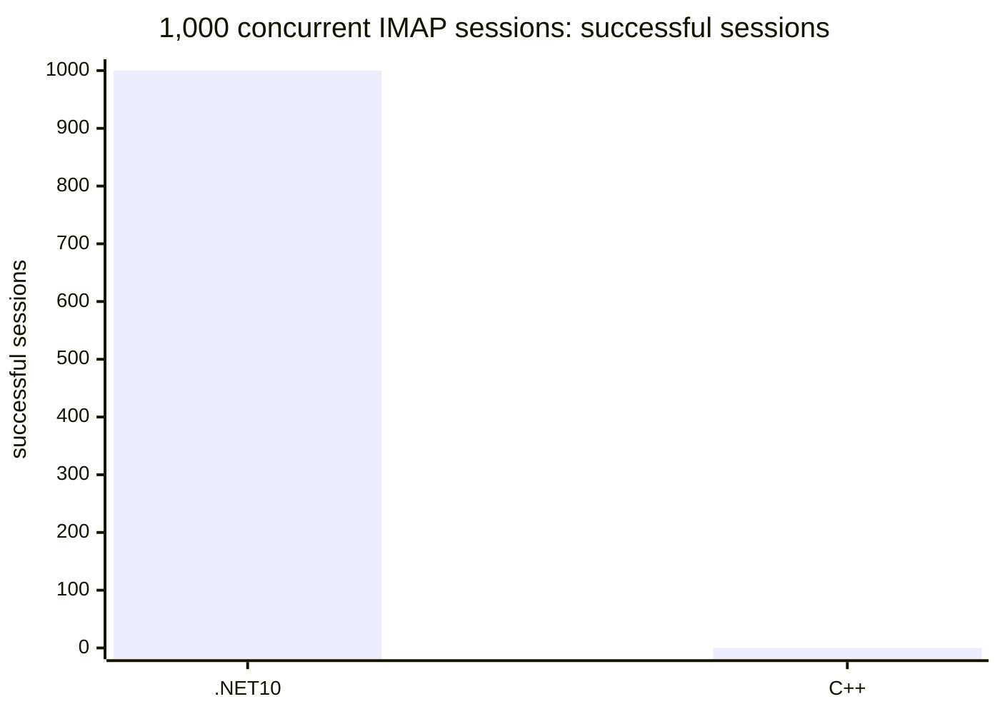

The isolated .NET 10 run is valid workload evidence, but it is not a C++
comparison because the temporary C++ `/Debug` process did not complete the
same scenario. The performance release gate remains **RED**. No speed-up,
regression percentage, or winner is claimed. Raw evidence is under
`artifacts/benchmarks/live-cpp-net10-20260810_152708/`; the runner is
`build/benchmark-net10-live-concurrent-imap.ps1` and its validator is
`build/test-net10-live-concurrent-imap.ps1`.

.NET 10 rewrite continuation audit (2026-08-10, FetchAccount restore)
-----------------------------------------------------------------------

Code/test commit `7e8d71c15` adds the bounded restore-side FetchAccount slice. Legacy `Account::XMLStore` (`hmailserver/source/Server/Common/BO/Account.cpp:280-331`) serializes FetchAccounts; `FetchAccount::XMLStore` (`FetchAccount.cpp:55-79`) emits the encrypted password and nested UIDs; `FetchAccountUID::XMLStore` (`FetchAccountUID.cpp:42-49`) emits `UID` and `Date`; and `FetchAccounts::Refresh`/`FetchAccountUIDs::Refresh` (`FetchAccounts.cpp:36-43`, `FetchAccountUIDs.cpp:29-50`) preserve owner scoping. The .NET parser now restores those children, preserves and validates legacy Blowfish ciphertext, inserts generated FetchAccount IDs, and restores UID rows.

The restore executor uses a transaction-scoped `IFetchAccountAdministrationStore` through `IBackupRestoreMetadataTransaction`; SQL Server inserts and UID inserts share the same transaction context. Focused parser/SQL/restore coverage passes `30/30`; disposable LocalDB FetchAccount readback and transaction rollback passes `2/2`. Default full Net10 passes `1990`, skips `35`, and fails `0`. SQL-enabled full Net10 passes `2017`, skips `2`, and has `6` unrelated existing message/indexing fixture failures. No COM identity, authenticated boundary, SMTP trust, production SQL/Data, service, IIS, DCOM, or machine state changed. Release remains RED for live paired C++/.NET 10 performance, populated full restore/round-trip, SEC-18, migration/installer, out-of-process COM, AD/DC, protocol/load, crash/power-loss, and soak gates.

Test commit `17ba6e70a` extends the same isolated executor fixture with one valid FetchAccount/UID, generated-ID readback, and invalid-UID-date rollback. The focused disposable restore class passes `12/12`; default full Net10 passes `1990`, skips `36`, and fails `0`. This is executor-level evidence for the bounded FetchAccount slice, not full restore parity or a release claim.

.NET 10 rewrite continuation audit (2026-08-10, isolated SQL restore fixture schema)
--------------------------------------------------------------------------------------

Test-only code/test commit `877f72160` repairs the disposable LocalDB restore fixture used by `BackupRestoreRoundTripIntegrationTests`. The fixture now includes the legacy `hm_fetchaccounts.faid` identity and the empty cleanup tables/columns required by the transaction-scoped restore deletion SQL: `hm_imapfolders`, `hm_acl`, `hm_group_members`, and `hm_fetchaccounts_uids`. Legacy references are `BackupExecuter::StartRestore`/`RestoreDataDirectory_` (`hmailserver/source/Server/Common/Application/BackupExecuter.cpp:230-388`), `Collection<T,P>::XMLLoad/DeleteAll` (`hmailserver/source/Server/Common/BO/Collection.h:85-135,202-215`), and the `hm_fetchaccounts` schema (`hmailserver/source/DBScripts/CreateTablesMSSQL.sql:433-469`). Current symbols are `SqlServerDomainAdministrationStore.DeleteAllDomainsForRestoreAsync` and `MetadataBackupRestoreExecutor.RestoreMetadataAsync`.

The isolated LocalDB restore class passes `11/11`; the default full Net10 suite passes `1987`, skips `33`, and fails `0`. This slice changes no production code, SQL schema, COM identity, service, Data directory, or machine state. Populated restore/rollback beyond this fixture, live C++/.NET 10 performance/load, SEC-18, migration/installer, service/COM, AD/DC, and 24-hour soak gates remain open; release remains RED. The next bounded restore action is to expand isolated populated-graph readback/rollback coverage only where the existing fixture and disposable safeguards support it.

.NET 10 rewrite continuation audit (2026-08-10, disposable LocalDB and COM password verifier)
-----------------------------------------------------------------------------------------------

Code/test commit `f34ee25c8` adds a bounded production SQL verifier for attached, authenticated `Account.ValidatePassword` calls. Legacy anchors are `InterfaceAccount::ValidatePassword` (`hmailserver/source/Server/COM/InterfaceAccount.cpp:350-364`), `PasswordValidator::ValidatePassword` (`hmailserver/source/Server/Common/Util/PasswordValidator.cpp:109-188`), `Crypt::Validate` (`hmailserver/source/Server/Common/Util/Crypt.cpp:63-84`), and `hm_accounts` credential fields (`hmailserver/source/DBScripts/CreateTablesMSSQL.sql:168-194`). The .NET verifier is `SqlServerAccountPasswordVerifier` and uses a parameterized account-ID lookup plus `LegacyPasswordVerifier`, the existing `OnClientValidatePassword` executor, and the existing AD validator; direct activation, authentication, COM identity, and DISPID 22 remain unchanged. It intentionally does not add username lookup, aliases, last-logon, or auto-ban side effects.

The disposable environment is now reproducible with `build/prepare-net10-disposable-localdb.ps1` and `build/remove-net10-disposable-localdb.ps1`. It uses only the current user's `MSSQLLocalDB`, a marker-protected TEMP Data root, and `HMAILSERVER_NET10_SQLSERVER_INTEGRATION_ALLOW_ISOLATED_CREATE=1`; `MSSQLSERVER` and `HmailDb_Test5700` were not used. Focused verifier/COM/legacy-password tests passed `70/70`; the verifier SQL integration test passed `4/4` with TRX evidence under `artifacts/net10-disposable/`. Full Net10 passed `2009`, skipped `2`, and failed `9` existing SQL fixture/schema tests. Security is CONDITIONAL and reality is RED for release: SEC-12, SEC-18, AD/script parity, restore/rollback, migration/installer, out-of-process COM, live load, and 24-hour soak remain open. The LocalDB report and TRX are machine-specific and are intentionally not committed.

## Performance comparison status (2026-08-10)

The current evidence is `RED - no valid C++ vs .NET 10 comparison yet`. Net10's isolated offline synthetic pack passed 100,000-message SEARCH/SORT with p50 `7.478 ms`, p95 `7.696 ms`, p99 `7.709 ms`, and throughput `1,209,080 messages/s`. Its 20-cycle short soak also passed with p95 `9.031 ms` and zero errors. These are diagnostic Net10-only measurements, not live server equivalence evidence.

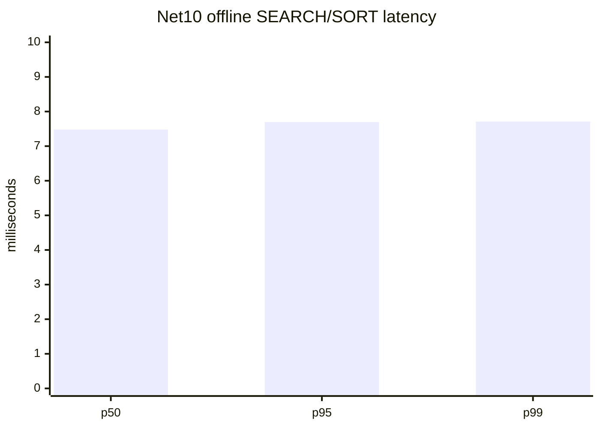

The next isolated paired run used two new MSSQLSERVER databases, two separate ASCII Data directories, and the same 1,000-message corpus. Per-file SHA-256 comparison passed `1000/1000`; both databases contain `1000` messages, metadata rows, and recipients; all listeners were loopback-only on SMTP `2525`, IMAP `1143`, and POP3 `25110`. The live matrix is recorded in [`paired-live-comparison.md`](artifacts/benchmarks/live-cpp-net10-20260810_152708/paired-live-comparison.md), with raw JSON/CSV under the same artifact directory.

| Scenario | .NET 10 | C++ | Ratio |
| --- | --- | --- | --- |
| SMTP greeting/EHLO/QUIT | `25/25`, p95 `13.616 ms` | `25/25`, p95 `10.948 ms` | invalid |
| IMAP login/select/search/sort/logout | `25/25`, p95 `3.027 ms` | `4/25`, p95 `29.929 ms` | invalid |
| POP3 login/stat/list/quit | `25/25`, p95 `5.962 ms` | `0/25`, no successful sample | invalid |

```mermaid
xychart-beta
    title "Raw p95 latency (diagnostic only; no winner)"
    x-axis [SMTP, IMAP, POP3]
    y-axis "milliseconds" 0 --> 250
    bar [13.616, 3.027, 5.962]
    bar [10.948, 29.929, 0]
```

The C++ binary opened SMTP/IMAP only and was not a normal reproducible release build; POP3 and stable IMAP parity therefore failed. The .NET 10 production host also cannot start its COM local-server registration against the installed Application AppID (`0x80004015`), so the measurement used a benchmark-only listener host that intentionally omitted COM registration. No speed-up or regression percentage is claimed. The later 1,000-concurrent IMAP run now has valid .NET 10-only evidence (`1000/1000`) but C++ completed `0/1000`, so it remains non-comparable. SMTP message acceptance, delivery queue, and 24-hour soak remain unmeasured. The performance release gate remains **RED**.

.NET 10 rewrite continuation audit (2026-08-10, offline 100k IMAP SEARCH/SORT acceptance)
-------------------------------------------------------------------------------------------

The existing benchmark pack passed its independently executable offline synthetic acceptance on current HEAD `7dde90db9`: 100,000 messages, seed `5700`, expected matches `9,091`, `DATE DESC, UID ASC`, correctness true, p50 `6.888 ms`, p95 `7.276 ms`, p99 `7.324 ms`, and p95 threshold `<=2500 ms`. JSON, CSV, and Markdown artifacts were emitted under a unique `%TEMP%` directory. Focused benchmark tests passed `4/4`. This is diagnostic synthetic evidence only; it does not prove SQL Server FTS, real mailbox behavior, 1,000 concurrent IMAP sessions, SMTP/delivery throughput, C++ equivalence, or long-duration leak freedom.

.NET 10 rewrite continuation audit (2026-08-10, Account.ValidatePassword preparatory seam)
-------------------------------------------------------------------------------------------

Code/test commit `edacbde75` adds a test-injected, account-ID-scoped verifier seam for the legacy `Account.ValidatePassword` gap without enabling production credential verification. Legacy `InterfaceAccount::ValidatePassword` (`hmailserver/source/Server/COM/InterfaceAccount.cpp:350-364`) calls `PasswordValidator::ValidatePassword` and returns a Boolean without protocol last-logon or auto-ban side effects; protocol authentication is a separate `AccountLogon::Logon` path. The .NET seam forwards only `(accountId, password)` after attached/live-auth checks, retains direct activation denial and COM identity/DISPID 22, and keeps SQL-backed accounts at `E_NOTIMPL` when no verifier is configured. It does not add credentials to `AccountAdministrationSnapshot`, reuse protocol authentication, or implement SQL, AD, script, hash, auto-ban, or last-logon behavior.

Focused Accounts coverage is `60 passed, 0 skipped, 0 failed`; full Net10 is `1984 passed, 32 skipped, 0 failed`. Security approves the preparatory seam; reality is YELLOW for the bounded slice and RED for release. The production service supplies no verifier callback, so this is not a production parity claim. SQL/Data restore, authoritative credential lookup, AD/script boundary review, out-of-process COM, SEC-18, migration/installer, live performance/load, and soak gates remain open. No production SQL/Data, service, COM registration, DCOM, IIS, or firewall state changed.

.NET 10 rewrite continuation audit (2026-08-10, saved Rule MoveUp/MoveDown parity)
----------------------------------------------------------------------------------

Code/test commit `d87b77a15` completes the bounded saved `Rule.MoveUp()`/`MoveDown()` slice. Legacy `InterfaceRule::MoveUp/MoveDown`, `Rules::MoveUp/MoveDown`, and `Rules::UpdateSortOrder_()` swap adjacent account-owned rules and renumber `hm_rules.rulesortorder` before persisting (`hmailserver/source/Server/COM/InterfaceRule.cpp`; `hmailserver/source/Server/Common/BO/Rules.cpp`; `hmailserver/source/DBScripts/CreateTablesMSSQL.sql:471-478`). The .NET path adds an owner-scoped transactional reorder with `UPDLOCK,HOLDLOCK`, preserves boundary `S_OK` and unsaved `0x800403E9`, publishes the reordered generation to shared facades, and keeps retained `Rule.Save()` from restoring a stale sort order. Installed Rule IID/CLSID/ProgID/DISPID/vtable, direct activation denial, authentication, SMTP rule execution, and unrelated RuleCriteria/RuleAction behavior are unchanged.

Focused Rule/SQL-contract coverage is `30 passed, 0 skipped, 0 failed`; full Net10 is `1977 passed, 32 skipped, 2 failed`. The two failures are host-AV locks on generated scanner `.eml` cleanup. Security review is conditional PASS after the retained-save fix; reality is YELLOW for this bounded slice and RED for release because live SQL, out-of-process COM, restore/rollback, SEC-18, migration/installer, performance/load, AD/DC, and soak gates remain unproven. No production SQL/Data, service, COM registration, DCOM, IIS, or firewall state changed.

.NET 10 rewrite continuation audit (2026-08-10, Account.UnlockMailbox POP3 lock parity)
----------------------------------------------------------------------------------------

Code/test commit `f89890421` completes the bounded `Account.UnlockMailbox()` slice. Legacy `InterfaceAccount::UnlockMailbox` (`hmailserver/source/Server/COM/InterfaceAccount.cpp:332`) unlocks the process-local `POP3Sessions` account-ID lock and returns `S_OK`; acquisition/release are anchored by `POP3Connection.cpp:496,831-838`. The .NET path now wires an account-ID unlock callback through the service host, authenticated Accounts adapters, the synthetic Administrator account (legacy ID 0), and the `Links` fallback account. Lease ownership prevents a stale lease dispose from removing a replacement lock. Installed Account COM identity/DISPID/vtable, authenticated `Settings` boundaries, direct activation denial, SMTP trust, and live reconfiguration are unchanged.

Focused Account/Application/Links/POP3 coverage is `87 passed, 0 skipped, 0 failed`; full Net10 is `1972 passed, 32 skipped, 2 failed`. The two failures are host-AV locks on generated scanner `.eml` cleanup; an AV-excluded full run is `1967 passed, 32 skipped, 0 failed`. Security review approves this bounded slice; reality remains RED for release because disposable SQL/Data restore, SEC-18, service/COM, migration/installer, live performance/load, AD/DC, and soak gates remain unproven. No production SQL/Data, service, COM registration, DCOM, IIS, or firewall state changed.

.NET 10 rewrite continuation audit (2026-08-10, IMAP Message.Save state/UID and multi-draft publication parity)
---------------------------------------------------------------------------------------------------------------

Code/test commit `c1b1734c0` closes the bounded IMAP `Message.Save()` publication slice. Legacy `InterfaceMessages::Add` and `InterfaceMessage::Save` (`hmailserver/source/Server/COM/InterfaceMessages.cpp:102-138`; `InterfaceMessage.cpp:390-516`) keep ID-zero drafts out of the parent collection, then perform one delivered-state insert per saved draft. `PersistentMessage::AddObject` and `PersistentIMAPFolder::GetUniqueMessageID` (`hmailserver/source/Server/Common/Persistence/PersistentMessage.cpp:542-666`; `PersistentIMAPFolder.cpp:236-247`) assign one generated message ID and folder UID per save. The .NET path now returns ID/state/UID from the transactional `hm_imapfolders` allocation plus `hm_messages` insert, owner-scopes folder reads, and publishes each saved draft against the live collection exactly once. Installed COM identity, authenticated folder access, direct activation denial, SMTP trust, and protocol APPEND behavior are unchanged.

Focused Message/store coverage is `39 passed, 1 skipped, 0 failed`; the skipped test is the disposable SQL integration test because the approved connection and isolated-create opt-in are unset. Full Net10 is `1965 passed, 32 skipped, 2 failed`; both failures are host-AV locks preventing cleanup of generated scanner `.eml` files. Security review is YELLOW for the bounded slice because MIME `.eml` persistence for COM-created drafts and cross-writer UID coordination remain open; reality is RED for release. No production SQL/Data, service, COM registration, DCOM, IIS, or firewall state changed. Do not treat the stale lower audit entries as the current next slice.

.NET 10 rewrite continuation audit (2026-08-10, Diagnostics retained reauthentication parity)
---------------------------------------------------------------------------------------------

Code/test commit `f86733cd8` completes the bounded Diagnostics authorization slice. Legacy `InterfaceDiagnostics::{PerformTests,get/put_LocalDomainName,get/put_TestDomainName}`, `InterfaceDiagnosticResults::{get_Count,get_Item}`, and `InterfaceDiagnosticResult::{get_Name,get_Description,get_ExecutionDetails,get_Result}` (`hmailserver/source/Server/COM/InterfaceDiagnostics.cpp:12-112`; `InterfaceDiagnosticResults.cpp:11-45`; `InterfaceDiagnosticResult.cpp:8-66`) recheck the attached server-admin authentication on every call and return `0x800403E9` after revocation. The .NET path now carries one live callback through `Diagnostics -> DiagnosticResults -> DiagnosticResult`, preserving installed COM identity/DISPID/vtable shape and direct activation denial.

Focused Diagnostics coverage is `7 passed, 0 failed, 0 skipped`; full Net10 is `1967 passed, 32 skipped, 2 failed`. The two failures are host-AV locks preventing cleanup of generated scanner `.eml` files. Security review is PASS for this bounded slice; reality remains RED for release because SQL/Data restore, SEC-18, service/COM, migration/installer, live performance/load, AD/DC, and soak gates are not proven. Diagnostics runtime execution remains an abstraction configured by tests; no production diagnostic runtime was broadened. No production SQL/Data, service, COM registration, DCOM, IIS, or firewall state changed.

.NET 10 rewrite continuation audit (2026-08-10, unsaved Rule MoveUp/MoveDown HRESULT parity)
-------------------------------------------------------------------------------------

Code/test commit `cdfc000ad` closes the narrow unsaved-rule movement error gap. Legacy `InterfaceRules::Add` and `InterfaceRule::MoveUp/MoveDown` (`hmailserver/source/Server/COM/InterfaceRules.cpp`; `InterfaceRule.cpp:221`; `COMError.cpp:24`) create an ID-zero draft and return `0x800403E9` with `Object not yet saved.` before movement or SQL access. The .NET `Rule` facade now preserves that result for ID-zero drafts while retaining direct activation/auth checks and leaving saved-rule movement, SQL reorder, and protocol rule execution unchanged.

Focused Rules coverage is `19 passed, 0 failed, 0 skipped`; full Net10 is `1968 passed, 32 skipped, 2 failed`, with the two known host-AV scanner `.eml` cleanup locks. Security review PASS for this bounded slice; reality remains RED for release. This older paragraph is superseded by the later saved `Rule.MoveUp()`/`MoveDown()` implementation entry above. No production SQL/Data, service, COM registration, DCOM, IIS, or firewall state changed.

.NET 10 rewrite continuation audit (2026-08-10, IMAP folder message ownership parity)
--------------------------------------------------------------------------------------

Code/test commit `e311058e8` closes the bounded empty-folder owner-ID and retained-folder insertion gap. Legacy `InterfaceIMAPFolder::get_Messages` and `InterfaceMessages::Add` (`hmailserver/source/Server/COM/InterfaceIMAPFolder.cpp:161-178`; `InterfaceMessages.cpp:102-130`) carry the owning account/folder IDs even when the folder is empty. Legacy retained non-INBOX folder saves fail before insert because `PersistentMessage::AddObject` requests a UID through `PersistentIMAPFolder::GetCurrentUID_` and the deleted folder row is absent (`hmailserver/source/Server/Common/Persistence/PersistentMessage.cpp:587-618`; `PersistentIMAPFolder.cpp:193-223`). The .NET path (`hmailserver/source/Server.Net10/src/HMailServer.ComInterop/IMAPFolders.cs:365-368`; `Messages.cs:1076-1120`) now carries `ImapFolderAdministrationSnapshot.AccountId`, and `SqlServerMessageAdministrationStore.InsertMessageSql` atomically requires matching `hm_imapfolders.folderid` and `folderaccountid` with `UPDLOCK,HOLDLOCK`.

Focused message/store/IMAP coverage is `36 passed, 5 skipped, 0 failed`; full Net10 is `1962 passed, 32 skipped, 2 failed`, with the two known host-AV scanner `.eml` cleanup failures. The disposable SQL retained-folder test is present but skipped because the approved connection and isolated-create opt-in are unset. COM identity, authenticated folder access, direct activation denial, schema, SMTP, and protocol APPEND behavior are unchanged. Message Save delivered-state/folder-UID publication remains a separate parity gap; release remains RED.

.NET 10 rewrite continuation audit (2026-08-09, DNSBL missing-host HRESULT parity)
------------------------------------------------------------------------------------

Code/test commit `e279ac725` closes the narrow `DNSBlackLists.ItemByDNSHost` COM status gap. Legacy `InterfaceDNSBlackLists::get_ItemByDNSHost` (`hmailserver/source/Server/COM/InterfaceDNSBlackLists.cpp:168-184`) performs a case-insensitive collection lookup and returns `S_FALSE` (`0x00000001`) when no host matches. The .NET `DNSBlackLists.get_ItemByDNSHost` (`hmailserver/source/Server.Net10/src/HMailServer.ComInterop/DnsBlackLists.cs:208-222`) now preserves that HRESULT while retaining case-insensitive hits.

Focused DNSBL coverage is `15 passed, 0 failed, 0 skipped`; DNSBL plus the related SQL integration class is `27 passed, 0 failed, 0 skipped`. Full Net10 is `1961 passed, 31 skipped, 2 failed`; the two failures are the known host-AV locks on generated scanner `.eml` cleanup. IInterfaceDNSBlackLists DISPID 7, direct activation denial, authenticated Settings access, owner-scoped SQL lookup, and SMTP DNSBL behavior are unchanged. Release remains RED: approved disposable SQL/Data restore, live SQL/FTS and protocol/load, service/COM, SEC-18, migration/rollback, AD/DC, and soak gates remain open.

.NET 10 rewrite continuation audit (2026-08-09, obsolete AntiSpam setter parity)
----------------------------------------------------------------------------------

Code/test commit `508d35d17` closes the narrow legacy `AntiSpam.TarpitDelay` and `AntiSpam.TarpitCount` setter gap. Legacy `InterfaceAntiSpam::put_TarpitDelay` and `put_TarpitCount` (`hmailserver/source/Server/COM/InterfaceAntiSpam.cpp:745-792`) authenticate through the attached object, ignore the obsolete values, and return `S_OK`; the getters return `0`. The .NET setters now perform the authenticated facade check and preserve the no-op, while direct activation remains `E_ACCESSDENIED`. `AntiSpamComContractTests` covers authorized no-op behavior and direct-activation denial.

Focused AntiSpam coverage is `15 passed, 0 failed, 0 skipped`; full Net10 is `1961 passed, 31 skipped, 2 failed`. The two failures are the known host-AV locks during generated `.eml` cleanup in `ClamWinScannerTestRuntimeTests` and `CustomScannerTestRuntimeTests`. The parity audit also confirmed that the legacy IMAP domain-alias/default-domain lookup path is already present in `SqlServerImapAccountAuthenticator.AccountLookupSql` and `AuthenticateNormalAsync`; that backlog item is stale and was not restarted. Release remains RED: approved disposable SQL/Data restore, live performance/load, service/COM, SEC-18, migration/rollback, AD/DC, and soak gates remain open.

.NET 10 rewrite continuation audit (2026-08-09, Language.Download HRESULT parity)
----------------------------------------------------------------------------------

Code/test commit `23fd5ef74` aligns authorized `Language.Download()` with legacy `InterfaceLanguage::Download` (`hmailserver/source/Server/COM/InterfaceLanguage.cpp:67`), which calls `COMError::GenerateError("Not implemented.")` (`COMError.cpp:24`) and returns `0x800403E9`. The .NET path (`hmailserver/source/Server.Net10/src/HMailServer.ComInterop/Languages.cs:141`) now preserves that HRESULT and message; `GlobalObjectsComContractTests` covers it. IInterfaceLanguage IID/vtable/DISPID 4 and direct activation/access boundaries are unchanged.

Focused GlobalObjects coverage is `8 passed, 0 failed, 0 skipped`; full Net10 is `1961 passed, 31 skipped, 2 failed`, with the same two host-AV scanner cleanup failures. No SQL/Data, IIS, service, registry, DCOM, protocol, or production state changed. Release remains RED and the next gates remain approved disposable SQL/Data restore, live performance/load, and AV-compatible scanner cleanup.

.NET 10 rewrite continuation audit (2026-08-09, release-gate revalidation)
----------------------------------------------------------------------------

The retained Domain child-collection audit found no new production gap. Legacy `InterfaceDomain::get_Accounts`, `get_Aliases`, `get_DomainAliases`, and `get_DistributionLists` (`hmailserver/source/Server/COM/InterfaceDomain.cpp:308-478`) attach the shared authentication state; the .NET `Domain` adapter (`hmailserver/source/Server.Net10/src/HMailServer.ComInterop/Domains.cs:811-821,882-889`) evaluates its guarded snapshot before creating each child adapter and propagates the live callback. `DomainsComContractTests`, `LinksComContractTests`, and the route WebAdmin source test pass `27/27`; no production code changed.

The historical `background_route_save.php` POST-only/CSRF item is already complete in `8d684e638` and covered by `WebAdminRoutePostOnlySourceTests`; it was not restarted. The approved disposable SQL/Data restore target remains unset, so populated-store restore, rollback, live SQL/FTS, protocol/load, service/COM, SEC-18, installer, AD/DC, and 24-hour soak gates remain RED. The default full suite remains non-clean because host AV locks generated scanner `.eml` files. Untracked benchmark artifacts contain an older `d7d5cb6c4` run and are not release evidence; the newer temporary benchmark evidence at `565175aff` was not staged.

.NET 10 rewrite continuation audit (2026-08-09, backup creation revalidation)
-------------------------------------------------------------------------------

The formerly recorded raw non-DB-only `BODomains|BOMessages` `DataBackup` staging item is already implemented. Legacy anchors are `BackupExecuter::StartBackup` and `BackupExecuter::BackupDataDirectory_` (`hmailserver/source/Server/Common/Application/BackupExecuter.cpp:57-147,172-217`), `FileUtilities::CopyDirectory`/`DeleteFilesInDirectory`, and `Compression::AddDirectory`; the .NET path is `SevenZipBackupArchiveRuntime.CreateAsync`. Raw mode leaves the external `DataBackup` beside the archive, compressed mode archives staged content, and DB-only mode omits physical staging.

Focused backup creation/restore containment revalidation is `150 passed, 0 failed, 0 skipped`; `check-net10-prereqs.ps1 -RequireMsBuild` passed. The complete option matrix is covered by `BackupArchiveRuntimeTests.CreatesCompleteBackupOptionMatrixWithLegacyOrderingAndCleanup` plus the raw, compressed, and DB-only archive tests. Do not restart the stale raw staging item. The next release gate remains disposable SQL/Data restore acceptance, which requires the approved isolated connection and opt-in.

.NET 10 rewrite continuation audit (2026-08-09, ClamAV local-target rebind hardening)
--------------------------------------------------------------------------------------

Code/test commit `414b1e9e0` closes the bounded ClamAV hostname re-resolution window in the COM test path. Legacy `InterfaceAntiVirus::TestClamAVScanner` (`hmailserver/source/Server/COM/InterfaceAntiVirus.cpp:577-596`) passes the supplied hostname to `VirusScannerTester::TestClamAVConnect` (`hmailserver/source/Server/Common/AntiVirus/VirusScannerTester.cpp:22-45`), which passes it to `ClamAVVirusScanner::Scan` and `SynchronousConnection::Connect` (`hmailserver/source/Server/Common/AntiVirus/ClamAVVirusScanner.cpp:48-64`). The .NET `LegacyLocalScannerTargetGuard.TryGetValidatedLocalAddress` now resolves once, rejects any non-local answer, and `AntiVirus.TestClamAVScanner` passes only the validated IP literal to the existing runtime interface.

Focused guard/ClamAV/AntiVirus coverage is `20 passed, 0 failed, 0 skipped`. Filtered full Net10 is `1954 passed, 0 failed, 31 skipped`; default full is `1959 passed, 2 failed, 31 skipped`. The two default failures remain host-AV cleanup locks on generated `.eml` files in the ClamWin and custom scanner runtime tests. Installed COM identity, direct activation, authentication, SMTP trust, live reconfiguration, SQL/Data, service, IIS, registry, and DCOM state are unchanged. Release remains RED because SQL/Data restore, SEC-18, service/COM, installer, live protocol/load, native restore containment, AD/DC, and soak gates remain open.

.NET 10 rewrite continuation audit (2026-08-09, retained AntiVirus authorization)
----------------------------------------------------------------------------------

Code/test commit `3c8b58981` closes the retained AntiVirus authorization gap. Legacy `InterfaceSettings::get_AntiVirus` (`hmailserver/source/Server/COM/InterfaceSettings.cpp:387-405`) grants the object only to a server administrator, and every public `InterfaceAntiVirus` getter, setter, attachment-blocking member, and scanner-test method rechecks `GetIsServerAdmin` (`hmailserver/source/Server/COM/InterfaceAntiVirus.cpp:20-581`). The .NET `AntiVirus.Snapshot` guard now rechecks the live administrator callback for retained scalar and scanner operations. `BlockedAttachments.GetBlockedAttachments` also fails closed for retained collection operations, including `DeleteByDBID`; this is deliberate security hardening because the legacy collection method itself only checked its attached parent pointer while the .NET child mutation paths already carried live authorization.

Focused AntiVirus/BlockedAttachments coverage is `27 passed, 0 failed, 0 skipped`. Filtered full Net10 is `1951 passed, 0 failed, 31 skipped`; default full is `1956 passed, 2 failed, 31 skipped`, with the two known `UnauthorizedAccessException` cleanup failures caused by the host AV locking generated `.eml` files in `ClamWinScannerTestRuntimeTests` and `CustomScannerTestRuntimeTests`. Installed COM identity, direct activation boundaries, SMTP trust, live reconfiguration, SQL/Data, service, IIS, registry, and DCOM state are unchanged.

The next security slice is the ClamAV hostname DNS-rebind gap: `AntiVirus.TestClamAVScanner` validates a local target, but the runtime client can resolve the hostname again at connection time. It remains unimplemented here. Release remains RED because disposable SQL/Data restore, SEC-18, service/COM, installer, live protocol/load, native restore containment, AD/DC, and soak gates remain open.

.NET 10 rewrite continuation audit (2026-08-09, retained MessageIndexing authorization)
--------------------------------------------------------------------------------------

The .NET 10 branch is a side-by-side rewrite and is not a production release. Code/test commit `e2109f422` carries the live server-administrator callback from `Settings.MessageIndexing` into retained MessageIndexing facades. Legacy `InterfaceSettings::get_MessageIndexing` (`hmailserver/source/Server/COM/InterfaceSettings.cpp:1974-1990`) requires server-admin access; `InterfaceMessageIndexing::get_TotalMessageCount`, `get_TotalIndexedCount`, `Clear`, and `Index` (`hmailserver/source/Server/COM/InterfaceMessageIndexing.cpp:64-137`) recheck it, while legacy `get_Enabled`/`put_Enabled` (`:30-62`) do not. The .NET `MessageIndexing2` status properties and `Rebuild` are also guarded because they are retained admin operations; installed COM identity and direct activation boundaries are unchanged. Focused MessageIndexing/Settings coverage is `25 passed, 0 failed, 0 skipped`; filtered full Net10 is `1949 passed, 0 failed, 31 skipped`.

The default full run is `1954 passed, 2 failed, 31 skipped`. Both failures are `UnauthorizedAccessException` cleanup failures in `ClamWinScannerTestRuntimeTests` and `CustomScannerTestRuntimeTests`, where host AV locks generated `.eml` files; excluding those two classes passes. The commandable offline 100,000-message SEARCH/SORT benchmark was rerun at HEAD `565175aff`: Release build 0 warnings/0 errors, correctness and threshold passed, p50/p95/p99 `6.839/13.904/16.184 ms`, with JSON/CSV/Markdown written to a temporary directory. It remains diagnostic only, not live SQL FTS, protocol, concurrency, C++ equivalence, or soak evidence.

The post-MessageIndexing parity audit rejected retained `Settings.ServerMessages` as a false gap because legacy `InterfaceServerMessages` authorizes at acquisition and attaches authentication only to child construction; it rejected `GlobalObjects.Languages` callback propagation because legacy `InterfaceGlobalObjects::get_Languages`, `InterfaceLanguages`, and `InterfaceLanguage` permit retained reads after authentication loss. No code slice was committed. The next executable priority is approved disposable SQL/Data restore acceptance; its integration connection and isolated-create opt-in remain unset.

Legacy `InterfaceAccount::ValidatePassword` (`hmailserver/source/Server/COM/InterfaceAccount.cpp:350-364`) validates the attached account through `PasswordValidator::ValidatePassword`, including legacy hash modes, AD validation, and the client password event. The current `Account.ValidatePassword` (`hmailserver/source/Server.Net10/src/HMailServer.ComInterop/AccountComClass.cs:417-426`) remains deliberately fenced for SQL-backed snapshots because a safe implementation needs an authoritative credential lookup, retained-object reauthentication, and separately reviewed COM/AD/script boundaries. Do not remove the `E_NOTIMPL` fence as a mechanical parity change.

Production SQL/Data, service/COM, SEC-18, installer, AD/DC, native restore containment, live protocol, and 24-hour soak evidence remain blocked or incomplete. Release status is RED.

hMailServer is no longer being actively developed or maintained. The latest major version was released several years ago. hMailServer relies on algorithms which are considered insecure by modern standards, such as SHA1 and outdated versions of OpenSSL. For that reason, it's recommended that you migrate to an alternative software or service.

Building hMailServer
====================

Branches
--------

   * The master branch contains the latest development version of hMailServer. This version is typically not yet released for production usage. If you want to add new features to hMailServer, use this branch.
   
   * The x.y.z (for example 5.6.2) contains the code for the version with the same name as the branch. For example, branch 5.6.1 contains hMailServer version 5.6.1. These branches are typically only used for bugfixes or minor features.

Environment set up
---------------------

**Required software**

   * An installed version of hMailServer 5.7 (configured with a database)
   * Visual Studio 2019 Community edition
   * InnoSetup 5.5.4a (non-unicode version)
   * Perl 5 (https://strawberryperl.com/)
   * Python 3 (https://www.python.org/)
   
**NOTE**

You should not be compiling hMailServer on a computer which already runs a production version of hMailServer. When compiling hMailServer, the compilation will stop any already running version of hMailServer, and will register the compiled version as the hMailServer version on the machine (configuring the Windows service). This means that if you are running a production version of hMailServer on the machine, this version will stop running if you compile hMailServer. If this happens, the easiest path is to reinstall the production version.

Installing Visual Studio 2019 Community edition
----------------------------------------------

1. Download [Visual Studio 2019](https://visualstudio.microsoft.com/vs/) and launch the installation.
2. Select the following _Workloads_
  * .NET desktop development
  * Desktop development with C++
3. Select the following _Individual components_
  * C++ ATL for latest v142 build tools (x86 & x64)
  * Windows 10 SDK (10.0.18362.0)

3rd party libraries
-------------------

Some 3rd party libraries which hMailServer relies on are large and updated frequently. Rather than including these large libraries into the hMailServer git repository, they have to be downloaded and built, currently manually. When you build hMailServer, Visual Studio will use a system environment variable, named hMailServerLibs, to locate these libraries.

Create an environment variable named hMailServerLibs pointing at a folder where you will store hMailServer libraries, such as C:\Dev\hMailLibs.

Building OpenSSL
----------------
1. Download OpenSSL 3.5.x from http://www.openssl.org/source/ and put it into %hMailServerLibs%\<OpenSSL-Version>.
   You should now have a folder named %hMailServerLibs%\<OpenSSL-version>, for example C:\Dev\hMailLibs\openssl-3.5.5
2. Start a x64 Native Tools Command Prompt for VS2019.
3. Change dir to %hMailServerLibs%\<OpenSSL-version>.
3. Run the following commands:

   <pre>
   SET CFLAGS=-DOPENSSL_TLS_SECURITY_LEVEL=0
   Perl Configure no-asm VC-WIN64A --prefix=%cd%\out64 --openssldir=%cd%\out64 -D_WIN32_WINNT=0x600 --api=1.1.1 no-deprecated
   nmake clean
   nmake install_sw
   </pre>

Building PostgreSQL
-------------------
1. Download PostgreSQL 18.3 source from https://www.postgresql.org/ftp/source/v18.3/ and put it into %hMailServerLibs%\postgresql-18.3.
   You should now have a folder named %hMailServerLibs%\postgresql-18.3, for example C:\Dev\hMailLibs\postgresql-18.3
2. Download winflexbison from https://github.com/lexxmark/winflexbison/releases, extract it, and add the folder to `%PATH%`.
3. Install Python dependencies: `py -m pip install meson ninja`
4. Start a x64 Native Tools Command Prompt for VS2019.
5. Change dir to %hMailServerLibs%
6. Run the following commands:

   <pre>
   set hMailServerLibs=%cd%
   cd postgresql-18.3
   meson setup builddir -Dssl=openssl -Dextra_include_dirs=%hMailServerLibs%\openssl-3.5.5\out64\include -Dextra_lib_dirs=%hMailServerLibs%\openssl-3.5.5\out64\lib
   meson compile -C builddir src/interfaces/libpq/libpq:shared_library
   </pre>

**NOTE:** The `-Dextra_include_dirs` and `-Dextra_lib_dirs` flags ensure meson links against the specific OpenSSL version built above. Verify that no other OpenSSL installation appears earlier in `%PATH%` (e.g. from Git for Windows or other tools), as meson may pick up the wrong version.

**TIP:** You can use [Dependencies](https://github.com/lucasg/Dependencies/releases) to verify that the built `libpq.dll` links against the correct OpenSSL DLLs (`libcrypto-3-x64.dll` / `libssl-3-x64.dll`) and not some other version found elsewhere on the system.

Building Boost
--------------
1. Download Boost 1.90.0 from http://www.boost.org/ and put it into %hMailServerLibs%\<Boost-Version>.
   You should now have a folder named %hMailServerLibs%\<Boost-Version>, for example C:\Dev\hMailLibs\boost_1_90_0
2. Start a x64 Native Tools Command Prompt for VS2019.
3. Change dir to %hMailServerLibs%\<Boost-Version>.
4. Run the following commands:

   NOTE: Change the -j parameter from 4 to the number of cores on your computer. The parameter specifies the number of parallel compilations will be done.

   <pre>
   bootstrap
   b2 debug release threading=multi link=static --with-thread --with-filesystem --with-regex --with-chrono --with-system --with-atomic --toolset=msvc-14.2 address-model=64 stage --build-dir=out64 -j 4
   </pre>

Building hMailServer
--------------------

Visual Studio 2019 must be started with _Run as Administrator_.

1. Download the source code from this Git repository.
2. Compile the solution hmailserver\source\Server\hMailServer\hMailServer.sln.
   This will build the hMailServer server-part (hMailServer.exe)
3. Compile the solution hmailserver\source\Tools\hMailServer Tools.sln.
   This will build hMailServer related tools, such as hMailServer Administrator and hMailServer DB Setup.
4. Compile hmailserver\installation\hMailServer.iss (using InnoSetup)
   This will build the hMailServer installation program.

Running in Debug
----------------

If you want to run hMailServer in debug mode in Visual Studio, add the command argument /debug. You find this setting in the Project properties, under Configuration Properties -> Debugging.

Running tests
-------------

hMailServer source code contains a number of automated tests which excercises the basic functionality. When adding new features or fixing bugs, corresponding tests should be added. hMailServer tests are implemented using NUnit. To run them in Visual Studio, follow these steps:

NOTE: When running tests, your local hMailServer installation will be updated with test accounts. Existing domains and accounts are deleted. Each tests prepares the server configuration in different ways. In other words, do not run the automated tests in an environment where you need to preserve hMailServer data.

1. Make sure hMailServer.exe is built and can be run. The tests will launch the service.
2. Open the test solution, `\hmailserver\test\hMailServer Tests.sln`
3. In Visual Studio, select Test Explorer from the View-menu. 
4. Locate a test to run under "RegressionTests"
5. Right-click on a test or test category and select "Run".

You can also navigate to the source code for a test, right-click anywhere and select "Run Test(s)" to run it.

Releasing hMailServer
=====================

Without finding any serious issues:

1. Run all integration tests on supported versions of Windows and the different supported databases. 
2. Run all server stress tests
3. Enable Gflags (gflags /p /enable hmailserver.exe) and run all integration tests to check for memory issues
4. Run for at least 1 week in production for hMailServer.com
5. Wait for at least 500 downloads of the beta version
## Current release-gate status (2026-08-13)

SecurityRanges managed parity is implemented and now has a fail-closed,
opt-in SQL evidence test in
`hmailserver/source/Server.Net10/tests/HMailServer.Net10.Tests/SqlServerSecurityRangeAdministrationStoreIntegrationTests.cs`.
The test creates and removes only a random local disposable database when
`HMAILSERVER_NET10_SQLSERVER_INTEGRATION_CONNECTION` and
`HMAILSERVER_NET10_SQLSERVER_INTEGRATION_ALLOW_ISOLATED_CREATE=1` are
explicitly configured. The current run skipped that destructive test because
those approvals are absent; four SQL contract tests passed.

The retained `Settings.SecurityRanges` collection now rechecks server
administrator authorization before `Delete`, `DeleteByDBID`, and `SetDefault`,
so revoking the administrator session cannot continue those mutations through
an already-obtained collection. This preserves the existing COM identities and
direct-activation boundaries.

Full Net10 is `2223 passed, 55 skipped, 0 failed`. The paired C++/.NET 10
performance release gate remains **RED** because the C++ side has not safely
run against the identical disposable SQL/Data/message fixture. No performance
ratio or winner is claimed. The next slice is registry-isolated C++ execution
or a separate staging VM.
