# Matched C++ / .NET 10 performance matrix

Date: 2026-08-13
Repository HEAD: `fad0a7f65ddb16310b5d19ba4194230d228c5fb4`
Decision: **RED; no performance ratio is valid**

## Fixture

- C++ SQL: `hmail_perf_pair_cpp_run_20260813_223908`
- .NET 10 SQL: `hmail_perf_pair_net10_run_20260813_223908`
- C++ Data: `C:\hmail-perf-pair-run-20260813_223908\cpp\Data`
- .NET 10 Data: `C:\hmail-perf-pair-run-20260813_223908\net10\Data`
- SQL: 37 tables and row counts equal
- Data: 1,000 files per side, equal SHA-256 manifest
- Full-Text: catalog, search-document table, and index ready on both sides
- Endpoints: `127.0.0.1:2525` SMTP, `:1143` IMAP, `:25110` POP3
- Fixture evidence: `shared-baseline-run-20260813_223908/paired-shared-baseline.json`

## Results

| Workload | C++ | .NET 10 | .NET 10 p50 / p95 / p99 | Throughput |
| --- | ---: | ---: | ---: | ---: |
| SMTP protocol, 25 | not run | 25/25 | 1.254 / 3.311 / 24.569 ms | n/a |
| IMAP protocol, 25 | not run | 25/25 | 19.432 / 121.194 / 517.908 ms | n/a |
| POP3 protocol, 25 | not run | 25/25 | 19.007 / 34.755 / 54.679 ms | n/a |
| SMTP message acceptance, 25 | not run | 25/25 | 6.011 / 9.742 / 216.675 ms | 5.012 msg/s |
| IMAP concurrent, 1,000 | not run | 1000/1000 | 2,914.176 / 3,660.792 / 3,714.839 ms | 69.452 sessions/s |
| IMAP FTS SEARCH, 25 | not run | 25/25 | 10.348 / 17.463 / 27.586 ms search | n/a |
| Local delivery queue, 50 | not run | 50/50 | 8.584 / 17.595 / 92.114 ms | 44.008 msg/s |
| POP3 large mailbox, 1,000 | not run | 5/5 | 60.214 / 318.506 / 370.136 ms | n/a |

## C++ gate failure

The C++ launch was not attempted after read-only preflight found:

```text
Registry32 HKLM\SOFTWARE\hMailServer\InstallLocation
= C:\hMailServer57-Test

Disposable C++ target
= C:\hmail-perf-pair-run-20260813_223908\cpp\Bin
```

Legacy `/Debug` startup registers the installed Application AppID before the
workload. Launching it here would violate the production registration boundary.
Evidence: `cpp-preflight-same-fixture-20260813_223908.json`.

## Interpretation

The Net10 numbers are valid isolated observations. They are not C++
comparisons. A separate registry-isolated C++ staging VM or installation must
run the identical fixture and workload matrix before any speed-up or regression
claim is made. The 24-hour soak, out-of-process COM lifecycle, and remote
delivery comparison are also still open.

```mermaid
xychart-beta
    title "Net10 p50/p95/p99 latency"
    x-axis [SMTP, IMAP, POP3, Accept, IMAP-1k, FTS, Queue, POP3-large]
    y-axis "Milliseconds" 0 --> 3800
    bar [1.254, 19.432, 19.007, 6.011, 2914.176, 10.348, 8.584, 60.214]
    bar [3.311, 121.194, 34.755, 9.742, 3660.792, 17.463, 17.595, 318.506]
    bar [24.569, 517.908, 54.679, 216.675, 3714.839, 27.586, 92.114, 370.136]
```


