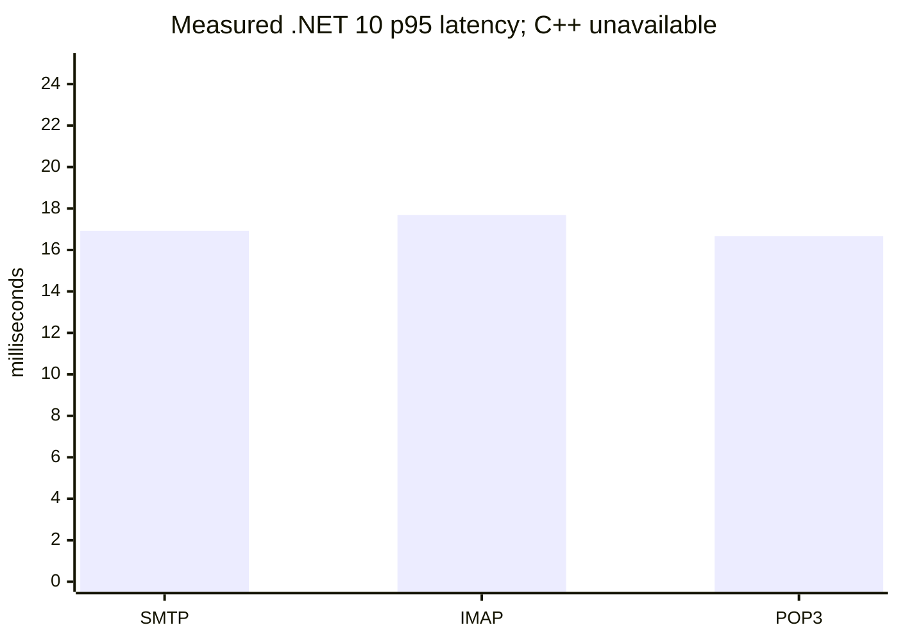

# C++ vs .NET 10 Performance Comparison

## Decision

**RED. No performance winner or speed-up ratio is valid.** Both sides used the
same disposable SQL database shape, 1,000-message Data corpus, loopback host,
and protocol ports. The .NET 10 process completed the protocol matrix. The C++
process did not become ready, so no C++ latency sample exists.

Run date: 2026-08-26  11:11 to 11:13 UTC
Host: Windows 11 Pro build 26200, x64
Loopback: `127.0.0.1`
Ports: SMTP `2525`, IMAP `1143`, POP3 `25110`
SQL: `hmail_perf_pair_cpp_20260825_143100` and `hmail_perf_pair_net10_20260825_143100`
Corpus: 1,000 identical disposable message files

## Measured protocol results

| Scenario | .NET 10 | C++ | Ratio |
| --- | --- | --- | --- |
| SMTP greeting/EHLO/QUIT | 25/25, p50 0.733 ms, p95 16.928 ms, p99 50.800 ms | 0/0, no listener | invalid |
| IMAP login/select/search/sort/logout | 25/25, p50 11.745 ms, p95 17.691 ms, p99 157.739 ms | 0/0, no listener | invalid |
| POP3 login/stat/list/quit | 25/25, p50 13.243 ms, p95 16.670 ms, p99 25.124 ms | 0/0, no listener | invalid |

```mermaid
xychart-beta
    title "Protocol completion count"
    x-axis [SMTP, IMAP, POP3]
    y-axis "successful iterations" 0 --> 25
    bar [25, 25, 25]
    bar [0, 0, 0]
```





The first series is .NET 10 and the second is C++. The C++ zeroes mean
unavailable samples, not zero latency or a performance result.

## C++ blocker evidence

The C++ executable was `C:\hmail-perf-pair-codex-20260825_1600\cpp\Bin\hMailServer.exe`
with SHA-256
`41816E05CEAF55BF0E8B6A5F82FDA49F503F263B3BFB2C208447569FF505D1D3`.
The isolation preflight passed after the verified stale test registration was
removed. The bounded `/Debug` startup probe still opened zero listeners on the
three target ports. A separate service-mode start using the exact disposable
fixture binary and `RunAsService` path terminated unexpectedly; Windows Service
Control Manager event `7034` was recorded. The temporary service registration,
CLSID, AppID, and stale install-location values were unregistered and verified
absent afterward. No production service, database, or Data directory was used.

## Reproduction

The .NET measurement was produced by:

```powershell
powershell.exe -NoProfile -ExecutionPolicy Bypass -File .\build\benchmark-net10-live-protocol.ps1 -Implementation net10 -Iterations 25 -BenchmarkStagingRoot C:\hmail-perf-pair-codex-20260825_1600\net10 -BenchmarkDatabase hmail_perf_pair_net10_20260825_143100 -BenchmarkServiceExecutable .\hmailserver\source\Server.Net10\src\HMailServer.Service\bin\Debug\net10.0-windows\hMailServer.exe -OutputDirectory .\artifacts\benchmarks\paired-cpp-net10-20260826\net10
```

The C++ run used the same fixture binary and `/Debug` argument, with the safety
preflight and target-port ownership checks applied. Raw JSON and CSV are stored
beside this report. The release performance gate remains RED until C++ becomes
ready and the identical protocol, acceptance, concurrency, queue, mailbox,
and soak workloads complete on both implementations.
