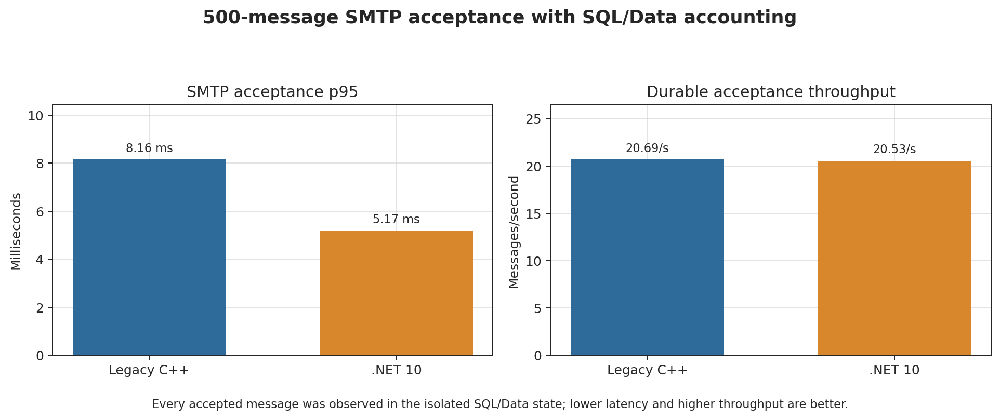
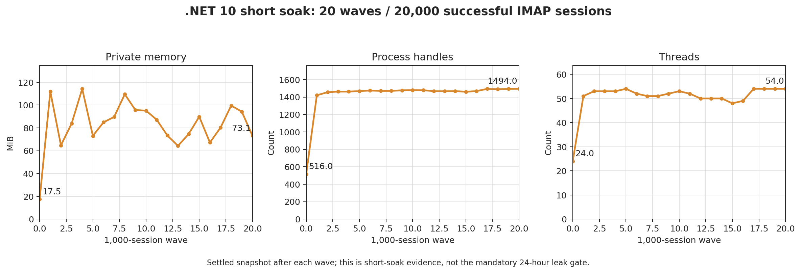

# Legacy C++ vs .NET 10 Performance Comparison

**Tested source commit:** `a3c0cb86725a5dca693a233407e4e9e7a8ce324e`
**Decision:** paired loopback protocol/load evidence is complete; the overall performance release gate remains **RED**.

## Technical Summary

A clean, repository-built legacy C++ Release binary and the .NET 10 Release binary were run sequentially on the same host and SQL Server instance. Both used the same 1,000-message logical corpus, byte-identical Data copies, loopback bindings, accounts, credentials, and protocol commands. The legacy runtime correctly remained on database schema 5708; only the Net10 copy was upgraded to schema 6000.

Net10 reduced p95 SMTP command latency by `5.67x` and p95 IMAP SEARCH/SORT latency by `9.16x`. POP3 p95 regressed by `8.39x`. Net10 passed 1,000/1,000 concurrent IMAP sessions; legacy C++ completed only `689/1000` and failed that gate.

Both implementations durably accepted 500/500 SMTP messages with exact +500 SQL rows and +500 Data files. Net10 p95 acceptance latency was `5.17 ms` versus `8.16 ms`; end-to-end durable throughput was effectively tied (`20.53` vs `20.69` messages/s).

## Key Findings

| Scenario | Legacy C++ p95 ms | .NET 10 p95 ms | Comparison |
| --- | ---: | ---: | --- |
| SMTP | 3.92 | 0.69 | Net10 5.67x faster |
| IMAP | 159.65 | 17.43 | Net10 9.16x faster |
| POP3 | 2.74 | 23.02 | Net10 8.39x slower |

| Concurrent sessions | Legacy C++ | C++ p95 ms | .NET 10 | Net10 p95 ms | Valid comparison |
| ---: | --- | ---: | --- | ---: | --- |
| 100 | PASS (100/100) | 5541.65 | PASS (100/100) | 1568.69 | Net10 3.53x faster |
| 500 | PASS (500/500) | 24139.88 | PASS (500/500) | 2604.84 | Net10 9.27x faster |
| 1000 | FAIL (689/1000) | 34410.45 | PASS (1000/1000) | 4130.10 | N/A: one or both acceptance artifacts failed |

| Metric | Legacy C++ | .NET 10 | Result |
| --- | ---: | ---: | --- |
| Accepted messages | 500/500 | 500/500 | Both PASS |
| p95 latency | 8.16 ms | 5.17 ms | Net10 1.58x faster |
| Durable throughput | 20.692/s | 20.532/s | Net10 1.01x lower |
| SQL/Data delta | +500 / +500 | +500 / +500 | Exact accounting |

The short soak completed `20,000/20,000` sessions with zero errors across 20 waves. Settled private memory moved from `111.91 MiB` after wave 1 to `73.09 MiB` after wave 20. Handles moved from `1420` to `1494`; only a 24-hour service soak can determine whether long-run resource growth stays bounded.

## Scope And Fixture

| Item | Evidence |
| --- | --- |
| Legacy build | Release x64, SHA-256 `2DE1AA51367268CECA019365B14AF7237EA00AAED1360C6793BA381879E3E9B1`, post-build registration disabled |
| Net10 build | Release x64, SDK 10.0.301, SHA-256 `0CBF729F8DB891ABA7320AC4B88BB40F54DCDBD2C010F7DB6CF6EA673EE5C004` |
| SQL versions | C++ `5708`; Net10 `6000` |
| Logical message parity | 1000 rows, SHA-256 `5136EEC556F9790732AE759EF52F77FE6172329EA55787A80300C4A824107E46` |
| Data parity | 1000 files / 209679 bytes, SHA-256 `45FA907CE0D3797C1E13EBB2F03F076A25656CCE27E801C18F745ACD3944FBBD` |
| Host | Microsoft Windows 11 Pro build 26200; 11th Gen Intel(R) Core(TM) i7-11800H @ 2.30GHz; 15.71 GiB RAM |
| SQL Server | 16.0.1190.2|RTM|Developer Edition (64-bit) |
| Network | 127.0.0.1; SMTP 2525, IMAP 1143, POP3 25110 |
| Power plan | Balanced |

## Methodology

1. Build legacy C++ and Net10 from the same Git commit in Release x64.
2. Restore the same legacy 5708 backup twice; retain 5708 for C++ and run only the checked-in 5708-to-6000 upgrade against Net10.
3. Rewrite only disposable message paths and prove exact Data and normalized SQL message fingerprints.
4. Run each implementation separately on the same loopback ports. Protocol tests execute SMTP EHLO/QUIT, authenticated IMAP SELECT/SEARCH TEXT/SORT/LOGOUT, and authenticated POP3 STAT/LIST/QUIT.
5. Run synchronized IMAP waves at 100, 500, and 1,000 sessions with a 30-second socket-operation timeout and five-second settled process snapshots.
6. Run 500 SMTP deliveries last and require accepted-message visibility plus SQL/Data before/after accounting.
7. Run a Net10-only 20-wave, 20,000-session short soak in one process and record settled memory, handles, and threads after every wave.

## Limitations And Gate Decision

- **Overall performance release gate: RED.** This report closes the previously missing clean legacy startup and paired loopback comparison, not the entire release benchmark matrix.
- C++ requires schema 5708 and Net10 requires 6000. Logical message rows and Data bytes are exact; physical SQL files are intentionally not identical.
- Measurements are from one laptop, one SQL Server instance, Balanced power mode, and loopback networking. They are not a capacity-planning baseline.
- Legacy C++ failed the 1,000-session wave, so no C++/Net10 latency or throughput ratio is published at that load.
- POP3 is materially slower in Net10 and remains an optimization target.
- The 20,000-session run is short-soak evidence only. Mandatory 24-hour memory/handle/thread/socket soak remains open.
- Remote SMTP delivery/retry, delivery queue throughput, TLS/DNS, external fetch, rules/scripting, backup/restore timing, and installer/service/COM lifecycle benchmarks remain open.

## Reproduction

The commandable harness is in `build/build-disposable-legacy-server.ps1`, `build/provision-paired-benchmark-fixture.ps1`, `build/benchmark-net10-live-protocol.ps1`, `build/benchmark-net10-live-concurrent-imap.ps1`, and `build/benchmark-net10-live-smtp-acceptance.ps1`. Each script refuses non-disposable database/root names and leaves production COM/DCOM/service state untouched.

Machine-readable summaries and sanitized samples are stored beside this report. The original local fixture paths are intentionally omitted from committed artifacts.
