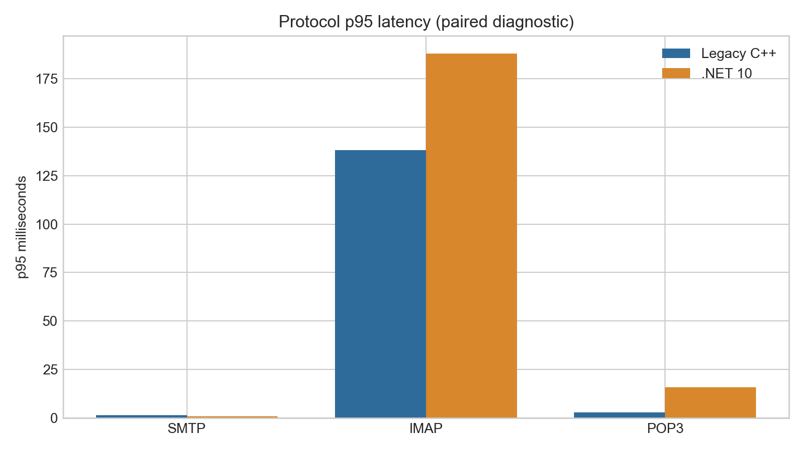
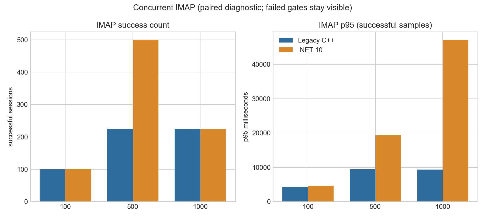
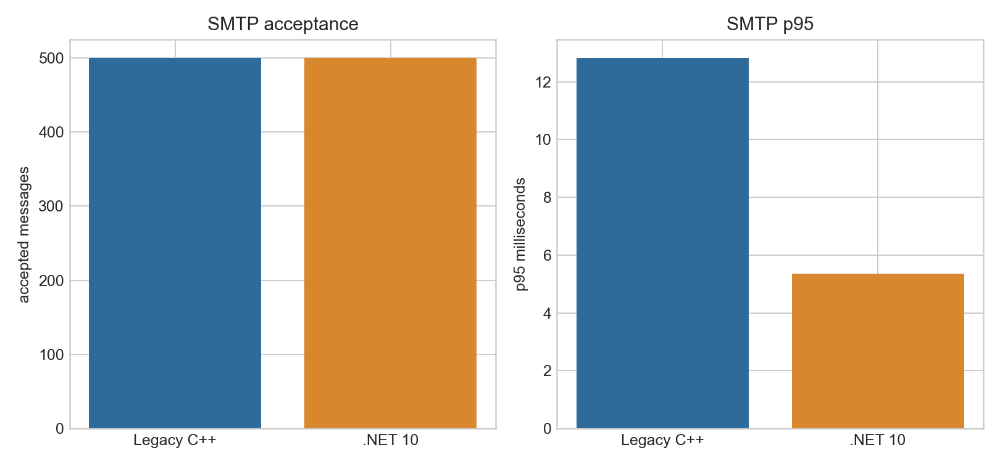

# Current C++ vs .NET 10 Performance Diagnostic

**Decision: RED.** This is a paired diagnostic report, not a release acceptance report. Ratios are emitted only for scenarios where both implementations passed.

Fixture: `hmail-perf-pair-head2-20260831`; source commit: `b00eb7e5231908cef94a281e639e3b2d35bf76ca`; C++ build hash: `9B426FBD0222D6E651240849832819AA67B7045A3593940DF1EA32890845F209`.

## Protocol

| Scenario | C++ | .NET 10 | p95 ratio (C++/.NET 10) |
| --- | --- | --- | ---: |
| SMTP | 200 success, p95 1.421 ms | 200 success, p95 0.979 ms | 1.451481 |
| IMAP | 200 success, p95 138.237 ms | 200 success, p95 187.811 ms | 0.736043 |
| POP3 | 200 success, p95 2.967 ms | 200 success, p95 15.752 ms | 0.188357 |

## Concurrent IMAP

| Sessions | C++ | .NET 10 | Ratio |
| ---: | --- | --- | --- |
| 100 | 100/100 (PASS) | 100/100 (PASS) | 0.912319 |
| 500 | 225/500 (FAIL) | 500/500 (PASS) | invalid |
| 1000 | 225/1000 (FAIL) | 224/1000 (FAIL) | invalid |

## SMTP

| Implementation | Accepted | p95 ms | Throughput/s |
| --- | ---: | ---: | ---: |
| cpp | 500/500 (PASS) | 12.827 | 19.393 |
| net10 | 500/500 (PASS) | 5.359 | 20.097 |

## Gate Limitations

- No concurrent IMAP winner or speed-up ratio is valid at 500 or 1,000 because one or both sides failed.
- The C++ executable is a disposable standalone `/Debug` process; installed service and out-of-process COM lifecycle evidence remain open.
- The workload corpus has 1,000 messages, not the required 100,000-message mailbox.
- 24-hour soak, POP3 large-mailbox soak, remote delivery/retry, queue, backup/restore timing, installer, and COM lifecycle gates remain open.

Raw JSON/CSV and charts are generated from the same manifest-bound disposable fixture. Production SQL, Data, service, COM registration, and DCOM permissions were not used or changed.
