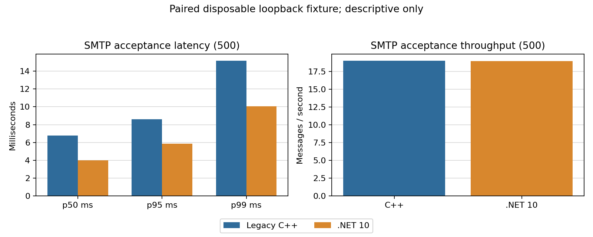

# Paired C++ / .NET 10 SMTP acceptance, 500 messages

Status: **PASS** for the bounded disposable loopback cell. The performance
release gate remains **RED**.

Fixture `hmail-perf-pair-delivery-20260901`, manifest SHA-256
`A83052CA61D7F3853E97522D3F72DDA595DB61811511435D3030E4E230E8B07E`, SQL/Data
fingerprints matched, and both implementations used loopback SMTP port 2525.

| Implementation | Accepted | Errors | p50 ms | p95 ms | p99 ms | Throughput/s |
| --- | ---: | ---: | ---: | ---: | ---: | ---: |
| Legacy C++ | 500 | 0 | 6.793 | 8.605 | 15.162 | 19.010 |
| .NET 10 | 500 | 0 | 3.976 | 5.875 | 10.052 | 18.934 |

The ratios are descriptive for this single cell: C++/Net10 p95 `1.465` and
Net10/C++ throughput `0.996`. They are not a general speed-up claim. Queue
throughput, remote retry matrix, POP3 soak, 1,000-session IMAP capacity, and
24-hour leak acceptance remain open.
