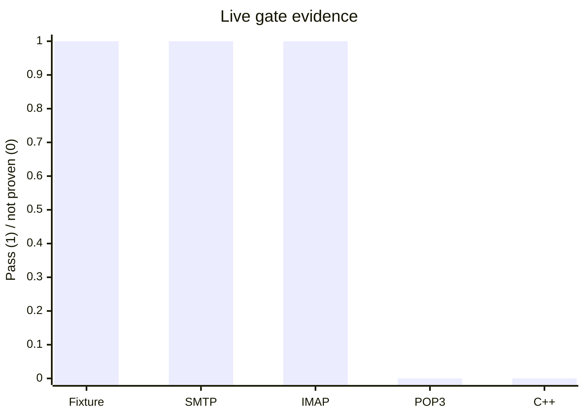

# C++ / .NET 10 Performance Gate Report

Date: 2026-08-11
Code/test commit: `cb65ea9a6`
Decision: **RED**

## Executive Result

The SQL/Data/message fixture is now equivalent at the start of the run:

- disposable databases: `hmail_perf_pair_cpp_20260811_1748` and `hmail_perf_pair_net10_20260811_1748`
- Data roots: `C:\hmail-perf-pair-20260811_1748\cpp\Data` and `C:\hmail-perf-pair-20260811_1748\net10\Data`
- 1,000 identical message files, identical SHA-256 corpus
- 37 tables and identical row counts on both sides
- active `perf.test` domain, `test@perf.test` account, Inbox, and three loopback ports
- SQL Full-Text service, catalog, search-document table, and index present on both sides
- SMTP `2525`, IMAP `1143`, POP3 `25110`, all bound to `127.0.0.1`

Evidence: `artifacts/benchmarks/live-cpp-net10-20260811/shared-baseline-pair-20260811_1748-final2/paired-shared-baseline.json`.

The .NET 10 listener was measured against this fixture. The legacy C++ process was **not** launched: the read-only preflight found the installed Registry32 path and `/Debug` startup would write the installed AppID registration. Therefore no C++ latency, throughput, ratio, regression, or winner is reported.

## Measured .NET 10 Results

| Scenario | Result | p50 | p95 | p99 | Throughput |
| --- | --- | ---: | ---: | ---: | ---: |
| SMTP acceptance, 25 messages | PASS, 25/25 | 17.573 ms | 76.988 ms | 320.452 ms | 4.170 msg/s |
| SMTP protocol, 25 sessions | PASS, 25/25 | 0.862 ms | 1.404 ms | 17.935 ms | n/a |
| IMAP protocol, 25 sessions | PASS, 25/25 | 13.609 ms | 22.084 ms | 445.018 ms | n/a |
| IMAP, 1,000 concurrent sessions | PASS, 1000/1000 | 2850.032 ms | 3984.891 ms | 4023.059 ms | 75.354 sessions/s |
| POP3 protocol, 25 sessions | FAIL in sequential harness | n/a | n/a | n/a | n/a |

The POP3 listener returned a banner in an isolated socket check and after a manually reproduced SMTP/IMAP sequence, but the automated sequential protocol runner received connection resets for all 25 POP3 samples. This is an unresolved acceptance/harness issue, not a PASS.

## Charts

These charts show measured .NET 10 values only. They are deliberately not C++ comparison charts.

```mermaid
xychart-beta
    title "Net10 live latency percentiles"
    x-axis [SMTP, IMAP, IMAP-1000]
    y-axis "Milliseconds" 0 --> 4200
    bar [17.573, 13.609, 2850.032]
    bar [76.988, 22.084, 3984.891]
    bar [320.452, 445.018, 4023.059]
```



Legend, in order: p50, p95, p99. SMTP acceptance is a message transaction; the other two rows are protocol/session scenarios.



## Legacy Anchors and Net10 Symbols

Legacy SMTP acceptance is anchored by `SMTPConnection::HandleSMTPFinalizationTaskCompleted_` (`hmailserver/source/Server/SMTP/SMTPConnection.cpp:980`), `PersistentMessage::AddObject`, `SaveRecipients_`, and the `hm_messages`/`hm_messagerecipients` schema in `hmailserver/source/DBScripts/CreateTablesMSSQL.sql:258-353`.

Legacy listener startup is anchored by `IOService::DoWork` and `TCPServer::Run`/`HandleAccept` (`hmailserver/source/Server/Common/TCPIP/IOService.cpp:65-134`, `hmailserver/source/Server/Common/TCPIP/TCPServer.cpp:51-226`). Legacy POP3 banner behavior is `POP3Connection::OnConnected`/`SendBanner_` (`hmailserver/source/Server/POP3/POP3Connection.cpp`). The .NET paths are `SqlServerSmtpQueueWriter`, `SmtpSession`, `ImapTcpListener`, `Pop3TcpListener`, and `Pop3Session`.

The disposable SQL diagnostic also exposed and provisioned the exact legacy `hm_rule_criterias` DDL from `CreateTablesMSSQL.sql:485-499`; this was applied only to the two disposable pair databases so the SQL schema remained identical.

## Acceptance Gaps

1. A registry-isolated C++ installation or VM is required before any C++ process can run safely.
2. The POP3 sequential protocol runner requires independent diagnosis and a green repeatable run.
3. C++/.NET 10 SMTP, IMAP, POP3, delivery, queue, and equal-load measurements are still absent as a pair.
4. SQL Full-Text is installed and structurally ready, but live FTS query acceptance and equivalent C++ query measurements remain open.
5. Delivery throughput/retry, POP3 large-mailbox soak, external-fetch soak, service restart/COM lifecycle, and 24-hour leak soak remain unexecuted.

## Reproduction Commands

```powershell
powershell.exe -NoProfile -ExecutionPolicy Bypass -File .\build\collect-live-equivalence-evidence.ps1 `
  -CppDatabase hmail_perf_pair_cpp_20260811_1748 `
  -Net10Database hmail_perf_pair_net10_20260811_1748 `
  -CppDataRoot C:\hmail-perf-pair-20260811_1748\cpp\Data `
  -Net10DataRoot C:\hmail-perf-pair-20260811_1748\net10\Data `
  -BackupPath C:\hmail-perf-cpp-ascii-20260810\Database\baseline-20260811.bak `
  -OutputDirectory .\artifacts\benchmarks\live-cpp-net10-20260811\shared-baseline-pair-20260811_1748-final2

powershell.exe -NoProfile -ExecutionPolicy Bypass -File .\build\benchmark-net10-live-smtp-acceptance.ps1 `
  -Implementation net10 -MessageCount 25 `
  -BenchmarkStagingRoot C:\hmail-perf-pair-20260811_1748\net10 `
  -BenchmarkDatabase hmail_perf_pair_net10_20260811_1748

powershell.exe -NoProfile -ExecutionPolicy Bypass -File .\build\benchmark-net10-live-concurrent-imap.ps1 `
  -Implementation net10 -Concurrency 1000 `
  -BenchmarkStagingRoot C:\hmail-perf-pair-20260811_1748\net10 `
  -BenchmarkDatabase hmail_perf_pair_net10_20260811_1748
```

No production service, production database/Data directory, installed COM identity, DCOM ACL, or public listener was changed.
