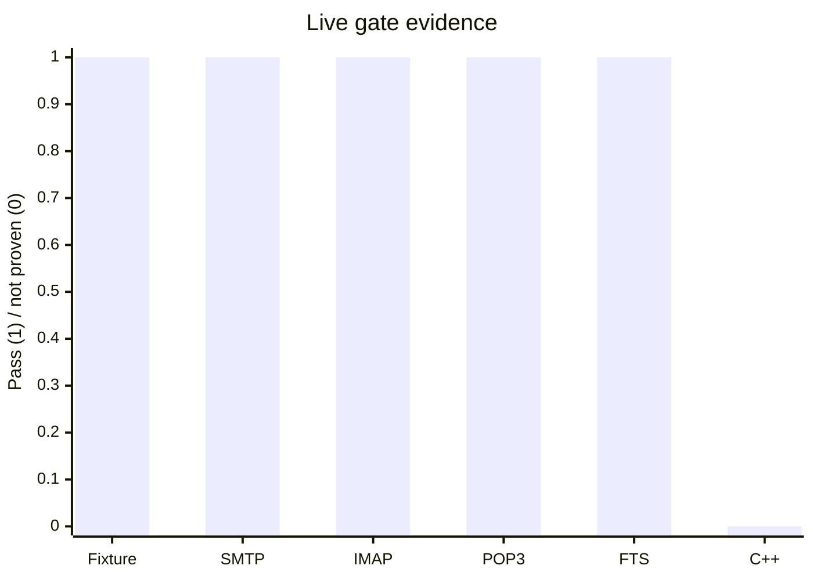

# C++ / .NET 10 Performance Gate Report

Date: 2026-08-11
Measurement harness commit: `2737ff625`; current parity HEAD: `d569a0780`
Decision: **RED**

## Latest Verification

The paired fixture remains valid at start state. The v2 final2 collector
validation passed for equal SQL row counts and equal Data SHA-256. A fresh
read-only C++ preflight was run against the disposable copy and refused to
launch because the installed Registry32 path is
`C:\hMailServer57-Test\Bin`, while the target is
`C:\hmail-perf-cpp-ascii-20260810\Bin`. No C++ process was started and no
registry, service, production database/Data directory, COM registration, or
port was changed. Fresh refusal evidence is in
`artifacts/benchmarks/live-cpp-net10-20260811/cpp-preflight-current/`.

This confirms the existing RED decision; it does not create a performance
ratio. The Net10 measurements below are valid Net10-only observations from
the disposable fixture and must not be read as C++ comparisons.

## Executive Result

The SQL/Data/message fixture is now equivalent at the start of the run:

- disposable databases: `hmail_perf_pair_cpp_20260811_1748` and `hmail_perf_pair_net10_20260811_1748`
- Data roots: `C:\hmail-perf-pair-20260811_1748\cpp\Data` and `C:\hmail-perf-pair-20260811_1748\net10\Data`
- 1,000 identical message files, identical SHA-256 corpus
- 37 tables and identical row counts on both sides
- active `perf.test` domain, `test@perf.test` account, Inbox, and three loopback ports
- SQL Full-Text service, catalog, search-document table, and index present on both sides
- SMTP `2525`, IMAP `1143`, POP3 `25110`, all bound to `127.0.0.1`

Evidence: `artifacts/benchmarks/live-cpp-net10-20260811/shared-baseline-pair-20260811_1748-after-protocol-soak-300/paired-shared-baseline.json`.

The .NET 10 listener was measured against this fixture. The legacy C++ process was **not** launched: the read-only preflight found the installed Registry32 path and `/Debug` startup would write the installed AppID registration. Therefore no C++ latency, throughput, ratio, regression, or winner is reported.

## Measured .NET 10 Results

| Scenario | Result | p50 | p95 | p99 | Throughput |
| --- | --- | ---: | ---: | ---: | ---: |
| SMTP acceptance, 25 messages | PASS, 25/25 | 5.235 ms | 21.270 ms | 198.446 ms | 6.505 msg/s |
| SMTP protocol, 25 sessions | PASS, 25/25 | 0.677 ms | 1.194 ms | 16.073 ms | n/a |
| IMAP protocol, 25 sessions | PASS, 25/25 | 9.415 ms | 13.701 ms | 207.027 ms | n/a |
| POP3 protocol, 25 sessions | PASS, 25/25 | 12.258 ms | 20.972 ms | 29.862 ms | n/a |
| IMAP, 1,000 concurrent sessions | PASS, 1000/1000 | 2506.190 ms | 3611.596 ms | 3720.543 ms | 79.045 sessions/s |
| IMAP `SEARCH TEXT needle`, 25 sessions | PASS, 25/25 | 7.900 ms | 12.802 ms | 21.557 ms | n/a |
| Local delivery, 50 queue messages | PASS, 50/50 | 4.376 ms | 8.405 ms | 48.484 ms | 73.308 msg/s |
| POP3 large mailbox, 1,000 messages | PASS, 5/5 | 54.757 ms | 290.599 ms | 333.589 ms | n/a |

The corrected protocol runner also completed a bounded Net10 resource run with
300 SMTP, 300 IMAP, and 300 POP3 sessions (`900/900`, zero errors). Its p95
latencies were `0.889/13.369/14.791 ms`; the launched process changed by
`+22,581,248` private bytes, `+144` handles, and `+2` threads. Readiness and
shutdown failures were zero. This is a short observation window, not the
required 24-hour leak gate.

The initial POP3 run exposed a production bug in `SqlServerPop3MailboxStore.ListMessagesAsync`: `SequentialAccess` requires ordinal 0 to be read before ordinal 1. After the one-line read-order fix, the isolated SQL diagnostic passed and the updated Release host passed POP3 25/25. The focused diagnostic is opt-in and uses only the disposable pair.

The live FTS acceptance prepared all 1,000 documents through the Net10
`MessageSearchBackfillProcessor` and `MessageFileSearchDocumentSource`, then
issued the IMAP command over `127.0.0.1:1143`. Every session returned 1,000
`needle` matches. The search document and queue tables were cleared and
`MessageIndexing` was disabled after the run.

The live delivery acceptance used the real SQL queue writer, lease/message/
recipient stores, local delivery store, and queue processor against the Net10
side of the disposable pair. It verified that every queue message was copied
to the fixture Inbox and that the queue source was completed and removed. A
controlled transient remote target then verified the retry/defer persistence
without opening a network connection: one queue row remained unlocked with
retry count 1, a future `messagenexttrytime`, null lease owner, and its
recipient retained. The SQL Inbox lookup was changed from `LOWER` to
`UPPER(...)=N'INBOX'` because the pair uses a Turkish collation; this preserves
the legacy Inbox contract and is covered by focused SQL and live tests.

The POP3 large-mailbox acceptance used the real loopback listener on
`127.0.0.1:25110` and required `STAT`, full `LIST`, full `UIDL`, and a
dot-terminated `RETR 1` response for all five sessions. The SQL mailbox row
count remained 1,000/1,000 after shutdown. This closes the Net10 large-mailbox
read/list/stream gate, but is not a C++ comparison or a long-duration soak.

The disposable restart lifecycle passed `2/2` cycles. Each launched
`LiveListenerHost.exe` PID owned all three loopback listeners and served the
expected SMTP/IMAP/POP3 banners; after shutdown, no launched PID retained any
of the three ports. Start-ready p50 was `1636.538 ms` and stop p50 was
`1546.317 ms`. This does not prove Windows service or out-of-process COM
lifecycle because COM local server was disabled.

The disposable external-fetch acceptance ran five real TCP/SQL cycles against
a loopback POP3 fixture. Each cycle leased one due account, downloaded and
accepted ten messages, completed and released the lease, and retained the
current ten UID rows. Total was `50/50` downloaded/accepted; cycle p50/p95/p99
was `23.998/24.229/24.229 ms`. Explicit `127.0.0.0/8` egress policy decisions
were allowed for all five connections. Temporary fetch-account and UID rows
were cleaned to `0/0`; the fake receiver did not persist message files. This
is Net10-only evidence, not C++ parity or a speed-up result.

## Charts

These charts show measured .NET 10 values only. They are deliberately not C++ comparison charts.

```mermaid
xychart-beta
    title "Net10 live latency percentiles"
    x-axis [SMTP, IMAP, POP3, FTS, IMAP-1000]
    y-axis "Milliseconds" 0 --> 4200
    bar [5.235, 9.415, 12.258, 7.900, 2506.190]
    bar [21.270, 13.701, 20.972, 12.802, 3611.596]
    bar [198.446, 207.027, 29.862, 21.557, 3720.543]
```



Legend, in order: p50, p95, p99. SMTP acceptance is a message transaction; the other two rows are protocol/session scenarios.



## Legacy Anchors and Net10 Symbols

Legacy SMTP acceptance is anchored by `SMTPConnection::HandleSMTPFinalizationTaskCompleted_` (`hmailserver/source/Server/SMTP/SMTPConnection.cpp:980`), `PersistentMessage::AddObject`, `SaveRecipients_`, and the `hm_messages`/`hm_messagerecipients` schema in `hmailserver/source/DBScripts/CreateTablesMSSQL.sql:258-353`. Local delivery is anchored by `LocalDelivery::Perform`, `DeliverToLocalAccount_`, and `PersistentMessage::CopyFromQueueToInbox` (`hmailserver/source/Server/SMTP/LocalDelivery.cpp:60-112,270-317`). Retry/defer is anchored by `ExternalDelivery::RescheduleDelivery_`, `GetRetryOptions_`, and `PersistentMessage::SetNextTryTime` (`hmailserver/source/Server/SMTP/ExternalDelivery.cpp:496-688`, `hmailserver/source/Server/Common/Persistence/PersistentMessage.cpp:670-695`). Net10 symbols are `SqlServerSmtpQueueWriter`, `SqlServerDeliveryQueueLeaseStore`, `SqlServerDeliveryQueueMessageStore`, `SqlServerDeliveryQueueRecipientStore`, `SqlServerLocalDeliveryStore`, and `DeliveryQueueProcessor`.

Legacy listener startup is anchored by `IOService::DoWork` and `TCPServer::Run`/`HandleAccept` (`hmailserver/source/Server/Common/TCPIP/IOService.cpp:65-134`, `hmailserver/source/Server/Common/TCPIP/TCPServer.cpp:51-226`). Legacy POP3 banner behavior is `POP3Connection::OnConnected`/`SendBanner_` (`hmailserver/source/Server/POP3/POP3Connection.cpp`). Legacy SEARCH is `IMAPCommandSEARCH::ExecuteCommand` and `MatchesTEXTCriteria_` (`hmailserver/source/Server/IMAP/IMAPCommandSearch.cpp`), which scans the selected folder's message files in memory. The .NET paths are `SqlServerSmtpQueueWriter`, `SmtpSession`, `ImapTcpListener`, `Pop3TcpListener`, `Pop3Session`, `MessageSearchBackfillProcessor`, `MessageFileSearchDocumentSource`, and `SqlServerMessageSearchIndex`.

The disposable SQL diagnostic also exposed and provisioned the exact legacy `hm_rule_criterias` DDL from `CreateTablesMSSQL.sql:485-499`; this was applied only to the two disposable pair databases so the SQL schema remained identical.

## Acceptance Gaps

1. A registry-isolated C++ installation or VM is required before any C++ process can run safely.
2. C++/.NET 10 SMTP, IMAP, POP3, FTS, delivery, queue, and equal-load measurements are still absent as a pair.
3. Remote-delivery throughput/retry comparison, registry-isolated C++ matrix,
   Windows service/out-of-process COM lifecycle, and 24-hour leak soak remain
   unexecuted.

## Reproduction Commands

```powershell
powershell.exe -NoProfile -ExecutionPolicy Bypass -File .\build\collect-live-equivalence-evidence.ps1 `
  -CppDatabase hmail_perf_pair_cpp_20260811_1748 `
  -Net10Database hmail_perf_pair_net10_20260811_1748 `
  -CppDataRoot C:\hmail-perf-pair-20260811_1748\cpp\Data `
  -Net10DataRoot C:\hmail-perf-pair-20260811_1748\net10\Data `
  -BackupPath C:\hmail-perf-cpp-ascii-20260810\Database\baseline-20260811.bak `
  -OutputDirectory .\artifacts\benchmarks\live-cpp-net10-20260811\shared-baseline-pair-20260811_1748-post-pop3-fixed

powershell.exe -NoProfile -ExecutionPolicy Bypass -File .\build\benchmark-net10-live-smtp-acceptance.ps1 `
  -Implementation net10 -MessageCount 25 `
  -BenchmarkStagingRoot C:\hmail-perf-pair-20260811_1748\net10 `
  -BenchmarkDatabase hmail_perf_pair_net10_20260811_1748

powershell.exe -NoProfile -ExecutionPolicy Bypass -File .\build\benchmark-net10-live-concurrent-imap.ps1 `
  -Implementation net10 -Concurrency 1000 `
  -BenchmarkStagingRoot C:\hmail-perf-pair-20260811_1748\net10 `
  -BenchmarkDatabase hmail_perf_pair_net10_20260811_1748

powershell.exe -NoProfile -ExecutionPolicy Bypass -File .\build\benchmark-net10-live-imap-search.ps1 `
  -Iterations 25 `
  -BenchmarkStagingRoot C:\hmail-perf-pair-20260811_1748\net10 `
  -BenchmarkDatabase hmail_perf_pair_net10_20260811_1748

powershell.exe -NoProfile -ExecutionPolicy Bypass -File .\build\benchmark-net10-live-delivery-queue.ps1 `
  -MessageCount 50 `
  -BenchmarkStagingRoot C:\hmail-perf-pair-20260811_1748\net10 `
  -BenchmarkDatabase hmail_perf_pair_net10_20260811_1748

powershell.exe -NoProfile -ExecutionPolicy Bypass -File .\build\benchmark-net10-live-pop3-large-mailbox.ps1 `
  -Iterations 5 `
  -BenchmarkStagingRoot C:\hmail-perf-pair-20260811_1748\net10 `
  -BenchmarkDatabase hmail_perf_pair_net10_20260811_1748

powershell.exe -NoProfile -ExecutionPolicy Bypass -File .\build\benchmark-net10-live-external-fetch.ps1 `
  -BenchmarkDatabase hmail_perf_pair_net10_20260811_1748 `
  -BenchmarkDataRoot C:\hmail-perf-pair-20260811_1748\net10\Data
```

No production service, production database/Data directory, installed COM identity, DCOM ACL, or public listener was changed.
