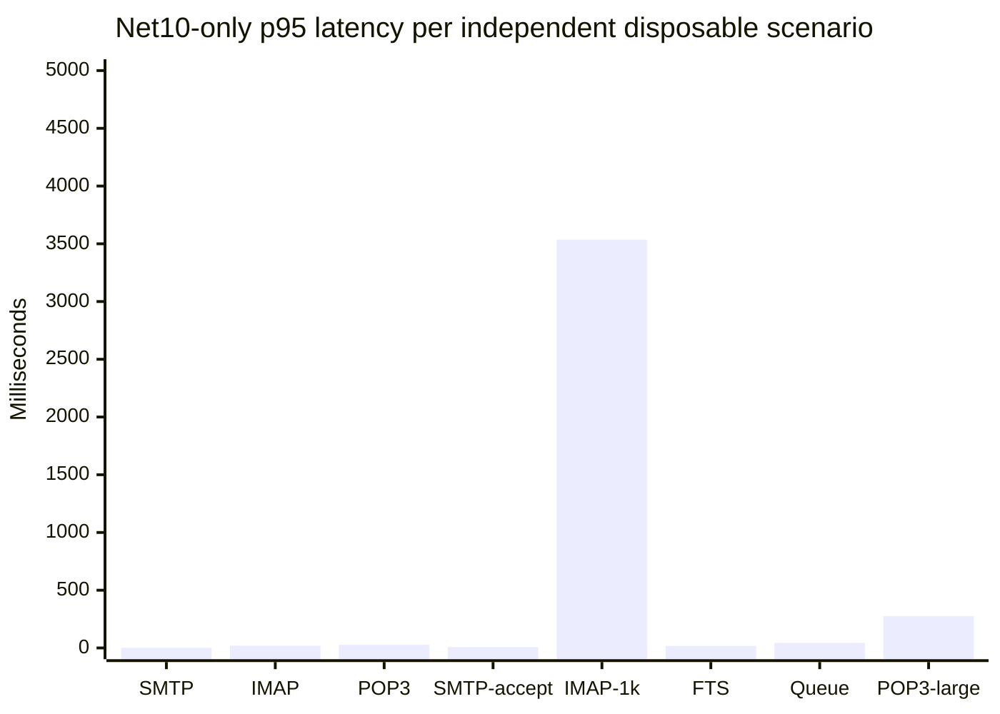
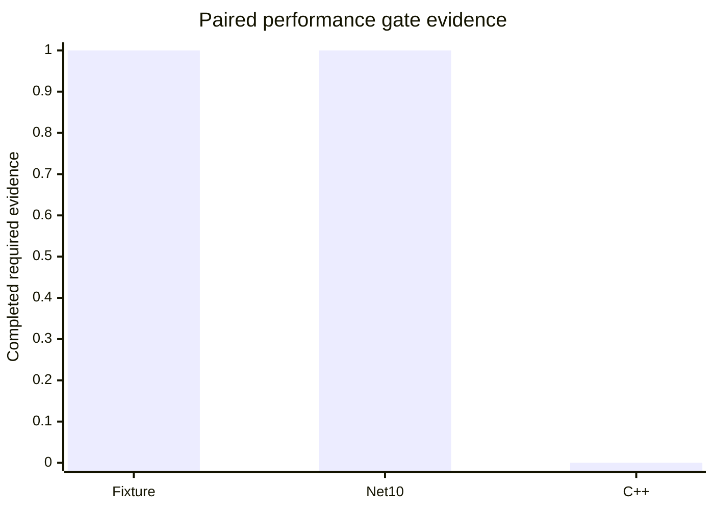
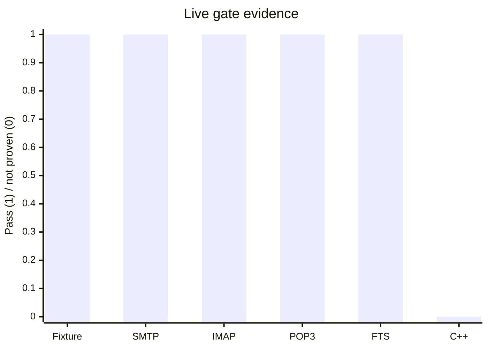

# C++ / .NET 10 Performance Gate Report

## Current Net10 repeated IMAP resource acceptance, 5 x 100 (2026-09-01)

Against the clean manifest-bound 100k disposable SQL/Data fixture, Net10
Admission passed `500/500` sessions across five 100-session waves with zero
errors/timeouts. Settled process growth was `+1.133 MiB`, `+5` handles, and
`-5` threads. The Full profile on the same fixture is retained as a RED
capacity result at `309/500` (`191` errors), not a soak pass. Evidence and the
resource chart are under
`artifacts/benchmarks/review-20260901/net10-imap-admission-100x5-100k/` and
`net10-imap-100x5-100k/`.

This slice has no new C++ run and Net10 was process-backed, so no service-mode
parity, ratio, or winner is claimed. Existing C++ 500/1000 capacity failures
remain unchanged. The performance gate remains **RED**; the next independent
slice is the isolated backup -> restore -> backup semantic round-trip.

## Current Net10 delivery queue diagnostic, 100 messages (2026-09-01)

On a clean manifest-bound 100k disposable SQL/Data fixture, Net10 passed
`100/100` local delivery commits at `81.673` messages/s, with p50/p95/p99
`4.193/6.362/10.396 ms`. SQL readback proved the bounded retry contract:
one type-1 row, unlocked and without a lease owner, retry count `1`, future
next-try, and one retained recipient. Evidence is under
`artifacts/benchmarks/review-20260901/net10-delivery-queue-100/`.

No equivalent legacy C++ queue runner exists in the benchmark pack and this
Net10 run was not service-backed. It is therefore not a paired performance
comparison and does not establish a winner. The performance gate remains
**RED**; repeated-wave IMAP/resource acceptance is next.

## Current paired SMTP acceptance, 500 messages (2026-09-01)

The disposable C++ service and Net10 each accepted `500/500` messages with
zero errors on the same manifest-bound SQL/Data fixture and loopback SMTP
port. Local-delivery readback was exact on both sides. C++ p50/p95/p99 were
`6.793/8.605/15.162 ms` at `19.010` messages/s; Net10 was
`3.976/5.875/10.052 ms` at `18.934` messages/s. The p95 and throughput ratios
are descriptive for this one cell. The release gate remains **RED** because
queue/remote-delivery, 1,000-session IMAP, POP3 soak, and 24-hour resource
acceptance remain open. Evidence and chart:
`artifacts/benchmarks/paired-cpp-net10-20260901-delivery/smtp-acceptance-500-comparison.md`.
The readback runner leaves accepted rows/files for accounting, so this fixture
is consumed and must not be reused as a clean baseline.

## Current paired TCP 451 recovery (2026-09-01)

Code/test commit `b4319db45` proved the same disposable C++ service and Net10
retry-recovery sequence against one loopback sink: RCPT `451` retained the
type-1 queue row, recipient, retry count `1`, and Data file without DATA; a
later RCPT `250` accepted DATA and removed all three. Both implementations and
the disposable C++ service cleanup passed. Evidence is under
`artifacts/benchmarks/paired-cpp-net10-20260901-delivery/cpp-tcp451-recovery/`
and `net10-tcp451-recovery.*`. This is a bounded correctness cell, not a
throughput or soak result; the release gate remains **RED**.

## Current paired TCP 451 retry-state evidence (2026-09-01)

Code/test commit `c1055f349` exercised the disposable C++ service and Net10
against the same controlled loopback sink protocol. Both received RCPT `451`
and proved no DATA, a retained type-1 queue row, unlocked/cleared lease,
retry count `1`, one retained recipient, retained Data file, and complete
cleanup. This is bounded correctness evidence, not retry recovery or a timing
comparison; the release gate remains **RED**. Evidence is under
`artifacts/benchmarks/paired-cpp-net10-20260901-delivery/cpp-tcp451-retry/`.

## Current Net10 TCP 451 retry-state evidence (2026-09-01)

The disposable Net10 component test passed a real loopback TCP `451` through
remote delivery and SQL queue deferral. It proved type-1 retention, unlocked
lease, retry count `1`, future next-try, retained recipient, and no DATA. It
does not provide paired C++ evidence or a performance result; the gate remains
**RED**. Evidence is under
`artifacts/benchmarks/paired-cpp-net10-20260901-delivery/net10-tcp451-retry.*`.

## Current paired SMTP local-delivery readback (2026-09-01)

The real disposable C++ service and Net10 service each accepted 25/25 SMTP
messages on the same isolated SQL/Data manifest and proved 25 type-2 Inbox
rows, 25 Data files, and zero recipient rows. C++ p50/p95/p99 were
`6.845/10.835/46.054 ms` at `18.706` messages/s; Net10 was
`5.336/29.166/67.014 ms` at `18.099`. This is a bounded correctness/timing
cell only. Evidence is under
`artifacts/benchmarks/paired-cpp-net10-20260901-delivery/`; the release gate
remains **RED** pending retry/defer, larger delivery/queue, capacity, restore,
installer/COM, and soak acceptance.

## Current paired 100k acceptance (2026-09-01)

Code/test commit `434dac735` completed the first valid service-backed paired
100,000-message IMAP SEARCH/SORT acceptance. Both implementations used the
same manifest-bound SQL/Data fixture, SQL Server, loopback `127.0.0.1:1143`,
and `Full` profile. Both passed exact SEARCH and SORT validation:

| Implementation | Result | p50 ms | p95 ms | p99 ms | Throughput/s |
| --- | --- | ---: | ---: | ---: | ---: |
| Legacy C++ service | 100000/100000 PASS | 15849.605 | 15849.605 | 15849.605 | 0.063 |
| .NET 10 | 100000/100000 PASS | 846.875 | 846.875 | 846.875 | 1.170 |

Fixture manifest SHA-256:
`DE4DA2CDCDA01B1BE6D8C9BC98A377167205E940722D2BBCEE98A15A16ACB23A`.
Each side had exactly 100,000 SQL messages and 100,000 byte-matched Data
files. The single-session p50 ratio is `18.715` C++/Net10 and is descriptive
only; it is not a general speedup or winner claim. Compact CSV, Markdown, and
SVG evidence is under
`artifacts/benchmarks/paired-cpp-net10-20260901-100k/`.

Decision: **RED**. C++ 500/1000-session capacity, larger SMTP/delivery/queue,
backup/restore timing, installer/COM lifecycle, and 24-hour resource-leak
acceptance remain open.

## Current diagnostic refresh (2026-08-21)

The latest offline synthetic 100k-message SEARCH/SORT benchmark passed with
`9091/9091` matches and p50/p95/p99 `8.725/9.426/9.614 ms`. Evidence is under
`artifacts/benchmarks/offline-net10-current-b89fb81f2/`; its JSON records the
benchmark source commit `b89fb81f24a3fc343b7fbe6885e21c2e4976ed2d`.

This does not alter the paired gate: the C++ process has not run in a
registry-isolated environment, so no ratio, speedup, regression percentage, or
winner is valid. Performance remains **RED**.

## Current authoritative rerun (2026-08-14)

Repository code HEAD: `9722dfac199fdcb7db900e6f97047146be2feeda`.
Decision: **RED**. No C++/.NET 10 ratio, speed-up, regression percentage, or
winner is claimed.

The disposable fixture provisioner is now `build/provision-paired-benchmark-fixture.ps1`.
It restores the approved SQL backup into two new disposable databases, copies
the same 1,000-message Data tree to both sides, rewrites message filenames to
the new Data roots, and emits isolated C++/Net10 INI roots. Each mutating
workload below used its own fresh pair; no production service, database, Data
directory, COM registration, DCOM ACL, or public listener was used.

| Scenario | Net10 result | p50 | p95 | p99 | Throughput | C++ launch |
| --- | --- | ---: | ---: | ---: | ---: | --- |
| SMTP/IMAP/POP3 protocol, 25 each | 75/75 | 0.724 / 12.463 / 17.781 ms | 1.330 / 19.775 / 27.875 ms | 18.543 / 424.364 / 36.395 ms | n/a | refused preflight |
| SMTP message acceptance, 25 | 25/25 | 5.995 ms | 7.031 ms | 198.675 ms | 4.469 msg/s | refused preflight |
| IMAP concurrent, 1,000 | 1000/1000 | 2610.928 ms | 3536.025 ms | 3585.298 ms | 77.040 sessions/s | refused preflight |
| IMAP FTS SEARCH, 25 | 25/25 | 6.903 ms search | 17.852 ms search | 24.119 ms search | n/a | refused preflight |
| Local delivery queue, 50 | 50/50 | 5.267 ms | 43.910 ms | 126.114 ms | 34.820 msg/s | refused preflight |
| POP3 large mailbox, 1,000 messages, 5 | 5/5 | 61.354 ms | 275.177 ms | 313.342 ms | n/a | refused preflight |



The legacy C++ executable was not started in any scenario. Its `_tWinMain`
unconditionally calls `RegisterAppID()` before `/Debug`, while this host's
Registry32 `HKLM\SOFTWARE\hMailServer\InstallLocation` resolves to
`C:\hMailServer57-Test`, not the disposable C++ root. The six matching
preflight records under
`artifacts/benchmarks/live-cpp-net10-20260814/cpp-preflight-fresh-041500.json`
and the matching matrix all show
`launchAttempted=false`. This is a safety refusal, not a C++ performance
result. A registry-isolated C++ staging VM/install is still required.

Evidence:

- Start-state equivalence: `artifacts/benchmarks/live-cpp-net10-20260814/shared-baseline-041500/`
- Net10 independent scenarios: `artifacts/benchmarks/live-cpp-net10-20260814/fresh-net10-*/`
- Queue fresh-pair evidence: `artifacts/benchmarks/live-cpp-net10-20260814/shared-baseline-041700/`
- C++ preflight: `artifacts/benchmarks/live-cpp-net10-20260814/cpp-preflight-fresh-041500.json`
- Full Net10 Debug: `2313 passed, 57 skipped, 0 failed`

The performance release gate remains **RED**. The current evidence proves
bounded Net10 behavior and safe refusal of an unsafe C++ launch. It does not
prove C++/.NET 10 performance parity, 24-hour leak freedom, live 100k SQL
mailbox SEARCH/SORT, remote-delivery comparison, or release readiness.

## Current verification (2026-08-14)

Code/test HEAD: `3383b0847`. The disposable paired start state remains
validated by the 2026-08-13 evidence: 37 SQL table row counts equal, 1,000
Data files equal by SHA-256, Full-Text ready on both sides, and identical
loopback ports `127.0.0.1:2525`, `:1143`, and `:25110`. The full Net10 suite
passes `2290`, skips `56`, fails `0`; the SQL owner-scope focus passes `8/8`.

The C++ executable was not launched. Read-only preflight found Registry32
pointing to `C:\hMailServer57-Test\Bin`, while the disposable C++ target is
`C:\hmail-perf-pair-run-20260813_223908\cpp\Bin`. Because legacy
`hmailserver/source/Server/hMailServer/hMailServer.cpp::_tWinMain` calls
`RegisterAppID()` before `/Debug`, launch on this host could modify the
installed Application registration. Performance gate: **RED**. No ratio,
speed-up, regression percentage, or winner is reported.

## Authoritative matched-fixture rerun (2026-08-13)

Repository HEAD at evidence capture: `fad0a7f65ddb16310b5d19ba4194230d228c5fb4`.
Decision: **RED**. No C++/.NET 10 speed-up, regression percentage, or winner
is claimed.

The paired disposable start state was created from the same SQL backup and
message corpus, then validated by
`build/collect-live-equivalence-evidence.ps1`:

- SQL databases: `hmail_perf_pair_cpp_run_20260813_223908` and
  `hmail_perf_pair_net10_run_20260813_223908`
- Data roots: `C:\hmail-perf-pair-run-20260813_223908\cpp\Data` and
  `C:\hmail-perf-pair-run-20260813_223908\net10\Data`
- 37 tables and row counts equal; 1,000 Data files per side with equal
  SHA-256 manifest; Full-Text catalog/table/index ready on both sides
- Loopback only: SMTP `2525`, IMAP `1143`, POP3 `25110`
- Evidence: `artifacts/benchmarks/live-cpp-net10-20260813/shared-baseline-run-20260813_223908/`

Net10 completed the matched-fixture workload set:

| Scenario | Result | p50 | p95 | p99 | Throughput |
| --- | --- | ---: | ---: | ---: | ---: |
| SMTP protocol, 25 sessions | 25/25 | 1.254 ms | 3.311 ms | 24.569 ms | n/a |
| IMAP protocol, 25 sessions | 25/25 | 19.432 ms | 121.194 ms | 517.908 ms | n/a |
| POP3 protocol, 25 sessions | 25/25 | 19.007 ms | 34.755 ms | 54.679 ms | n/a |
| SMTP acceptance, 25 messages | 25/25 | 6.011 ms | 9.742 ms | 216.675 ms | 5.012 msg/s |
| IMAP concurrent, 1,000 sessions | 1000/1000 | 2,914.176 ms | 3,660.792 ms | 3,714.839 ms | 69.452 sessions/s |
| IMAP FTS SEARCH, 25 sessions | 25/25 | 10.348 ms search | 17.463 ms search | 27.586 ms search | n/a |
| Local delivery queue, 50 messages | 50/50 | 8.584 ms | 17.595 ms | 92.114 ms | 44.008 msg/s |
| POP3 large mailbox, 1,000 messages | 5/5 | 60.214 ms | 318.506 ms | 370.136 ms | n/a |

The first delivery run against the already-mutated protocol/SMTP database
failed its accounting assertion (`processed=51`, expected `50`) because the
controlled retry row was present in the same target. It was not hidden or
counted as a pass. A fresh disposable delivery database was then created and
the isolated run passed `50/50`, with retry evidence persisted separately.

The C++ run was **not launched**. Same-fixture preflight evidence is in
`artifacts/benchmarks/live-cpp-net10-20260813/cpp-preflight-same-fixture-20260813_223908.json`:
the 32-bit installed registry path is `C:\hMailServer57-Test\Bin`, not the
disposable target. Legacy `/Debug` startup calls `RegisterAppID` before the
workload and could change the installed Application registration, so the
harness refused launch. This host therefore cannot produce a valid paired
ratio without a separate registry-isolated staging VM or isolated Windows
installation.

```mermaid
xychart-beta
    title "Measured Net10 latency percentiles (matched disposable fixture)"
    x-axis [SMTP, IMAP, POP3, SMTP-accept, IMAP-1k, FTS, Queue, POP3-large]
    y-axis "Milliseconds" 0 --> 3800
    bar [1.254, 19.432, 19.007, 6.011, 2914.176, 10.348, 8.584, 60.214]
    bar [3.311, 121.194, 34.755, 9.742, 3660.792, 17.463, 17.595, 318.506]
    bar [24.569, 517.908, 54.679, 216.675, 3714.839, 27.586, 92.114, 370.136]
```



Legend: p50, p95, p99. These are Net10-only measurements, not a C++
comparison chart.



The required next step is to run this exact fixture and workload matrix on a
separate staging VM or registry-isolated C++ installation, then publish paired
JSON/CSV/Markdown results. Until that happens, the performance release gate
is **RED**.

Date: 2026-08-13
Measurement harness commit: `2737ff625`; current parity HEAD: `8b6d280e5`
Decision: **RED**

## Clean Pair Rerun (2026-08-13)

The benchmark pack was rerun against a fresh disposable pair created from the
existing disposable fixture backup. No production service, database, Data
directory, installed COM registration, DCOM ACL, or public listener was used.

- SQL databases: `hmail_perf_pair_cpp_clean_20260813_1300` and `hmail_perf_pair_net10_clean_20260813_1300`
- Data roots: `C:\hmail-perf-pair-clean-20260813_1300\cpp\Data` and `C:\hmail-perf-pair-clean-20260813_1300\net10\Data`
- Start state: `EQUIVALENT_START_STATE`; 37 tables/row counts equal, 1,000 Data files per side, equal SHA-256 manifest, Full-Text ready
- Loopback ports: SMTP `2525`, IMAP `1143`, POP3 `25110` on `127.0.0.1`
- Net10 workloads: SMTP acceptance `25/25`, SMTP/IMAP/POP3 protocol `25/25` each, IMAP-1000 `1000/1000`, FTS SEARCH `25/25`, queue `50/50`, POP3 large mailbox `5/5`

Net10-only measurements from this clean pair:

| Scenario | p50 | p95 | p99 | Throughput |
| --- | ---: | ---: | ---: | ---: |
| SMTP acceptance, 25 messages | 5.507 ms | 6.783 ms | 204.391 ms | 6.229 msg/s |
| SMTP protocol, 25 sessions | 0.714 ms | 1.282 ms | 18.728 ms | n/a |
| IMAP protocol, 25 sessions | 11.394 ms | 16.292 ms | 303.088 ms | n/a |
| POP3 protocol, 25 sessions | 13.346 ms | 25.311 ms | 40.470 ms | n/a |
| IMAP, 1,000 concurrent sessions | 2,411.337 ms | 3,597.804 ms | 3,651.514 ms | 81.242 sessions/s |
| IMAP FTS SEARCH, 25 sessions | 9.168 ms | 12.803 ms | 22.177 ms | n/a |
| Delivery queue, 50 messages | 5.580 ms | 11.050 ms | 61.614 ms | 54.891 msg/s |
| POP3 large mailbox, 1,000 messages | 77.263 ms | 357.381 ms | 409.000 ms | n/a |

The C++ run was not started. The read-only preflight found Registry32
`HKLM\SOFTWARE\hMailServer\InstallLocation = C:\hMailServer57-Test`, while
the disposable C++ executable is under `C:\hmail-perf-cpp-ascii-20260810\Bin`.
Legacy `/Debug` startup can write the installed Application AppID
registration, so the harness refused to launch it. The service was stopped,
no C++ listener was created, and no C++ latency or throughput sample exists.

Therefore no C++/.NET 10 ratio, regression percentage, or performance winner
is valid. The performance release gate remains **RED** until the same clean
fixture and workloads run in a registry-isolated C++ installation or separate
staging VM.

## Latest Verification

The paired fixture remains valid at start state. The v2 final2 collector
validation passed for equal SQL row counts and equal Data SHA-256. A fresh
read-only C++ preflight was run against the disposable copy and refused to
launch because the installed Registry32 path is
`C:\hMailServer57-Test\Bin`, while the target is
`C:\hmail-perf-cpp-ascii-20260810\Bin`. No C++ process was started and no
registry, service, production database/Data directory, COM registration, or
port was changed. Fresh refusal evidence is in
`artifacts/benchmarks/live-cpp-net10-20260811/cpp-preflight-current/`.

This confirms the existing RED decision; it does not create a performance
ratio. The Net10 measurements below are valid Net10-only observations from
the disposable fixture and must not be read as C++ comparisons.

## Executive Result

The SQL/Data/message fixture is now equivalent at the start of the run:

- disposable databases: `hmail_perf_pair_cpp_20260811_1748` and `hmail_perf_pair_net10_20260811_1748`
- Data roots: `C:\hmail-perf-pair-20260811_1748\cpp\Data` and `C:\hmail-perf-pair-20260811_1748\net10\Data`
- 1,000 identical message files, identical SHA-256 corpus
- 37 tables and identical row counts on both sides
- active `perf.test` domain, `test@perf.test` account, Inbox, and three loopback ports
- SQL Full-Text service, catalog, search-document table, and index present on both sides
- SMTP `2525`, IMAP `1143`, POP3 `25110`, all bound to `127.0.0.1`

Evidence: `artifacts/benchmarks/live-cpp-net10-20260811/shared-baseline-pair-20260811_1748-after-protocol-soak-300/paired-shared-baseline.json`.

The .NET 10 listener was measured against this fixture. The legacy C++ process was **not** launched: the read-only preflight found the installed Registry32 path and `/Debug` startup would write the installed AppID registration. Therefore no C++ latency, throughput, ratio, regression, or winner is reported.

## Measured .NET 10 Results

| Scenario | Result | p50 | p95 | p99 | Throughput |
| --- | --- | ---: | ---: | ---: | ---: |
| SMTP acceptance, 25 messages | PASS, 25/25 | 5.235 ms | 21.270 ms | 198.446 ms | 6.505 msg/s |
| SMTP protocol, 25 sessions | PASS, 25/25 | 0.677 ms | 1.194 ms | 16.073 ms | n/a |
| IMAP protocol, 25 sessions | PASS, 25/25 | 9.415 ms | 13.701 ms | 207.027 ms | n/a |
| POP3 protocol, 25 sessions | PASS, 25/25 | 12.258 ms | 20.972 ms | 29.862 ms | n/a |
| IMAP, 1,000 concurrent sessions | PASS, 1000/1000 | 2506.190 ms | 3611.596 ms | 3720.543 ms | 79.045 sessions/s |
| IMAP `SEARCH TEXT needle`, 25 sessions | PASS, 25/25 | 7.900 ms | 12.802 ms | 21.557 ms | n/a |
| Local delivery, 50 queue messages | PASS, 50/50 | 4.376 ms | 8.405 ms | 48.484 ms | 73.308 msg/s |
| POP3 large mailbox, 1,000 messages | PASS, 5/5 | 54.757 ms | 290.599 ms | 333.589 ms | n/a |

The corrected protocol runner also completed a bounded Net10 resource run with
300 SMTP, 300 IMAP, and 300 POP3 sessions (`900/900`, zero errors). Its p95
latencies were `0.889/13.369/14.791 ms`; the launched process changed by
`+22,581,248` private bytes, `+144` handles, and `+2` threads. Readiness and
shutdown failures were zero. This is a short observation window, not the
required 24-hour leak gate.

The initial POP3 run exposed a production bug in `SqlServerPop3MailboxStore.ListMessagesAsync`: `SequentialAccess` requires ordinal 0 to be read before ordinal 1. After the one-line read-order fix, the isolated SQL diagnostic passed and the updated Release host passed POP3 25/25. The focused diagnostic is opt-in and uses only the disposable pair.

The live FTS acceptance prepared all 1,000 documents through the Net10
`MessageSearchBackfillProcessor` and `MessageFileSearchDocumentSource`, then
issued the IMAP command over `127.0.0.1:1143`. Every session returned 1,000
`needle` matches. The search document and queue tables were cleared and
`MessageIndexing` was disabled after the run.

The live delivery acceptance used the real SQL queue writer, lease/message/
recipient stores, local delivery store, and queue processor against the Net10
side of the disposable pair. It verified that every queue message was copied
to the fixture Inbox and that the queue source was completed and removed. A
controlled transient remote target then verified the retry/defer persistence
without opening a network connection: one queue row remained unlocked with
retry count 1, a future `messagenexttrytime`, null lease owner, and its
recipient retained. The SQL Inbox lookup was changed from `LOWER` to
`UPPER(...)=N'INBOX'` because the pair uses a Turkish collation; this preserves
the legacy Inbox contract and is covered by focused SQL and live tests.

The POP3 large-mailbox acceptance used the real loopback listener on
`127.0.0.1:25110` and required `STAT`, full `LIST`, full `UIDL`, and a
dot-terminated `RETR 1` response for all five sessions. The SQL mailbox row
count remained 1,000/1,000 after shutdown. This closes the Net10 large-mailbox
read/list/stream gate, but is not a C++ comparison or a long-duration soak.

The disposable restart lifecycle passed `2/2` cycles. Each launched
`LiveListenerHost.exe` PID owned all three loopback listeners and served the
expected SMTP/IMAP/POP3 banners; after shutdown, no launched PID retained any
of the three ports. Start-ready p50 was `1636.538 ms` and stop p50 was
`1546.317 ms`. This does not prove Windows service or out-of-process COM
lifecycle because COM local server was disabled.

The disposable external-fetch acceptance ran five real TCP/SQL cycles against
a loopback POP3 fixture. Each cycle leased one due account, downloaded and
accepted ten messages, completed and released the lease, and retained the
current ten UID rows. Total was `50/50` downloaded/accepted; cycle p50/p95/p99
was `23.998/24.229/24.229 ms`. Explicit `127.0.0.0/8` egress policy decisions
were allowed for all five connections. Temporary fetch-account and UID rows
were cleaned to `0/0`; the fake receiver did not persist message files. This
is Net10-only evidence, not C++ parity or a speed-up result.

## Charts

These charts show measured .NET 10 values only. They are deliberately not C++ comparison charts.

```mermaid
xychart-beta
    title "Net10 live latency percentiles"
    x-axis [SMTP, IMAP, POP3, FTS, IMAP-1000]
    y-axis "Milliseconds" 0 --> 4200
    bar [5.235, 9.415, 12.258, 7.900, 2506.190]
    bar [21.270, 13.701, 20.972, 12.802, 3611.596]
    bar [198.446, 207.027, 29.862, 21.557, 3720.543]
```



Legend, in order: p50, p95, p99. SMTP acceptance is a message transaction; the other two rows are protocol/session scenarios.



## Legacy Anchors and Net10 Symbols

Legacy SMTP acceptance is anchored by `SMTPConnection::HandleSMTPFinalizationTaskCompleted_` (`hmailserver/source/Server/SMTP/SMTPConnection.cpp:980`), `PersistentMessage::AddObject`, `SaveRecipients_`, and the `hm_messages`/`hm_messagerecipients` schema in `hmailserver/source/DBScripts/CreateTablesMSSQL.sql:258-353`. Local delivery is anchored by `LocalDelivery::Perform`, `DeliverToLocalAccount_`, and `PersistentMessage::CopyFromQueueToInbox` (`hmailserver/source/Server/SMTP/LocalDelivery.cpp:60-112,270-317`). Retry/defer is anchored by `ExternalDelivery::RescheduleDelivery_`, `GetRetryOptions_`, and `PersistentMessage::SetNextTryTime` (`hmailserver/source/Server/SMTP/ExternalDelivery.cpp:496-688`, `hmailserver/source/Server/Common/Persistence/PersistentMessage.cpp:670-695`). Net10 symbols are `SqlServerSmtpQueueWriter`, `SqlServerDeliveryQueueLeaseStore`, `SqlServerDeliveryQueueMessageStore`, `SqlServerDeliveryQueueRecipientStore`, `SqlServerLocalDeliveryStore`, and `DeliveryQueueProcessor`.

Legacy listener startup is anchored by `IOService::DoWork` and `TCPServer::Run`/`HandleAccept` (`hmailserver/source/Server/Common/TCPIP/IOService.cpp:65-134`, `hmailserver/source/Server/Common/TCPIP/TCPServer.cpp:51-226`). Legacy POP3 banner behavior is `POP3Connection::OnConnected`/`SendBanner_` (`hmailserver/source/Server/POP3/POP3Connection.cpp`). Legacy SEARCH is `IMAPCommandSEARCH::ExecuteCommand` and `MatchesTEXTCriteria_` (`hmailserver/source/Server/IMAP/IMAPCommandSearch.cpp`), which scans the selected folder's message files in memory. The .NET paths are `SqlServerSmtpQueueWriter`, `SmtpSession`, `ImapTcpListener`, `Pop3TcpListener`, `Pop3Session`, `MessageSearchBackfillProcessor`, `MessageFileSearchDocumentSource`, and `SqlServerMessageSearchIndex`.

The disposable SQL diagnostic also exposed and provisioned the exact legacy `hm_rule_criterias` DDL from `CreateTablesMSSQL.sql:485-499`; this was applied only to the two disposable pair databases so the SQL schema remained identical.

## Acceptance Gaps

1. A registry-isolated C++ installation or VM is required before any C++ process can run safely.
2. C++/.NET 10 SMTP, IMAP, POP3, FTS, delivery, queue, and equal-load measurements are still absent as a pair.
3. Remote-delivery throughput/retry comparison, registry-isolated C++ matrix,
   Windows service/out-of-process COM lifecycle, and 24-hour leak soak remain
   unexecuted.

## Reproduction Commands

```powershell
powershell.exe -NoProfile -ExecutionPolicy Bypass -File .\build\collect-live-equivalence-evidence.ps1 `
  -CppDatabase hmail_perf_pair_cpp_20260811_1748 `
  -Net10Database hmail_perf_pair_net10_20260811_1748 `
  -CppDataRoot C:\hmail-perf-pair-20260811_1748\cpp\Data `
  -Net10DataRoot C:\hmail-perf-pair-20260811_1748\net10\Data `
  -BackupPath C:\hmail-perf-cpp-ascii-20260810\Database\baseline-20260811.bak `
  -OutputDirectory .\artifacts\benchmarks\live-cpp-net10-20260811\shared-baseline-pair-20260811_1748-post-pop3-fixed

powershell.exe -NoProfile -ExecutionPolicy Bypass -File .\build\benchmark-net10-live-smtp-acceptance.ps1 `
  -Implementation net10 -MessageCount 25 `
  -BenchmarkStagingRoot C:\hmail-perf-pair-20260811_1748\net10 `
  -BenchmarkDatabase hmail_perf_pair_net10_20260811_1748

powershell.exe -NoProfile -ExecutionPolicy Bypass -File .\build\benchmark-net10-live-concurrent-imap.ps1 `
  -Implementation net10 -Concurrency 1000 `
  -BenchmarkStagingRoot C:\hmail-perf-pair-20260811_1748\net10 `
  -BenchmarkDatabase hmail_perf_pair_net10_20260811_1748

powershell.exe -NoProfile -ExecutionPolicy Bypass -File .\build\benchmark-net10-live-imap-search.ps1 `
  -Iterations 25 `
  -BenchmarkStagingRoot C:\hmail-perf-pair-20260811_1748\net10 `
  -BenchmarkDatabase hmail_perf_pair_net10_20260811_1748

powershell.exe -NoProfile -ExecutionPolicy Bypass -File .\build\benchmark-net10-live-delivery-queue.ps1 `
  -MessageCount 50 `
  -BenchmarkStagingRoot C:\hmail-perf-pair-20260811_1748\net10 `
  -BenchmarkDatabase hmail_perf_pair_net10_20260811_1748

powershell.exe -NoProfile -ExecutionPolicy Bypass -File .\build\benchmark-net10-live-pop3-large-mailbox.ps1 `
  -Iterations 5 `
  -BenchmarkStagingRoot C:\hmail-perf-pair-20260811_1748\net10 `
  -BenchmarkDatabase hmail_perf_pair_net10_20260811_1748

powershell.exe -NoProfile -ExecutionPolicy Bypass -File .\build\benchmark-net10-live-external-fetch.ps1 `
  -BenchmarkDatabase hmail_perf_pair_net10_20260811_1748 `
  -BenchmarkDataRoot C:\hmail-perf-pair-20260811_1748\net10\Data
```

No production service, production database/Data directory, installed COM identity, DCOM ACL, or public listener was changed.
