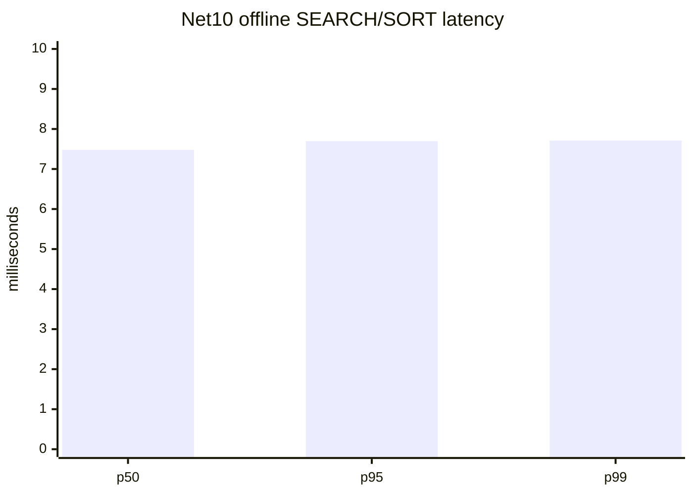

# Legacy C++ vs .NET 10 Performance Report

**Run date:** 2026-08-10
**Repository commit:** `5bdc53e11e54e194667cd3552a785dd41644dc59`
**Host:** Windows 11 build `10.0.26200`, x64, 16 logical processors
**Decision:** `RED - no valid C++ vs .NET 10 comparison yet`

## Executive result

The .NET 10 benchmark pack produced reproducible offline measurements. A valid
legacy C++ server run was not performed. The available C++ test installation
points to `HmailDb_Test5700`, which is outside the approved disposable target,
and the legacy service is stopped and disabled. No C++ service or test process
was started and no production or existing test database/Data directory was
accessed.

Do not calculate a speed-up, regression percentage, or winner from this report.
The two implementations have not yet been measured under the same live
protocol, SQL, Data-directory, message corpus, and machine conditions.

## .NET 10 evidence

| Scenario | Workload | Result | Evidence |
| --- | --- | --- | --- |
| Offline IMAP SEARCH/SORT | 100,000 synthetic messages, seed `5700`, 7 measured iterations | p50 `7.478 ms`, p95 `7.696 ms`, p99 `7.709 ms`, throughput `1,209,080 messages/s`, correctness `true` | `artifacts/benchmarks/offline-net10-20260810-20260810T120915Z/` |
| Short synthetic soak | 20/20 cycles, 100,000 messages | p50 `3.727 ms`, p95 `9.031 ms`, p99 `13.782 ms`, errors `0`, threshold `true` | `artifacts/benchmarks/short-soak-net10-20260810-20260810T120928Z/` |

Short-soak process deltas were private memory `-3,301,376` bytes, handles `+20`,
threads `0`, TCP connections `-1`, Gen0/Gen1/Gen2 `40/40/40`. These are useful
diagnostic counters only; they are not 24-hour leak acceptance evidence.



The benchmark is implemented by
`hmailserver/source/Server.Net10/benchmarks/HMailServer.Net10.Benchmarks` and
is intentionally independent of SQL Server, the hMailServer service, COM
registration, and a mail Data directory. It is not a live server benchmark.

## C++ evidence and blocker

The legacy source target is
`hmailserver/source/Server/hMailServer/hMailServer.sln`, with the server
implementation in `hmailserver/source/Server/hMailServer/hMailServer.vcxproj`.
An isolated compile attempt reached the C++ sources but failed before producing
`hMailServer.exe` because the project MIDL step returned:

```text
MIDL2020: error generating type library: SaveAllChanges Failed
```

The available installed binary is
`C:\hMailServer57-Test\Bin\hMailServer.exe`, but its configuration names
`HmailDb_Test5700` and `C:\hMailServer57-Test\Data`. It was deliberately not
started. The legacy performance fixtures also require a live COM/server target:

- `hmailserver/test/hMailServer.PerformanceTests/hMailServer.PerformanceTests/AverageMailSending.cs`
- `hmailserver/test/PerformanceTest/Program.cs`
- `hmailserver/test/StressTest/`

Those fixtures cannot be used as a C++ baseline until an independently created
SQL/Data copy and non-production process configuration are available.

## Required next run

1. Create two disposable databases from the legacy schema, one for each server.
2. Create two separate disposable Data directories with the same generated
   message corpus and identical account/folder state.
3. Build or copy the legacy binary into an isolated directory without using
   `HmailDb_Test5700` or its Data directory.
4. Configure both servers to loopback-only high ports and verify that neither
   existing service nor production port is touched.
5. Run the same SMTP acceptance, IMAP SEARCH/SORT, POP3 mailbox, delivery queue,
   and connection-concurrency workloads against both processes.
6. Capture p50/p95/p99, throughput, errors, timeouts, CPU, private memory,
   handles, threads, sockets, GC, and SQL wait/query counters.
7. Repeat after warm-up and publish raw JSON/CSV plus the comparison chart.

Until those prerequisites pass, the performance release gate remains RED.
