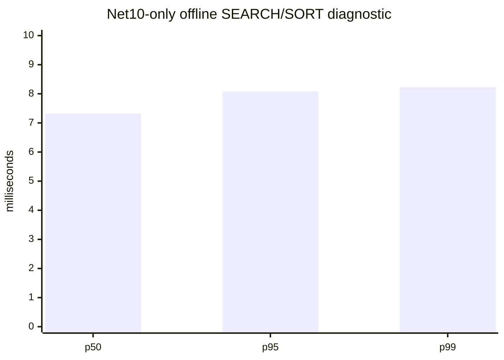
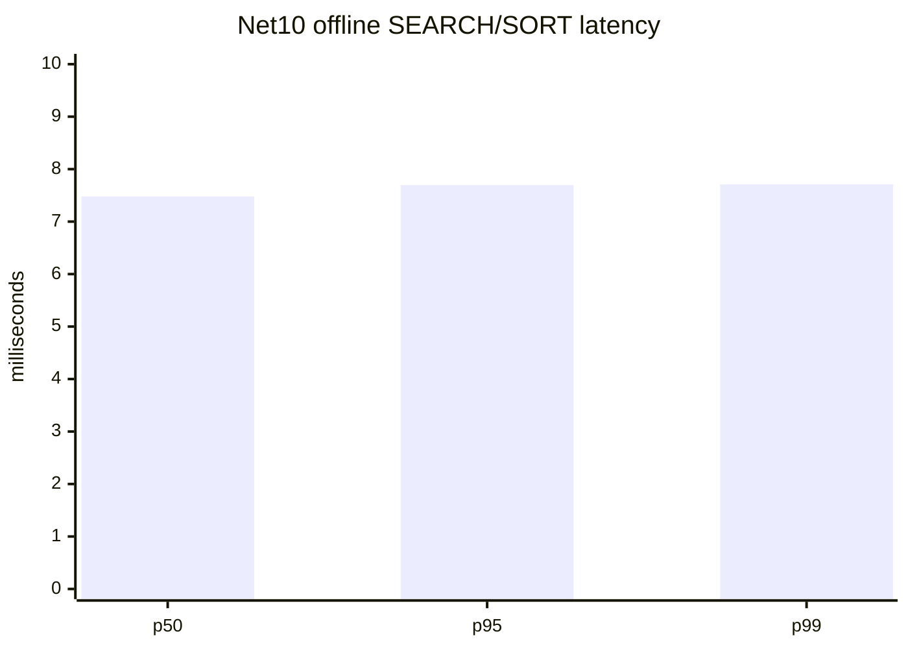
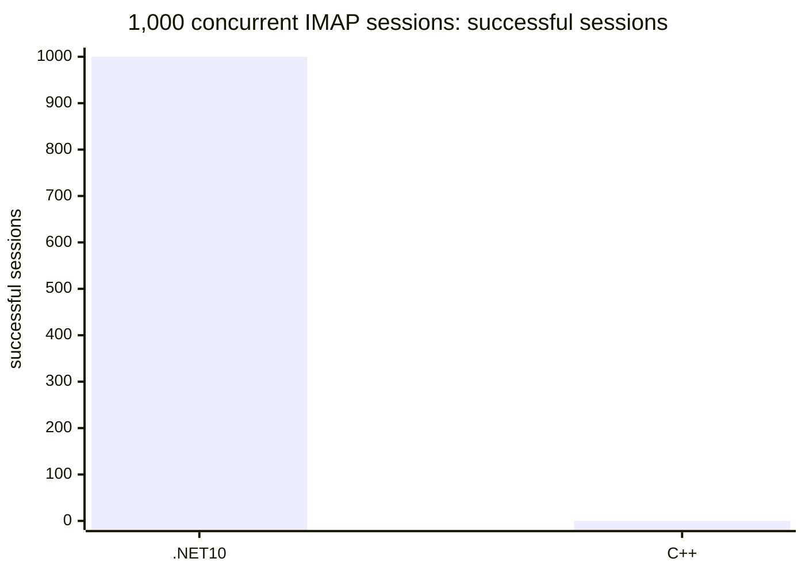

# Legacy C++ vs .NET 10 Performance Report

## Current authoritative fixture/FTS status (2026-08-11)

Tool commit `7e58324d7` added shared-baseline v2 evidence to
`build/collect-live-equivalence-evidence.ps1`. The collector now checks the
active `perf.test` domain, `test@perf.test` account, Inbox, exact loopback
SMTP/IMAP/POP3 rows, message filename containment under each selected Data
root, and SQL Full-Text service/catalog/table/index readiness.

The read-only rerun against the disposable databases reported
`NOT_EQUIVALENT`: both sides had domain/account matches `1` and loopback rows
`3`, but Inbox matches were `0`, message files under the selected Data roots
were `0` (`1000`/`1029` outside), and Full-Text readiness was `false` on both
sides. The detailed evidence is under
`artifacts/benchmarks/live-cpp-net10-20260811/shared-baseline-v2-live/`.

This supersedes any earlier start-state statement that treated row-count and
Data-file equality alone as sufficient. The performance release gate is
**RED**; the existing charts below are historical diagnostic measurements and
must not be used to calculate a C++/.NET 10 speed-up.

The current Net10-only offline 100k diagnostic at commit `2a6f68efc` passed
correctness and threshold checks with p50/p95/p99 of `7.324/8.076/8.223 ms`.
It is an in-memory diagnostic and is deliberately excluded from the paired
performance decision.



**Run date:** 2026-08-10
**Repository commit:** `21cc042c9`
**Host:** Windows 11 build `10.0.26200`, x64, 16 logical processors
**Decision:** `RED - no valid C++ vs .NET 10 comparison yet`

## Latest shared-baseline rerun (2026-08-11)

The disposable C++ SQL database was backed up with `COPY_ONLY` and restored
into the disposable Net10 database. The start-state collector reported 33/33
matching table row counts. The two isolated Data directories contained 1,000
files each with zero relative-path or SHA-256 mismatches. The runs used
loopback `127.0.0.1` and SMTP `2525`, IMAP `1143`, POP3 `25110`.

| Scenario | C++ | .NET 10 | Ratio |
| --- | ---: | ---: | --- |
| SMTP protocol, 25 iterations | 0/25 | 25/25 | invalid |
| IMAP protocol, 25 iterations | 0/25 | 0/25 | invalid |
| POP3 protocol, 25 iterations | 0/25 | 0/25 | invalid |
| IMAP concurrent, 1,000 sessions | 0/1000 | 0/1000 | invalid |

```mermaid
xychart-beta
    title "Shared-baseline protocol success counts"
    x-axis [SMTP, IMAP, POP3, IMAP-1k]
    y-axis "successful sessions" 0 --> 25
    bar [0, 0, 0, 0]
    bar [25, 0, 0, 0]
```



The shared SQL/Data start state is now proven, but neither implementation
completed the same matrix. The release gate remains **RED** and no speed-up,
regression percentage, or winner is valid. Evidence is under
`artifacts/benchmarks/live-cpp-net10-20260811/`; the checker is
`build/collect-live-equivalence-evidence.ps1`.

## Executive result

The .NET 10 benchmark pack produced reproducible offline measurements. A later
live listener-only run used two new MSSQLSERVER databases, separate ASCII Data
directories, and a byte-identical 1,000-message corpus. The .NET 10 listener
matrix passed; the copied legacy `/Debug` binary completed SMTP but failed the
same IMAP/POP3 matrix. The run is therefore still not a performance comparison.

Do not calculate a speed-up, regression percentage, or winner from this report.
The two implementations have not yet been measured under the same live
protocol, SQL, Data-directory, message corpus, and machine conditions.

## .NET 10 evidence

| Scenario | Workload | Result | Evidence |
| --- | --- | --- | --- |
| Offline IMAP SEARCH/SORT | 100,000 synthetic messages, seed `5700`, 7 measured iterations | p50 `7.478 ms`, p95 `7.696 ms`, p99 `7.709 ms`, throughput `1,209,080 messages/s`, correctness `true` | `artifacts/benchmarks/offline-net10-20260810-20260810T120915Z/` |
| Short synthetic soak | 20/20 cycles, 100,000 messages | p50 `3.727 ms`, p95 `9.031 ms`, p99 `13.782 ms`, errors `0`, threshold `true` | `artifacts/benchmarks/short-soak-net10-20260810-20260810T120928Z/` |

Short-soak process deltas were private memory `-3,301,376` bytes, handles `+20`,
threads `0`, TCP connections `-1`, Gen0/Gen1/Gen2 `40/40/40`. These are useful
diagnostic counters only; they are not 24-hour leak acceptance evidence.



The benchmark is implemented by
`hmailserver/source/Server.Net10/benchmarks/HMailServer.Net10.Benchmarks` and
is intentionally independent of SQL Server, the hMailServer service, COM
registration, and a mail Data directory. It is not a live server benchmark.

## C++ evidence and blocker

The original live attempt is recorded in
`artifacts/benchmarks/live-cpp-net10-20260810_152708/live-comparison-attempt-20260810.json`
and the matching Markdown evidence file. It created:

- SQL Server `localhost` databases `hmail_perf_cpp_sql_20260810_152708` and
  `hmail_perf_net_sql_20260810_152708`.
- Separate Data directories under
  `C:\Users\Kandil\AppData\Local\Temp\hmailserver-live-perf-20260810_153126`.
- Loopback-only target ports SMTP `25250`, POP3 `25110`, and IMAP `25143`.
- 1,000 identical messages per target, with 1,000 matching
  `hm_messages`, `hm_message_metadata`, and recipient rows.

The existing hMailServer service was stopped and disabled. `HmailDb_Test5700`,
the existing Data directory, production ports, and existing COM registration
were not used; the Application AppID values were unchanged before and after
the isolated process probe.

The legacy source target is
`hmailserver/source/Server/hMailServer/hMailServer.sln`, with the server
implementation in `hmailserver/source/Server/hMailServer/hMailServer.vcxproj`.
The normal source build still fails because the project MIDL step returns:

```text
MIDL2020: error generating type library: SaveAllChanges Failed
```

For the isolated probe, a temporary test-only configuration hook was used to
build a copied legacy binary without changing the repository source or the
installed registration. That binary crashed during initialization for all four
isolated connection combinations: LocalDB/default provider, LocalDB named
pipe/`MSOLEDBSQL`, MSSQLSERVER/`sqloledb`, and MSSQLSERVER/`MSOLEDBSQL`. The
copied binary opened `2525` and `1143` only when it read the existing registered
installation path; that non-isolated run was excluded from all measurements.

The installed binary remains
`C:\hMailServer57-Test\Bin\hMailServer.exe`, and its configuration names
`HmailDb_Test5700` and `C:\hMailServer57-Test\Data`. The legacy performance
fixtures also require a live COM/server target:

- `hmailserver/test/hMailServer.PerformanceTests/hMailServer.PerformanceTests/AverageMailSending.cs`
- `hmailserver/test/PerformanceTest/Program.cs`
- `hmailserver/test/StressTest/`

Those fixtures cannot be used as a C++ baseline until an independently created
SQL/Data copy and non-production process configuration are available.

## Required next run

1. Move the paired run to a disposable SQL Server instance with Full-Text
   Search enabled and a legacy-supported ADO provider, or to a dedicated
   staging VM.
2. Build or copy the legacy binary into an isolated directory without using
   `HmailDb_Test5700` or its Data directory.
3. Configure both servers to loopback-only high ports and verify that neither
   existing service nor production port is touched.
4. Run the same SMTP acceptance, IMAP SEARCH/SORT, POP3 mailbox, delivery queue,
   and connection-concurrency workloads against both processes.
5. Capture p50/p95/p99, throughput, errors, timeouts, CPU, private memory,
   handles, threads, sockets, GC, and SQL wait/query counters.
6. Repeat after warm-up and publish raw JSON/CSV plus the comparison chart.

Until those prerequisites pass, the performance release gate remains RED.

## Latest paired listener evidence

The current raw evidence is
`artifacts/benchmarks/live-cpp-net10-20260810_152708/paired-live-comparison.md`.
The corpus equality report confirms `1000/1000` identical Data files, and both
disposable SQL databases contain `1000` messages, metadata rows, and
recipients. The repeated loopback scenarios used SMTP `2525`, IMAP `1143`, and
POP3 `25110`:

| Scenario | .NET 10 | C++ | Decision |
| --- | --- | --- | --- |
| SMTP greeting/EHLO/QUIT | `25/25`, p95 `13.616 ms` | `25/25`, p95 `10.948 ms` | not comparable as a winner |
| IMAP login/select/search/sort/logout | `25/25`, p95 `3.027 ms` | `4/25`, p95 `29.929 ms` | C++ incomplete |
| POP3 login/stat/list/quit | `25/25`, p95 `5.962 ms` | `0/25` | C++ listener unavailable |

The raw p95 values are diagnostic only:

```mermaid
xychart-beta
    title "Raw p95 latency (diagnostic only; no winner)"
    x-axis [SMTP, IMAP, POP3]
    y-axis "milliseconds" 0 --> 250
    bar [13.616, 3.027, 5.962]
    bar [10.948, 29.929, 0]
```



The C++ process is a temporary `/Debug` probe rather than a normal isolated
release build and did not open POP3. The normal .NET 10 host opens all three
listeners but fails the installed AppID COM identity check with `0x80004015`,
so the live run used a benchmark-only listener host with COM intentionally
omitted. No paired ratio is valid. The later concurrent IMAP run provides
valid .NET 10-only evidence but C++ completed `0/1000`; SMTP message
acceptance, delivery queue, and 24-hour soak remain release blockers.

## Latest 1,000-concurrent IMAP evidence

The bounded runner `build/benchmark-net10-live-concurrent-imap.ps1` was then
run against the same isolated SQL/Data fixture for both implementations. The
fixture was read back before the run: both databases contain `1000` messages,
`1000` message metadata rows, `1000` message-recipient rows, root `INBOX`
with `folderparentid = -1`, and identical loopback listener rows for SMTP
`2525`, IMAP `1143`, and POP3 `25110`. The Data corpus remains `1000/1000`
SHA-256-equal files.

| Scenario | .NET 10 | C++ | Decision |
| --- | --- | --- | --- |
| 1,000 concurrent IMAP LOGIN/SELECT/SEARCH/SORT/LOGOUT | `1000/1000`, p50 `48.706 ms`, p95 `183.157 ms`, p99 `558.690 ms` | `0/1000`, no successful sample; IMAP banner/read aborted and POP3 listener did not open | invalid ratio |



The .NET 10 result is a valid isolated workload result. The C++ result is a
reproducible baseline failure of the temporary `/Debug` process, not a zero
latency result. No speed-up or regression percentage is calculated. The
focused validator passes for both artifacts because it validates accounting
and correctly preserves the C++ `FAIL` status. The performance release gate
remains **RED** until a normal reproducible C++ binary completes the same
scenario, followed by SMTP message acceptance, delivery queue, and soak
workloads.
