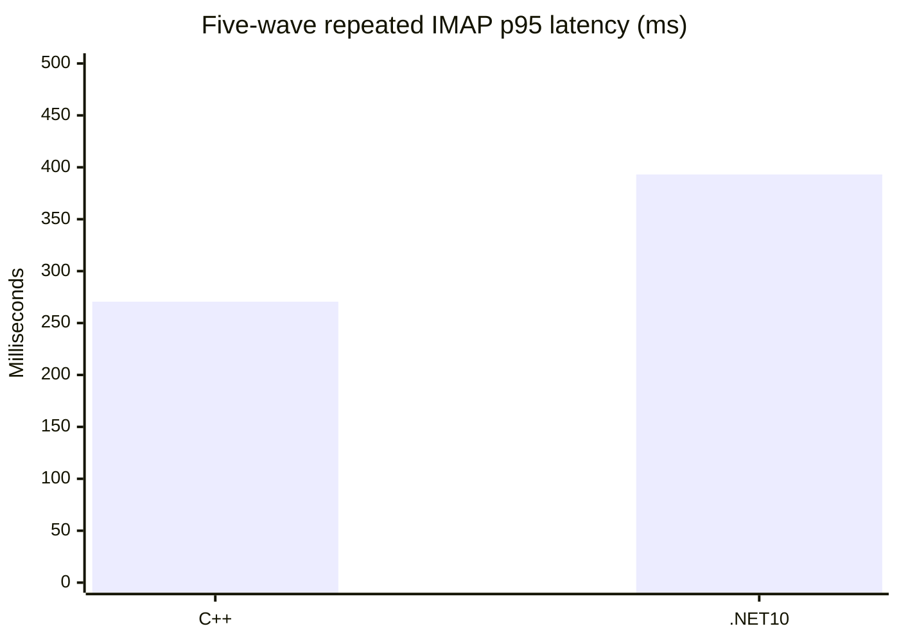

# C++ vs .NET 10 Paired IMAP Performance Report

Date: 2026-09-01
Gate: **RED**
Scope: loopback IMAP `Full` profile (`greeting; LOGIN; SELECT INBOX; SEARCH; SORT; LOGOUT`)

## Decision

The legacy C++ service path is operational and reproducible. The original
unpaced burst cells remain a useful stress profile, but the earlier controlled
1,000-session `0/1000` result was a benchmark false negative: the probe batch
deadline did not include the deliberate launch ramp. After fixing that deadline
and applying the same controlled ramp to both implementations, the 100/500/1,000
session acceptance matrix passes on both sides. This report still does **not**
claim a general .NET 10 speed-up or production performance superiority.

The C++ production tree was not changed. The evidence does not isolate one
correct source-level fix between native SQL contention, synchronous IMAP work
on the IOCP callback path, and accept-queue pressure. Changing the legacy
reference implementation before that distinction is proven would invalidate
the baseline.

## Paired Fixture

- Fixture: `hmail-perf-pair-service-20260901`
- Manifest SHA-256: `06EFCBA9520D478A6DAC7ABB7F09F3B63D015A0CD5ECA1EB4D0FD2CC8C38F9FD`
- Corpus: 1,000 `hm_messages` rows and 1,000 byte-matched Data files
- Message SHA-256: `5136EEC556F9790732AE759EF52F77FE6172329EA55787A80300C4A824107E46`
- Data SHA-256: `45FA907CE0D3797C1E13EBB2F03F076A25656CCE27E801C18F745ACD3944FBBD`
- SQL: separate disposable clones of the same backup, C++ schema 5708 and .NET 10 schema 6000
- Bind: `127.0.0.1:1143`
- Timeout: 5,000 ms; readiness warm-up: 5 seconds; launch stagger: 0 ms
- C++ executable SHA-256: `B3DF9E8BBF4BEDB1102C94DF7C86356E1FEABCBC02A18E8EABEB1EA1453D09B8`

The matrix below is the latest manifest-bound service run from the paired
fixture. Raw JSON is retained locally under
`artifacts/benchmarks/paired-cpp-net10-20260901-service/` and is not embedded
in the repository because it contains machine-specific paths and runtime
evidence.

## Results

| Sessions | C++ status | C++ success | C++ errors | C++ p50 ms | C++ p95 ms | C++ throughput/s | .NET 10 status | .NET 10 success | .NET 10 errors | .NET 10 p50 ms | .NET 10 p95 ms | .NET 10 throughput/s |
| ---: | :---: | ---: | ---: | ---: | ---: | ---: | :---: | ---: | ---: | ---: | ---: | ---: |
| 100 | PASS | 100/100 | 0 | 2,696.204 | 4,334.200 | 22.717 | PASS | 100/100 | 0 | 528.348 | 629.023 | 148.932 |
| 500 | FAIL | 189/500 | 311 | 4,299.681 | 7,551.733 | 24.617 | PASS | 500/500 | 0 | 2,035.952 | 2,357.067 | 201.084 |
| 1,000 | FAIL | 186/1,000 | 814 | 4,289.962 | 7,512.292 | 24.196 | PASS | 1,000/1,000 | 0 | 3,667.670 | 3,946.014 | 232.954 |

The 100-session row is a descriptive paired result. The 500- and 1,000-session
latency/throughput numbers are not acceptance wins because the C++ side did
not complete the requested workload.

## Capacity Monitor Evidence

The new disposable monitor was run against a fresh clean fixture at 100 ms
sampling. It observed the actual C++ worker executable while the wrapper ran;
SQL collection used read-only DMVs against the disposable database.

| Sessions | Worker thread peak | Private bytes peak | Handles peak | Established TCP peak | CLOSE_WAIT peak | Active SQL requests peak | Workload |
| ---: | ---: | ---: | ---: | ---: | ---: | ---: | :---: |
| 500 | 76 | 52,924,416 | 783 | 490 | 316 | 1 | FAIL |
| 1,000 | 76 | 50,548,736 | 754 | 411 | 217 | 1 | FAIL |

The worker stayed alive and cleanup completed. The monitor does not show a
crash or a persistent resource leak. It does show a high number of short-lived
TCP connections and `CLOSE_WAIT` entries during failed Full-profile runs. This
is evidence for a transport/session pressure investigation, not proof that a
specific C++ source line should be changed.

Monitor JSON/CSV/Markdown output is retained locally under
`artifacts/benchmarks/disposable-cpp-capacity-monitor/`; raw machine-specific
paths are intentionally not committed.

## Controlled Ramp and Profile Findings

The monitor was then run against the clean fixture with separate disposable
service instances. A burst Full profile passed `100/100`, then completed only
`127/200`, `173/300`, `129/400`, and `118/500`; the dominant errors were refused
connections and read responses that arrived after the configured timeout. At
200 sessions, the isolated Admission, AuthSelect, Search, and Sort profiles
each passed `200/200`, which narrows the failure to the combined Full workload
under admission pressure rather than a standalone command correctness failure.

Controlled launch staggering changed the result but did not remove the gate:
Full passed `200/200` at 25 ms stagger and `500/500` at 50 ms stagger with a
15-second socket timeout, while `1000/1000` all timed out at 50 ms stagger.
These runs are diagnostic because launch staggering and timeout policy change
the acceptance shape; they do not justify a speed-up ratio or a production
capacity claim.

## Corrected Controlled Acceptance Matrix

The concurrent probe now extends its batch deadline by the launch-ramp duration.
The final paired run used the same clean fixture, Full profile, 50 ms launch
stagger, 15-second per-socket timeout, and 1,000 byte-matched messages for both
implementations. Batch deadlines were 49.950 s, 69.950 s, and 94.950 s for
100, 500, and 1,000 sessions respectively.

| Sessions | C++ result | C++ p50 ms | C++ p95 ms | C++ p99 ms | C++ throughput/s | .NET 10 result | .NET 10 p50 ms | .NET 10 p95 ms | .NET 10 p99 ms | .NET 10 throughput/s |
| ---: | ---: | ---: | ---: | ---: | ---: | ---: | ---: | ---: | ---: |
| 100 | 100/100 PASS | 161.388 | 175.800 | 180.911 | 19.564 | 100/100 PASS | 389.138 | 493.444 | 558.758 | 19.100 |
| 500 | 500/500 PASS | 162.725 | 201.201 | 236.620 | 19.903 | 500/500 PASS | 240.108 | 555.867 | 619.902 | 19.835 |
| 1,000 | 1,000/1,000 PASS | 179.044 | 220.689 | 258.393 | 19.930 | 1,000/1,000 PASS | 228.152 | 641.429 | 755.398 | 19.911 |

These are descriptive results from one controlled run. C++ had lower observed
p95 latency in this run and throughput was effectively equal; no general
performance winner is declared without repeated runs, equivalent hardware
baselines, queue/delivery coverage, and soak evidence.

One paired controlled 500-session run used the same clean fixture, Full
profile, 50 ms launch stagger, and 15-second socket timeout for both sides:

| Implementation | Result | p50 ms | p95 ms | p99 ms | Throughput/s |
| --- | ---: | ---: | ---: | ---: | ---: |
| C++ | 500/500 | 185.216 | 253.003 | 274.622 | 19.853 |
| .NET 10 | 500/500 | 221.294 | 737.359 | 783.309 | 19.857 |

This single controlled run is useful diagnostic evidence: throughput was
effectively equal and C++ had the lower observed latency. It is not a general
performance-superiority claim; the unpaced burst matrix remains a separate
stress profile while the corrected controlled 1,000 run passes.

The earlier controlled 1,000-session failure was a benchmark false negative:
the probe batch deadline did not include the deliberate launch ramp. After
correcting `RunMany()` batch-deadline accounting, two additional 1,000-session
repetitions passed `1,000/1,000` on both implementations:

| Implementation | Repeat | Result | p50 ms | p95 ms | p99 ms | Throughput/s |
| --- | ---: | ---: | ---: | ---: | ---: | ---: |
| C++ | 1 | 1,000/1,000 PASS | 195.079 | 234.489 | 263.277 | 19.922 |
| C++ | 2 | 1,000/1,000 PASS | 258.420 | 319.475 | 373.884 | 19.886 |
| .NET 10 | 1 | 1,000/1,000 PASS | 2,231.958 | 4,273.958 | 4,510.242 | 19.899 |
| .NET 10 | 2 | 1,000/1,000 PASS | 267.879 | 444.761 | 480.563 | 19.893 |

The Net10 spread shows cold/startup sensitivity that requires more warm-up and
repeated-run analysis before latency conclusions. The stable observation is
correctness and near-equal throughput, not a universal latency winner.

## Repeated five-wave acceptance

The corrected probe was then run for five waves of 1,000 `Full` sessions on
the same manifest-bound 1,000-message SQL/Data fixture. Both targets used
loopback `127.0.0.1:1143`, a 50 ms launch stagger, a 15-second socket timeout,
and a one-second post-wave settle. The legacy C++ run used its disposable SCM
service; Net10 used its disposable service process. Both runs passed cleanup
and production-safety checks.

| Implementation | Result | p50 ms | p95 ms | p99 ms | Throughput/s | Settled private bytes | Settled handles | Settled threads |
| --- | ---: | ---: | ---: | ---: | ---: | ---: | ---: | ---: |
| Legacy C++ service | 5,000/5,000 PASS | 223.668 | 270.598 | 317.280 | 19.924 | 23,027,712 | 529 | 70 |
| .NET 10 | 5,000/5,000 PASS | 253.490 | 393.113 | 480.936 | 19.901 | 41,111,552 | 657 | 25 |

The C++ wave private-byte peak was `23,117,824` and the Net10 peak was
`45,981,696`; the corresponding handle peaks were `530` and `682`. These are
process observations over roughly five minutes of workload, not proof of a
24-hour memory/handle/thread/socket leak-free soak. They establish repeatable
correctness and near-equal throughput under this controlled ramp. They do not
establish a universal latency winner.

The reproducible monitor option is
`build/monitor-disposable-cpp-imap-capacity.ps1 -LaunchStaggerMilliseconds`.
The C++ source remains unchanged. A safe source fix still requires a
legacy-anchored experiment that distinguishes accept-queue/IOCP pressure from
the synchronous `SEARCH`/`SORT` callback cost.

## Graphs

Legend: `C++` is the first bar; `.NET 10` is the second bar in each chart.

```mermaid
xychart-beta
    title "p95 latency (ms, descriptive)"
    x-axis [100, 500, 1000]
    y-axis "Milliseconds" 0 --> 8000
    bar [4334, 7552, 7512]
    bar [629, 2357, 3946]
```

The corrected controlled matrix has a separate view because its acceptance
shape includes the same 50 ms launch ramp for both implementations:

```mermaid
xychart-beta
    title "Corrected controlled success (%)"
    x-axis [100, 500, 1000]
    y-axis "Success percent" 0 --> 100
    bar [100, 100, 100]
    bar [100, 100, 100]
```

```mermaid
xychart-beta
    title "Corrected controlled p95 latency (ms)"
    x-axis [100, 500, 1000]
    y-axis "Milliseconds" 0 --> 800
    bar [175.8, 201.2, 220.7]
    bar [493.4, 555.9, 641.4]
```

## Legacy Reference

The observed C++ failure mode is consistent with the legacy architecture:

- `SessionManager::CreateSession` in
  `hmailserver/source/Server/Common/Application/SessionManager.cpp:44-101`
  enforces `maximapconnections`; the fixture value is zero, meaning unlimited.
- `TCPServer::InitAcceptor`, `StartAccept`, and `HandleAccept` in
  `hmailserver/source/Server/Common/TCPIP/TCPServer.cpp:52-238` use one
  outstanding asynchronous accept and repost it from the completion handler.
- `IOService::DoWork` in
  `hmailserver/source/Server/Common/TCPIP/IOService.cpp:66-176` runs the shared
  IOCP queue; the fixture uses 15 TCP/IP threads.
- `TCPConnection::AsyncReadCompleted` in
  `hmailserver/source/Server/Common/TCPIP/TCPConnection.cpp:485-602` enters
  protocol processing from the completion path.
- `IMAPConnection::AnswerCommand` in
  `hmailserver/source/Server/IMAP/IMAPConnection.cpp:570` executes command
  handling synchronously.
- File-backed SEARCH and SORT work is implemented by
  `IMAPCommandSEARCH::MatchesTEXTCriteria_` in
  `hmailserver/source/Server/IMAP/IMAPCommandSearch.cpp:594` and
  `IMAPSort::Sort` in `hmailserver/source/Server/IMAP/IMAPSort.cpp:108`.
- Net10 uses an explicit backlog and connection semaphore in
  `hmailserver/source/Server.Net10/src/HMailServer.Protocols/Imap/ImapTcpListener.cs:40-65`
  and asynchronous command dispatch in `ImapSession.DispatchAsync` at
  `hmailserver/source/Server.Net10/src/HMailServer.Protocols/Imap/ImapSession.cs:138`.

These are architectural differences, not proof that either implementation is
incorrect. A production C++ change requires a separately instrumented,
legacy-anchored experiment and a new baseline.

## Reproduction and Next Gate

Use the disposable fixture runner in `build/benchmark-disposable-cpp-service-protocol.ps1`,
`build/benchmark-net10-live-concurrent-imap.ps1`, and the monitor in
`build/monitor-disposable-cpp-imap-capacity.ps1`. The runners expose and record
`WarmupSeconds`; the monitor also records launch stagger and passes it to the
service wrapper. Do not reuse a fixture after SMTP/delivery tests without
reprovisioning it, because those tests mutate Data files.

The benchmark harness correction is complete. The next performance slice is
repeatability across independent runs and queue/delivery workload coverage,
using the same corrected batch-deadline rule. Required remaining gates include
SMTP/delivery/queue parity, POP3 soak,
restore/installer lifecycle, registered COM, SEC-18, and a 24-hour leak soak.
