# C++ vs .NET 10 Paired IMAP Performance Report

Date: 2026-09-01
Gate: **RED**
Scope: loopback IMAP `Full` profile (`greeting; LOGIN; SELECT INBOX; SEARCH; SORT; LOGOUT`)

## Decision

The legacy C++ service path is operational and reproducible at 100 sessions,
but it does not pass the 500- or 1,000-session acceptance cells. Therefore this
report does **not** claim a general .NET 10 speed-up or production performance
superiority. The failed C++ cells are valid capacity evidence and remain a
release blocker.

The C++ production tree was not changed. The evidence does not isolate one
correct source-level fix between native SQL contention, synchronous IMAP work
on the IOCP callback path, and accept-queue pressure. Changing the legacy
reference implementation before that distinction is proven would invalidate
the baseline.

## Paired Fixture

- Fixture: `hmail-perf-pair-service-20260901`
- Manifest SHA-256: `06EFCBA9520D478A6DAC7ABB7F09F3B63D015A0CD5ECA1EB4D0FD2CC8C38F9FD`
- Corpus: 1,000 `hm_messages` rows and 1,000 byte-matched Data files
- Message SHA-256: `5136EEC556F9790732AE759EF52F77FE6172329EA55787A80300C4A824107E46`
- Data SHA-256: `45FA907CE0D3797C1E13EBB2F03F076A25656CCE27E801C18F745ACD3944FBBD`
- SQL: separate disposable clones of the same backup, C++ schema 5708 and .NET 10 schema 6000
- Bind: `127.0.0.1:1143`
- Timeout: 5,000 ms; readiness warm-up: 5 seconds; launch stagger: 0 ms
- C++ executable SHA-256: `B3DF9E8BBF4BEDB1102C94DF7C86356E1FEABCBC02A18E8EABEB1EA1453D09B8`

The matrix below is the latest manifest-bound service run from the paired
fixture. Raw JSON is retained locally under
`artifacts/benchmarks/paired-cpp-net10-20260901-service/` and is not embedded
in the repository because it contains machine-specific paths and runtime
evidence.

## Results

| Sessions | C++ status | C++ success | C++ errors | C++ p50 ms | C++ p95 ms | C++ throughput/s | .NET 10 status | .NET 10 success | .NET 10 errors | .NET 10 p50 ms | .NET 10 p95 ms | .NET 10 throughput/s |
| ---: | :---: | ---: | ---: | ---: | ---: | ---: | :---: | ---: | ---: | ---: | ---: | ---: |
| 100 | PASS | 100/100 | 0 | 2,696.204 | 4,334.200 | 22.717 | PASS | 100/100 | 0 | 528.348 | 629.023 | 148.932 |
| 500 | FAIL | 189/500 | 311 | 4,299.681 | 7,551.733 | 24.617 | PASS | 500/500 | 0 | 2,035.952 | 2,357.067 | 201.084 |
| 1,000 | FAIL | 186/1,000 | 814 | 4,289.962 | 7,512.292 | 24.196 | PASS | 1,000/1,000 | 0 | 3,667.670 | 3,946.014 | 232.954 |

The 100-session row is a descriptive paired result. The 500- and 1,000-session
latency/throughput numbers are not acceptance wins because the C++ side did
not complete the requested workload.

## Capacity Monitor Evidence

The new disposable monitor was run against a fresh clean fixture at 100 ms
sampling. It observed the actual C++ worker executable while the wrapper ran;
SQL collection used read-only DMVs against the disposable database.

| Sessions | Worker thread peak | Private bytes peak | Handles peak | Established TCP peak | CLOSE_WAIT peak | Active SQL requests peak | Workload |
| ---: | ---: | ---: | ---: | ---: | ---: | ---: | :---: |
| 500 | 76 | 52,924,416 | 783 | 490 | 316 | 1 | FAIL |
| 1,000 | 76 | 50,548,736 | 754 | 411 | 217 | 1 | FAIL |

The worker stayed alive and cleanup completed. The monitor does not show a
crash or a persistent resource leak. It does show a high number of short-lived
TCP connections and `CLOSE_WAIT` entries during failed Full-profile runs. This
is evidence for a transport/session pressure investigation, not proof that a
specific C++ source line should be changed.

Monitor JSON/CSV/Markdown output is retained locally under
`artifacts/benchmarks/disposable-cpp-capacity-monitor/`; raw machine-specific
paths are intentionally not committed.

## Graphs

Legend: `C++` is the first bar; `.NET 10` is the second bar in each chart.

```mermaid
xychart-beta
    title "p95 latency (ms, descriptive)"
    x-axis [100, 500, 1000]
    y-axis "Milliseconds" 0 --> 8000
    bar [4334, 7552, 7512]
    bar [629, 2357, 3946]
```

## Legacy Reference

The observed C++ failure mode is consistent with the legacy architecture:

- `SessionManager::CreateSession` in
  `hmailserver/source/Server/Common/Application/SessionManager.cpp:44-101`
  enforces `maximapconnections`; the fixture value is zero, meaning unlimited.
- `TCPServer::InitAcceptor`, `StartAccept`, and `HandleAccept` in
  `hmailserver/source/Server/Common/TCPIP/TCPServer.cpp:52-238` use one
  outstanding asynchronous accept and repost it from the completion handler.
- `IOService::DoWork` in
  `hmailserver/source/Server/Common/TCPIP/IOService.cpp:66-176` runs the shared
  IOCP queue; the fixture uses 15 TCP/IP threads.
- `TCPConnection::AsyncReadCompleted` in
  `hmailserver/source/Server/Common/TCPIP/TCPConnection.cpp:485-602` enters
  protocol processing from the completion path.
- `IMAPConnection::AnswerCommand` in
  `hmailserver/source/Server/IMAP/IMAPConnection.cpp:570` executes command
  handling synchronously.
- File-backed SEARCH and SORT work is implemented by
  `IMAPCommandSEARCH::MatchesTEXTCriteria_` in
  `hmailserver/source/Server/IMAP/IMAPCommandSearch.cpp:594` and
  `IMAPSort::Sort` in `hmailserver/source/Server/IMAP/IMAPSort.cpp:108`.
- Net10 uses an explicit backlog and connection semaphore in
  `hmailserver/source/Server.Net10/src/HMailServer.Protocols/Imap/ImapTcpListener.cs:40-65`
  and asynchronous command dispatch in `ImapSession.DispatchAsync` at
  `hmailserver/source/Server.Net10/src/HMailServer.Protocols/Imap/ImapSession.cs:138`.

These are architectural differences, not proof that either implementation is
incorrect. A production C++ change requires a separately instrumented,
legacy-anchored experiment and a new baseline.

## Reproduction and Next Gate

Use the disposable fixture runner in `build/benchmark-disposable-cpp-service-protocol.ps1`
and `build/benchmark-net10-live-concurrent-imap.ps1`. Both now expose and
record `WarmupSeconds`; the service wrapper passes the same value to the child
runner. Do not reuse a fixture after SMTP/delivery tests without reprovisioning
it, because those tests mutate Data files.

The next performance slice is a read-only monitor that correlates worker
private bytes/handles/threads, TCP 1143 states, and disposable SQL request/wait
DMVs with failed session timestamps. Only after that evidence identifies the
bottleneck should a C++ source change be considered. Required remaining gates
include SMTP/delivery/queue parity, POP3 soak, restore/installer lifecycle,
registered COM, SEC-18, and a 24-hour leak soak.
