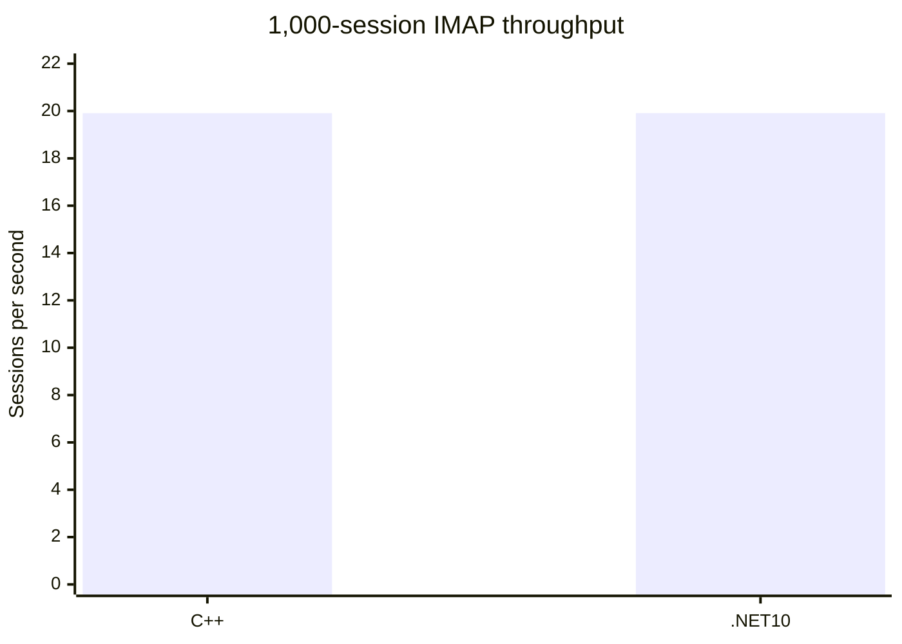
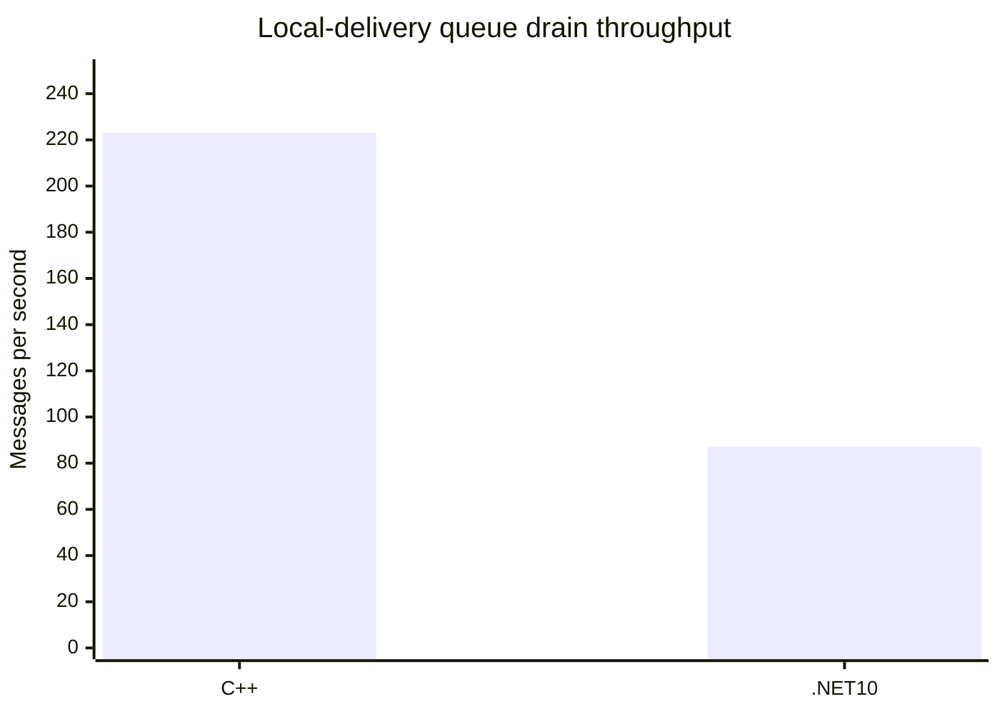
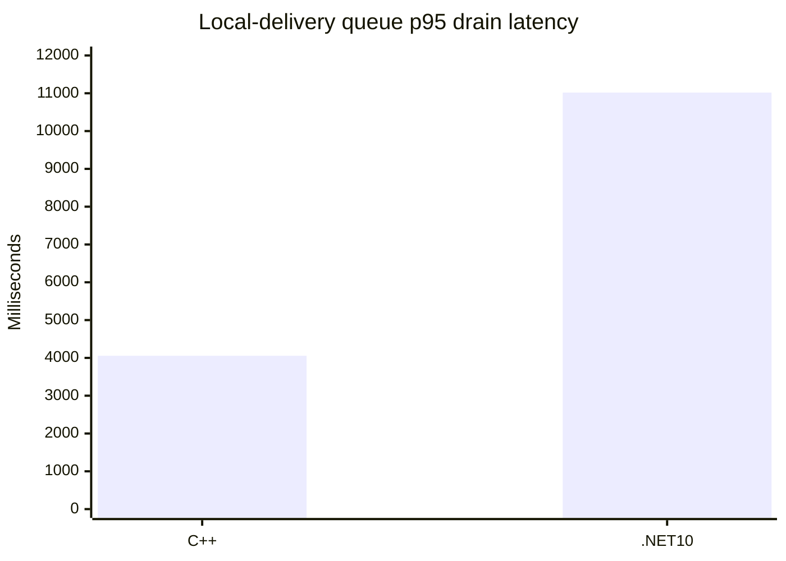

# C++ vs .NET 10 Paired Performance Report

Date: 2026-09-02
Gate: **RED**
Scope: disposable loopback protocol and 1,000-session IMAP acceptance on the
same SQL/Data fixture.

## Result

The disposable legacy C++ server was rebuilt from the supported Release x64
tree and exercised through a temporary SCM service. The service wrapper used
`/DisposableBenchmark /ServiceName=... RunAsService`, ran as `NT AUTHORITY\\LocalService`,
waited for all three loopback listeners, and stopped/deleted the service after
each run. The installed `hMailServer` service and Application registration
were not changed. No C++ production source change was justified by this
evidence; the earlier failure was in the benchmark/fixture environment, not a
proven source-level defect.

Both implementations used the same manifest-bound disposable fixture:

- 1,000 `hm_messages` rows and 1,000 byte-matched Data files.
- Separate SQL clones, one for each implementation.
- `127.0.0.1` with SMTP `2525`, IMAP `1143`, and POP3 `25110`.
- Full protocol sequence: greeting, LOGIN, SELECT INBOX, SEARCH, SORT, LOGOUT.
- Protocol runs: 25 iterations per implementation, zero errors.
- Fixture manifest SHA-256: `913704FA787E829C8E4E890C7193BEC4C377AE69ECE1B3C0D483406C50DD5FB8`.
- C++ executable SHA-256: `B3DF9E8BBF4BEDB1102C94DF7C86356E1FEABCBC02A18E8EABEB1EA1453D09B8`.
- .NET 10 executable SHA-256: `3B69C7C81B8062F38A55E01631F9252A0B4569A42B8D3E4DD37B9D2A509BA598`.

## Protocol latency

Values are milliseconds, p50/p95/p99. Every cell is `25/25 PASS` with zero
errors. These are latency observations, not a universal performance ranking.

| Scenario | C++ p50 | C++ p95 | C++ p99 | .NET 10 p50 | .NET 10 p95 | .NET 10 p99 |
| --- | ---: | ---: | ---: | ---: | ---: | ---: |
| SMTP connection/command | 1.410 | 2.645 | 46.551 | 2.074 | 2.945 | 36.008 |
| IMAP Full SEARCH/SORT | 135.671 | 192.863 | 475.286 | 189.341 | 286.626 | 535.567 |
| POP3 LIST/UIDL/RETR | 2.381 | 3.285 | 3.559 | 16.641 | 27.495 | 35.785 |

```mermaid
xychart-beta
    title "Paired protocol p95 latency (ms)"
    x-axis [SMTP, IMAP, POP3]
    y-axis "Milliseconds" 0 --> 320
    bar [2.645, 192.863, 3.285]
    bar [2.945, 286.626, 27.495]
```

## 1,000 concurrent IMAP sessions

The same Full profile was run with a 50 ms launch stagger and a 15,000 ms
socket timeout. Both runs completed `1,000/1,000` with zero errors and zero
timeouts. The C++ cell was service-backed by the disposable SCM wrapper. The
.NET 10 cell was process-backed by the approved live benchmark runner; it was
not an installed service. This host-mode difference is recorded explicitly,
so this cell is not presented as an apples-to-apples service-lifecycle gate.

| Implementation | Result | p50 ms | p95 ms | p99 ms | Throughput/s | Private bytes after settle | Handles | Threads |
| --- | ---: | ---: | ---: | ---: | ---: | ---: | ---: | ---: |
| Legacy C++ service | PASS 1,000/1,000 | 170.920 | 215.262 | 256.084 | 19.909 | 19.0 MB | 525 | 72 |
| .NET 10 process | PASS 1,000/1,000 | 196.993 | 506.818 | 541.259 | 19.910 | 43.2 MB | 654 | 25 |

```mermaid
xychart-beta
    title "1,000-session IMAP latency"
    x-axis [p50, p95, p99]
    y-axis "Milliseconds" 0 --> 600
    bar [170.920, 215.262, 256.084]
    bar [196.993, 506.818, 541.259]
```

## Normalization limits

The fixture, ports, command sequence, ramp, timeout, and success criteria are
shared. The C++ side uses its native SQL layer and schema `5708`; .NET 10 uses
`Microsoft.Data.SqlClient`, schema `6000`, and a connection pool capped at 100.
The C++ concurrent cell is a disposable SCM service while the .NET 10 cell is
a direct process. The run does not attest CPU affinity, process priority, host
load, or SQL-server load. The deliberate 50 ms launch stagger also controls
the observed completion rate, so `19.91 sessions/s` is not maximum server
capacity.

## Local-delivery queue drain

The same manifest-bound fixture was seeded with 1,000 byte-matched marker
messages in each disposable SQL/Data clone. The C++ side ran through a
temporary `NT AUTHORITY\\LocalService` SCM service; the .NET 10 side ran as a
direct process with its SQL connection and Data directory explicitly bound to
the disposable clone. This queue-only cell intentionally did not require SMTP,
IMAP, or POP3 listeners. Both sides completed `1,000/1,000` local deliveries,
removed the marker queue/recipient rows and files, and restored the original
SQL/Data baseline hashes.

| Implementation | Result | p50 ms | p95 ms | p99 ms | Drain throughput | Private bytes after | Handles | Threads |
| --- | ---: | ---: | ---: | ---: | ---: | ---: | ---: | ---: |
| Legacy C++ service | PASS 1,000/1,000 | 1,473.590 | 4,055.290 | 4,279.550 | 223.060 msg/s | 17.16 MB | 522 | 76 |
| .NET 10 process | PASS 1,000/1,000 | 7,485.040 | 11,017.310 | 11,476.320 | 87.130 msg/s | 44.84 MB | 576 | 28 |

This cell measures time from worker start until each marker appears in the
target Inbox, so the approximately `2.56x` C++/Net10 throughput ratio is a
bounded local-delivery observation, not a product-wide speed-up claim. The
fixture still crosses the legacy schema `5708` and Net10 schema `6000`
boundary, uses the C++ native SQL layer versus `Microsoft.Data.SqlClient`, and
compares a service host with a direct .NET process. The queue seed is direct
SQL/Data setup rather than SMTP admission, and remote retry throughput is not
covered.

Legacy queue anchors inspected for this cell were
`hmailserver/source/Server/SMTP/SMTPDeliveryManager.cpp:67-104`
(`SMTPDeliveryManager::DoWork`),
`hmailserver/source/Server/SMTP/DeliveryTask.cpp:30-36`
(`DeliveryTask::DoWork`),
`hmailserver/source/Server/SMTP/SMTPDeliverer.cpp:69-151`
(`SMTPDeliverer::DeliverMessage`), and
`hmailserver/source/Server/SMTP/DeliveryQueue.cpp:147-160`
(`DeliveryQueue::StartDelivery`). Net10 anchors inspected were
`hmailserver/source/Server.Net10/src/HMailServer.Delivery/DeliveryQueueWorker.cs`,
`DeliveryQueueProcessor.cs`,
`hmailserver/source/Server.Net10/src/HMailServer.Storage.SqlServer/SqlServerDeliveryQueueLeaseStore.cs`,
`SqlServerDeliveryQueueMessageStore.cs`, and
`hmailserver/source/Server.Net10/src/HMailServer.Service/DeliveryQueueProcessorHostedService.cs`.

## Interpretation and remaining gates

The fresh run proves that the current C++ disposable service path and current
.NET 10 listener can complete the bounded protocol and 1,000-session IMAP
workloads against equivalent data. It does not prove a general speed-up or
performance superiority. The .NET 10 p95/p99 IMAP latency and POP3 latency are
higher in this run, while throughput is effectively equal within benchmark
resolution.

The performance release gate remains **RED** because the following acceptance
cells are still open or not equivalent:

- service-backed paired remote retry throughput (the local-delivery queue cell
  above is complete, but remote retry remains open);
- 100k-mailbox acceptance for every protocol where required and larger SMTP
  waves;
- 24-hour memory/handle/thread/socket soak with comparable C++ baseline;
- SQL Full-Text indexing/query acceptance and backup/restore timing;
- service restart and registered COM lifecycle acceptance.

The legacy reference symbols used for the lifecycle and workload comparison
are `ChMailServerModule::RegisterClassObjects`, `ServiceMain`,
`SMTPDeliveryManager::DoWork`, `SMTPDeliverer::DeliverMessage`,
`IMAPClient`/`IMAPConnection` command handling, and
`POP3Connection::ProtocolLIST_`/`ProtocolUIDL_`. Net10 equivalents are
`Host`, `DeliveryQueueProcessor`, `SmtpRemoteDeliveryClient`, `ImapSession`,
and `Pop3Session`.

Raw JSON and process evidence remain machine-local under
`artifacts/benchmarks/paired-cpp-net10-20260902-current/`; they are not
committed because they contain machine-specific paths and runtime evidence.
