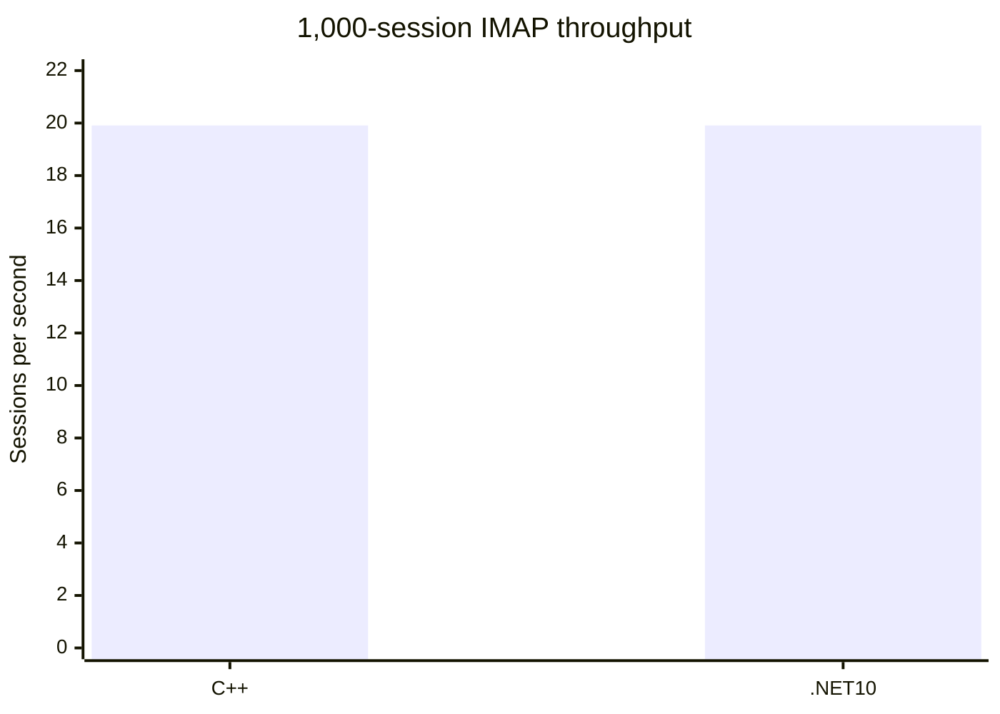
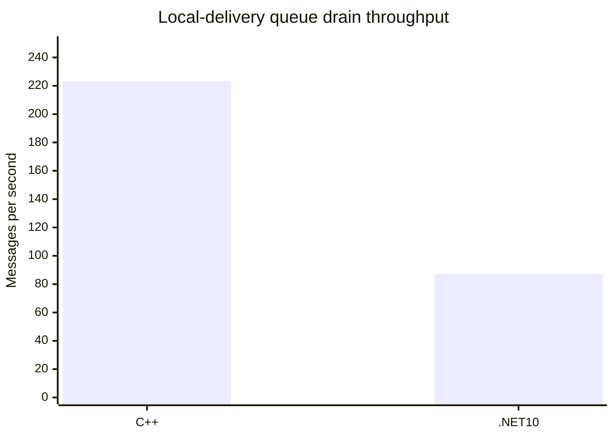
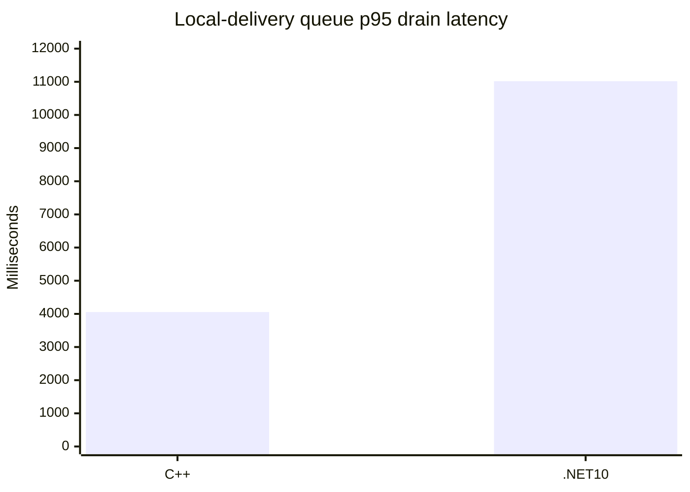
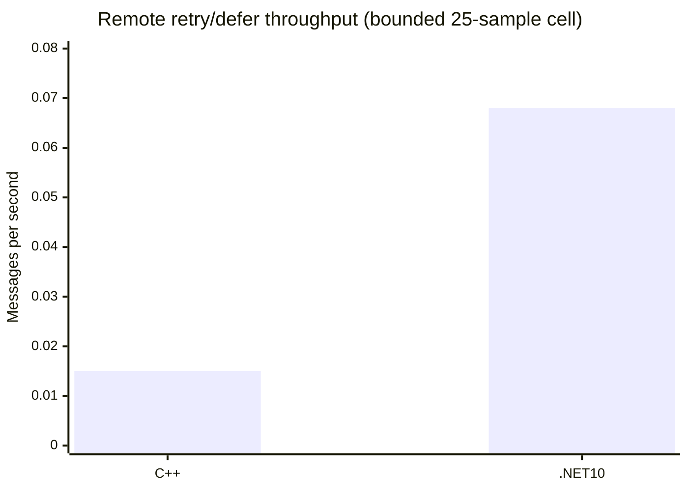
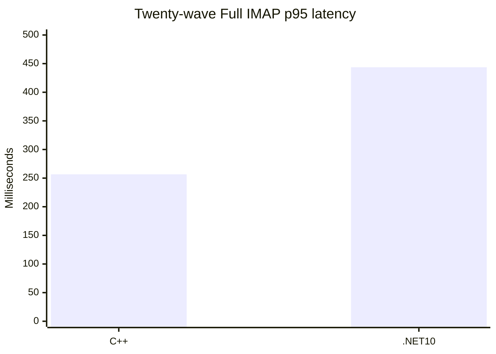

# C++ vs .NET 10 Paired Performance Report

Date: 2026-09-02
Gate: **RED**
Scope: disposable loopback protocol and 1,000-session IMAP acceptance on the
same SQL/Data fixture.

## Result

The disposable legacy C++ server was rebuilt from the supported Release x64
tree and exercised through a temporary SCM service. The service wrapper used
`/DisposableBenchmark /ServiceName=... RunAsService`, ran as `NT AUTHORITY\\LocalService`,
waited for all three loopback listeners, and stopped/deleted the service after
each run. The installed `hMailServer` service and Application registration
were not changed. No C++ production source change was justified by this
evidence; the earlier failure was in the benchmark/fixture environment, not a
proven source-level defect.

Both implementations used the same manifest-bound disposable fixture:

- 1,000 `hm_messages` rows and 1,000 byte-matched Data files.
- Separate SQL clones, one for each implementation.
- `127.0.0.1` with SMTP `2525`, IMAP `1143`, and POP3 `25110`.
- Full protocol sequence: greeting, LOGIN, SELECT INBOX, SEARCH, SORT, LOGOUT.
- Protocol runs: 25 iterations per implementation, zero errors.
- Fixture manifest SHA-256: `913704FA787E829C8E4E890C7193BEC4C377AE69ECE1B3C0D483406C50DD5FB8`.
- C++ executable SHA-256: `B3DF9E8BBF4BEDB1102C94DF7C86356E1FEABCBC02A18E8EABEB1EA1453D09B8`.
- .NET 10 executable SHA-256: `3B69C7C81B8062F38A55E01631F9252A0B4569A42B8D3E4DD37B9D2A509BA598`.

## Protocol latency

Values are milliseconds, p50/p95/p99. Every cell is `25/25 PASS` with zero
errors. These are latency observations, not a universal performance ranking.

| Scenario | C++ p50 | C++ p95 | C++ p99 | .NET 10 p50 | .NET 10 p95 | .NET 10 p99 |
| --- | ---: | ---: | ---: | ---: | ---: | ---: |
| SMTP connection/command | 1.410 | 2.645 | 46.551 | 2.074 | 2.945 | 36.008 |
| IMAP Full SEARCH/SORT | 135.671 | 192.863 | 475.286 | 189.341 | 286.626 | 535.567 |
| POP3 LIST/UIDL/RETR | 2.381 | 3.285 | 3.559 | 16.641 | 27.495 | 35.785 |

```mermaid
xychart-beta
    title "Paired protocol p95 latency (ms)"
    x-axis [SMTP, IMAP, POP3]
    y-axis "Milliseconds" 0 --> 320
    bar [2.645, 192.863, 3.285]
    bar [2.945, 286.626, 27.495]
```

## 1,000 concurrent IMAP sessions

The same Full profile was run with a 50 ms launch stagger and a 15,000 ms
socket timeout. Both runs completed `1,000/1,000` with zero errors and zero
timeouts. The C++ cell was service-backed by the disposable SCM wrapper. The
.NET 10 cell was process-backed by the approved live benchmark runner; it was
not an installed service. This host-mode difference is recorded explicitly,
so this cell is not presented as an apples-to-apples service-lifecycle gate.

| Implementation | Result | p50 ms | p95 ms | p99 ms | Throughput/s | Private bytes after settle | Handles | Threads |
| --- | ---: | ---: | ---: | ---: | ---: | ---: | ---: | ---: |
| Legacy C++ service | PASS 1,000/1,000 | 170.920 | 215.262 | 256.084 | 19.909 | 19.0 MB | 525 | 72 |
| .NET 10 process | PASS 1,000/1,000 | 196.993 | 506.818 | 541.259 | 19.910 | 43.2 MB | 654 | 25 |

```mermaid
xychart-beta
    title "1,000-session IMAP latency"
    x-axis [p50, p95, p99]
    y-axis "Milliseconds" 0 --> 600
    bar [170.920, 215.262, 256.084]
    bar [196.993, 506.818, 541.259]
```

## Normalization limits

The fixture, ports, command sequence, ramp, timeout, and success criteria are
shared. The C++ side uses its native SQL layer and schema `5708`; .NET 10 uses
`Microsoft.Data.SqlClient`, schema `6000`, and a connection pool capped at 100.
The C++ concurrent cell is a disposable SCM service while the .NET 10 cell is
a direct process. The run does not attest CPU affinity, process priority, host
load, or SQL-server load. The deliberate 50 ms launch stagger also controls
the observed completion rate, so `19.91 sessions/s` is not maximum server
capacity.

## Local-delivery queue drain

The same manifest-bound fixture was seeded with 1,000 byte-matched marker
messages in each disposable SQL/Data clone. The C++ side ran through a
temporary `NT AUTHORITY\\LocalService` SCM service; the .NET 10 side ran as a
direct process with its SQL connection and Data directory explicitly bound to
the disposable clone. This queue-only cell intentionally did not require SMTP,
IMAP, or POP3 listeners. Both sides completed `1,000/1,000` local deliveries,
removed the marker queue/recipient rows and files, and restored the original
SQL/Data baseline hashes.

| Implementation | Result | p50 ms | p95 ms | p99 ms | Drain throughput | Private bytes after | Handles | Threads |
| --- | ---: | ---: | ---: | ---: | ---: | ---: | ---: | ---: |
| Legacy C++ service | PASS 1,000/1,000 | 1,473.590 | 4,055.290 | 4,279.550 | 223.060 msg/s | 17.16 MB | 522 | 76 |
| .NET 10 process | PASS 1,000/1,000 | 7,485.040 | 11,017.310 | 11,476.320 | 87.130 msg/s | 44.84 MB | 576 | 28 |

This cell measures time from worker start until each marker appears in the
target Inbox, so the approximately `2.56x` C++/Net10 throughput ratio is a
bounded local-delivery observation, not a product-wide speed-up claim. The
fixture still crosses the legacy schema `5708` and Net10 schema `6000`
boundary, uses the C++ native SQL layer versus `Microsoft.Data.SqlClient`, and
compares a service host with a direct .NET process. The queue seed is direct
SQL/Data setup rather than SMTP admission, and remote retry throughput is not
covered.

Legacy queue anchors inspected for this cell were
`hmailserver/source/Server/SMTP/SMTPDeliveryManager.cpp:67-104`
(`SMTPDeliveryManager::DoWork`),
`hmailserver/source/Server/SMTP/DeliveryTask.cpp:30-36`
(`DeliveryTask::DoWork`),
`hmailserver/source/Server/SMTP/SMTPDeliverer.cpp:69-151`
(`SMTPDeliverer::DeliverMessage`), and
`hmailserver/source/Server/SMTP/DeliveryQueue.cpp:147-160`
(`DeliveryQueue::StartDelivery`). Net10 anchors inspected were
`hmailserver/source/Server.Net10/src/HMailServer.Delivery/DeliveryQueueWorker.cs`,
`DeliveryQueueProcessor.cs`,
`hmailserver/source/Server.Net10/src/HMailServer.Storage.SqlServer/SqlServerDeliveryQueueLeaseStore.cs`,
`SqlServerDeliveryQueueMessageStore.cs`, and
`hmailserver/source/Server.Net10/src/HMailServer.Service/DeliveryQueueProcessorHostedService.cs`.

## Remote TCP 451 retry/defer throughput

The same manifest-bound disposable SQL/Data fixture was exercised with 25
isolated samples per implementation. Each sample used a loopback SMTP sink
that returned `451` on the first recipient attempt and `250` on recovery.
Readback required the transient queue state after `451`, final message and
recipient deletion after recovery, Data-file cleanup, and removal of the
temporary C++ LocalService SCM service. All `25/25` samples passed on both
sides; the aggregate artifact is
`artifacts/benchmarks/paired-cpp-net10-20260902-current/tcp451-retry-throughput-r1/`.

| Implementation | Result | p50 ms | p95 ms | p99 ms | Throughput | Peak private bytes | Peak handles | Peak threads |
| --- | --- | ---: | ---: | ---: | ---: | ---: | ---: | ---: |
| Legacy C++ service | PASS 25/25 | 68,227.938 | 69,409.603 | 69,540.947 | 0.015 msg/s | 158.55 MB | 979 | 76 |
| .NET 10 process | PASS 25/25 | 12,924.178 | 16,383.045 | 39,464.910 | 0.068 msg/s | 83.81 MB | 839 | 79 |

This cell is descriptive only. Its elapsed time is dominated by the legacy
retry scheduler and the compared hosts differ (temporary C++ service versus
direct Net10 test process). The observed Net10/C++ throughput ratio is about
`4.53x` for this cell, not a product-wide speed-up claim. The runner preserves
the no-winner decision and records all per-sample cleanup results in JSON.
The resource columns are evidence for each run, not a comparable memory or
handle ranking: C++ samples the named service process, while the Net10 sample
captures the `dotnet test` launcher and does not include all descendants.
Post-exit zeroes are lifecycle cleanup observations, not leak measurements.

Legacy anchors are `ExternalDelivery::CollectDeliveryResult_` and
`ExternalDelivery::RescheduleDelivery_`
(`hmailserver/source/Server/SMTP/ExternalDelivery.cpp:439-608`),
`SMTPDeliveryManager::GetNextMessage_`
(`hmailserver/source/Server/SMTP/SMTPDeliveryManager.cpp:133`), and
`PersistentMessage::SetNextTryTime`
(`hmailserver/source/Server/Common/Persistence/PersistentMessage.cpp:677`).
Net10 anchors are `DeliveryQueueProcessor.RunBatchAsync` and
`ProcessRecipientResultsAsync`
(`hmailserver/source/Server.Net10/src/HMailServer.Delivery/DeliveryQueueProcessor.cs:57-500`),
`RemoteDeliveryTargetDispatcher`, `SmtpRemoteDeliveryClient.SendAttemptAsync`,
and `SqlServerDeliveryQueueLeaseStore`.

## Twenty-wave IMAP resource repeatability

The existing manifest-bound Full IMAP runner was extended to 20 waves of 100
concurrent sessions per target, with the same 50 ms launch stagger, 5 second
warmup, 5 second settle, and 1,000-message corpus. Both disposable targets
completed `2,000/2,000` sessions with zero errors, zero timeouts, zero readiness
failures, and exact 1,000-row SEARCH/SORT validation.

| Implementation | Result | p50 ms | p95 ms | p99 ms | Throughput | Private growth | Handle growth | Thread growth |
| --- | --- | ---: | ---: | ---: | ---: | ---: | ---: | ---: |
| Legacy C++ service | PASS 2,000/2,000 | 192.971 | 256.640 | 309.167 | 19.466/s | +7,192,576 B | +9 | -6 |
| .NET 10 process | PASS 2,000/2,000 | 192.119 | 443.601 | 735.100 | 19.457/s | +22,933,504 B | +157 | 0 |

The C++ cell used a temporary `NT AUTHORITY\\LocalService` SCM service and
the Net10 cell used a direct disposable process. The result is therefore
repeatability and diagnostic resource evidence, not service-lifecycle parity.
The Net10 settle growth is materially higher in this run and must be explained
by a longer leak/connection-lifecycle investigation before release. This is
not 24-hour leak-free evidence and does not establish a performance winner.
Raw reports are machine-local under
`artifacts/benchmarks/paired-cpp-net10-20260902-soak-cpp-s50/` and
`artifacts/benchmarks/paired-cpp-net10-20260902-soak-net10-s50/`.

The matching Admission-profile resource gate also passed `2,000/2,000` on
each target with zero errors/timeouts. C++ p50/p95/p99 were
`2.109/3.105/4.497 ms` at `20.160/s`; Net10 was
`1.110/1.606/2.346 ms` at `20.131/s`. The standard resource validator passed
Net10 with `+11.363 MiB`, `-4` handles, and `-11` threads after settle. This
Admission result is a bounded gate pass, not 24-hour leak evidence. The Full
profile resource growth above remains an investigation item.

A second manifest-bound Full-profile repeat passed `2,000/2,000` on both
targets with the same 20 waves, 100 sessions per wave, and 50 ms launch
stagger. C++ p50/p95/p99 were `200.219/232.402/275.567 ms` at `19.435/s`,
with settled growth of `+6,094,848` bytes, `+4` handles, and `-6` threads.
Net10 was `212.709/343.659/881.420 ms` at `19.410/s`, with
`+21,483,520` bytes, `+171` handles, and `-1` thread. Net10 private bytes
settled into roughly `41.5-43.7 MB` and handles into `688-695` after wave 3,
so this repeats a startup/retained-resource signal rather than a monotonic
per-wave climb. The two generic report validators passed. This remains
diagnostic evidence, not 24-hour leak acceptance or a performance winner.
Raw reports are machine-local under
`artifacts/benchmarks/paired-cpp-net10-20260902-soak-cpp-s50-r2/` and
`artifacts/benchmarks/paired-cpp-net10-20260902-soak-net10-s50-r2/`.

## Isolated backup/restore round-trip

The disposable Net10 backup -> restore -> backup integration runner passed
`25/25` tests in `55.140 s`, with zero failures and zero skips. It used only
local Integrated Security, uniquely named `hmailserver_net10_*` databases, and
test-owned temporary Data roots; its finally blocks dropped the databases and
deleted the temporary roots. The report and validator are
`artifacts/migration/net10-backup-restore-roundtrip-20260902/` and
`build/test-net10-backup-restore-roundtrip-report.ps1`.

This is isolated functional and rollback-cleanup evidence for Net10. There is
no paired legacy C++ backup timing result, and it does not prove installer,
service, production-data, or production-rollback readiness. Backup/restore
performance and the cross-version semantic comparison remain release gates.

## Disposable SQL Full-Text acceptance

The disposable Net10 Full-Text preparation and live search acceptance passed
`1/1` preparation test and `25/25` loopback `SEARCH TEXT needle` sessions.
Backfill processed all 1,000 message rows and each session returned 1,000
distinct indexed matches. The live runner reports SEARCH p50/p95/p99 of
`11.001/22.849/73.038 ms`; the report validator is
`build/test-net10-live-fts-report.ps1` and passed the same JSON. It verifies
the `live-imap-search-acceptance-v1` schema, exact sample counts, ordered
percentiles, `127.0.0.1:1143`, `hmail_perf_*` SQL, `C:\hmail-perf-*` Data, and
cleanup attestation. Raw JSON/CSV/Markdown evidence is machine-local under
`artifacts/benchmarks/paired-cpp-net10-20260902-current/fts-net10-25-r1/`.

Legacy `IMAPCommandSEARCH::ExecuteCommand` and `DoesMessageMatch_`
(`hmailserver/source/Server/IMAP/IMAPCommandSearch.cpp:40-432`) define the
reference SEARCH response/matching path; the legacy path does not provide the
Net10 SQL Full-Text backfill implementation. This is disposable Net10-only
acceptance, not paired C++ timing or a general performance claim.

## Interpretation and remaining gates

The fresh run proves that the current C++ disposable service path and current
.NET 10 listener can complete the bounded protocol and 1,000-session IMAP
workloads against equivalent data. It does not prove a general speed-up or
performance superiority. The .NET 10 p95/p99 IMAP latency and POP3 latency are
higher in this run, while throughput is effectively equal within benchmark
resolution.

The performance release gate remains **RED** because the following acceptance
cells are still open or not equivalent:

- longer service-backed paired delivery waves and scheduler-capacity evidence;
- 100k-mailbox acceptance for every protocol where required and larger SMTP
  waves;
- 24-hour memory/handle/thread/socket soak with comparable C++ baseline;
- paired backup/restore timing and semantic equivalence;
- service restart and registered COM lifecycle acceptance.

The legacy reference symbols used for the lifecycle and workload comparison
are `ChMailServerModule::RegisterClassObjects`, `ServiceMain`,
`SMTPDeliveryManager::DoWork`, `SMTPDeliverer::DeliverMessage`,
`IMAPClient`/`IMAPConnection` command handling, and
`POP3Connection::ProtocolLIST_`/`ProtocolUIDL_`. Net10 equivalents are
`Host`, `DeliveryQueueProcessor`, `SmtpRemoteDeliveryClient`, `ImapSession`,
and `Pop3Session`.

Raw JSON and process evidence remain machine-local under
`artifacts/benchmarks/paired-cpp-net10-20260902-current/`; they are not
committed because they contain machine-specific paths and runtime evidence.
