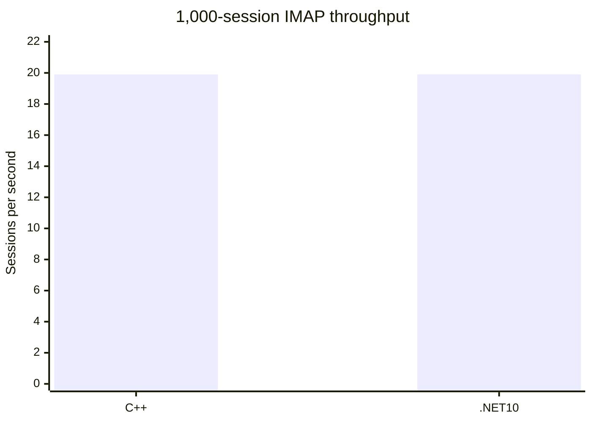
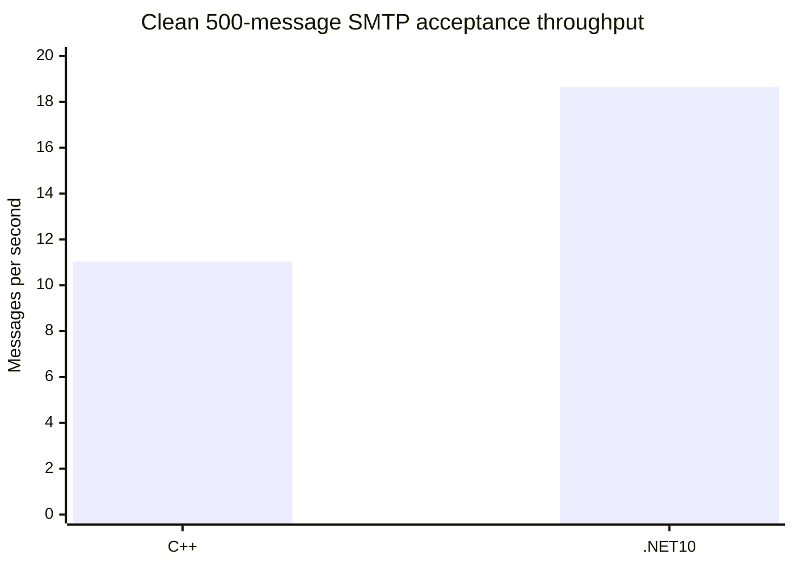
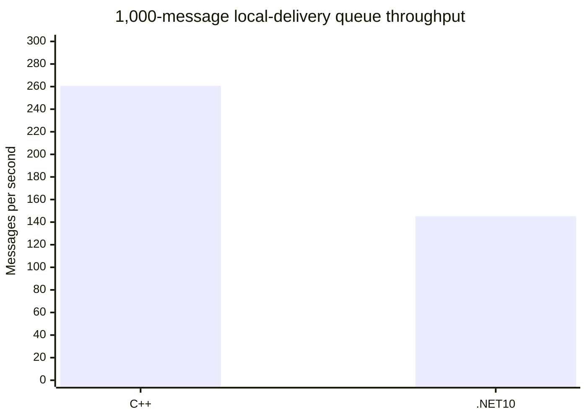
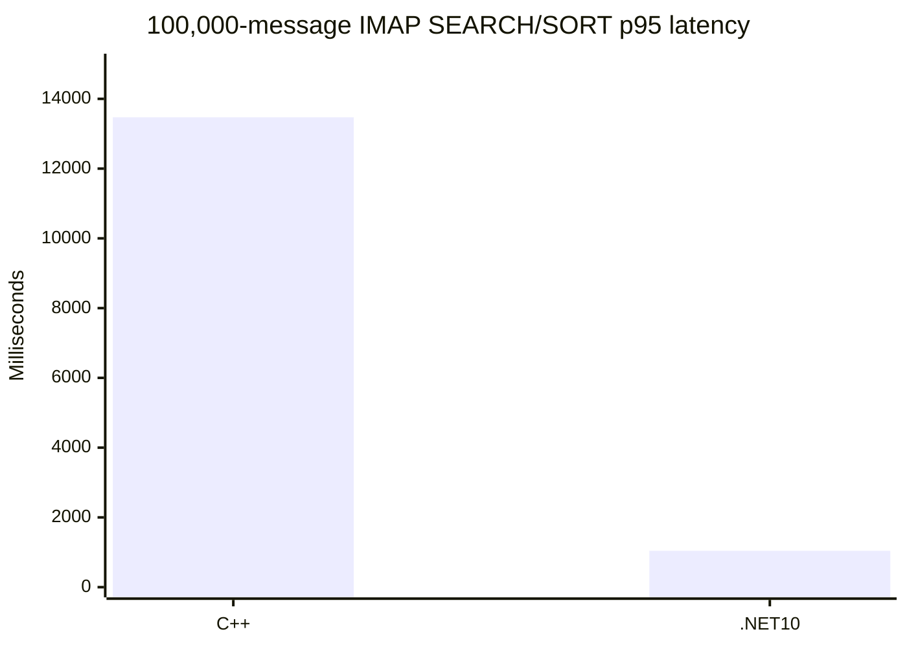
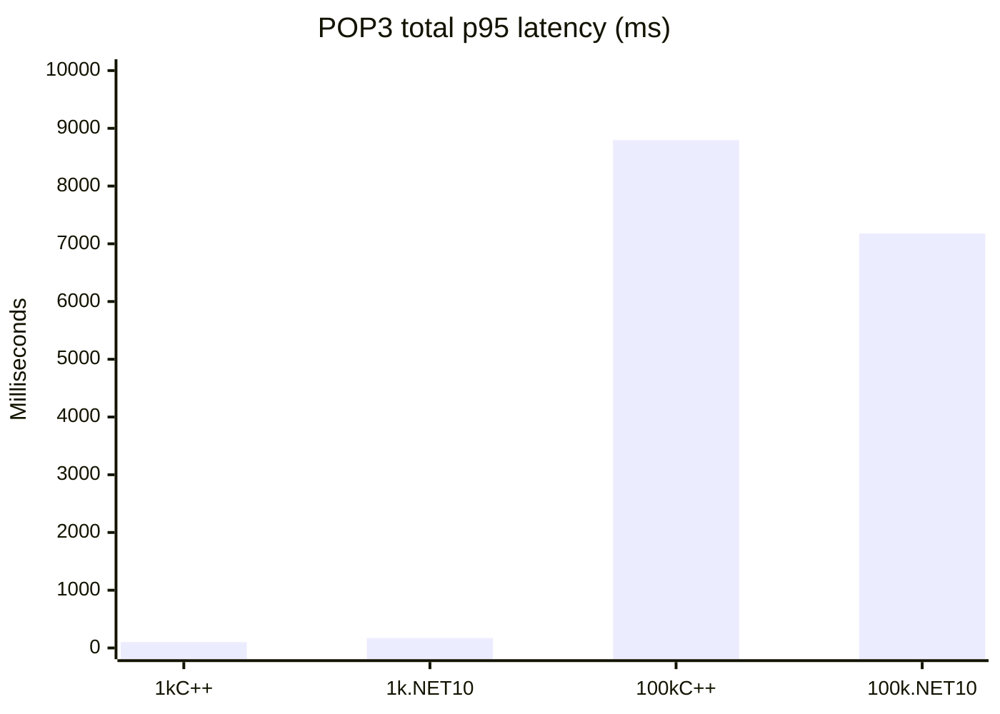
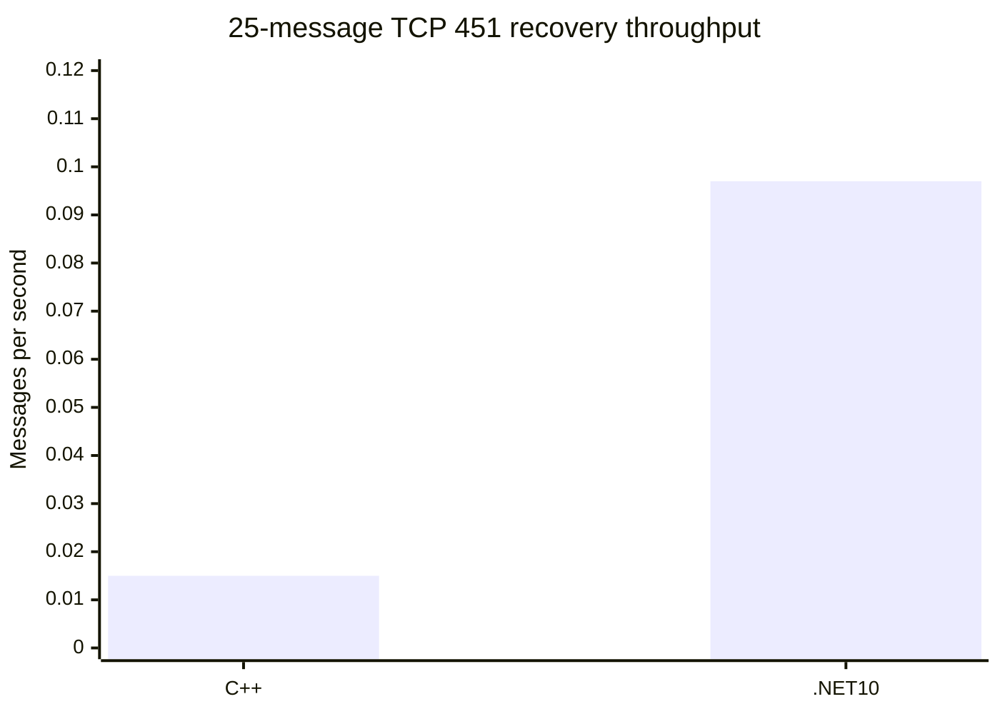

# C++ vs .NET 10 Paired Performance Report

Date: 2026-09-03
Gate: **RED**
Scope: disposable loopback protocol, SMTP acceptance, 1,000-session IMAP,
100,000-message IMAP SEARCH/SORT, and 1,000/100,000-message POP3 acceptance.

## Executive result

The legacy C++ side is now usable as a disposable service-backed benchmark
target. The earlier native startup failure was caused by the disposable INI
`ProgramFolder` pointing at the staging root instead of its `Bin` directory;
the corrected C++ service starts with `RunAsService`, binds the disposable
loopback ports, and is removed by the benchmark wrapper after each run.

The paired measurements below are evidence, not a product-wide speed claim.
There is no universal winner. The 1,000-session IMAP throughput is effectively
equal, while latency and message-acceptance results vary by workload. The
performance release gate remains **RED** because the required SQL FTS parity,
delivery/remote retry matrix, backup/restore timing, installer/COM lifecycle,
and long-soak acceptance are not all complete.

## Fixture and execution evidence

The protocol, concurrent IMAP, and clean SMTP cells use fixture manifest
`hmail-perf-pair-service-20260901-clean`, SHA-256
`9AFBE72146AE416CD88667F608C924764E2361A6BF62860A36EE1F391C823C5B8`.
The 1,000-message POP3 cells use
`hmail-perf-pair-current-20260902-provisioned`, manifest SHA-256
`913704FA787E829C8E4E890C7193BEC4C377AE69ECE1B3C0D483406C50DD5FB8`.
The 100,000-message POP3 cells use
`hmail-perf-pair-100k-20260901`, manifest SHA-256
`DE4DA2CDCDA01B1BE6D8C9BC98A377167205E940722D2BBCEE98A15A16ACB23A`.

Each run verified the same message-row count, message-content hash, Data-file
count, Data-byte count, and Data hash at run start. Each implementation used a
separate disposable SQL clone and its own Data directory. All listeners were
loopback-only: SMTP `2525`, IMAP `1143`, and POP3 `25110`.

The C++ protocol, 1,000-session IMAP, and clean SMTP runs used the disposable
SCM service wrapper with `NT AUTHORITY\\LocalService` and service name
`HMailPerf20260903`. The .NET 10 runs used the approved live process runner;
they were process-backed, not installed-service runs. POP3 uses the existing
direct-process large-mailbox runner for both targets. This host-mode difference
is recorded deliberately and prevents an installed-service lifecycle claim.

Executable hashes observed in the current runs:

| Target | SHA-256 |
| --- | --- |
| Legacy C++ `hMailServer.exe` | `B3DF9E8BBF4BEDB1102C94DF7C86356E1FEABCBC02A18E8EABEB1EA1453D09B8` |
| .NET 10 protocol/IMAP executable | `B4F9954DE405D93AE6AB9CD556340F57D4370596010426F56BF55932CB12C603` |
| .NET 10 1,000-message POP3 executable | `3B69C7C81B8062F38A55E01631F9252A0B4569A42B8D3E4DD37B9D2A509BA598` |
| .NET 10 100,000-message POP3 executable | `EBBF2395E8933C7BACE46AD51D451033745819B4B168934194C43B3B5121FAED` |

## Protocol latency, 25 iterations

All cells passed `25/25` with zero errors. Values are milliseconds; lower is
better. The ratio is descriptive only: `Net10/C++` above `1.0x` means higher
Net10 latency.

| Scenario | C++ p50 | C++ p95 | C++ p99 | .NET 10 p50 | .NET 10 p95 | .NET 10 p99 | Net10/C++ p95 |
| --- | ---: | ---: | ---: | ---: | ---: | ---: | ---: |
| SMTP connection/command | 1.346 | 2.264 | 12.828 | 0.906 | 23.725 | 29.854 | 10.479x |
| IMAP Full SEARCH/SORT | 143.373 | 232.942 | 355.526 | 196.053 | 324.948 | 573.912 | 1.395x |
| POP3 LIST/UIDL/RETR | 2.713 | 3.156 | 3.959 | 17.251 | 28.244 | 37.576 | 8.949x |

```mermaid
xychart-beta
    title "Paired protocol p95 latency (ms)"
    x-axis [SMTP, IMAP, POP3]
    y-axis "Milliseconds" 0 --> 340
    bar [2.264, 232.942, 3.156]
    bar [23.725, 324.948, 28.244]
```

## 1,000 concurrent IMAP sessions

The Full profile used 1,000 sessions, five waves, a 50 ms launch stagger, and
a 15,000 ms socket timeout. Both targets completed `5,000/5,000` sessions with
zero errors and zero timeouts.

| Implementation | Result | p50 ms | p95 ms | p99 ms | Throughput/s | Private bytes after settle | Handles | Threads |
| --- | ---: | ---: | ---: | ---: | ---: | ---: | ---: | ---: |
| Legacy C++ disposable service | PASS 5,000/5,000 | 221.443 | 326.243 | 447.752 | 19.904 | 22.13 MiB | 535 | 70 |
| .NET 10 process | PASS 5,000/5,000 | 229.220 | 376.039 | 669.006 | 19.908 | 40.59 MiB | 675 | 24 |

Net10/C++ is `1.153x` at p95, `1.494x` at p99, and `1.000x` by throughput
after rounding. The launch stagger controls the completion rate, so this is
not maximum server capacity or a leak result.

```mermaid
xychart-beta
    title "1,000-session IMAP latency"
    x-axis [p50, p95, p99]
    y-axis "Milliseconds" 0 --> 700
    bar [221.443, 326.243, 447.752]
    bar [229.220, 376.039, 669.006]
```

## SMTP message acceptance, clean 500-message cell

Both sides started from the same manifest-bound 1,000-message fixture and
accepted `500/500` messages with zero errors. The run intentionally leaves the
accepted rows/files in each disposable clone for post-run accounting; it does
not touch production SQL or Data.

| Implementation | Result | p50 ms | p95 ms | p99 ms | Throughput |
| --- | ---: | ---: | ---: | ---: | ---: |
| Legacy C++ disposable service | PASS 500/500 | 7.896 | 177.115 | 466.122 | 11.032 msg/s |
| .NET 10 process | PASS 500/500 | 4.969 | 6.749 | 30.207 | 18.648 msg/s |

For this cell only, Net10 throughput is `1.690x` the C++ measurement and p95
is lower. The C++ p95/p99 tail is unusually high in this run, so this must be
repeated before using it as an optimization claim.

## SMTP repeatability, three fresh fixtures

To separate run variance from the single clean cell above, three additional
independent paired fixtures were provisioned from the same 1,000-message
backup/Data baseline. Each target accepted `500/500` messages with zero errors.
These runs used the same C++ disposable service wrapper and Net10 process
runner; lower latency is better and higher throughput is better.

| Fixture | Implementation | p50 ms | p95 ms | p99 ms | Throughput |
| --- | --- | ---: | ---: | ---: | ---: |
| r4 | Legacy C++ service | 6.687 | 7.542 | 8.593 | 19.653 msg/s |
| r4 | .NET 10 process | 5.406 | 6.982 | 7.809 | 18.703 msg/s |
| r5 | Legacy C++ service | 6.779 | 9.712 | 10.834 | 19.385 msg/s |
| r5 | .NET 10 process | 5.128 | 6.434 | 8.749 | 19.488 msg/s |
| r6 | Legacy C++ service | 6.826 | 10.178 | 14.356 | 19.256 msg/s |
| r6 | .NET 10 process | 5.008 | 6.419 | 7.695 | 19.335 msg/s |
| Average | Legacy C++ service | 6.764 | 9.144 | 11.261 | 19.431 msg/s |
| Average | .NET 10 process | 5.181 | 6.612 | 8.084 | 19.175 msg/s |

The three-run average is effectively tied on throughput (`0.987x` Net10/C++).
Net10 had lower average p95 by `2.532 ms` in this small local workload. This
repeat removes the earlier single-run outlier from
any general interpretation; neither side is declared a product-wide winner.

An independent r7 fixture additionally ran with local-delivery readback and
passed the focused paired validator: C++ `500/500`, p95 `7.944 ms`, throughput
`19.386 msg/s`; Net10 `500/500`, p95 `6.898 ms`, throughput `18.687 msg/s`.
Both began with 1,000 rows, reached 1,500 rows, proved the readback state, and
reported valid post-run accounting. This confirms the acceptance and cleanup
path, but it is not a replacement for larger delivery/queue testing.

## Local-delivery queue drain, 1,000 messages

The current manifest-bound queue cell seeded 1,000 marker messages in each
disposable SQL/Data clone, drained them through the C++ disposable SCM service
and Net10 process, and restored both SQL/Data baselines. Both sides passed
`1000/1000`; marker rows/files were absent after cleanup.

| Implementation | Result | p50 ms | p95 ms | p99 ms | Throughput | Baseline cleanup |
| --- | ---: | ---: | ---: | ---: | ---: | ---: |
| Legacy C++ disposable service | PASS 1000/1000 | 1,178.437 | 3,421.946 | 3,628.268 | 260.688 msg/s | PASS |
| .NET 10 process | PASS 1000/1000 | 3,911.817 | 6,696.517 | 6,887.304 | 145.195 msg/s | PASS |

The bounded Net10/C++ throughput ratio is `0.557x`; C++ is faster in this
queue-only cell. This is not a product-wide speed claim. The fixture uses
legacy schema `5708` versus Net10 schema `6000`, and the hosts differ between
service-backed C++ and process-backed Net10. The first attempt was correctly
blocked by the existing COM registration because this queue launcher did not
disable the Net10 COM local server; the benchmark-only environment assignment
`HMAILSERVER_COM_LOCAL_SERVER_ENABLED=false` now matches the SMTP runner and
is covered by `build/test-paired-local-delivery-queue.ps1`.

## 100,000-message IMAP SEARCH/SORT acceptance

The same 100,000-message SQL/Data fixture was exercised with one Full-profile
session per implementation. Both targets returned the exact `1..100000`
sequence for SEARCH and SORT, with `1/1` successful sessions and zero errors.

| Implementation | Result | p50 ms | p95 ms | p99 ms | Throughput/s | Private bytes after settle | Handles | Threads |
| --- | ---: | ---: | ---: | ---: | ---: | ---: | ---: | ---: |
| Legacy C++ disposable service | PASS 1/1 | 13,471.490 | 13,471.490 | 13,471.490 | 0.074 | 61.61 MiB | 514 | 72 |
| .NET 10 process | PASS 1/1 | 1,043.234 | 1,043.234 | 1,043.234 | 0.953 | 44.37 MiB | 526 | 25 |

The bounded Net10/C++ latency ratio is `0.077x` and the throughput ratio is
`12.878x` for this one-session cell. This is not a universal speed-up claim:
the hosts differ (C++ service-backed versus Net10 process-backed), the sample
count is one per side, and SQL query state is asymmetric. The read-only query
state collector found the C++ database has no `hm_message_search_documents`
table or Full-Text catalog, while Net10 has 100,000 indexed documents and one
Full-Text catalog. Therefore this cell proves live SEARCH/SORT acceptance and
timing for each implementation, but it does **not** prove SQL Full-Text parity.

The exact legacy anchor is `IMAPCommandSEARCH::ExecuteCommand` and
`DoesMessageMatch_` in
`hmailserver/source/Server/IMAP/IMAPCommandSearch.cpp:40-432`. The exact
commands are generated by `build/benchmark-net10-live-concurrent-imap.ps1`:
`LOGIN; SELECT INBOX; SEARCH TEXT needle; SORT (DATE) UTF-8 ALL; LOGOUT`.
The C++ service wrapper is
`build/benchmark-disposable-cpp-service-protocol.ps1`. Both reports were
validated by `build/test-net10-live-concurrent-imap.ps1` with expected
concurrency `1`, waves `1`, and message count `100000`.

The paired SQL state was collected read-only by
`build/collect-imap-query-state.ps1` and validated by
`build/test-collect-imap-query-state.ps1`. This is the evidence needed for the
next FTS slice: a legacy-compatible scan/index strategy must be selected before
claiming Full-Text performance equivalence.

## POP3 large mailbox

The 1,000-message mailbox passed `25/25` iterations on both targets. The
100,000-message mailbox passed `3/3` iterations on both targets. No messages
were deleted or changed by the read-only workload.

| Mailbox | Implementation | Result | p50 ms | p95 ms | p99 ms |
| ---: | --- | ---: | ---: | ---: | ---: |
| 1,000 | Legacy C++ | PASS 25/25 | 58.648 | 100.865 | 140.570 |
| 1,000 | .NET 10 | PASS 25/25 | 61.373 | 171.597 | 198.003 |
| 100,000 | Legacy C++ | PASS 3/3 | 6,282.784 | 8,794.889 | 9,018.187 |
| 100,000 | .NET 10 | PASS 3/3 | 6,607.938 | 7,177.200 | 7,227.801 |

The 100,000-message result is not directly comparable to the 1,000-message
result because mailbox size dominates the operation. At 100,000 messages Net10
was lower on p95 and p99; at 1,000 messages C++ was lower. This reinforces the
no-universal-winner conclusion.

## TCP 451 retry/defer recovery, 25 messages

The same manifest-bound retry cell sent 25 messages through each disposable
target with a deterministic loopback sink returning `451` on the first
attempt and `250` on recovery. Both implementations completed `25/25` with
zero errors, zero timeouts, and cleanup of every per-iteration SQL/Data clone.

| Implementation | Result | p50 ms | p95 ms | p99 ms | Throughput | Cleanup |
| --- | ---: | ---: | ---: | ---: | ---: | ---: |
| Legacy C++ disposable service | PASS 25/25 | 66,190.728 | 66,971.866 | 67,367.404 | 0.015 msg/s | PASS |
| .NET 10 process | PASS 25/25 | 9,609.576 | 10,123.811 | 23,982.852 | 0.097 msg/s | PASS |

The cell is descriptive retry/recovery evidence only. Its elapsed time is
dominated by implementation-specific retry scheduling, so no throughput or
latency winner is claimed. It does not replace remote-delivery retry coverage,
longer queue waves, or service/COM lifecycle acceptance. The retry launcher
sets `HMAILSERVER_COM_LOCAL_SERVER_ENABLED=false` for the isolated Net10 child;
the first attempt exposed that harness precondition and was preserved as a
non-production failed artifact.

## Paired backup evidence, semantic comparison still RED

The disposable C++ service was authenticated through the legacy COM
`Application.Authenticate` path and executed `Settings.Backup` plus
`BackupManager.StartBackup` with mode `15` (settings, domains, messages, and
compression) against the paired disposable C++ SQL/Data clone. The corrected
disposable service used the rebuilt stage executable
`28BD6E090E7412F9D9194FDED1AEA31BE6941232E7B7DE44E5C3683C3CA8DAA0`; COM
backup completed in `3.633 s`, produced a `7,330` byte 7z archive, and left
the installed Application registry graph unchanged. No production service,
database, Data directory, or DCOM configuration was used.

The matching Net10 run used its paired SQL/Data clone and produced a `15,691`
byte 7z archive. The retained payload comparator found `1000/1000`
DataBackup files equal by length and SHA-256. XML comparison remains `FAIL`
for explicit compatibility differences: C++ emits empty top-level containers
that Net10 currently omits, password hashes contain independent salts, and
Net10 excludes `smtprelayerpassword` from its settings projection. The Net10
account backup projection now follows legacy
`PersistentAccount::ReadObject` (`hmailserver/source/Server/Common/Persistence/PersistentAccount.cpp:146-195`):
plaintext password rows are converted to the preferred salted SHA-256 format
before serialization, and the backup SQL projection preserves the full
`yyyy-MM-dd HH:mm:ss` vacation-expiry value. The focused SQL regression is
`BackupAccounts_HashPlaintextRowsWithLegacySaltedSha256`.

This is paired archive evidence, not a backup speed ratio: the Net10 runner did
not capture an equivalent elapsed-time sample. Exact XML semantic equivalence,
backup timing acceptance, installed COM lifecycle, and production rollback
remain open. The performance gate remains **RED**.

## Previously accepted cells not rerun in this report

The 2026-09-02 report records the earlier disposable cells: Net10 Full-Text
backfill/search and normalized 20-wave IMAP repeatability.
Those results remain bounded evidence, but they are not silently merged into
the current run's fixture or host-mode claims. See
[`CPP_VS_NET10_PERFORMANCE_REPORT_20260902.md`](CPP_VS_NET10_PERFORMANCE_REPORT_20260902.md)
for their exact artifacts and limitations.

## Legacy anchors and benchmark commands

The protocol behavior exercised here is anchored in the legacy C++ protocol
workers, including `SMTPConnection`, `IMAPConnection`, and `POP3Connection` in
`hmailserver/source/Server/SMTP/SMTPConnection.cpp`,
`hmailserver/source/Server/IMAP/IMAPConnection.cpp`, and
`hmailserver/source/Server/POP3/POP3Connection.cpp`. The concurrent IMAP
workload exercises legacy login, SELECT, SEARCH/SORT, and logout behavior;
legacy SEARCH/SORT implementation anchors are
`IMAPCommandSEARCH::ExecuteCommand` and `DoesMessageMatch_` in
`hmailserver/source/Server/IMAP/IMAPCommandSearch.cpp:40-432`.

The exact runners used were:

- `build/benchmark-disposable-cpp-service-protocol.ps1`
- `build/benchmark-net10-live-protocol.ps1`
- `build/benchmark-net10-live-concurrent-imap.ps1`
- `build/benchmark-net10-live-smtp-acceptance.ps1`
- `build/benchmark-net10-live-pop3-large-mailbox.ps1`

Every runner emitted JSON and CSV plus a Markdown cell summary. The raw
machine-specific evidence is under the local
`artifacts/benchmarks/paired-cpp-net10-20260903-current/` directory and is not
part of the tracked GitHub report because it contains local SQL/Data paths.

## Validation

The .NET 10 prerequisite check passed with .NET SDK/runtime `10.0.301/10.0.9`,
MSBuild 17.x, Visual C++ build tools, and Windows SDK MIDL available. The full
Debug suite then passed `2,804` tests with `95` skips and `0` failures out of
`2,899`. The skipped cases are opt-in SQL/IIS/restore/installer/integration
tests whose environment is intentionally not enabled by the normal suite.

After the benchmark runs, the disposable legacy service was restarted and
verified as `Running` under `LocalSystem`, with executable
`C:\hMailServer57-Legacy-Disposable\Bin\hMailServer.exe`; COM activation
returned version `1.0.0-B0`. The service listens only on `127.0.0.1` for
SMTP `2525`/`2587`, POP3 `2110`, and IMAP `2143`. No production service,
database, Data directory, registry identity, or DCOM permission was changed.

## Gate decision and next work

**Performance release gate: RED.** These runs fix the former C++ disposable
service blocker and establish reproducible paired protocol/SMTP/IMAP/POP3
evidence. They do not prove production readiness. The next performance slices
are: repeat the clean SMTP cell enough to establish variance, pair SQL FTS
query timing against a legacy fixture, complete delivery/queue and remote
retry matrices, then run the defined long resource soak and service/COM
lifecycle acceptance. No speed-up percentage should be advertised outside the
individual bounded cells above.
