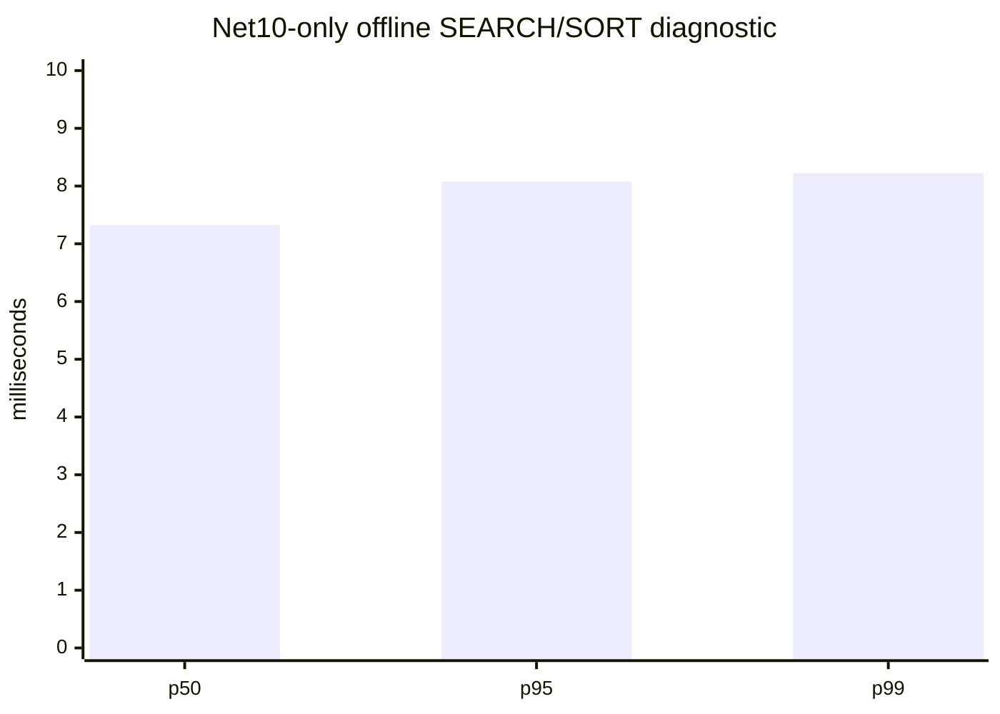

# .NET 10 Benchmark Pack

## Current Net10 delivery queue diagnostic, 100 messages (2026-09-01)

The clean manifest-bound 100k disposable fixture produced `100/100` local
delivery commits at `81.673` messages/s, with p50/p95/p99 of
`4.193/6.362/10.396 ms`. SQL readback proved one unlocked, lease-free type-1
retry row with retry count `1`, a future next-try timestamp, and one retained
recipient. JSON/CSV/Markdown evidence is under
`artifacts/benchmarks/review-20260901/net10-delivery-queue-100/`.

This is Net10-only bounded evidence. There is no equivalent C++ queue runner,
and the host was not service-backed, so no parity ratio or winner is claimed;
the release gate remains **RED**. Validate the report with
`build/test-net10-delivery-queue-report.ps1`.

## Current paired SMTP acceptance, 500 messages (2026-09-01)

The disposable C++ service and Net10 each passed `500/500` SMTP messages with
zero errors and exact local-delivery readback on the same fixture-bound SQL,
Data, and loopback port. C++ p50/p95/p99 were `6.793/8.605/15.162 ms` at
`19.010` messages/s; Net10 was `3.976/5.875/10.052 ms` at `18.934` messages/s.
The ratios are descriptive for one bounded cell and do not establish a general
winner. The release gate remains **RED**. See
`artifacts/benchmarks/paired-cpp-net10-20260901-delivery/smtp-acceptance-500-comparison.md`
and `smtp-acceptance-500.png`.
The readback runner leaves accepted messages and Data files for accounting;
future runs must provision a fresh manifest-bound fixture.

## Current paired TCP 451 recovery (2026-09-01)

The paired C++/Net10 recovery harness in code/test commit `b4319db45` used the
same loopback sink and disposable SQL/Data fixture. Each implementation
retained one queue row and recipient after RCPT `451` without DATA, then
completed with RCPT `250` and DATA and removed the message file. Cleanup passed
for the disposable LocalService SCM service, route, SQL principal, message,
recipient, and Data file. JSON/CSV/Markdown evidence is under
`artifacts/benchmarks/paired-cpp-net10-20260901-delivery/cpp-tcp451-recovery/`;
the Net10 evidence is under `net10-tcp451-recovery.*`. This is correctness
evidence only; larger waves, capacity, soak, and release gates remain **RED**.

## Current paired TCP 451 retry-state evidence (2026-09-01)

Code/test commit `c1055f349` added a disposable paired harness. C++ and Net10
both exercised the same loopback sink protocol, received RCPT `451`, sent no
DATA, retained type-1 queue state and the recipient, cleared the lease,
incremented retry count to `1`, retained the Data file, and passed cleanup.
This is bounded initial transient-state correctness only; retry recovery,
larger waves, and performance acceptance remain open and the gate is **RED**.
Evidence is under
`artifacts/benchmarks/paired-cpp-net10-20260901-delivery/cpp-tcp451-retry/`.

## Current Net10 TCP 451 retry-state evidence (2026-09-01)

A disposable opt-in test exercised a real loopback SMTP `451` through the
Net10 remote client and delivery queue. Readback proved `messagetype=1`, an
unlocked cleared lease, retry count `1`, future next-try, one retained
recipient, two deferred status events, and no DATA. This is component-level
correctness evidence only; paired C++ retry and performance acceptance remain
open and the gate is **RED**. Evidence is under
`artifacts/benchmarks/paired-cpp-net10-20260901-delivery/net10-tcp451-retry.*`.

## Current paired SMTP local-delivery readback (2026-09-01)

The service-backed C++ and Net10 SMTP runners each accepted 25/25 messages on
the same disposable manifest-bound fixture and proved exact local-delivery
readback: 25 type-2 Inbox rows, 25 Data files, and zero recipient rows per
implementation. C++ p50/p95/p99 were `6.845/10.835/46.054 ms` at `18.706`
messages/s; Net10 was `5.336/29.166/67.014 ms` at `18.099`. This is bounded
evidence, not a general winner claim. The release gate is **RED**. Compact
CSV/Markdown/SVG evidence is under
`artifacts/benchmarks/paired-cpp-net10-20260901-delivery/`.

## Current paired acceptance (2026-09-01)

The first valid paired 100,000-message IMAP SEARCH/SORT acceptance used the
same manifest-bound SQL/Data fixture, SQL Server, loopback `127.0.0.1:1143`,
and `Full` profile for the disposable C++ service and Net10. Both sides
passed exact SEARCH and SORT validation (`100000/100000`). C++ p50/p95/p99
were `15849.605/15849.605/15849.605 ms` at `0.063` sessions/s; Net10 was
`846.875/846.875/846.875 ms` at `1.170` sessions/s.

Manifest SHA-256:
`DE4DA2CDCDA01B1BE6D8C9BC98A377167205E940722D2BBCEE98A15A16ACB23A`.
Each side contained 100,000 SQL messages and 100,000 byte-matched Data files.
The compact CSV, Markdown, and SVG evidence is under
`artifacts/benchmarks/paired-cpp-net10-20260901-100k/`.

The measured single-session p50 ratio is `18.715` C++/Net10. This is bounded
acceptance evidence, not a general performance claim. The release gate stays
**RED** pending C++ 500/1000-session capacity, larger SMTP/delivery/queue,
backup/restore timing, installer/COM lifecycle, and 24-hour soak acceptance.

## Current offline diagnostic (2026-08-21)

The latest deterministic 100,000-message SEARCH/SORT harness passed with
`9091/9091` matches. Measured p50/p95/p99 were `8.725/9.426/9.614 ms`; JSON,
CSV, and Markdown evidence is under
`artifacts/benchmarks/offline-net10-current-b89fb81f2/`. The JSON records
source commit `b89fb81f24a3fc343b7fbe6885e21c2e4976ed2d`.

This is an in-memory Net10-only diagnostic. It is not SQL Full-Text, live
IMAP, C++ comparison, speedup evidence, or 24-hour soak acceptance. The paired
performance gate remains **RED**.

## Clean paired-fixture rerun (2026-08-13)

The fresh disposable pair
`hmail_perf_pair_cpp_clean_20260813_1300` /
`hmail_perf_pair_net10_clean_20260813_1300` was equivalent at start state:
37 table row counts equal, 1,000 equal-SHA-256 Data files per side, active
domain/account/Inbox, Full-Text ready, and SMTP/IMAP/POP3 on
`127.0.0.1:2525/1143/25110`.

Net10 passed the paired-shape workloads: SMTP acceptance `25/25`, protocol
SMTP/IMAP/POP3 `25/25` each, IMAP-1000 `1000/1000`, FTS SEARCH `25/25`, queue
`50/50`, and POP3 large mailbox `5/5`. The current raw Net10 p50/p95 values
are `5.507/6.783` SMTP acceptance, `0.714/1.282` SMTP, `11.394/16.292` IMAP,
`13.346/25.311` POP3, `2411.337/3597.804` IMAP-1000,
`9.168/12.803` FTS, `5.580/11.050` queue, and `77.263/357.381` POP3-large.

The C++ process was not started: Registry32 still resolves the installed
legacy path `C:\hMailServer57-Test\Bin`, and the safe preflight refuses a
disposable target because `/Debug` startup can write the installed AppID
registration. The release gate is **RED**; no ratio or winner is valid.

See `PERFORMANCE_COMPARISON_REPORT.md` for the full gate decision and
`artifacts/benchmarks/live-cpp-net10-20260813/` for JSON/CSV/Markdown output.

## Current authoritative live gate (2026-08-11)

Code/test commit `2737ff625` also corrected live protocol process-resource
serialization. A bounded run completed 300 SMTP, 300 IMAP, and 300 POP3
sessions (`900/900`, zero errors) against the disposable pair. p95 latency was
`0.889/13.369/14.791 ms`; process growth was `22,581,248` private bytes,
`144` handles, and `2` threads. Evidence is under
`artifacts/benchmarks/live-cpp-net10-20260811/net10-protocol-soak-300/`.
This is Net10-only bounded evidence; it is not a 24-hour soak or a C++ ratio.

Code/test commit `46db432c6` verified the equal disposable SQL/Data/message
pair and Net10 live acceptance: SMTP acceptance `25/25`, SMTP/IMAP/POP3
protocol `25/25`, concurrent IMAP `1000/1000`, and IMAP Full-Text
`SEARCH TEXT needle` `25/25` with 1,000 matches per session. The live FTS
benchmark reports SEARCH p50/p95/p99 of `7.900/12.802/21.557 ms` and clears
its disposable search state after the run.

The delivery-queue benchmark now processes 50 local messages through the real
SQL queue and Inbox path with `50/50` commits, `73.308` messages/s, and
p50/p95/p99 batch latency `4.376/8.405/48.484 ms`. Its controlled transient
target proves SQL defer state without network access: the row remains queued,
unlocked, retry count 1, future next-try, and recipient retained. Run it with:

```powershell
powershell.exe -NoProfile -ExecutionPolicy Bypass -File .\build\benchmark-net10-live-delivery-queue.ps1 `
  -MessageCount 50 `
  -BenchmarkStagingRoot C:\hmail-perf-pair-20260811_1748\net10 `
  -BenchmarkDatabase hmail_perf_pair_net10_20260811_1748
```

The JSON/CSV/Markdown output is under
`artifacts/benchmarks/live-cpp-net10-20260811/net10-live-delivery-queue/`.
The run also caught and fixed a Turkish-collation Inbox lookup in
`SqlServerLocalDeliveryStore` by using `UPPER(foldername) = N'INBOX'`.

The POP3 large-mailbox benchmark completes five real loopback sessions against
the 1,000-message fixture, requiring `STAT`, full `LIST`, full `UIDL`, and
`RETR 1`, while verifying the SQL mailbox remains `1000/1000`. It reports
total p50/p95/p99 `54.757/290.599/333.589 ms`, LIST p50/p95
`14.963/56.093 ms`, UIDL p50 `15.060 ms`, and RETR p50 `1.466 ms`.
The report is under
`artifacts/benchmarks/live-cpp-net10-20260811/net10-pop3-large-mailbox/`.

The disposable restart lifecycle runner starts the isolated Net10 host twice,
checks PID ownership and SMTP/IMAP/POP3 banners on `127.0.0.1:2525`, `1143`,
and `25110`, then verifies port release after stop. It passed `2/2` cycles;
start-ready p50 was `1636.538 ms` and stop p50 was `1546.317 ms`. Evidence is
under `artifacts/benchmarks/live-cpp-net10-20260811/net10-restart-lifecycle/`.
COM local server is intentionally disabled, so this is not Windows service or
out-of-process COM evidence.

The external-fetch benchmark uses a real loopback POP3 fixture and the
disposable SQL fetch-account store for five successive ten-message cycles. It
passed `50/50` downloaded/accepted messages, retained the current ten UID rows,
released every lease, and cleaned temporary SQL rows to `0/0`; the latest cycle
p50/p95/p99 was `23.998/24.229/24.229 ms`. Run it with:

```powershell
powershell.exe -NoProfile -ExecutionPolicy Bypass -File .\build\benchmark-net10-live-external-fetch.ps1 `
  -BenchmarkDatabase hmail_perf_pair_net10_20260811_1748 `
  -BenchmarkDataRoot C:\hmail-perf-pair-20260811_1748\net10\Data
```

Evidence is under `artifacts/benchmarks/live-cpp-net10-20260811/net10-external-fetch/`.
This is Net10-only evidence; the paired C++ performance gate remains RED.

The legacy C++ process remains blocked by the read-only registry/configuration
preflight because legacy `/Debug` startup would write the installed AppID
registration. The paired performance gate remains **RED**; no ratio, regression
percentage, or winner is valid until the identical matrix runs in a registry-
isolated C++ environment. See
`hmailserver/source/Server.Net10/PERFORMANCE_COMPARISON_REPORT.md` for the
full evidence and remaining delivery, retry, queue, and soak gates.

## Historical paired-fixture gate (superseded, 2026-08-11)

Tool commit `7e58324d7` upgrades
`build/collect-live-equivalence-evidence.ps1` to shared-baseline v2. The
read-only collector now records the active domain/account/Inbox, exact
loopback listener rows, message filename containment under each Data root, and
SQL Full-Text service/catalog/table/index readiness for both disposable
databases. It reports `NOT_EQUIVALENT` unless those checks, row counts, and
Data hashes all pass.

The live rerun found domain/account and all three listener rows in both
databases, but Inbox matching was `0`, message files under the selected Data
roots were `0` (`1000`/`1029` outside), and Full-Text was not ready on either
side. This is a fixture/SQL prerequisite failure, not a performance result.
The paired release gate remains **RED** and no ratio or winner is valid.

The focused validator is `build/test-live-equivalence-evidence.ps1`; it also
proves missing Full-Text evidence fails closed.

The current Net10-only offline 100k diagnostic at commit `2a6f68efc` passed
with 100,000 messages, deterministic correctness, and p50/p95/p99 of
`7.324/8.076/8.223 ms`. This workload is in-memory and does not exercise SQL
Full-Text, live IMAP, C++, or the paired release gate.



## Current SMTP acceptance gate (2026-08-11)

Code/tool commit `b34b2b415` adds
`build/benchmark-net10-live-smtp-acceptance.ps1`, which measures the complete
loopback SMTP message transaction (`EHLO`, `MAIL FROM`, `RCPT TO`, `DATA`,
final `250`, and `QUIT`) for either the isolated `net10` or `cpp` target. It
emits JSON, CSV, and Markdown with message count, accepted/error counts,
p50/p95/p99, throughput, process metrics, and readiness/shutdown evidence.
`build/test-net10-live-smtp-acceptance.ps1` rejects inconsistent or falsely
successful reports.

The 2026-08-11 disposable smoke reports are intentionally **FAIL**: Net10
reaches SMTP `354` but does not return the final acceptance `250` (`0/1`),
while the C++ target fails SMTP readiness (`0/1`). No performance ratio is
valid until both sides pass the same acceptance and cleanup gates.

## Historical paired live evidence: RED

On 2026-08-11 the benchmark pack restored one disposable C++ SQL backup into
both target databases and verified the starting state: 33/33 table row counts
matched, and the two 1,000-file Data trees had zero relative-path or SHA-256
mismatches. Both sides used loopback `127.0.0.1` with SMTP `2525`, IMAP `1143`,
and POP3 `25110`.

The protocol matrix still cannot produce a performance comparison. C++ was
`0/25` for SMTP, IMAP, and POP3. Net10 was SMTP `25/25`, IMAP `0/25`, and POP3
`0/25` against the same starting snapshot. The 1,000-session IMAP probe was
`0/1000` for both. The result is diagnostic only and no speed-up claim is
valid.

```mermaid
xychart-beta
    title "Shared-baseline protocol success counts"
    x-axis [SMTP, IMAP, POP3, IMAP-1k]
    y-axis "successful sessions" 0 --> 25
    bar [0, 0, 0, 0]
    bar [25, 0, 0, 0]
```



The repeatable start-state checker is
`build/collect-live-equivalence-evidence.ps1`. JSON and Markdown evidence are
written below `artifacts/benchmarks/live-cpp-net10-20260811/`. This does not
prove SQL FTS, message acceptance, delivery throughput, restore behavior, or
24-hour leak freedom.

The latest full opt-in Net10 validation against disposable MSSQL/Data
resources is `2156 passed, 2 skipped, 0 failed`. The two skips are the explicit
installer artifact and native registry integration tests. This green test run
does not change the paired live-performance gate above.

The live scripts now fail closed before workload execution unless all expected
listeners are owned by the launched process and return protocol banners. The
1,000-session IMAP script also records a start barrier and waits for listener
shutdown. The 2026-08-11 rerun recorded C++ POP3 readiness failure, Net10
SMTP `25/25` with IMAP/POP3 `0/25`, and Net10 `1000/1000` completed IMAP probes
with `0` successes. These are failure-path artifacts, not performance data.

The first offline acceptance scenario is a deterministic 100,000-message IMAP SEARCH/SORT run. It is intentionally independent of SQL Server, the hMailServer service, COM registration, and any mail data directory.

Run it from the repository root:

```powershell
& 'E:\Yazılım\hmailserver57\tools\dotnet10\dotnet.exe' run `
  --project .\hmailserver\source\Server.Net10\benchmarks\HMailServer.Net10.Benchmarks\HMailServer.Net10.Benchmarks.csproj `
  --configuration Debug -- `
  --output .\artifacts\benchmarks\offline-search-sort `
  --git-commit (git rev-parse HEAD)
```

The runner emits `offline-imap-search-sort.json`, `.csv`, and `.md`. The report records the deterministic seed, dataset size, search term, `DATE DESC, UID ASC` order, correctness checks, p50/p95/p99, throughput, mean allocation, mean Gen0/Gen1/Gen2 collection deltas, process peak working set, host/runtime details, commit, timestamps, and an informational p95 threshold. GC counters and process peak working set are host/runtime-dependent measurements, not leak acceptance evidence or C++/.NET equivalence proof.

Legacy references are `hmailserver/source/Server/IMAP/IMAPSearchParser.cpp:118-195`, `IMAPSortParser.cpp:24-52`, and `IMAPSort.cpp:108-232,265-326`. Legacy sorting selects the parsed sort field, reverses the complete result for `REVERSE`, and has no explicit UID tie-breaker. The current SQL plan is `hmailserver/source/Server.Net10/src/HMailServer.Search.SqlServer/SqlServerImapSortPlanner.cs:23-126`, which emits the requested criteria followed by `m.messageuid ASC`; this benchmark measures the current deterministic offline contract, not legacy tie-order equivalence.

This scenario does not prove SQL Server Full-Text Search, live IMAP protocol latency, 1,000 concurrent sessions, or C++ versus .NET performance equivalence. Those remain release-gate work.
