# .NET 10 Benchmark Pack

## Latest paired live evidence: RED

On 2026-08-11 the benchmark pack restored one disposable C++ SQL backup into
both target databases and verified the starting state: 33/33 table row counts
matched, and the two 1,000-file Data trees had zero relative-path or SHA-256
mismatches. Both sides used loopback `127.0.0.1` with SMTP `2525`, IMAP `1143`,
and POP3 `25110`.

The protocol matrix still cannot produce a performance comparison. C++ was
`0/25` for SMTP, IMAP, and POP3. Net10 was SMTP `25/25`, IMAP `0/25`, and POP3
`0/25` against the same starting snapshot. The 1,000-session IMAP probe was
`0/1000` for both. The result is diagnostic only and no speed-up claim is
valid.

```mermaid
xychart-beta
    title "Shared-baseline protocol success counts"
    x-axis [SMTP, IMAP, POP3, IMAP-1k]
    y-axis "successful sessions" 0 --> 25
    bar [0, 0, 0, 0]
    bar [25, 0, 0, 0]
```



The repeatable start-state checker is
`build/collect-live-equivalence-evidence.ps1`. JSON and Markdown evidence are
written below `artifacts/benchmarks/live-cpp-net10-20260811/`. This does not
prove SQL FTS, message acceptance, delivery throughput, restore behavior, or
24-hour leak freedom.

The first offline acceptance scenario is a deterministic 100,000-message IMAP SEARCH/SORT run. It is intentionally independent of SQL Server, the hMailServer service, COM registration, and any mail data directory.

Run it from the repository root:

```powershell
& 'E:\Yazılım\hmailserver57\tools\dotnet10\dotnet.exe' run `
  --project .\hmailserver\source\Server.Net10\benchmarks\HMailServer.Net10.Benchmarks\HMailServer.Net10.Benchmarks.csproj `
  --configuration Debug -- `
  --output .\artifacts\benchmarks\offline-search-sort `
  --git-commit (git rev-parse HEAD)
```

The runner emits `offline-imap-search-sort.json`, `.csv`, and `.md`. The report records the deterministic seed, dataset size, search term, `DATE DESC, UID ASC` order, correctness checks, p50/p95/p99, throughput, mean allocation, mean Gen0/Gen1/Gen2 collection deltas, process peak working set, host/runtime details, commit, timestamps, and an informational p95 threshold. GC counters and process peak working set are host/runtime-dependent measurements, not leak acceptance evidence or C++/.NET equivalence proof.

Legacy references are `hmailserver/source/Server/IMAP/IMAPSearchParser.cpp:118-195`, `IMAPSortParser.cpp:24-52`, and `IMAPSort.cpp:108-232,265-326`. Legacy sorting selects the parsed sort field, reverses the complete result for `REVERSE`, and has no explicit UID tie-breaker. The current SQL plan is `hmailserver/source/Server.Net10/src/HMailServer.Search.SqlServer/SqlServerImapSortPlanner.cs:23-126`, which emits the requested criteria followed by `m.messageuid ASC`; this benchmark measures the current deterministic offline contract, not legacy tie-order equivalence.

This scenario does not prove SQL Server Full-Text Search, live IMAP protocol latency, 1,000 concurrent sessions, or C++ versus .NET performance equivalence. Those remain release-gate work.
