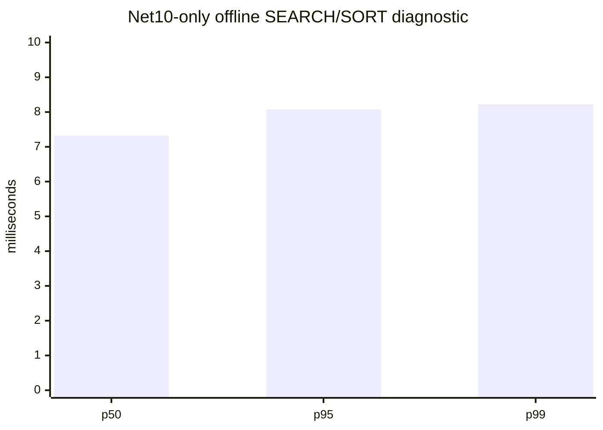

# .NET 10 Benchmark Pack

## Current authoritative live gate (2026-08-11)

Code/test commit `eb0c9a7ed` verified the equal disposable SQL/Data/message
pair and Net10 live acceptance: SMTP acceptance `25/25`, SMTP/IMAP/POP3
protocol `25/25`, concurrent IMAP `1000/1000`, and IMAP Full-Text
`SEARCH TEXT needle` `25/25` with 1,000 matches per session. The live FTS
benchmark reports SEARCH p50/p95/p99 of `7.900/12.802/21.557 ms` and clears
its disposable search state after the run.

The legacy C++ process remains blocked by the read-only registry/configuration
preflight because legacy `/Debug` startup would write the installed AppID
registration. The paired performance gate remains **RED**; no ratio, regression
percentage, or winner is valid until the identical matrix runs in a registry-
isolated C++ environment. See
`hmailserver/source/Server.Net10/PERFORMANCE_COMPARISON_REPORT.md` for the
full evidence and remaining delivery, retry, queue, and soak gates.

## Historical paired-fixture gate (superseded, 2026-08-11)

Tool commit `7e58324d7` upgrades
`build/collect-live-equivalence-evidence.ps1` to shared-baseline v2. The
read-only collector now records the active domain/account/Inbox, exact
loopback listener rows, message filename containment under each Data root, and
SQL Full-Text service/catalog/table/index readiness for both disposable
databases. It reports `NOT_EQUIVALENT` unless those checks, row counts, and
Data hashes all pass.

The live rerun found domain/account and all three listener rows in both
databases, but Inbox matching was `0`, message files under the selected Data
roots were `0` (`1000`/`1029` outside), and Full-Text was not ready on either
side. This is a fixture/SQL prerequisite failure, not a performance result.
The paired release gate remains **RED** and no ratio or winner is valid.

The focused validator is `build/test-live-equivalence-evidence.ps1`; it also
proves missing Full-Text evidence fails closed.

The current Net10-only offline 100k diagnostic at commit `2a6f68efc` passed
with 100,000 messages, deterministic correctness, and p50/p95/p99 of
`7.324/8.076/8.223 ms`. This workload is in-memory and does not exercise SQL
Full-Text, live IMAP, C++, or the paired release gate.



## Current SMTP acceptance gate (2026-08-11)

Code/tool commit `b34b2b415` adds
`build/benchmark-net10-live-smtp-acceptance.ps1`, which measures the complete
loopback SMTP message transaction (`EHLO`, `MAIL FROM`, `RCPT TO`, `DATA`,
final `250`, and `QUIT`) for either the isolated `net10` or `cpp` target. It
emits JSON, CSV, and Markdown with message count, accepted/error counts,
p50/p95/p99, throughput, process metrics, and readiness/shutdown evidence.
`build/test-net10-live-smtp-acceptance.ps1` rejects inconsistent or falsely
successful reports.

The 2026-08-11 disposable smoke reports are intentionally **FAIL**: Net10
reaches SMTP `354` but does not return the final acceptance `250` (`0/1`),
while the C++ target fails SMTP readiness (`0/1`). No performance ratio is
valid until both sides pass the same acceptance and cleanup gates.

## Historical paired live evidence: RED

On 2026-08-11 the benchmark pack restored one disposable C++ SQL backup into
both target databases and verified the starting state: 33/33 table row counts
matched, and the two 1,000-file Data trees had zero relative-path or SHA-256
mismatches. Both sides used loopback `127.0.0.1` with SMTP `2525`, IMAP `1143`,
and POP3 `25110`.

The protocol matrix still cannot produce a performance comparison. C++ was
`0/25` for SMTP, IMAP, and POP3. Net10 was SMTP `25/25`, IMAP `0/25`, and POP3
`0/25` against the same starting snapshot. The 1,000-session IMAP probe was
`0/1000` for both. The result is diagnostic only and no speed-up claim is
valid.

```mermaid
xychart-beta
    title "Shared-baseline protocol success counts"
    x-axis [SMTP, IMAP, POP3, IMAP-1k]
    y-axis "successful sessions" 0 --> 25
    bar [0, 0, 0, 0]
    bar [25, 0, 0, 0]
```



The repeatable start-state checker is
`build/collect-live-equivalence-evidence.ps1`. JSON and Markdown evidence are
written below `artifacts/benchmarks/live-cpp-net10-20260811/`. This does not
prove SQL FTS, message acceptance, delivery throughput, restore behavior, or
24-hour leak freedom.

The latest full opt-in Net10 validation against disposable MSSQL/Data
resources is `2156 passed, 2 skipped, 0 failed`. The two skips are the explicit
installer artifact and native registry integration tests. This green test run
does not change the paired live-performance gate above.

The live scripts now fail closed before workload execution unless all expected
listeners are owned by the launched process and return protocol banners. The
1,000-session IMAP script also records a start barrier and waits for listener
shutdown. The 2026-08-11 rerun recorded C++ POP3 readiness failure, Net10
SMTP `25/25` with IMAP/POP3 `0/25`, and Net10 `1000/1000` completed IMAP probes
with `0` successes. These are failure-path artifacts, not performance data.

The first offline acceptance scenario is a deterministic 100,000-message IMAP SEARCH/SORT run. It is intentionally independent of SQL Server, the hMailServer service, COM registration, and any mail data directory.

Run it from the repository root:

```powershell
& 'E:\Yazılım\hmailserver57\tools\dotnet10\dotnet.exe' run `
  --project .\hmailserver\source\Server.Net10\benchmarks\HMailServer.Net10.Benchmarks\HMailServer.Net10.Benchmarks.csproj `
  --configuration Debug -- `
  --output .\artifacts\benchmarks\offline-search-sort `
  --git-commit (git rev-parse HEAD)
```

The runner emits `offline-imap-search-sort.json`, `.csv`, and `.md`. The report records the deterministic seed, dataset size, search term, `DATE DESC, UID ASC` order, correctness checks, p50/p95/p99, throughput, mean allocation, mean Gen0/Gen1/Gen2 collection deltas, process peak working set, host/runtime details, commit, timestamps, and an informational p95 threshold. GC counters and process peak working set are host/runtime-dependent measurements, not leak acceptance evidence or C++/.NET equivalence proof.

Legacy references are `hmailserver/source/Server/IMAP/IMAPSearchParser.cpp:118-195`, `IMAPSortParser.cpp:24-52`, and `IMAPSort.cpp:108-232,265-326`. Legacy sorting selects the parsed sort field, reverses the complete result for `REVERSE`, and has no explicit UID tie-breaker. The current SQL plan is `hmailserver/source/Server.Net10/src/HMailServer.Search.SqlServer/SqlServerImapSortPlanner.cs:23-126`, which emits the requested criteria followed by `m.messageuid ASC`; this benchmark measures the current deterministic offline contract, not legacy tie-order equivalence.

This scenario does not prove SQL Server Full-Text Search, live IMAP protocol latency, 1,000 concurrent sessions, or C++ versus .NET performance equivalence. Those remain release-gate work.
